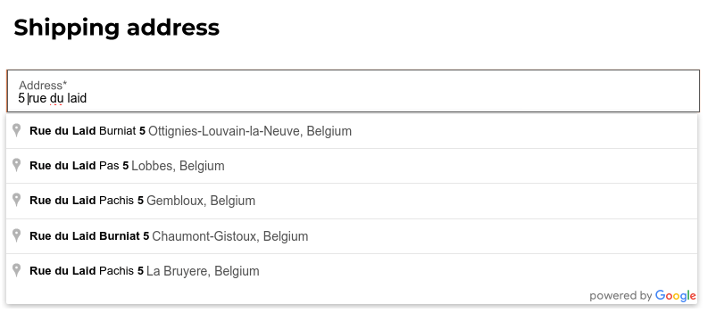
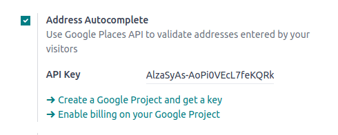

====================
Address autocomplete
====================

You can use the Google Places API on your website to ensure that your users' delivery addresses exist and are understood
by the carrier. The Google Places API allows developers to access detailed information about places using HTTP requests.
The autocompletion predicts a list of places when the user starts typing the address.

.. seealso::
   - `Google Maps Platform <https://mapsplatform.google.com/maps-products>`_
   - `Google Developers Documentation: Google Places API
     <https://developers.google.com/maps/documentation/places/web-service/autocomplete>`_

To do so, go to :menuselection:`Website --> Configuration --> Settings` and enable :guilabel:`Address Autocomplete` in
the :guilabel:`SEO` section.

Insert your :guilabel:`Google Places API key` in the :guilabel:`API Key` field. If you don't have one, create yours on
the `Google Cloud Console <https://console.cloud.google.com/getting-started>`_ and follow these steps.

Step 1: Enable the Google Places API
====================================

| **Create a New Project:**
| To enable the **Google Places API**, you first need to create a project. To do so, click :guilabel:`Select a project`
  in the top left corner, :guilabel:`New Project`, and follow the prompts to set up your project.

| **Enable the Google Places API:**
| Go to the :guilabel:`Enabled APIs & Services` and click :guilabel:`+ ENABLE APIS AND SERVICES.` Search for
  :guilabel:`"Places API"` and select it. Click on the :guilabel:`"Enable"` button.

.. note::
   Google's pricing depends on the number of requests and their complexity.

Step 2: Create API Credentials
==============================

Go to `APIs & Services --> Credentials <https://console.cloud.google.com/apis/credentials>`_.

| **Create credentials:**
| To create your credentials, go to :guilabel:`Credentials`, click :guilabel:`Create Credentials`, and select
  :guilabel:`API key`.

.. admonition:: Restrict the API Key (Optional)

   For security purposes, you can restrict the usage of your API key. You can go to the :guilabel:`API restrictions`
   section to specify which APIs your key can access. For the Google Places API, you can restrict it to only allow
   requests from specific websites or apps.

.. important::
   - Save Your API Key: Copy your API key and securely store it.
   - Do not share it publicly or expose it in client-side code.
