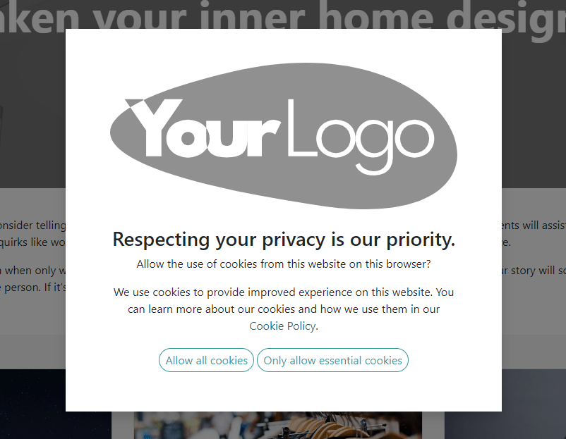
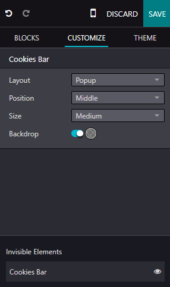

===========
Cookies bar
===========

Cookies are small text files sent to your device when you visit a website. They are processed and
stored by your browser and contain information about your visit, such as login data, location,
language, etc. There are two main types of cookies:

- Essential cookies, which are necessary for the website to function properly;
- Non-essential or optional cookies, which are used to analyze your behavior or display
  advertisements.

Notifying users about data collection, as well as its methods and purposes, is required by data
protection laws such as `GDPR <https://gdpr.eu>`_. Cookies bars are commonly used to fulfill this
obligation in a user-friendly and transparent manner. They are displayed immediately upon a user's
first visit to inform them that the website uses cookies and let them decide whether they want to
store non-essential cookies on their device.

Configuration
=============

To enable the cookies bar on your Odoo website, go to :menuselection:`Website --> Configuration` and
enable :guilabel:`Cookies Bar` in the :guilabel:`Privacy` section.

You can :ref:`customize the appearance of your cookies bar <cookies-bar/customization>` and :ref:`edit the content of
the related Cookie Policy page <cookies-bar/policy>`.

.. _cookies-bar/customization:

Customization
=============

To adapt the display of the cookies bar, click :guilabel:`Edit` and select the :guilabel:`Cookies
Bar` building block in the :guilabel:`Invisible Elements` at the bottom of the panel. Customize it
using the options in the :guilabel:`Customize` tab in the edit panel. Three :guilabel:`Layouts` are
available:

- :guilabel:`Discrete`: thin bar
- :guilabel:`Classic`: banner
- :guilabel:`Popup`: you can change the popup's :guilabel:`Position` to the :guilabel:`Top`,
  :guilabel:`Middle`, or :guilabel:`Bottom` of the screen.

You can also:

- modify the :guilabel:`Size` of the cookies bar;
- enable :guilabel:`Backdrop` to gray out the page in the background when the cookies bar is
  displayed on the screen;
- further customize the appearance of the cookies bar using :guilabel:`Block` and/or
  :guilabel:`Column` customization options, which are available after clicking anywhere in the
  building block.

To edit the contents of the cookies bar (i.e., the consent message), click directly in the building
block.

.. _cookies-bar/policy:

Cookie policy
=============

When you enable the cookies bar for your website, Odoo creates the **Cookie Policy** page
(`/cookie-policy`) with the list of essential and optional cookies. To access it, click the
:guilabel:`Cookie Policy` hyperlink in the cookies bar or open the page from :menuselection:`Website
--> Site --> Pages`.

The contents of the page can be adapted based on your website's features and characteristics if
needed.

.. tip::
   You could add a link providing access to this page, in your website's footer, for example.
