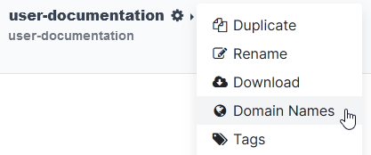
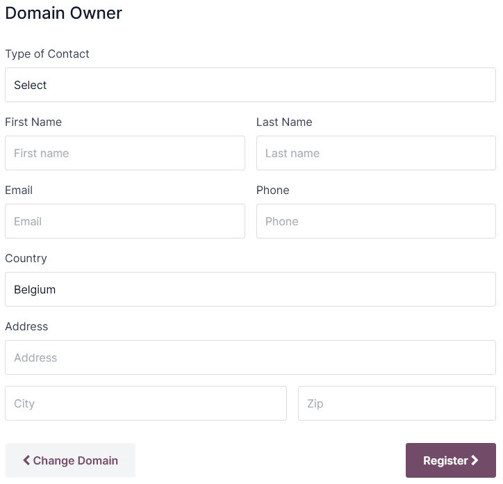

============
Domain names
============

Domain names are text-based addresses identifying online locations, such as websites. They provide a
more memorable and recognizable way for people to navigate the internet than numerical IP addresses.

**Odoo Online** and **Odoo.sh** databases use a **subdomain** of the `odoo.com` **domain** by
default (e.g., `mycompany.odoo.com`).

However, you can use a custom domain name instead by :ref:`registering a free domain name
<domain-name/register>` (only available for Odoo Online databases) or by :ref:`configuring a
domain name you already own <domain-name/existing>`.

.. seealso::
   `Odoo Tutorials: Register a free domain name [video]
   <https://www.odoo.com/slides/slide/register-a-free-domain-name-1663>`_

.. _domain-name/register:

Register a free domain name with Odoo
=====================================

To register a one-year free domain name for your Odoo Online database, sign in to your account and
go to the `database manager <https://www.odoo.com/my/databases>`_. Click the gear icon
(:guilabel:`⚙️`) next to the database name and select :guilabel:`Domain Names`.

Search for the desired domain name and check its availability.

.. image:: domain_names/domain-search.png
   :alt: Searching for an available domain name

.. tip::
   Ensure the Website app is installed if the domain name registration option does not appear.

Select the desired domain name, fill in the :guilabel:`Domain Owner` form, and click
:guilabel:`Register`. The chosen domain name is directly linked to the database.

Next, you should :ref:`map your domain name to your Odoo website <domain-name/website-map>`.

.. important::
   A verification email from `noreply@domainnameverification.net` will be sent to the email address
   provided in the :guilabel:`Domain Owner` form. It is essential to verify your email address to
   keep the domain active and receive the renewal quote before expiration.

The domain name registration is free for the first year. After this period, Odoo will continue to
manage the domain in partnership with **Gandi.net**, the domain name registrar, and you will be
charged `Gandi.net's renewal rate <https://www.gandi.net/en/domain>`_. Odoo sends a renewal
quotation every year to the email address mentioned in the :guilabel:`Domain Owner` form several
weeks before the expiration date of the domain. The domain is renewed automatically when the
quotation is confirmed.

.. note::
   - The offer is only available for **Odoo Online** databases.
   - The offer is limited to **one** domain name per client.
   - The offer is limited to the registration of a **new** domain name.
   - The offer is available to *One App Free* plans. Ensure that your website contains enough
     original content for Odoo to verify that your request is legitimate and respects `Odoo's
     Acceptable Use Policy <https://www.odoo.com/acceptable-use>`_. Given the high number of
     requests, it can take Odoo several days to review them.

.. _domain-name/register-dns:

DNS records
-----------

To manage your free domain name :abbr:`DNS (domain name system)` records, open the `database manager
<https://www.odoo.com/my/databases>`_, click the gear icon (:guilabel:`⚙️`) next to the database
name, select :guilabel:`Domain Names`, and click :guilabel:`DNS`.

- :guilabel:`A`: the A record holds the IP address of the domain. It is automatically created and
  **cannot** be edited or deleted.
- :guilabel:`CNAME`: CNAME records forward one domain or subdomain to another domain. One is
  automatically created to map the `www.` subdomain to the database. If the database is renamed, the
  CNAME record **must** also be renamed.
- :guilabel:`MX`: MX records instruct servers on where to deliver emails.
- :guilabel:`TXT`: TXT records can be used for different purposes (e.g., to verify domain name
  ownership).

Any modification to the DNS records can take up to **72 hours** to propagate worldwide on all
servers.

.. note::
   `Submit a support ticket <https://www.odoo.com/help>`_ if you need assistance to manage your
   domain name.

Mailbox
-------

The one-year free domain name offer does **not** include a mailbox. There are two options to link
your domain name with a mailbox.

Use a subdomain
~~~~~~~~~~~~~~~

You can create a subdomain (e.g., `subdomain.yourdomain.com`) to use as an alias domain for the
database. It allows users to create records in the database from emails received on their
`email@subdomain.yourdomain.com` alias.

To do so, open the `database manager <https://www.odoo.com/my/databases>`_, click the gear icon
(:guilabel:`⚙️`) next to the database name, and go to :menuselection:`Domain Names --> DNS --> Add
DNS record --> CNAME`. Next, enter the desired subdomain in the :guilabel:`Name` field (e.g.,
`subdomain`), the original database domain with a period at the end (e.g., `mycompany.odoo.com.`) in
the :guilabel:`Content` field, and click :guilabel:`Add record`.

Then, add the alias domain as your *own domain* by clicking :guilabel:`Use my own domain`, entering
the alias domain (e.g., `subdomain.yourdomain.com`), clicking :guilabel:`Verify`, and then
:guilabel:`I confirm, it's done`.

Finally, go to your database and open the :guilabel:`Settings`. Under the :guilabel:`Alias Domain`
field, enter the alias domain (e.g., `subdomain.yourdomain.com`), click :guilabel:`Create`, and then
:guilabel:`Save`.

Use an external email provider
~~~~~~~~~~~~~~~~~~~~~~~~~~~~~~

To use an external email provider, you should configure an MX record. To do so, open the `database
manager <https://www.odoo.com/my/databases>`_, click the gear icon (:guilabel:`⚙️`) next to the
database name, click :menuselection:`Domain Names --> DNS --> Add DNS record --> MX`. The values you
should enter for the :guilabel:`Name`, :guilabel:`Content`, and :guilabel:`Priority` fields depend
on the external email provider.

.. seealso::
   - `Google Workspace: MX record values <https://support.google.com/a/answer/174125?hl=en>`_
   - `Outlook and Exchange Online: Add an MX record for email <https://learn.microsoft.com/en-us/microsoft-365/admin/get-help-with-domains/create-dns-records-at-any-dns-hosting-provider?view=o365-worldwide#add-an-mx-record-for-email-outlook-exchange-online>`_

.. _domain-name/existing:

Configure an existing domain name
=================================

If you already have a domain name, you can use it for your Odoo website.

.. warning::
   It is strongly recommended to follow **in order** these three steps to avoid any :ref:`SSL
   certificate validation <domain-name/ssl>` issues:

   #. :ref:`Add a CNAME record <domain-name/cname>`
   #. :ref:`Map your domain name to your Odoo database <domain-name/db-map>`
   #. :ref:`Map your domain name to your Odoo website <domain-name/website-map>`

.. _domain-name/cname:

Add a CNAME record
------------------

Adding a CNAME record to forward your domain name to the address of your Odoo database is required.

.. tabs::

   .. group-tab:: Odoo Online

      The CNAME record's target address should be your database's address as defined at its creation
      (e.g., `mycompany.odoo.com`).

   .. group-tab:: Odoo.sh

      The CNAME record's target address should be the project's main address, which can be found on
      Odoo.sh by going to :menuselection:`Settings --> Project Name`, or a specific branch
      (production, staging or development) by going to :menuselection:`Branches --> select the
      branch --> Settings --> Custom domains`, and clicking :guilabel:`How to set up my domain?`. A
      message indicates which address your CNAME record should target.

The specific instructions depend on your DNS hosting service.

.. seealso::
   - `GoDaddy: Add a CNAME record <https://www.godaddy.com/help/add-a-cname-record-19236>`_
   - `Namecheap: How to create a CNAME record for your domain <https://www.namecheap.com/support/knowledgebase/article.aspx/9646/2237/how-to-create-a-cname-record-for-your-domain>`_
   - `OVHcloud: Add a new DNS record <https://docs.ovh.com/us/en/domains/web_hosting_how_to_edit_my_dns_zone/#add-a-new-dns-record>`_
   - `Cloudflare: Manage DNS records
     <https://support.cloudflare.com/hc/en-us/articles/360019093151>`_

.. important::
   Odoo only supports subdomains. To use your naked domain name :dfn:`(a domain name without any
   subdomains or prefixes)` (`yourdomain.com`), create a redirection 301 to redirect visitors to
   `www.yourdomain.com`.

.. example::
   You own the domain name `yourdomain.com`, and your Odoo Online database's address is
   `mycompany.odoo.com`. You want to access your Odoo database primarily with the domain
   `www.yourdomain.com` and also with the naked domain `yourdomain.com`.

   To do so, create a CNAME record for the `www` subdomain, with `mycompany.odoo.com` as the target.
   Next, create a redirect (301 permanent or visible redirect) to redirect visitors from
   `yourdomain.com` to `wwww.yourdomain.com`.

.. _domain-name/db-map:

Map a domain name to an Odoo database
-------------------------------------

.. warning::
   Ensure you have :ref:`added a CNAME record <domain-name/cname>` to your domain name's DNS
   **before** mapping your domain name to your Odoo database.

   Failing to do so may prevent the validation of the :ref:`SSL certificate <domain-name/ssl>` and
   could result in a *certificate name mismatch* error. Web browsers often display this as a
   warning, such as *"Your connection is not private"*.

   If you encounter this error after mapping the domain name to your database, wait up to five
   days, as the validation may still happen. If not, you can `submit a support ticket
   <https://www.odoo.com/help>`_, including screenshots of your CNAME records.

.. tabs::

   .. group-tab:: Odoo Online

      Open the `database manager <https://www.odoo.com/my/databases>`_, click the gear icon
      (:guilabel:`⚙️`) next to the database name, and go to :menuselection:`Domain Names --> Use my
      own domain`. Then, enter the domain name (e.g., `yourdomain.com`), click :guilabel:`Verify`
      and :guilabel:`I confirm, it's done`.

      .. image:: domain_names/map-database-online.png
         :alt: Mapping a domain name to an Odoo Online database

   .. group-tab:: Odoo.sh

      On Odoo.sh, go to :menuselection:`Branches --> select your branch --> Settings --> Custom
      domains`, type the domain name to add, then click :guilabel:`Add domain`.

      .. image:: domain_names/map-database-sh.png
         :alt: Mapping a domain name to an Odoo.sh branch

      .. seealso::
         :ref:`Odoo.sh branches: settings tab <odoosh-gettingstarted-branches-tabs-settings>`

.. _domain-name/ssl:

SSL encryption (HTTPS protocol)
~~~~~~~~~~~~~~~~~~~~~~~~~~~~~~~

**SSL encryption** allows visitors to navigate a website through a secure connection, which appears
as the *https://* protocol at the beginning of a web address rather than the non-secure *http://*
protocol.

Odoo generates a separate SSL certificate for each domain :ref:`mapped to a database
<domain-name/db-map>` using `Let's Encrypt's certificate authority and ACME protocol
<https://letsencrypt.org/how-it-works/>`_.

.. note::
   - Certificate generation may take up to 24 hours.
   - Several attempts to validate your certificate are made for five days after you map your domain
     name to your database.
   - If you use another service, you can keep using it or change to Odoo's.

.. important::
   No SSL certificate is generated for naked domains :dfn:`(domain names without any subdomains
   or prefixes)`.

.. _domain-name/web-base-url:

Web base URL of a database
~~~~~~~~~~~~~~~~~~~~~~~~~~

.. note::
   If the Website app is installed on your database, skip this section and continue from the
   :ref:`Map a domain name to a website <domain-name/website-map>` section.

The *web base URL* or root URL of a database affects your main website address and all the
links sent to your customers (e.g., quotations, portal links, etc.).

To make your custom domain name the *web base URL* of your database, access your database using your
custom domain name and log in as an administrator :dfn:`(a user part of the Settings access right
group under Administration)`.

.. important::
   If you access your database with the original Odoo address (e.g., `mycompany.odoo.com`), the *web
   base URL* of your database will be updated accordingly. To prevent the automatic update of the
   *web base URL* when an administrator logs in to the database, activate the :ref:`developer mode
   <developer-mode>`, go to :menuselection:`Settings --> Technical --> System Parameters --> New`,
   and enter `web.base.url.freeze` as the :guilabel:`Key` and `True` as the :guilabel:`Value`.

.. note::
   You can also set the web base URL manually. To do so, activate the :ref:`developer mode
   <developer-mode>`, go to :menuselection:`Settings --> Technical --> System Parameters`, and
   search for the `web.base.url` key (create it if necessary) and enter the full address of your
   website as the value (e.g., `https://www.yourdomain.com`). The URL must include the protocol
   `https://` (or `http://`) and *not* end with a slash (`/`).

.. _domain-name/website-map:

Map a domain name to an Odoo website
------------------------------------

Mapping your domain name to your website is different than mapping it to your database:

- It defines your domain name as the main one for your website, helping search engines to index your
  website correctly.
- It defines your domain name as the base URL for your database, including portal links sent by
  email to your customers.
- If you have multiple websites, it maps your domain name to the appropriate website.

Go to :menuselection:`Website --> Configuration --> Settings`. If you have multiple websites, select
the one you want to configure. In the :guilabel:`Domain` field, enter the address of your website
(e.g., `https://www.yourdomain.com`) and :guilabel:`Save`.

.. warning::
   Mapping your domain name to your Odoo website prevents Google Search from indexing your original
   database address (e.g., `mycompany.odoo.com`).

   If both addresses are already indexed, it may take some time before the indexation of the second
   address is removed from Google Search. You can use the `Google Search Console
   <https://search.google.com/search-console/welcome>`_ to fix the issue.

.. note::
   If you have multiple websites and companies on your database, make sure to select the right
   :guilabel:`Company` under :menuselection:`Website --> Configuration --> Settings`. Doing so
   indicates Odoo which URL to use as the :ref:`base URL <domain-name/web-base-url>` according to
   the company in use.
