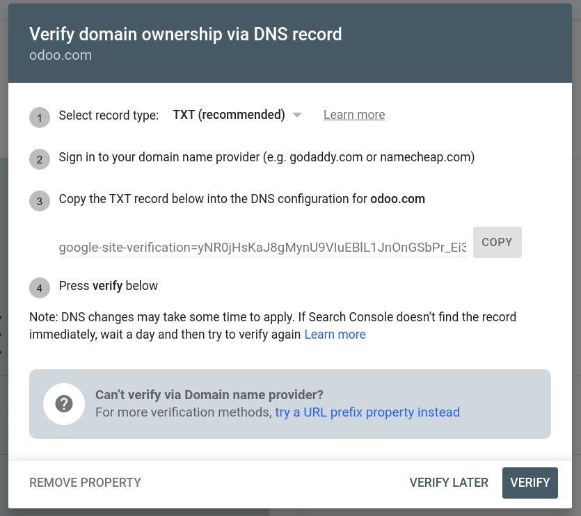
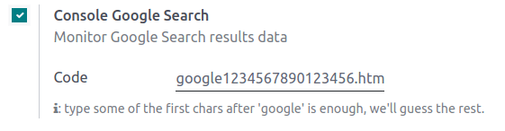

=====================
Google Search Console
=====================

Google Search Console is a free web service provided by Google that allows website owners to
monitor, maintain, and troubleshoot their site's presence in Google Search results. It offers
valuable insights into how Google views and interacts with your site, helping you optimize its
performance.

To enable GSC, go to `Google Search Console <https://search.google.com/search-console/welcome>`_,
enter your domain or URL prefix, follow the instructions, and copy the code from Google.

.. image:: google_search_console/add-domain-or-url-prefix.png
   :alt: Google Search Console domain or URL prefix

Then, access your Odoo database, go to :menuselection:`Website --> Configuration --> Settings`, and
enable :guilabel:`Google Search Console` in the :guilabel:`SEO` section. Paste the code in the
dedicated field.

.. important::
   To prevent Google from indexing both your custom domain name `www.example.com` and your original
   Odoo database URL `www.example.odoo.com`, :ref:`map your domain name with your Odoo website
   <domain-name/website-map>`.

.. seealso::
   :doc:`domain_names`
