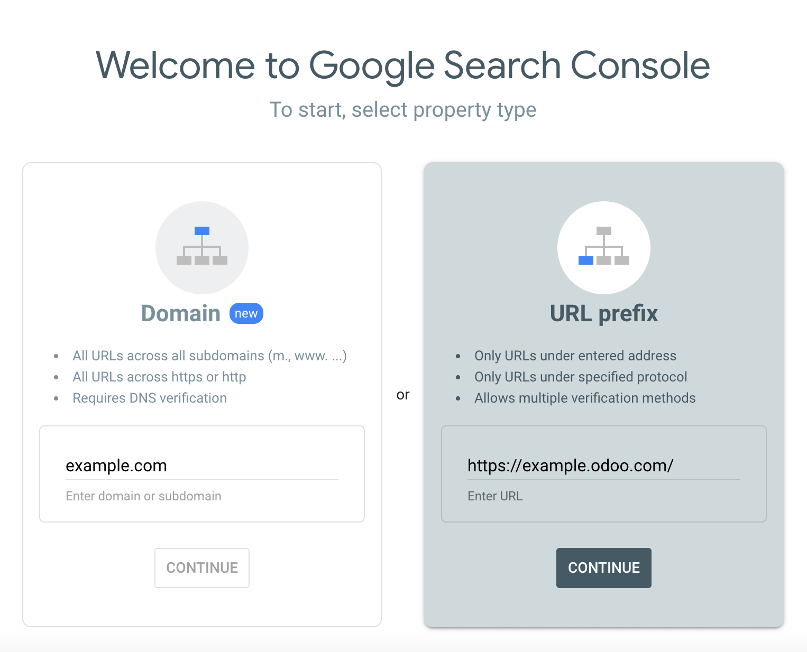

=====================
Google Search Console
=====================

Google Search Console is a free web service provided by Google that allows website owners to
monitor, maintain, and troubleshoot their site's presence in Google Search results. It offers
valuable insights into how Google views and interacts with your site, helping you optimize its
performance.

To enable Google Search Console for your website, go to `Google Search Console
<https://search.google.com/search-console/welcome>`_. Then, select the property type
:ref:`GSC-Domain` or :ref:`GSC-URL prefix`.

.. _GSC-Domain:

Domain property
===============

A domain property in Search Console tracks all versions of your website, including subdomains and
protocols (http/https). This comprehensive view allows you to analyze your overall website's search
performance and make informed decisions to optimize its visibility. Enter the domain, e.g.,
`example.com` and click :guilabel:`Continue`.

.. note::
   - The domain property type can only be verified via
     `DNS record <https://support.google.com/webmasters/answer/9008080?hl=en#domain_name_verification&zippy=%2Chtml-tag>`_.
   - Google suggests creating at least one domain property to represent your site, as it is the most
     complete view of your website information.

.. _GSC-URL prefix:

URL prefix property
===================

This type of verification is usually simpler as you have multiple verification methods, such as
using your existing Google Analytics or Tag Manager account. It also makes sense to view a section
of your website separately. For example, if you work with a consultant on a specific part of your
website, you might want to verify this part separately to limit access to your data. Enter the URL,
e.g., `https://www.example.odoo.com` and click :guilabel:`Continue`.

Site ownership verification
===========================

Before using Google Search Console for your website, you must verify your site ownership. This
verification process is a security measure that protects both you and Google. It ensures that only
authorized users have access to sensitive data and that you have control over how your website is
treated in Google Search.

Five methods are available to do this:

.. _website/google-search-console:

#. :ref:`GSC-HTML-file-upload`
#. `DNS record <https://support.google.com/webmasters/answer/9008080?hl=en#domain_name_verification&zippy=%2Chtml-tag>`_
#. `HTML tag <https://support.google.com/webmasters/answer/9008080?hl=en#meta_tag_verification&zippy=%2Chtml-tag>`_
#. `Google Analytics tracking code <https://support.google.com/webmasters/answer/9008080?hl=en#google_analytics_verification>`_
#. `Google Tag Manager container snippet <https://support.google.com/webmasters/answer/9008080?hl=en#google_tag_manager_verification>`_

.. note::
   The best method for you depends on your comfort level and technical expertise. For beginners,
   using a file upload or HTML tag might be easiest. Those options are convenient if you already use
   Google Analytics or Tag Manager. You need to access your domain registrar's settings for domain
   verification.

.. _GSC-HTML-file-upload:

HTML file upload
----------------

This method involves uploading an HTML file provided by Google containing the verification code you
have to put in your Odoo's Website Settings. Google verifies ownership by checking for this code.

#. Once you added your website URL under the URL prefix option and clicked :guilabel:`continue`,
   expand the HTML file section where you find a download :icon:`fa-download` button.

   .. image:: google_search_console/html-file-download.png
      :alt: HTML file download

#. Download your HTML verification file and copy the verification code (e.g., `google123abc.html`).

   .. image:: google_search_console/open-copy-html-file.png
      :alt: Open and copy html file

#. In your Odoo database, go to :menuselection:`Website --> Configuration --> Settings`,
   and enable :guilabel:`Google Search Console` in the :guilabel:`SEO` section. Paste the
   verification code (e.g., `google123abc.html`) in the dedicated field.

   .. image:: google_search_console/paste-html-code-settings.png
      :alt: Paste html code in Odoo

#. In Google Search Console, click :guilabel:`Verify`. If you perform the steps above correctly,
   verification should be done immediately.

.. seealso::
   :doc:`domain_names`
