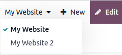
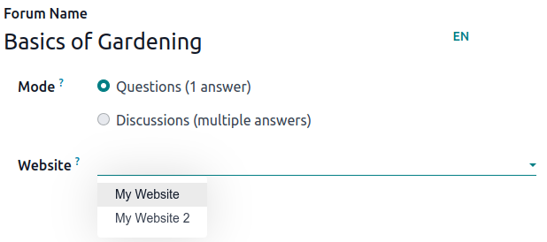
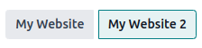

=================
Multiple websites
=================

Odoo allows you to create multiple websites from the same database. This can be useful, for example,
if you have multiple brands operating under your organization, or to create separate websites for
different products/services, or different audiences. In these cases, having different websites can
help avoid confusion and make it easier to tailor your digital outreach strategies and reach your
target audience.

Each website can be designed and configured independently with its own :doc:`domain name
</administration/maintain/domain_names>`, theme, pages,
menus, :doc:`languages <translate>`, :doc:`products <../../ecommerce/managing_products/products>`,
assigned sales team, etc. They can also :ref:`share content and pages
<multi-website/website_content>`.

.. tip::
   Duplicate content (i.e., pages and content shared between multiple websites) can have a negative
   impact on :doc:`../pages/seo`.

Website creation
================

To create a new website, proceed as follows:

#. Go to :menuselection:`Website --> Configuration --> Settings`.
#. Click :guilabel:`+ New Website`.

   .. image:: multi_website/create-website.png
      :alt: New website button

#. Specify the :guilabel:`Website Name` and :guilabel:`Website domain`. Each website must be
   published under its own :doc:`domain </administration/maintain/domain_names>`.
#. Adapt the :guilabel:`Company name`, :guilabel:`Languages` and :guilabel:`Default language`
   if needed.
#. Click the :guilabel:`Create` button.

You can then start building your new website.

.. note::
   By default, all website-related apps that you have installed (e.g. **eCommerce**,
   **Forum**, **Blog**, etc.) and their related website pages are also available on the
   new website. You can remove them by amending the website's menu.

Switching websites
==================

To switch from one website to another, click the menu next to the :guilabel:`+New` button in the
top right corner and select the website you want to switch to.

.. note::
   When you switch websites, you are redirected to the other website, to the same page (URL) as the
   current one. If the page you are currently viewing does not exist on the other website, you are
   redirected to a 404 error page. Once redirected, click :guilabel:`Create page` to create the
   page.

   .. image:: multi_website/404-create-page.png
      :alt: Create a page from a 404 error page

Website-specific configuration
==============================

Most website settings are website-specific, which means they can be enabled/disabled per website. To
adapt the settings for a website, go to :menuselection:`Website --> Configuration --> Settings`.
Select the desired website in the field :guilabel:`Settings of Website` at the top of the
:guilabel:`Settings` page, in the **yellow** banner. Then, adapt the options for that specific
website.

.. note::
   - Websites are created with the default settings; the settings are not copied from one website to
     the other.
   - In a :doc:`multi-company environment <../../../general/users/companies>`, each website can be
     linked to a specific company in your database so that only company-related data (e.g.,
     products, jobs, events, etc.) is displayed on the website. To display company-specific data,
     set the desired company in the :guilabel:`Company` field.

.. _multi-website/website_content:

Content availability
--------------------

By default, pages, products, events, etc. created from the frontend (using the
:guilabel:`+New` button) are only available on the website from which it was created. Records
created from the backend, however, are made available on all websites by default. The content's
availability can be changed in the backend, in the :guilabel:`Website` field. For example, for
products, go to :menuselection:`eCommerce --> Products`, then select the product and go to the
:guilabel:`Sales` tab. For forums, go to :menuselection:`Configuration --> Forums`, then select the
forum.

.. _website_field:

Records and features can be made available:

- On all websites: leave the :guilabel:`Website` field empty;
- Only on one website: set the :guilabel:`Website` field accordingly;
- On some websites: in this case, you should duplicate the item and set the :guilabel:`Website`
  field.

Website pages
~~~~~~~~~~~~~

To modify the website on which a page is to be published, proceed as follows:

#. Go to :menuselection:`Website --> Site --> Pages`.
#. Open the search panel and select the website on which the page is currently published.

   .. image:: multi_website/pages-switch-websites.png
      :alt: Display pages per website

#. Tick the check box next to the page(s) you want to change.
#. Click the :guilabel:`Website` field and select the website, or empty it to publish the page on
   all websites.

.. note::
   Each website must have its own homepage; you may not use the same homepage for several websites.

eCommerce features
==================

eCommerce features such as products, eCommerce categories, pricelists, discounts, payment providers,
etc. can be restricted to :ref:`a specific website <website_field>`.

Customer accounts
-----------------

You can :doc:`allow your customers to use the same account
<../../ecommerce/ecommerce_management/customer_accounts>` on all of your websites by enabling the
:guilabel:`Shared Customer Accounts` check box in the website settings.

Pricing
-------

Products can be priced differently based on the website using :ref:`pricelists
<ecommerce/pricelists>`. The following configuration is required:

#. Go to :menuselection:`Website --> Configuration --> Settings`.
#. Scroll down to the :guilabel:`Shop - Products` section and select the :guilabel:`Pricelists`
   option :guilabel:`Multiple prices per product`.
#. Click :guilabel:`Pricelists` to define new pricelists or edit existing ones.
#. Select the pricelist or click :guilabel:`New` to create a new one, then select the
   :guilabel:`Configuration` tab and set the :guilabel:`Website` field.

Reporting
=========

Analytics
---------

Each website has its own :ref:`analytics <website/analytics/plausible>`. To switch between websites,
click the buttons in the upper right corner.

Other reporting data
--------------------

Other reporting data such as eCommerce dashboard data, online sales analyses and visitors can be
grouped by website if necessary. Open the search panel and select :guilabel:`Group by --> Website`.
