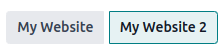

=================
Multiple websites
=================

Odoo allows you to :doc:`create <../website_creation>` multiple websites from the same database.
This can be useful, for example, if you have multiple brands operating under your organization, or
if you want to create separate websites for different products/services or audiences.

Creating another website
========================

Creating multiple websites requires having *at least* one :doc:`domain name <domain_names>`.
Different alternatives exist, but before creating another website, you should either

- :ref:`Register a domain name for free with Odoo <domain-name/register>` for your first website,
  then, for your second website, either:

  - :ref:`Use a subdomain of your free Odoo domain name <domain-name/register/subdomains>`.
  - :ref:`Use a domain name you purchased <domain-name/existing>`.

- :ref:`Use a domain name you purchased <domain-name/existing>` for your first website, then, for
  your second website, either:

  - :ref:`Use a subdomain of your purchased domain name <domain-name/existing/subdomains>`.
  - :ref:`Use a domain name you purchased <domain-name/existing>`.
  - :ref:`Register a domain name for free with Odoo <domain-name/register>`.

Once it is time to :ref:`map your second domain name's address to your second Odoo website
<domain-name/existing/website-map>`, you can `create <../../website_creation>` it and map it
directly by entering the second website's address in the :guilabel:`Website Domain` field (e.g.,
`https://www.yourseconddomain.com` or `https://subdomain.yourdomain.com`).

.. tip::
   To switch from one website's frontend to another, click the website selection drop-down in the
   top right corner and select the website you want to switch to.

   .. image:: multi_website/website-selector-frontend.png
      :alt: Selecting a website on the frontend

Website-specific configuration
==============================

Most website settings are website-specific. To access the settings of a website, go to
:menuselection:`Website --> Configuration --> Settings` and select the desired website using the
website selection drop-down at the top left of the settings page.

.. image:: multi_website/website-selector-settings.png
   :alt: Selecting a website in the app settings

.. note::
   - Settings shared by all websites are indicated using the :icon:`fa-info-circle`
     (:guilabel:`information`) icon.

     .. image:: multi_website/common-setting-info.png
        :alt: Shared setting infobox

   - When you create another website, it uses the default settings; settings are not copied from one
     website to another.

eCommerce features
------------------

eCommerce features such as products, eCommerce categories, pricelists, discounts, payment providers,
etc., can be restricted to :ref:`a specific website <multi-website/website_content>`.

Customer accounts
~~~~~~~~~~~~~~~~~

To :doc:`allow your customers to use the same account
<../../ecommerce/configuration/customer_accounts>` on all of your websites, go to
:menuselection:`Website --> Configuration --> Settings` and enable :guilabel:`Shared Customer
Accounts`.

Pricing
~~~~~~~

Products can be priced differently based on the website using :ref:`pricelists
<ecommerce/prices/selectable-pricelists>`. To do so:

#. Go to :menuselection:`Website --> Configuration --> Settings`.
#. Scroll down to the :guilabel:`Shop - Products` section and select the :guilabel:`Pricelists`
   option :guilabel:`Multiple prices per product`.
#. Click :guilabel:`Pricelists` to define new pricelists or edit existing ones.
#. Select the pricelist or click :guilabel:`New` to create a new one, then select the
   :guilabel:`Configuration` tab and set the :guilabel:`Website` field.

.. _multi-website/website_content:

Content availability across websites
====================================

.. note::
   All installed website-related apps (e.g., eCommerce, eLearning, Forum, etc.) and their related
   pages are also available on the new website. You can remove them from the website's menu.

By default, most records (products, courses, forum posts, etc.) created from the frontend are
displayed on all websites. To restrict the content to a single website, search for the
:guilabel:`Website` field in the backend.

For example, for products, go to :menuselection:`eCommerce --> Products`, select a product, open the
:guilabel:`eCommerce` tab, and specify which website the product should be available on.

.. image:: multi_website/product-website-setting.png
   :alt: Restricting a product to a single website

.. tip::
   In a :doc:`multi-company environment </applications/general/companies>`, each website can be
   linked to a specific company so that only that company's data (e.g., products, events, etc.) is
   displayed on the website. To display company-specific data, go to :guilabel:`Website -->
   Configuration --> Settings` and set the desired company in the :guilabel:`Company` field.

.. note::
   When generating links, for example, a customer portal link to a quotation, Odoo uses the
   following logic to select the website domain:

   - If a company has a *single* website, that website's domain is used.
   - If a company has *multiple* websites, Odoo uses the domain of the website that was created
     first. To change the order of priority, enable :ref:`developer mode <developer-mode>`, go to
     :menuselection:`Website --> Configuration --> Websites`, and use the :icon:`oi-draggable`
     (:guilabel:`drag handle`) icon to reorder websites.
   - If a company's website has *no domain*, the :ref:`web base URL
     <domain-name/existing/db-map/web-base-url>` is used.

Website pages
-------------

To modify the website on which a page is published, proceed as follows:

#. Go to :menuselection:`Website --> Site --> Pages`.
#. Open the search panel and select the website on which the page is currently published.

   .. image:: multi_website/website-pages-search.png
      :alt: Display pages per website

#. Tick the check box next to the page(s) you want to change.
#. Click the :guilabel:`Website` field and select the website, or empty it to publish the page on
   all websites.

.. note::
   Each website must have its own homepage; you may not use the same homepage for several websites.

Reporting
=========

Each website has its own :ref:`analytics <analytics/plausible>`. To switch between websites, use
the buttons in the top right corner.

Other reporting data, such as eCommerce dashboard data, online sales analyses, and visitors, can be
grouped by website by opening the search panel and selecting :guilabel:`Group by --> Website`.
