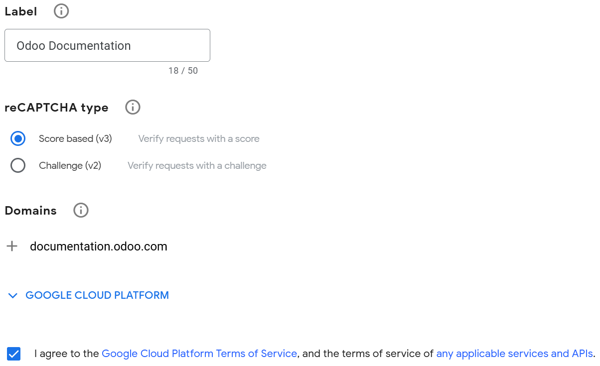

=====================
reCAPTCHA v3 on forms
=====================

Google's reCAPTCHA protects website forms against spam and abuse. It attempts to distinguish between
human and bot submissions.

.. warning::
   reCAPTCHA v3 may not be compliant with local data protection regulations.

.. note::
   reCAPTCHA v3 works in the background and does not interrupt visitors. However, if the check
   fails, visitors cannot submit the form.

.. seealso::
   `Google's reCAPTCHA v3 guide <https://developers.google.com/recaptcha/docs/v3>`_

Configuration
=============

On Google
---------

Open `the reCAPTCHA website registration page <https://www.google.com/recaptcha/admin/create>`_. Log
in or create a Google account if necessary.

On the website registration page:

- Give the website a :guilabel:`Label`.
- Leave the :guilabel:`reCAPTCHA type` on :guilabel:`Score based (v3)`.
- Enter one or more :guilabel:`Domains` (e.g., *example.com* or *subdomain.example.com*).
- Under :guilabel:`Google Cloud Platform`, a project is automatically selected if one was already
  created with the logged-in Google account. If not, one is automatically created. Click
  :guilabel:`Google Cloud Platform` to select a project yourself or rename the automatically created
  project.
- Agree to the terms of service.
- Click :guilabel:`Submit`.

A new page with the generated keys is then displayed. Leave it open for convenience, as copying the
keys to Odoo is required next.

On Odoo
-------

- From the database dashboard, click :guilabel:`Settings`. Under :guilabel:`Integrations`, enable
  :guilabel:`reCAPTCHA` if needed.

  .. warning::
     Do not disable the :guilabel:`reCAPTCHA` feature or uninstall the :guilabel:`Google reCAPTCHA
     integration` module, as many other modules would also be removed.

- Open the Google reCAPTCHA page, copy the :guilabel:`Site key`, and paste it into the
  :guilabel:`Site Key` field in Odoo.
- Open the Google reCAPTCHA page, copy the :guilabel:`Secret key`, and paste it into the
  :guilabel:`Secret Key` field in Odoo.
- Change the default :guilabel:`Minimum score` (`0.7`) if necessary, using a value between `1.0`
  and `0.0`. The higher the threshold is, the more difficult it is to pass the reCAPTCHA, and vice
  versa. Out of the 11 levels, only the following four score levels are available by default: `0.1`,
  `0.3`, `0.7` and `0.9`.
- Click :guilabel:`Save`.

.. seealso::
   `Interpret reCAPTCHA scores - Google documentation <https://cloud.google.com/recaptcha/docs/interpret-assessment-website#interpret_scores>`_

All pages using the :guilabel:`Form`, :guilabel:`Newsletter Block`, :guilabel:`Newsletter Popup`
snippets, and the eCommerce :guilabel:`Extra Step During Checkout` form are now protected by
reCAPTCHA.

.. note::
   - If the reCAPTCHA check fails, the following error message is displayed:

     .. image:: recaptcha/recaptcha-error.png
        :alt: Google reCAPTCHA verification error message

   - reCAPTCHA v3 is free for up to `1 million assessments per month <https://developers.google.com/recaptcha/docs/faq#are-there-any-qps-or-daily-limits-on-my-use-of-recaptcha>`_.

.. tip::
   - Analytics and additional settings are available on `Google's reCAPTCHA administration page
     <https://www.google.com/recaptcha/admin/>`_. For example, you can receive email alerts if
     Google detects suspicious traffic on your website or view the percentage of suspicious
     requests, which could help you determine the right minimum score.

   - You can notify visitors that reCAPTCHA protects a form. To do so, open the website editor
     and navigate to the form. Then, click somewhere on the form, and on the right sidebar's
     :guilabel:`Customize` tab, toggle :guilabel:`Show reCAPTCHA Policy` found under the
     :guilabel:`Form` section.

   .. image:: recaptcha/recaptcha-policy.png
      :alt: reCAPTCHA policy message displayed on a form
