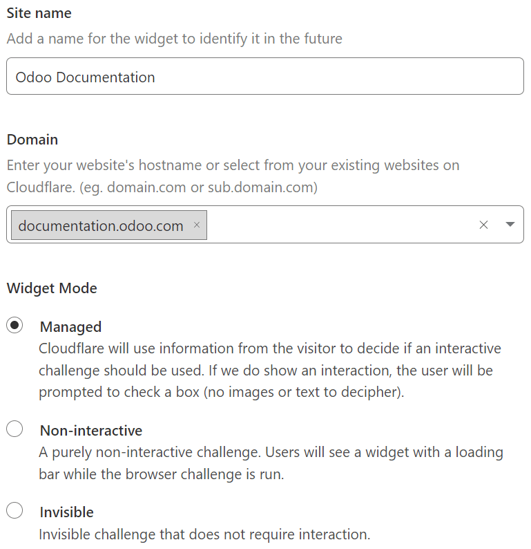

=====================
Forms spam protection
=====================

:ref:`Cloudflare Turnstile <cloudflare-turnstile>` and :ref:`Google reCAPTCHA v3 <google-recaptcha>`
protect website forms against spam and abuse. They attempt to distinguish between human and bot
submissions using non-interactive challenges based on telemetry and visitor behavior.

.. tip::
   **Cloudflare Turnstile is recommended** as it is possible to add an interactive check if the
   automated check fails. Also, Google reCAPTCHA v3 is limited to `1 million assessments per month
   per domain <https://developers.google.com/recaptcha/docs/faq#are-there-any-qps-or-daily-limits-on-my-use-of-recaptcha>`_.

.. note::
   All pages using the :guilabel:`Form`, :guilabel:`Newsletter Block`, :guilabel:`Newsletter Popup`
   snippets, and the eCommerce :guilabel:`Extra Step During Checkout` form are protected by both
   tools.

.. seealso::
   - `Cloudflare Turnstile's documentation <https://developers.cloudflare.com/turnstile/>`_
   - `Google's reCAPTCHA v3 guide <https://developers.google.com/recaptcha/docs/v3>`_

.. _cloudflare-turnstile:

Cloudflare Turnstile configuration
==================================

On Cloudflare
-------------

- `Create <https://dash.cloudflare.com/sign-up>`_ a Cloudflare account or use an existing one and
  `log in <https://dash.cloudflare.com/login>`_.
- On the dashboard navigation sidebar, click :guilabel:`Turnstile`.
- On the :guilabel:`Turnstile Sites` page, click :guilabel:`Add Site`.
- Add a :guilabel:`Site name` to identify it easily.
- Enter or select the website's :guilabel:`Domain` (e.g., *example.com* or *subdomain.example.com*).
- Select a :guilabel:`Widget Mode`:

  - The :guilabel:`Managed` mode is **recommended**, as visitors can be prompted to check a box
    confirming they are human if deemed necessary by Turnstile.

    .. image:: spam_protection/turnstile-human.png
       :alt: Cloudflare Turnstile human verification widget

  - For the :guilabel:`Non-interactive` and :guilabel:`Invisible` modes, visitors are never
    prompted to interact. In :guilabel:`Non-interactive` mode, a loading widget can be displayed to
    warn visitors that Turnstile protects the form; however, the widget is not supported by Odoo.

    .. note::
       If the Turnstile check fails, visitors are not able to submit the form, and the following
       error message is displayed:

       .. image:: spam_protection/turnstile-error.png
          :alt: Cloudflare Turnstile verification error message

- Click :guilabel:`Create`.

The generated keys are then displayed. Leave the page open for convenience, as copying the keys in
Odoo is required next.

On Odoo
-------

- From the database dashboard, click :guilabel:`Settings`. Under :guilabel:`Integrations`, enable
  :guilabel:`Cloudflare Turnstile` and click :guilabel:`Save`.
- Open the Cloudflare Turnstile page, copy the :guilabel:`Site Key`, and paste it into the
  :guilabel:`CF Site Key` field in Odoo.
- Open the Cloudflare Turnstile page, copy the :guilabel:`Secret Key`, and paste it into the
  :guilabel:`CF Secret Key` field in Odoo.
- Click :guilabel:`Save`.

.. tip::
   Navigate to Turnstile on your Cloudflare account to view the solve rates and access more
   settings.

.. _google-recaptcha:

reCAPTCHA v3 configuration
==========================

On Google
---------

Open `the reCAPTCHA website registration page <https://www.google.com/recaptcha/admin/create>`_. Log
in or create a Google account if necessary.

On the website registration page:

- Give the website a :guilabel:`Label`.
- Leave the :guilabel:`reCAPTCHA type` on :guilabel:`Score based (v3)`.
- Enter one or more :guilabel:`Domains` (e.g., *example.com* or *subdomain.example.com*).
- Under :guilabel:`Google Cloud Platform`, a project is automatically selected if one was already
  created with the logged-in Google account. If not, one is automatically created. Click
  :guilabel:`Google Cloud Platform` to select a project yourself or rename the automatically created
  project.
- Agree to the terms of service.
- Click :guilabel:`Submit`.

.. image:: spam_protection/recaptcha-google-configuration.png
   :alt: reCAPTCHA website registration example

A new page with the generated keys is then displayed. Leave it open for convenience, as copying the
keys to Odoo is required next.

On Odoo
-------

- From the database dashboard, click :guilabel:`Settings`. Under :guilabel:`Integrations`, enable
  :guilabel:`reCAPTCHA` if needed.

  .. warning::
     Do not disable the :guilabel:`reCAPTCHA` feature or uninstall the :guilabel:`Google reCAPTCHA
     integration` module, as many other modules would also be removed.

- Open the Google reCAPTCHA page, copy the :guilabel:`Site key`, and paste it into the
  :guilabel:`Site Key` field in Odoo.
- Open the Google reCAPTCHA page, copy the :guilabel:`Secret key`, and paste it into the
  :guilabel:`Secret Key` field in Odoo.
- Change the default :guilabel:`Minimum score` (`0.50`) if necessary, using a value between `1.00`
  and `0.00`. The higher the threshold is, the more difficult it is to pass the reCAPTCHA, and vice
  versa.
- Click :guilabel:`Save`.

You can notify visitors that reCAPTCHA protects a form. To do so, open the website editor and
navigate to the form. Then, click somewhere on the form, and on the right sidebar's
:guilabel:`Customize` tab, toggle :guilabel:`Show reCAPTCHA Policy` found under the :guilabel:`Form`
section.

.. image:: spam_protection/recaptcha-policy.png
   :alt: reCAPTCHA policy message displayed on a form

.. note::
   If the reCAPTCHA check fails, the following error message is displayed:

   .. image:: spam_protection/recaptcha-error.png
      :alt: Google reCAPTCHA verification error message

.. tip::
   Analytics and additional settings are available on `Google's reCAPTCHA administration page
   <https://www.google.com/recaptcha/admin/>`_. For example, you can receive email alerts if Google
   detects suspicious traffic on your website or view the percentage of suspicious requests, which
   could help you determine the right minimum score.
