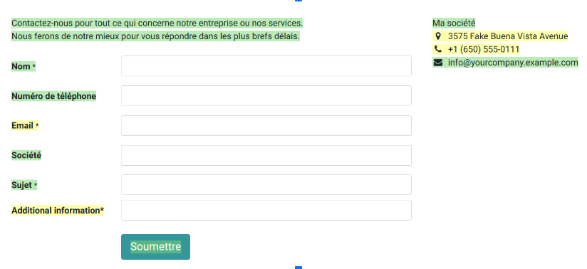

============
Translations
============

Your website is displayed in the language that matches your visitor’s browser. If the browser’s
language has not been installed and added to your website, the content is shown in the
:ref:`default language <translate/default-language>`. When additional languages are installed, users
can choose their preferred language using the :ref:`language selector <translate/language-selector>`.

The :ref:`Translate <translate/translate>` feature on your website allows automatic translation of
standard terms and provides a tool for manual content translation.

Install languages
=================

To allow translation of your website, you must first :doc:`install <../../../general/users/language>`
the required languages and add them to your website. To do so, go to :menuselection:`Website -->
Configuration --> Settings` and click :guilabel:`Install languages` in the :guilabel:`Website info`
section. In the dialog box that opens, select the :guilabel:`Languages` you want from the dropdown
menu, tick the required :guilabel:`Websites to translate`, and click :guilabel:`Add`.

To edit your website's languages, go to :menuselection:`Website –> Configuration –> Settings` and
add/remove the required languages in/from the :guilabel:`Languages` field in the
:guilabel:`Website info` section.

.. tip::
   Alternatively, once the languages have been installed, you can add them from the :ref:`language
   selector <translate/language-selector>`. You might then need to refresh your page to see the new
   language.

.. _translate/default-language:

Default language
----------------

When multiple languages are available on your website, you can set a default language to be used if
the visitor’s browser language is not available. To do so, go to :menuselection:`Website –->
Configuration -–> Settings`, and select a language in the :guilabel:`Default` field.

.. note::
   This field is only visible if multiple languages have been installed and added to your website.

.. _translate/language-selector:

Language selector
=================

Your website’s visitors can switch languages using the language selector, available by default in
the :guilabel:`Copyright` section at the bottom of the page. To edit the language selector menu:

#. Go to your website and click :guilabel:`Edit`;
#. Click the language selector available in the :guilabel:`Copyright` block and go to the
   :guilabel:`Copyright` section of the website builder;
#. Set the :guilabel:`Language selector` field to either :guilabel:`Dropdown` or :guilabel:`Inline`.
   Click :guilabel:`None` if you do not want to display the  :guilabel:`Language selector`;

     .. image:: translate/language-selector.png
        :alt: Add a language selector menu.

#. Click :guilabel:`Save`.

.. tip::
  You can also add the :guilabel:`Language Selector` to the :guilabel:`Header` of your page. To do
  so, click the :guilabel:`Header` block and go to the :guilabel:`Navbar` section to edit the
  :guilabel:`Language Selector`.

.. _translate/translate:

Translate your website
======================

Select your desired language from the language selector to see your content in another language.
Then, click the :guilabel:`Translate` button in the top-right corner to manually activate the
translation mode so that you can translate what has not been translated automatically by Odoo.

Translated text strings are highlighted in green; text strings that were not translated
automatically are highlighted in yellow.

In this mode, you can only translate text. To change the page's structure, you must edit the master
page, i.e., the page in the original language of the database. Any changes made to the master page
are automatically applied to all translated versions.

To replace the original text with the translation, click the block, edit its contents, and save.

.. note::
  When a website supports multiple languages, the content is accessible through different URLs,
  depending on the language selected. For example,
  `https://www.mywebsite.com/shop/product/my-product-1` is the URL to the master page, in English,
  while `https://www.mywebsite.com/fr_FR/shop/product/mon-produit-1` is the URL to the French
  version of the same page.

.. tip::
  Once the desired language is installed, you can translate some items from the backend (e.g., the
  product's name in the product form). To do so, click the language code (e.g., :guilabel:`EN`) next
  to the text you want to translate and add the translation.

Content visibility by language
------------------------------

You can hide content (such as images or videos, for example) depending on the language. To do so:

#. Click :guilabel:`Edit` and select an element of your website;
#. Go to the :guilabel:`Text - Image` section and :guilabel:`Visibility`;
#. Click :guilabel:`No condition` and select :guilabel:`Conditionally` instead;
#. Go to :guilabel:`Languages` to configure the condition(s) to apply by selecting
   :guilabel:`Visible for` or :guilabel:`Hidden for`, and click :guilabel:`Choose a record` to
   decide which languages are impacted.
