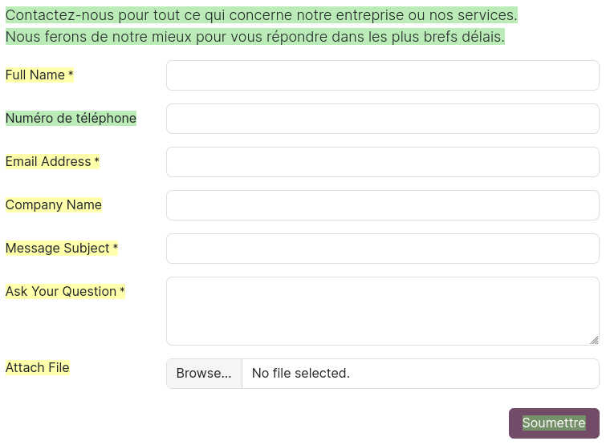

============
Translations
============

Your website can be translated into multiple languages, allowing visitors to view its content in
their preferred language.

Configuration
=============

Before translating a website into one or more languages, :doc:`install them on the database
<../../../general/users/language>`. To do so:

- Go to :menuselection:`Website --> Configuration --> Settings`.
- Under the :guilabel:`General` section, click :icon:`oi-arrow-right` :guilabel:`Install new
  languages`.
- In the dialog box, select one or more :guilabel:`Languages` from the dropdown menu, click
  :guilabel:`Add`, then :guilabel:`Close`.

Next, add the installed language(s) to the website by selecting them under the :guilabel:`Languages`
field and clicking :guilabel:`Save`.

.. tip::
   To remove a language from a website, click the :icon:`oi-close` :guilabel:`(Delete)` icon next to
   it.

.. _translate/language-selector:

Language selector
=================

Once another language is added to a website, the language selector is displayed in the website's
header and footer, allowing visitors to switch between languages.

.. tip::
   - Refresh your browser if the language selector or a language option does not appear.
   - If the visitor's browser language is not available, the website will use the website's default
     language. To edit it, go to :menuselection:`Website --> Configuration --> Settings`. Under the
     :guilabel:`General` section, select the language using the :guilabel:`Default` field.

To hide or customize the appearance of one of the language selectors, open the website in the
default language, click :guilabel:`Edit`, then select the language selector.

- To edit the header's language selector:

  #. In the sidebar, scroll down to the :guilabel:`Language Selector` section.
  #. Set the :guilabel:`Style` to :guilabel:`Dropdown` or :guilabel:`Inline`.
  #. Set the :guilabel:`Label` to :guilabel:`Text`, :guilabel:`Flag`, :guilabel:`Flag and Text`,
     :guilabel:`Code`, or :guilabel:`Flag and Code`.
  #. Click :guilabel:`Save`.

  .. tip::
     To hide the language selector in the header, go to the :guilabel:`Show/Hide Elements` section
     and click the :icon:`fa-flag` (:guilabel:`Language selector`) button next to the
     :guilabel:`Actions` field.

- To edit the footer's language selector:

  #. Set the :guilabel:`Language selector` field to :guilabel:`Dropdown`, :guilabel:`Inline`,
     or :guilabel:`None`.
  #. Set the :guilabel:`Label` to :guilabel:`Text`, :guilabel:`Flag`, :guilabel:`Flag and Text`,
     :guilabel:`Code`, or :guilabel:`Flag and Code`.
  #. Click :guilabel:`Save`.

.. tip::
   You can :ref:`display or hide website elements <website/visibility/conditions>` based on the
   website's language.

.. _translate/translate:

Translate a page
================

To translate a website page, switch to the language to translate and click :menuselection:`Edit -->
Translate` in the top-right corner to activate the translation mode.

.. note::
   - In this mode, only translatable text can be edited. Any other type of modification with the
     website builder must be carried out while using the default language.
   - Depending on the language added, some default content may already be translated. However, the
     content you added manually should be translated using the :guilabel:`Translate` feature.
   - When text is highlighted in green, it indicates that it has already been translated (manually
     or automatically). When text is highlighted in yellow, it indicates that it has not been
     translated.

Click the green button next to the :guilabel:`Translated to` field to automatically translate all
text highlighted in yellow. You can also manually translate or adapt text, whether it is highlighted
in green or yellow, by selecting it and editing it. Click :guilabel:`Save` when you are done
translating.

.. tip::
   - The core URL structure remains consistent across languages, while specific elements like
     product names or categories are translated. For example,
     `https://www.mywebsite.com/shop/product/my-product-1` is the default version of a product page,
     while `https://www.mywebsite.com/fr/shop/product/mon-produit-1` is the translated version of
     the same product page. The structure (`/shop/product/`) remains unchanged, but the product name
     (`my-product`) is translated (`mon-produit`).
   - Some elements can also be translated from the backend (e.g., product names).

Translate SEO-related elements
------------------------------

To translate an :ref:`image's alt tag <seo/images>` (i.e., the image's :guilabel:`Description`
field) and title tag (i.e., the image's :guilabel:`Tooltip` field), switch to the language to
translate, click :menuselection:`Edit --> Translate`, and select the image. In the
:guilabel:`Translate Attribute` box, enter the translation for the :guilabel:`alt` and/or the
:guilabel:`title` tags.

To add translated :ref:`meta tags <seo/meta-tags>`, go to :menuselection:`Website --> Site -->
Optimize SEO`. In the :guilabel:`Keywords` section, select the language and add the keywords.

.. note::
   When viewing a website in its default language, all keywords are displayed, regardless of their
   language. However, when viewing a website in another language, only the keywords relevant to that
   language are displayed.

.. seealso::
   :doc:`Search Engine Optimization <../structure/seo>`
