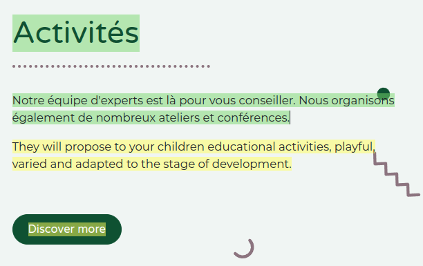

============
Translations
============

The contents of your website pages (i.e., text strings) can be translated into different languages
directly on your website.

Your website is displayed in the language that matches the visitor's browser's language, unless that
particular language has not been installed. In this case, the website is displayed in the
:ref:`default language <translate/default-language>`. The visitor can still select another language
in the language menu.

Installing languages
====================

To translate your website, you first have to add the required languages:

#. Go to your website.
#. Scroll to the bottom of the page to the **language menu**.
#. Click the language and select :guilabel:`Add a language`.

   .. image:: translate/website-add-language.png
      :alt: Add a language to your website.

#. Click the :guilabel:`Languages` field and select the required language from the drop-down list.
   Repeat this step for each additional language.
#. Click the :guilabel:`Add` button.

.. tip::
   You can also edit your website's languages from the backend, in the :guilabel:`Settings`. Go to
   :menuselection:`Website –> Configuration –> Settings` and add/remove the required languages in
   the :guilabel:`Languages` field, in the :guilabel:`Website info` section.

.. _translate/default-language:

Default language
----------------

If the language of the visitor's browser is not installed on your website, the content is displayed
in the default language.

To define a default language, go to :menuselection:`Website –> Configuration –> Settings`, and
select a language in the :guilabel:`Default` field.

.. note::
   This field is visible only if multiple languages are already configured for your website.

Translating the contents
========================

Once the languages have been added, you can translate the contents of your website. To do so, go to
your website, select the language from the language menu and click the :guilabel:`Translate` button
on the right part of the task bar to activate the **translation mode**.

.. image:: translate/translate-button.png
   :alt: Translate button

As a result:

- Text strings that have already been translated are highlighted in green;
- Text strings that need to be translated are highlighted in yellow.

You can then replace the original text with the translation by clicking the block, editing its
contents and saving.

.. tip::
   - Once the languages have been installed, you can also translate some items (e.g.,
     the product's name and description) from the backend (e.g., in the product template). To do so,
     click the language code (e.g., :guilabel:`EN`) next to the text you want to translate (e.g.,
     the product name) and add the translation.

     .. image:: translate/product-translation.png
        :alt: Translate product-related items.

   - You can also :doc:`export/import translations <../../../../developer/howtos/translations>`
     to translate multiple items (e.g., product names and descriptions) in one go.

Language selector menu
======================

To add a language selector menu:

#. Go to your website and click :guilabel:`Edit`.
#. Select the block where you want to add the language selector menu (e.g., the header).
#. Select the :guilabel:`Customize` tab.
#. In the :guilabel:`Navbar` section, set the :guilabel:`Language selector` field to either
   :guilabel:`Dropdown` or :guilabel:`Inline`.

   .. image:: translate/language-selector.png
      :alt: Add a language selector menu.

#. Click :guilabel:`Save`.
