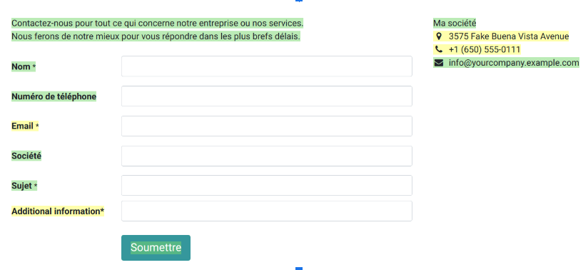

============
Translations
============

:ref:`Translate <translate/translate>` the website into multiple languages to allow visitors to view
the content in their preferred language.

The website content is displayed in the :ref:`default language <translate/default-language>` defined
in the database.

To make the content available in other languages, you must install the required
languages and add them to the website. Once this is done, a :ref:`language selector <translate/language-selector>`
is automatically added to the website, allowing visitors to choose their preferred language.

Install languages
=================

To allow translation on the website, first :doc:`install <../../../general/users/language>`
the required languages and add them to the website. To do so, go to :menuselection:`Website -->
Configuration --> Settings --> General section --> Install new languages`.
In the dialog box that opens, select the :guilabel:`Languages` from the dropdown menu, tick the
required :guilabel:`Websites to translate`, click :guilabel:`Add`, and click :guilabel:`Close`.

.. tip::
   Once the new languages have been added, refreshing the page might be necessary to see them in the
   :ref:`language selector <translate/language-selector>`.

To remove a language from the website, go to :menuselection:`Website -->
Configuration --> Settings --> General section --> Languages field`. click the cross of a language
to remove it.

.. _translate/default-language:

Default language
----------------

When multiple languages are available on your website, you can set a default language to be used if
the visitor’s browser language is not available. To do so, go to :menuselection:`Website -->
Configuration --> Settings --> General section --> Default field`, and select a language.

.. note::
   The :guilabel:`Default language` field is only visible if multiple languages have been installed
   and added to your website.

.. _translate/language-selector:

Language selector
=================

As soon as other languages are installed and added in the website, a :guilabel:`Language selector`
appears on the website, allowing visitors to switch between languages. It automatically appears in
the header as a dropdown menu and in the :guilabel:`Copyright` section at the bottom of the page.

To customize the appearance of the Language selector in the header block:

#. Go to the website in the default language and click :guilabel:`Edit`;
#. Click the :guilabel:`Language Selector` available in the header block;
#. In the website builder, go to the :guilabel:`Language Selector` field;
#. Set the :guilabel:`Language Selector` field to either :guilabel:`Dropdown`, :guilabel:`Inline`,
   Click :guilabel:`None` if the :guilabel:`Language selector` is not intended to be displayed;
#. Set the :guilabel:`Label` to either :guilabel:`Text`, :guilabel:`Flag`, :guilabel:`Flag and Text`,
   :guilabel:`Code`, or :guilabel:`Flag and Code`;
#. Click :guilabel:`Save`.

To customize the appearance of the Language selector in the :guilabel:`Copyright` block:

#. Go to the website in the default language and click :guilabel:`Edit`;
#. Click the language selector available in the :guilabel:`Copyright` block;
#. In the website builder, go to the :guilabel:`Copyright` section;
#. Set the :guilabel:`Language Selector` field to either :guilabel:`Dropdown`, :guilabel:`Inline`,
   Click :guilabel:`None` if the :guilabel:`Language selector` is not intended to be displayed;
#. Set the :guilabel:`Label` to either :guilabel:`Text`, :guilabel:`Flag`, :guilabel:`Flag and Text`,
   :guilabel:`Code`, or :guilabel:`Flag and Code`;
#. Click :guilabel:`Save`.

  .. image:: translate/language-selector.png
          :alt: Add a language selector menu.

Change website's language
=========================

Go to the website page, select the language from the :guilabel:`Language selector` in the header or
in he footer, to see the content of the website in another language.
In added languages, standard terms are translated, but the rest of the content can be translated
using the :guilabel:`Translate` feature.

.. _translate/translate:

Translate website page
----------------------

Translation can be done manually or automatically with one click.

Translate manually
~~~~~~~~~~~~~~~~~~

Click the :guilabel:`Language selector`, select the language with missing translation, click
:menuselection:`Edit --> Translate` in the top-right corner to activate the translation mode.
Translated text is highlighted in green, while text that is not translated is highlighted in yellow.
To translate the required text, click the block, edit its contents, then click :guilabel:`Save`.

Translate with one click
~~~~~~~~~~~~~~~~~~~~~~~~

Translate an entire page with one click. After clicking :menuselection:`Edit --> Translate`, click
the green language button on the top-right corner to automatically translate all the content
highlighted in yellow.

.. note::
   The :guilabel:`Edit` button opens the translation mode only while viewing the page in a language
   that is not the default one. In this mode, only translations can be edited. Any other type of
   modification with the website builder must be carried out while using the default language.
   Any changes made to the default-language pages are automatically applied to the pages of all
   other languages.

.. note::
   When a website supports multiple languages, the core URL structure remains consistent across
   languages, while specific elements like product names or categories are translated. For example,
   `https://www.mywebsite.com/shop/product/my-product-1` is the English version of a product page,
   while `https://www.mywebsite.com/fr/shop/product/mon-produit-1` is the French version of the same
   page. The structure (/shop/product/) stays unchanged, but the translated elements (e.g., product
   name) adapt to the selected language.

.. tip::
   Once the desired language is installed, some items from the backend can be translated (e.g., the
   product's name in the product form). To do so, click the language code (e.g., :guilabel:`EN`) next
   to the text you want to translate and add the translation.

Translate alt tags
------------------

To translate Alt tags on any image, start by defining an Alt tag on the image.

Switch to the default language, click :guilabel:`Edit` and then click the image. On the
:guilabel:`Edit` bar, go to the :guilabel:`Image` section and fill in the fields
:guilabel:`Description` and :guilabel:`Tooltip`.

To translate the Alt tag, switch to the language to translate.
Then click on :menuselection:`Edit --> Translate` and click on the image. In the
:guilabel:`Translate Attribute` box that opens, add translation to the :guilabel:`title` and
the :guilabel:`alt`.

Translate meta tags
-------------------

To translate :ref:`meta tags <seo/meta-tags>`, navigate to the website in the desired language, then
click on :menuselection:`Site --> Optimize SEO` to adjust the page's metadata by editing different
fields (:guilabel:`Title`, :guilabel:`Description`, and :guilabel:`Keywords`) to match the language
of the page.

.. note::
   When viewing the website in its default language, you will see all the added keywords,
   regardless of their language. However, if you switch the website to a different language, such as
   French, you will only see the keywords relevant to that language. Filtering all keywords by each
   language is not possible.

Content visibility by language
==============================

You can hide content (such as images or videos, for example) depending on the language. To do so:

#. Click :guilabel:`Edit` and select an element of your website;
#. Go to the :guilabel:`Title - Image` section and :guilabel:`Visibility`;
#. Click :guilabel:`No condition` and select :guilabel:`Conditionally` instead;
#. Go to :guilabel:`Languages` to configure the condition(s) to apply by selecting
   :guilabel:`Visible for` or :guilabel:`Hidden for`, and click :guilabel:`Choose a record` to
   decide which languages are impacted.
