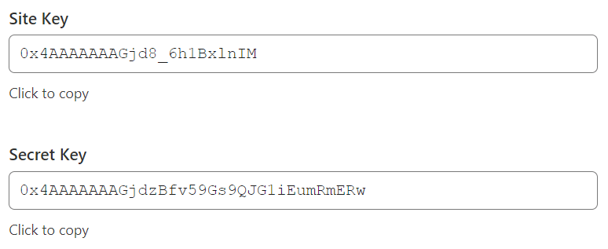

=============================
Cloudflare Turnstile on forms
=============================

Cloudflare Turnstile protects website forms against spam and abuse. It attempts to distinguish
between human and bot submissions using non-interactive challenges based on telemetry and visitor
behavior. An interaction is only required when the automatic checks are not passed if desired.

.. seealso::
   `Cloudflare Turnstile's documentation <https://developers.cloudflare.com/turnstile/>`_

Configuration
=============

On Cloudflare
-------------

- `Create <https://dash.cloudflare.com/sign-up>`_ a Cloudflare account or use an existing one and
  `log in <https://dash.cloudflare.com/login>`_.
- On the dashboard navigation sidebar, click :guilabel:`Turnstile`.
- On the :guilabel:`Turnstile Sites` page, click :guilabel:`Add Site`.
- Add a :guilabel:`Site name` to identify it easily.
- Enter or select the website's :guilabel:`Domain` (e.g., *odoo.com* or *example.odoo.com*).
- Select a :guilabel:`Widget Mode`:

  - The :guilabel:`Managed` mode is recommended, as visitors can be prompted to check a box
    confirming they are human if deemed necessary by Turnstile.

    .. image:: turnstile/turnstile-human.png
       :alt: Cloudflare Turnstile human verification widget

  - For the :guilabel:`Non-interactive` and :guilabel:`Invisible` modes, visitors are never
    prompted to interact. In :guilabel:`Non-interactive` mode, a loading widget can be displayed to
    warn visitors that Turnstile protects the form; however, the widget is not supported by Odoo.

    .. note::
       If the Turnstile check fails, visitors are not able to submit the form, and the following
       error message is displayed:

       .. image:: turnstile/turnstile-error.png
          :alt: Cloudflare Turnstile verification error message

- Click :guilabel:`Create`.

.. image:: turnstile/turnstile-configuration.png
   :alt: Adding a website to Cloudflare Turnstile

The generated keys are then displayed. Leave the page open for convenience, as copying the keys to
Odoo is required next.

On Odoo
-------

- From the database dashboard, click :guilabel:`Settings`. Under :guilabel:`Integrations`, enable
  :guilabel:`Cloudflare Turnstile` and click :guilabel:`Save`.
- Open the Cloudflare Turnstile page, copy the :guilabel:`Site Key`, and paste it into the
  :guilabel:`CF Site Key` field in Odoo.
- Open the Cloudflare Turnstile page, copy the :guilabel:`Secret Key`, and paste it into the
  :guilabel:`CF Secret Key` field in Odoo.
- Click :guilabel:`Save`.

All pages using the :guilabel:`Form`, :guilabel:`Newsletter Block`, and :guilabel:`Newsletter Popup`
snippets on the website are now protected by Turnstile.

.. tip::
   Navigate to Turnstile on your Cloudflare account to view the solve rates and access other
   settings.
