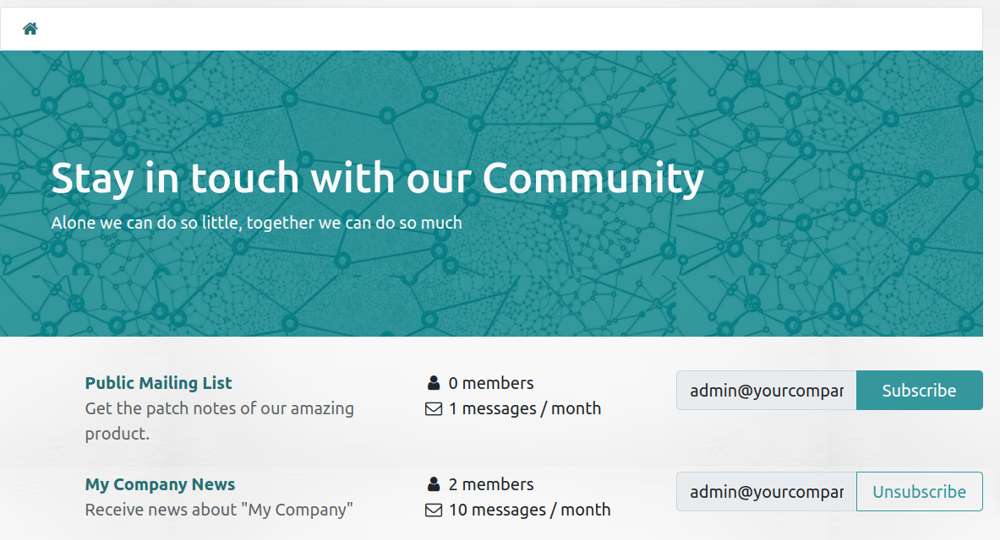

===========
Mail groups
===========

The **mail groups** feature allows website visitors to have a public discussion by email. They can
join a group to receive emails from other group members (i.e., website users who have subscribed to
the group) and send new ones to all group members.

To activate the feature, :ref:`install <general/install>` the :guilabel:`Website Mail Group`
(`website_mail_group`) module.

.. note::
   The **mail groups** feature is not to be confused with the
   :doc:`../../marketing/email_marketing/mailing_lists` in the Email Marketing app.

.. _website/mailing_lists/configure_groups:

Configuring mail groups
=======================

To configure mail groups, proceed as follows:

#. Configure a custom email alias domain by accessing the **General settings**, scrolling down to
   the :guilabel:`Discuss` section, enabling the :guilabel:`Custom Email Server` feature, and
   entering the :guilabel:`Alias domain` (e.g., `@mycompany.com`).
#. Go to :menuselection:`Website --> Configuration --> Mailing Lists`, then click :guilabel:`New`.
#. Specify a :guilabel:`Group Name`, the :guilabel:`Email Alias`, and a :guilabel:`Description`.
#. Enable :guilabel:`Moderate this group` and specify the :guilabel:`Moderators` if you wish to
   :ref:`moderate messages <website/mailing_lists/moderate>` from this group. Alternatively, if the
   group is not moderated, you can define :guilabel:`Responsible Users` who can manage the messages
   in the group.
#. In the :guilabel:`Privacy` tab, define who can subscribe to the mail group:

   - :guilabel:`Everyone`: to make the mail group public so anyone can subscribe to it;
   - :guilabel:`Members only`: to only allow users defined as members to subscribe to the mail group;
   - :guilabel:`Selected group of users`: to only allow users from the :guilabel:`Authorized group`
     to subscribe to the mail group.

#. If the mail group is moderated, you can automatically notify authors when their message is
   pending moderation by enabling :guilabel:`Automatic notification` in the :guilabel:`Notify
   Members` tab and writing the :guilabel:`Notification message`.
#. If you wish to send out guidelines to new subscribers, enable :guilabel:`Send guidelines to new
   subscribers` and write them in the :guilabel:`Guidelines` tab. This is particularly useful when
   the mail group is moderated.

Using mail groups
=================

Subscribing/unsubscribing
-------------------------

Based on the :ref:`configuration of the mail group <website/mailing_lists/configure_groups>`,
users can subscribe to and unsubscribe from mail groups from the website page (`/groups` by default).

Internal users can also do this from :menuselection:`Website --> Configuration --> Mailing Lists`,
using the :guilabel:`Join` and :guilabel:`Leave` buttons.

Sending messages
----------------

To send messages to a mail group, website users can email the :ref:`mail group's email address
<website/mailing_lists/configure_groups>`. Internal users can also create messages directly from
Odoo. To do so, go to :menuselection:`Website --> Configuration --> Mailing Lists`, select the mail
group, click the :guilabel:`Emails` smart button, and click :guilabel:`New`. Then, fill in the
fields and click :guilabel:`Send`.

.. tip::
   - The list of messages can also be accessed by selecting the group from the `/groups` website
     page.
   - Group members can also unsubscribe from the group, access the mail group page, and send emails
     to the group using the URLs in the footer of any group email they have received.

     .. image:: mail_groups/mail-group-URLs.png
        :alt: URLs in the footer of a group email.

.. _website/mailing_lists/moderate:

Moderating mail group messages
==============================

If the :guilabel:`Moderate this group` feature has been enabled for the
:ref:`mail group <website/mailing_lists/configure_groups>`, one of the :guilabel:`Moderators` must
approve the group's messages before they are dispatched to the other members.

To moderate messages, go to :menuselection:`Website --> Configuration --> Mailing Lists`, select the
mail group, and click the :guilabel:`To review` smart button. You can moderate messages using the
buttons at the end of the message line or select a message to view its content and moderate it
accordingly.

   .. image:: mail_groups/mail-group-moderation.png
      :alt: Moderation buttons in the message line.

The following actions are available:

- :guilabel:`Accept`: to accept the email and send it to the mail group members.
- :guilabel:`Reject`: to reject the email. In the pop-up window that opens, click
  :guilabel:`Reject Silently` to reject the email without notifying the author, or specify an
  explanation for rejecting the message, then click :guilabel:`Send & Reject` to reject the message
  and send the explanation to the author.
- :guilabel:`Whitelist`: to whitelist the author, i.e. automatically accept all of their emails. As
  a result, a :ref:`moderation rule <website/mailing_lists/moderate>` is created for the author's
  email address with the status :guilabel:`Always allow`.
- :guilabel:`Ban`: to blacklist the author, i.e. automatically discard all their emails. In the
  pop-up window that opens, click :guilabel:`Ban` to ban the author without notifying them, or
  specify an explanation, then click :guilabel:`Send & Ban` to ban the author and send them the
  explanation. As a result, a :ref:`moderation rule <website/mailing_lists/moderate>` is created for
  the author's email address with the status :guilabel:`Permanent ban`.

.. note::
   Messages can also be moderated from the group's list of messages. Go to :menuselection:`Website
   --> Groups --> Mailing List Groups`, select the mail group and click the :guilabel:`Emails` smart
   button.

.. _website/mailing_lists/moderation_rules:

Whitelisting/Blacklisting authors
=================================

You can whitelist or blacklist an author either directly :ref:`from a mail group message
<website/mailing_lists/moderate>`, or by creating a moderation rule. To do so, go to
:menuselection:`Website --> Configuration --> Moderation Rules` and click :guilabel:`New`. Then,
select the :guilabel:`Group`, specify the author's :guilabel:`Email` and set the :guilabel:`Status`
field.

.. tip::
   You can also access the mail group's moderation rules by going to :menuselection:`Website -->
   Configuration --> Mailing Lists`, selecting the group, then clicking the :guilabel:`Moderations`
   smart button.
