========
Optimize
========

Now that you've built your website, it's time to optimize it with Odoo. Odoo provides numerous
tools to enhance your site's SEO, loading speed, image optimization, and so much more.

Search Engine Optimization (SEO)
================================

Search Engine Optimization, otherwise known as SEO, is a set of strategic practices that can
optimize your website and enhance its ranking in search engines (like, Google). Proper SEO practices
are important because a great SEO ranking helps your website gain more visitors.

Some quality SEO practices include: having fast load times, making sure each page has one (and only
one) title ``<h1>``, your meta tags (alt-tag, title-tag) should be consistent with the content
they represent, and your website should have a ``/sitemap.xml`` file. But these are just a few of
the *many* SEO strategies you can employ to earn a better SEO ranking for your website.

To guarantee that your Odoo Website (and Odoo eCommerce) has a great SEO ranking, Odoo eliminates
all the technical complexities of SEO, and handles these intricate search engine strategies *for
you* - in the easiest way possible.

First, let's see how to boost your ranking by fine-tuning your content (and meta tags) for your
website.

Meta Tags
---------

Title, description
******************

Every page on your website should define the ``<title>`` and ``<description>`` meta data.

These elements are used by search engines to promote your website. They are automatically generated
based on the page title and content, but you can fine-tune them whenever you'd like, by clicking
*Optimize SEO* under the *Promote* menu.

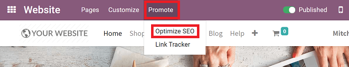

When you click *Optimize SEO* a pop-up appears, in which you enter in the pertinent SEO-related
information about the page and its content.

Remember, you need to be accurate with this information. If they don't fit the content of the page,
search engines will downgrade your website, which negatively affects your SEO ranking.

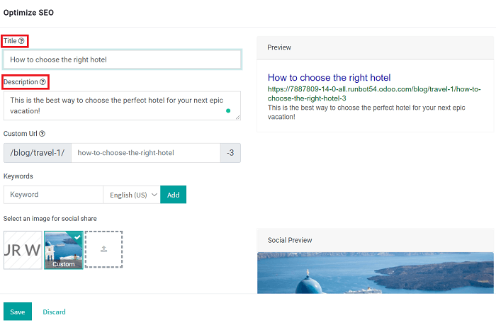

Keywords
********

To get the most out of your content *and* boost traffic, Odoo provides users with a ``<keyword>``
finder. These keywords are the search terms that you want to lead towards your website.

When you enter a keyword into the *Keywords* field, and hit *Add*, you see how it is used in the
content (H1, H2, page title, page description, page content). You also see what the related
keywords are in Google. If you want to add any of those related keywords to your list, simply
click on it, and Odoo will add it for you.

The more keywords used, the better.

.. image:: optimize/seo/keyword-finder.png
   :align: center
   :alt: odoo keyword finder seo optimization

.. note::
   If your website is in multiple languages, you can use the *Promote* tool for every language of a
   single page, set a specific title, description, and search tags, as well.

Content is king
---------------

When it comes to SEO, content is king. That's why Odoo provides several modules to help users build
incredible content for their websites.

Odoo offers the following:

- **Odoo Blogs**: write great content about anything you want.

- **Odoo eLearning Course**: publish all sorts of content as part of an educational online course.
  The content is automatically indexed on the web page.

- **Odoo Forum**: let your community create content for you, by allowing them to share their
  thoughts, feelings, and opinions with each other. Example: `odoo.com/forum/1 <https://odoo
  .com/forum/1>`_

...and many more!

.. note::
   The 404 page is a regular page that you can edit like any other in Odoo. That way, you can build
   build a great 404 page to redirect to the top content of your website when visitors get lost with
   invalid URLs.

Social networks
---------------

Social media is built for mass-sharing. If lots of people share your content on social media, it's
likely that even more people will link to it, and links are a *huge* factor for SEO rankings.

That's why Odoo embeds several tools to help share content through various social media channels.

Social network links
********************

Odoo allows users to link all their social media accounts in the footer of their website. All
you have to do is input all the necessary accounts in your company settings, and Odoo will take
care of the rest.

.. image:: optimize/seo/seo03.png
   :align: center
   :alt: connect with us social media links

Social share
************

It's important to allow your visitors to share any content they like on your website on their
various social media platforms. The best way to do that, is to drop the *Share* building block on
any page you want your visitors to share with their followers.

When visitors click that icon, they are then prompted to share that page on their social media feed.

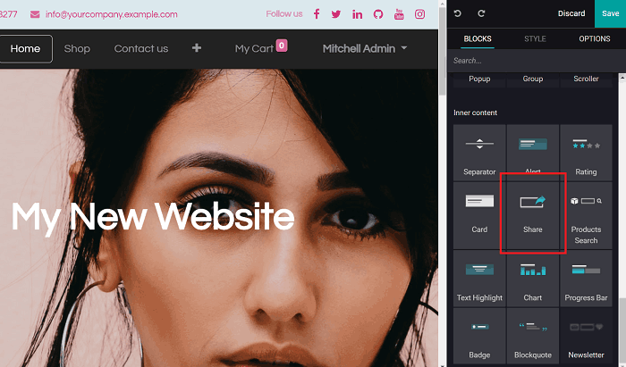

Remember, most social media platforms use a picture of the image as part of the share post.

Odoo uses the website logo by default, but you can choose any other image of your page by going
to :menuselection:`Promote --> Optimize SEO` and select an image for social sharing purposes.

.. image:: optimize/seo/seo05.png
   :align: center
   :alt: picture used for social media shares

Facebook page
*************

Looking for a unique way to catch the eye of your visitor *and* promote your *Facebook* page
(or business)? Simply drop the *Facebook* building block onto your page, while in the *Edit* mode
on the front-end of your website.

Doing so, will display a customizable widget showcasing your *Facebook* business page, and it will
encourage visitors to follow it.

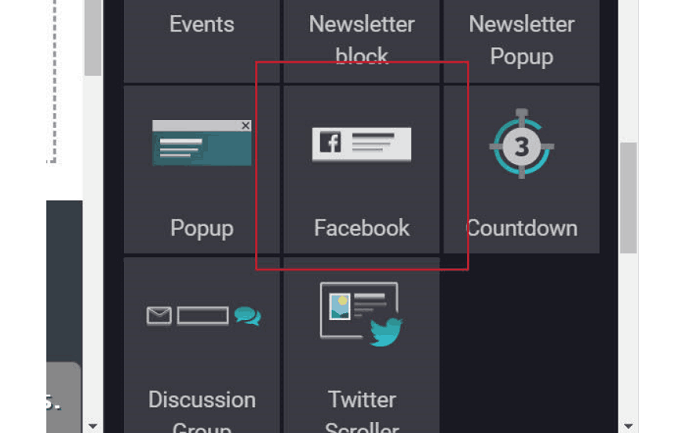

You can choose display the timeline, next events, messages, and more.

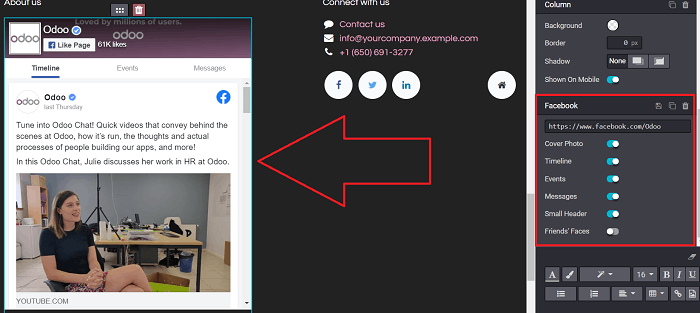

Twitter Scroller
****************

Displaying Twitter feeds with testimonials from happy customers expressing their satisfaction on
your website is a great way to increase (and enhance) your company's online presence.

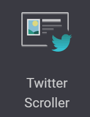

Test website
------------

You can compare how your website ranks (in terms of SEO) against Odoo using free services, like
WooRank : `woorank.com <https://www.woorank.com>`_

Handling URLs
-------------

The following section explains how Odoo makes URLs SEO-friendly.

.. note::
   The following URLs are *not active*. They are purely meant to be used as an example to show
   how Odoo makes URL management easier than ever before.

URL structure
*************

A typical Odoo URL will look like this:

-  https://www.mysite.com/fr\_FR/shop/product/my-great-product-31

URLs are composed of the following components:

-  **https://** = Protocol

-  **www.mysite.com** = Domain name

-  **/fr\_FR** = This is the language that the page is currently in. This part of the URL is removed
   if the visitor browses the main language of the website. In that case, the main version of this
   page would look like this:
   https://www.mysite.com/shop/product/my-great-product-31

-  **/shop/product** = every module defines its own namespace. Thus, */shop* is for the catalog of
   the eCommerce module, and */shop/product* is for a product page.

-  **my-great-product** = by default, this is the slugified title of the product this page refers
   to, but you can customize it for SEO purposes. For instance, if a product is named "Office Lamp"
   it gets slugified to "office-lamp". Depending on the namespace, this could be different objects
   (blog post, page title, forum post, forum comment, product category, etc.).

-  **-31** = the unique ID of the product

.. note::
   Any dynamic component of a URL can be reduced to its ID. As an example, the following
   URLs all do a 301 redirect to the above URL:

   -  https://www.mysite.com/fr\_FR/shop/product/31 (short version)

   -  http://mysite.com/fr\_FR/shop/product/31 (even shorter version)

   -  http://mysite.com/fr\_FR/shop/product/other-product-name-31 (old product name)

Some URLs have several dynamic parts, like this one (a blog category *and* a post):

-  https://www.odoo.com/blog/company-news-5/post/the-odoo-story-56

In the above example:

-  *Company News* is the title of the blog

-  *The Odoo Story* is the title of the specific blog post

When an Odoo page has a "pager," the page number is set directly in the URL (does not have a GET
argument). This allows every page to be indexed by search engines.

Example: https://www.odoo.com/blog/page/3

Changes in URLs and titles
**************************

The URL of a page can change for many reasons. Like, when it becomes a more SEO-friendly version
of a product name, for example. When the URL of a page changes, don't worry. Odoo will
automatically update all its corresponding links to the new URL.

Not only that, but if external websites *still* point to the old URL, a 301 redirect is done,
which re-routes visitors to the new address of the page.

As an example, this URL...

- http://mysite.com/shop/product/old-product-name-31

...will automatically redirect to:

- http://mysite.com/shop/product/new-and-better-product-name-31

In other words, if you change the title of a blog post (or the name of a product), the changes
automatically apply everywhere in your website. Also, the old link still functions when used by
external websites, via a 301 redirect, maintaining the SEO link power.

HTTPS
*****

Search engines boost rankings of secure HTTPS/SSL websites. That's why, by default, all Odoo Online
databases are fully based on HTTPS. If the visitor accesses your website through a non-HTTPS URL,
they get a 301 redirect to its HTTPS equivalent.

Links: Nofollow strategy
************************

The more a page is linked from external and quality websites, the more it helps your SEO ranking.

Here are some Odoo strategies to help you manage links:

- Every link you add to your website is "dofollow", which means this link will contribute to the
  'SEO Juice' for the linked page.

- Every link posted by a contributor (forum post, blog comment, etc.) that links to your own website
  is "dofollow," as well.

- Every link posted by a contributor that links to an external website is "nofollow." That way, you
  don't run the risk of people posting links on your website to third-party websites, which may have
  a bad reputation.

.. note::
   When using the forum, contributors who have a lot of Karma *can be* trusted. In such case, their
   links will not have any ``rel="nofollow"`` attribute.

Multi-Language URLs
*******************

If you run a website in multiple languages, the same content will be available in different URLs,
depending on the language used:

- https://www.mywebsite.com/shop/product/my-product-1 (The main language here is English)

- https://www.mywebsite.com\/fr\_FR/shop/product/mon-produit-1 (This is the French version)

In this example, fr\_FR is the language of the page. You can even have several variations of the
same language, like pt\_BR (Portuguese from Brazil), pt\_PT (Portuguese from Portugal), and so on.

Language annotation
*******************

To let search engines know the second URL is the French translation of the first URL, Odoo adds an
HTML link element in the header.

In the HTML <head> section of the main version, Odoo automatically adds a link element pointing
to the translated versions of that webpage:

-  <link rel="alternate" hreflang="fr"
   href="https://www.mywebsite.com\/fr\_FR/shop/product/mon-produit-1"/>

With this approach search engines redirect to the right language, according to the visitor language.

Don't worry, though. You don't get penalized by search engines if your page isn't translated yet.
Also, when it is, it's not considered "duplicated content." It's merely a different version of the
same content.

Language detection
******************

When a visitor lands on your website for the first time (e.g. yourwebsite.com/shop), they may be
automatically redirected to a translated version, according to that visitor's browser language
preference (e.g. **yourwebsite.com/fr\_FR/shop**).

A cookie of the current language will be kept, so when they visit your website again in the
future, they can avoid any redirection.

To force a visitor to stick to the default language of your website, you can use the code of the
default language in any link you share.

For example: **yourwebsite.com/en\_US/shop**

That above link will always direct visitors to the English version of the page, without using the
browser language preferences.

Page speed
----------

The time it takes to load a page on your website is an important criteria for search engines. A
faster website not only improves your visitor's experience, it gives you a better page ranking,
as well.

Studies have shown that, if you divide the time it takes to load your pages in half (e.g. 2 seconds,
instead of 4 seconds), the visitor abandonment rate is also divided by two (25% to 12.5%). One extra
second to load a page could `cost $1.6b to Amazon in sales <http://www.fastcompany
.com/1825005/how-one-second-could-cost-amazon-16-billion-sales>`__.

.. image:: optimize/seo/seo06.png
   :align: center
   :alt: page load time graph

Fortunately, Odoo does all the page speed magic for you!

Below, you will discover the tricks Odoo uses to speed up your loading time. You can compare how
your website ranks using these two tools:

- `Google Page Speed <https://developers.google.com/speed/pagespeed/insights/>`__

- `Pingdom Website Speed Test <http://tools.pingdom.com/fpt/>`__

Images
------

When you upload new images, Odoo automatically compresses them to reduce their size, with lossless
compression for .PNG and .GIF and lossy compression for .JPG.

Once uploaded, you can manually adjust the look and quality of the image, via the helpful toolbar
located on the right, while in *Edit* mode.

The key is to make the image look great, with the smallest file size possible, *without* sacrificing
quality.

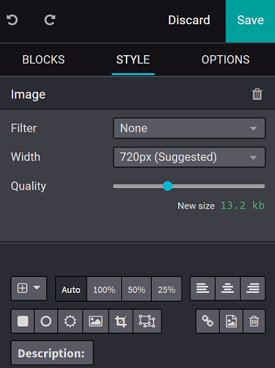

.. note::
   Odoo compresses images when they are uploaded to your website, *not* when requested by the
   visitor. Thus, it's possible that, *if* you use a third-party theme, it will provide images that
   are not compressed efficiently. But all images used in Odoo official themes have been compressed
   by default.

When the image is selected, Odoo allows you to add the Alt and title attributes of the ````
tag by clicking *Description:* in that same toolbar.

When you click on *Description*, the following window appears:

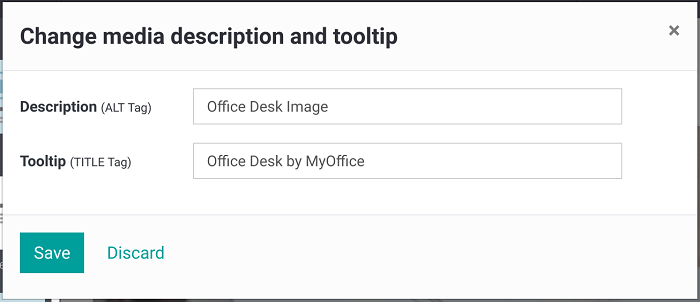

Pictograms
----------

Odoo's pictograms are implemented using a font (`Font Awesome <https://fortawesome.github
.io/Font-Awesome/icons/>`__ in most Odoo themes). You can use as many pictograms as you want, as
they don't result in extra requests to load the page.

.. image:: optimize/seo/seo10.png
   :align: center
   :alt: sample array of pictograms

Static resources: CSS
---------------------

All CSS files are pre-processed, concatenated, minified, compressed, and cached (server-side and
browser-side).

The result is:

- only one CSS file request is needed to load a page

- this CSS file is shared and cached amongst pages, so when the visitor clicks on another page, the
  browser doesn't even have to load a single CSS resource

- this CSS file is optimized to be small

Pre-processed
*************

The CSS framework used by Odoo is Bootstrap.

While a theme might use another framework, most of `Odoo themes <https://www.odoo
.com/apps/themes>`__ extend and customize Bootstrap directly. Since Odoo supports Less and Sass,
you can modify CSS rules, instead of overwriting them through extra CSS lines, which results in a
smaller file.

Concatenated
************

Every module (or library) you might use in Odoo has its own set of CSS, Less, or
Sass files (eCommerce, blogs, themes, etc.).

Having several CSS files is great for the modularity, but not good for the performance. Mainly
because most browsers can only perform 6 requests in parallel, resulting in lots of files loaded in
series.

The latency time to transfer a file is usually much longer than the actual data transfer time,
especially for small files, like .JS and .CSS. Thus, the time to load CSS resources depends more
on the number of requests to be done, rather than the actual file size, itself.

To address this issue, all CSS / Less / Sass files are concatenated into a single .CSS file to send
to the browser.

That way, a visitor has **only one .CSS file to load** per page, which is extremely efficient.

As the CSS is shared amongst all pages, when the visitor clicks on another page, the browser does
not even have to load a new CSS file!

================================= =============================================
  **Both files in the <head>**     **What the visitor gets (only one file)**
================================= =============================================
 /\* From bootstrap.css \*/       .text-muted {
 .text-muted {                    color: #666;
 color: #777;                     background: yellow
 background: yellow;              }
 }

 /\* From my-theme.css \*/
 .text-muted {
 color: #666;
 }
================================= =============================================

The CSS sent by Odoo includes all CSS / Less / Sass of all pages and modules.

By doing this, additional page views from the same visitor will *not* have to load CSS files at all.
However, some modules might include huge CSS/Javascript resources that you do not want to
prefetch at the first page because they are *too* big.

In this case, Odoo splits this resource into a second bundle that is loaded only when the page using
it is requested. An example of this is the backend, which is only loaded when the visitor logs in
and accesses the backend (/web).

.. note::
   If the CSS file is very big, Odoo will split it into two smaller files to avoid the 4095
   selectors limit per sheet of Internet Explorer. But most themes fit below this limit.

Minified
********

After being pre-processed and concatenated, the resulting CSS is minified to reduce its size.

============================ ==============================
  **Before minification**     **After minification**
============================ ==============================
  /\* some comments \*/       .text-muted {color: #666}
  .text-muted {
  color: #666;
  }
============================ ==============================

The final result is then compressed, before being delivered to the browser.

Then, a cached version is stored server-side (we don't have to pre-process, concatenate, or minify
at every request) and browser-side (the same visitor will load the CSS only once for all pages that
they visit).

Static resources: Javascript
----------------------------

Just like with CSS resources, Javascript resources are also concatenated, minified, compressed, and
cached (server-side and browser-side).

Odoo creates three Javascript bundles:

- One for all the pages of the website (including code for parallax effects, form validation, etc.)

- One for common Javascript code shared amongst the front-end and back-end (Bootstrap)

- One for back-end specific Javascript code (Odoo Web Client interface for your employees using
  Odoo)

Most visitors only need the first two bundles, resulting in a maximum of two Javascript files to
load in order to render one page. As these files are shared across all pages, further clicks by
the same visitor will not load any other Javascript resource.

.. note::
   If you work in "Developer Mode," the CSS and Javascript are neither concatenated, nor minified.
   Thus, it's much slower. However, it allows you to easily debug with the Chrome debugger, as CSS
   and Javascript resources are not transformed from their original versions.

CDN
---

If you activate the CDN feature in Odoo, static resources (Javascript, CSS, images) are loaded from
a Content Delivery Network.

Using a Content Delivery Network has three advantages:

- Load resources from a nearby server (most networks have servers in main countries around the
  globe)

- Cache resources efficiently (no computation resources used on your own server)

- Split the resource loading on different services, allowing more resources to load in parallel
  (since the Chrome limit of 6 parallel requests is by domain)

You can activate and configure your CDN options from the **Website** settings, found under the
Configuration menu, but only while in `Developer Mode <https://www.odoo.com/documentation/user/14.0/general/developer_mode/activate
.html#:~:text=Go%20to%20Settings%20%E2%80%A3%20Activate,
developer%20mode%20option%20becomes%20available.>`_.

Here is an example of configuration you can use:

.. image:: optimize/seo/seo11.png
   :align: center
   :alt: cdn setting in the website admin app

HTML pages
----------

HTML pages can be compressed, but this task is usually handled by your web server (NGINX or Apache).

The Odoo Website Builder has been optimized to guarantee clean and short HTML code. Building blocks
have been developed to produce clean HTML code, as well, usually using Bootstrap and the HTML
editor.

For example, if you use the color picker to change the color of a paragraph to the primary color
of your website, Odoo will produce the following code:

``<p class="text-primary">My Text</p>``

But most other HTML editors (such as, CKEditor) will produce the following code:

``<p style="color: #AB0201">My Text</p>``

Responsive design
-----------------

Websites that are not mobile-friendly are negatively impacted in search engine rankings. All Odoo
themes rely on Bootstrap to render everything efficiently, according to the device that's being
used: desktop, tablet, or mobile.

.. image:: optimize/seo/seo12.png
   :align: center
   :alt: examples of odoo's responsive design

Since all Odoo modules share the same technology, all pages on your website are automatically
mobile-friendly.

Browser caching
---------------

Javascript, images, and CSS resources have a URL that changes dynamically when their content
changes. This allows Odoo to set a very long cache delay (XXX) on these resources: XXX secs, while
being updated instantly (if you update the resource).

Scalability
-----------

In addition to being fast, Odoo is also more scalable than traditional CMS and eCommerce platforms
(like Drupal, Wordpress, Magento, Prestashop).

Here's a quick summarization highlighting the scalability of Odoo Website and eCommerce.

.. image:: optimize/seo/seo13.png
   :align: center
   :alt: slide about odoo's scalability

Sitemap
-------

The sitemap points out pages to index to search engine robots. Odoo generates a ``/sitemap.xml``
file automatically for you. For performance reasons, this file is cached and updated every 12 hours.

By default, all URLs will be in a single ``/sitemap.xml`` file, but if you have a lot of pages,
Odoo automatically creates a Sitemap Index file, respecting the `sitemaps.org protocol
<http://www.sitemaps.org/protocol.html>`__ grouping sitemap URLs in 45,000 chunks per file.

Every sitemap entry has 4 attributes that are computed automatically:

-  ``<loc>`` : the URL of a page

-  ``<lastmod>`` : last modification date of the resource, computed automatically based on a related
   object. For a page related to a product, this could be the last modification date of the product
   (or the page).

-  ``<priority>`` : modules may implement their own priority algorithm based on their content.
   For example, a forum might assign a priority based on the number of votes on a specific post. The
   priority of a static page is defined by its priority field, which is normalized (16 is the
   default).

Structured data markup
----------------------

Structured Data Markup is used to generate Rich Snippets in search engine results. It is a way for
website owners to send structured data to search engine robots; helping them understand your content
and create well-presented search results.

Google supports a number of rich snippets for content types, including:
Reviews, People, Products, Businesses, Events, and Organizations.

Odoo implements micro-data as defined in the `schema.org <http://schema.org>`__ specification for
events, eCommerce products, forum posts, and contact addresses. This allows your product pages to
be displayed in Google using extra information, like the price and rating of a product:

.. image:: optimize/seo/seo14.png
   :align: center
   :alt: sample of google search results

robots.txt
----------

When indexing your website, search engines first look at the general indexing rules of the
``/robots.txt`` file (allowed robots, sitemap path, etc.). Odoo automatically creates this file
for you.

It consists of:

User-agent: \*
Sitemap: https://www.odoo.com/sitemap.xml

It means all robots are allowed to index your website, and there is no other indexing rule specified
in the sitemap to be found at that address.

You can customize the file *robots* in
:doc:`Developer mode <../../general/developer_mode/activate>` from :menuselection:`Settings -->
Technical --> User Interface --> Views` (exclude robots, exclude some pages, or redirect to a custom
Sitemap).

Make the Model Data of the view *Non Updatable*, in order to not reset the file after system
upgrades.

Track traffic
=============

Now that you've created a website with engaging content, it's time to see how well it performs with
your audience. That's why it's incredibly important to track your website's traffic. With Odoo,
users can track this vital information in a number of different ways.

Track traffic in Google Analytics
---------------------------------

To follow your website's traffic with Google Analytics you need to `Create a Google Analytics
account <https://www.google.com/analytics/>`__ if you don't have one.

Then, you must complete the creation form and accept the conditions to get the tracking ID.

    .. image:: optimize/tracking_analytics/google_analytics_account.png
       :align: center
       :alt: google analytics account

Following that, copy the tracking ID to insert it in Odoo.

    .. image:: optimize/tracking_analytics/google_analytics_tracking_id.png
       :align: center
       :alt: google analytics tracking id

Now, go to :menuselection:`Configuration --> Settings` in the Website app. Then, you must turn on
Google Analytics, and paste the tracking ID here. Don't forget to hit *Save* when you're done.

      .. image:: optimize/tracking_analytics/google-analytics-setting.png
         :align: center
         :alt: google analytics setting

If you need help getting started with Google Analytics, you can refer to `Google Documentation
<https://support.google.com/analytics/answer/1008015?hl=en/>`_.

Track traffic from Odoo Dashboard
---------------------------------

You can accurately track traffic statistics straight from your Odoo Website Dashboard, thanks to
Google Analytics.

First, you need to create a Google Analytics account. Then, copy and paste your tracking ID
in your website settings. Next, go to `Google APIs platform library <https://console.cloud.google
.com/apis/library?supportedpurview=project>`__ in order to generate Analytics API credentials.

Now, log in with your Google account, and create a new project with an appropriate name (e.g. Odoo).
You need this project to store your API credentials.

.. image:: optimize/tracking_analytics/google_analytics_create_project.png
   :align: center
   :alt: google analytics create project

In the API Library, select *Google Analytics API*.

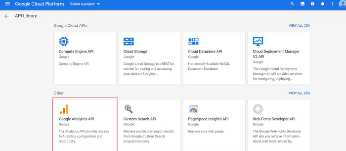

Then, select *Enable* next to "Analytics API."

.. image:: optimize/tracking_analytics/google_analytics_enable.png
   :align: center
   :alt: google analytics enable api

In order to properly use this API, you need to create credentials to use in Odoo.

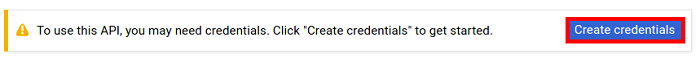

Following that, you must select *Web browser (Javascript)* as the calling source and *User data* as
the kind of data.

.. image:: optimize/tracking_analytics/google_analytics_get_credentials.png
   :align: center
   :alt: google analytics api get credentials

Then, you can create a Client ID.

To do so, enter the name of the application (e.g. My Odoo Database) and the allowed pages that
trigger a redirection.

The *Authorized JavaScript origin* is your Odoo's database URL. The *Authorized redirect URI* is
your Odoo database URL followed by '/google_account/authentication', as showcased below.

.. image:: optimize/tracking_analytics/google_analytics_authorization.png
   :align: center
   :alt: google analytics authorization

Proceed to the Consent Screen, and enter a product name (e.g. Google Analytics in Odoo). You
can check the customizations options at this time, but it's not mandatory.

.. note::
   The Consent Screen will *only* show up when you enter the Client ID in Odoo for the **first**
   time.

Then, you are provided with your Client ID, which you then copy to paste in Odoo.

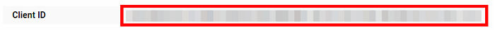

Go to :menuselection:`Website application --> Configuration --> Settings`, activate *Google
Analytics Dashboard* and paste the Client ID in the fields that appear.

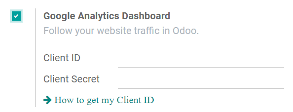

And finally, authorize Odoo to access your Google API.

.. image:: optimize/tracking_analytics/google_analytics_login.png
   :align: center
   :alt: google analytics login

Link Trackers
-------------

Link Trackers allow you to easily track all your marketing campaigns (emails, banner ads, blog
posts, social media posts, affiliate links, etc.). With Link Trackers, you can quickly identify your
your best traffic sources. This valuable data helps you make more informed decisions about the
distribution of your marketing budget.

Setup
*****

On the front-end of your website, go to :menuselection:`Promote --> Link Tracker`.

Here, you are able to get a specific tracked URL based on the campaign, medium, and source being
used.

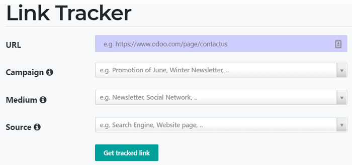

- **URL**: URL of the page you want to track (e.g. the home page or a product page).
- **Campaign**: context of your link (e.g. a special promotion).
- **Medium**: channel used to share (deliver) your link (e.g. an email or a Facebook ad).
- **Source**: platform where the traffic originates (e.g. Google or Twitter).

Then, click *Get tracked link* to generate a URL that you can post (or send) by the source you have
decided on.

Follow-up on tracked links
**************************

On that same Link Tracker page, beneath the *Get tracked link* fields, you can look at statistics
in the *Your tracked links* section.

In addition to seeing the *Most Clicked* and *Recently Used* links, you can also see complete
statistics by clicking on *Stats* next to a link you want to analyze, including the number of
clicks.

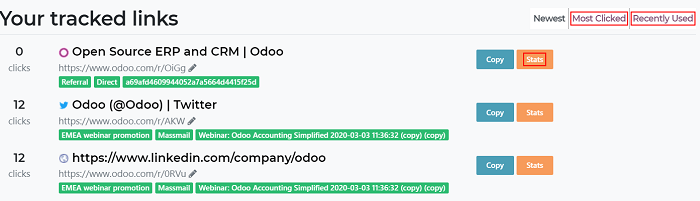

.. tip::
   #. You can also access the link tracker on *odoo.com/r* via your browser.
   #. Activate the developer mode (:menuselection:`Settings --> Activate the developer mode`) and
      get access to the *Link Tracker* module and its back-end functionalities.
   #. Integrated with Google Analytics, those trackers allow you to see the number of clicks and
      visitors to keep you on top of your marketing campaigns.
