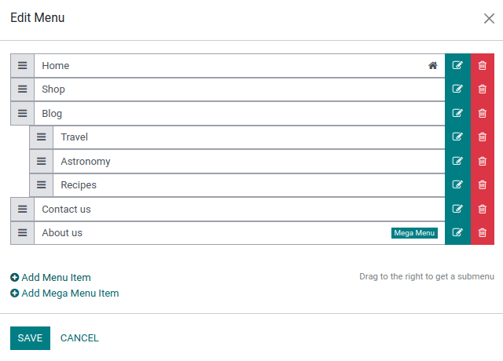
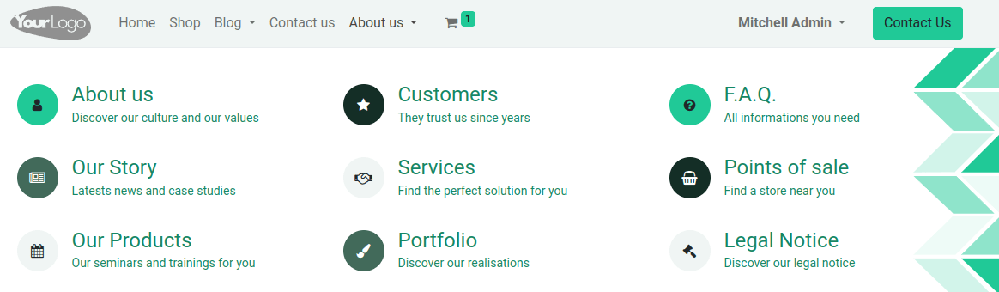

=====
Menus
=====

Menus are used to organize your website’s content and help visitors navigate through your web pages
effectively. User-friendly and well-structured website menus also play a crucial role in improving
:doc:`search engine rankings <seo>`.

Odoo allows you to customize the content and appearance of your website's menu to your needs.

Menu editor
===========

The menu editor allows you to edit your website's menu and add :ref:`regular menu items
<website/regular-menus>` and :ref:`mega menus <website/mega-menus>`.

To edit your website's menu, go to :menuselection:`Website --> Site --> Menu Editor`. From there,
you can:

- **rename** a menu item or change its URL using the :guilabel:`Edit Menu Item` icon;
- **delete** a menu item using the :guilabel:`Delete Menu Item` icon;
- **move** a menu item by dragging and dropping it to the desired place in the menu;
- **create a regular drop-down menu** by dragging and dropping the sub-menu items to the right,
  underneath their parent menu.

.. note::

  You can also access the menu editor by clicking :guilabel:`Edit`, selecting any menu item and
  clicking the :guilabel:`Edit Menu` icon.

  .. image:: menus/edit-menu-icon.png
     :alt: Access the Menu editor while in Edit mode.

.. _website/regular-menus:

Adding regular menu items
-------------------------

By default, pages are added to the menu as regular menu items when :doc:`they are created
<../pages>`. You can also add regular menu items from the menu editor by clicking :guilabel:`Add
Menu Item`. Enter the :guilabel:`Name` and URL of the related page in the pop-up window that appears
on the screen and click :guilabel:`OK`.

.. tip::
   In the :guilabel:`URL or Email` field, you can type `/` to search for a page on your website or
   `#` to search for an existing custom anchor.

.. _website/mega-menus:

Adding mega menus
-----------------

Mega menus are similar to drop-down menus, but instead of a simple list of sub-menus, they display a
panel divided into groups of navigation options. This makes them suitable for websites with large
amounts of content, as they can help include all of your web pages in the menu while still making
all menu items visible at once. Mega menus can also be structured more visually than regular
drop-down menus, for example, through layout, typography, and icons.

To create a mega menu, go to :menuselection:`Website --> Site --> Menu Editor` and click
:guilabel:`Add Mega Menu Item`. Enter the :guilabel:`Name` of the mega menu in the pop-up, click
:guilabel:`OK`, then :guilabel:`Save`.

To adapt the options and layout of the mega menu, click it in the navigation bar, then click
:guilabel:`Edit`. Mega menus are composed of building blocks, which means you can customize each
component individually using inline formatting, as well as the options available in the
:guilabel:`Customize` tab in the website builder. For example, you can:

- edit the text directly in the building block;
- edit a menu item's URL by selecting the menu item, then clicking the :guilabel:`Edit link` button
  in the small preview pop-up. Type `/` to search for a page on your website, or `#` to search for
  an existing custom anchor.

  .. image:: menus/mega-menu-option.png
     :alt: Edit a mega menu option.

- move a menu item by dragging and dropping the related block to the desired position in the mega
  menu;
- delete a menu item by deleting the related block.

.. tip::
   You can adapt the general layout of the mega menu by selecting the desired :guilabel:`Template`
   and :guilabel:`Size` in the :guilabel:`Mega menu` section in the :guilabel:`Customize` tab in the
   website builder.

Header and navigation bar appearance
====================================

To customize the appearance of your website's menu, click :guilabel:`Edit`, then select the
navigation bar or any menu item. You can then adapt the fields in the :guilabel:`Header` and
:guilabel:`Navbar` sections in the :guilabel:`Customize` tab in the website builder.
