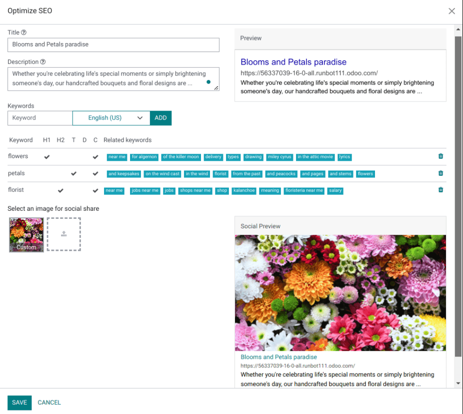
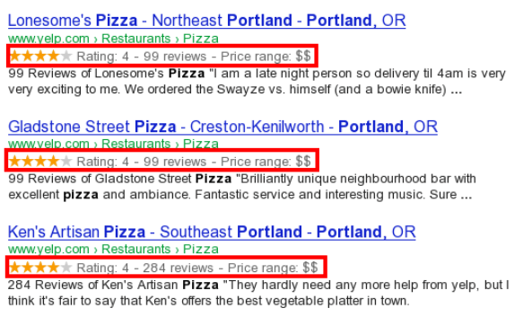

================================
Search Engine Optimization (SEO)
================================

Search Engine Optimization, often abbreviated as SEO, is a digital marketing strategy to improve a
website's visibility and ranking in search engine results (e.g., in Google). It involves optimizing
various elements on your website, including its content, social sharing, URLs, images, and page
speed.

.. note::
   - Odoo provides several modules to help you build your website content, such as
     :doc:`eCommerce <../../ecommerce>`, :doc:`Blog <../../blog>`, :doc:`eLearning
     <../../elearning>`, and :doc:`Forum <../../forum>`.
   - All Odoo themes rely on the CSS Framework `Bootstrap <https://getbootstrap.com/>`_ to render
     efficiently according to the device: desktop, tablet, or mobile, which positively impacts
     ranking in search engines.

Content optimization
====================

To optimize a webpage's SEO, access the page, then go to :menuselection:`Website --> Site -->
Optimize SEO`.

Meta tags
---------

Meta tags are HTML elements that provide information about a webpage to search engines and website
visitors. They play a crucial role in SEO by helping search engines understand the content and
context of a webpage and attract visitors with appealing content. There are two types of meta tags
in Odoo:

- :guilabel:`Title` tags specify a webpage's title and are displayed as a clickable link in search
  engine results. They should be concise, descriptive, and relevant to the page's content. You can
  update the title tag of your webpage or keep it empty to use the default value based on the page’s
  content.

- :guilabel:`Description` tags summarize the webpage's content, often displayed in search engine
  results below the title. They are used to encourage the user to visit the page. You can update
  the description tag of your webpage or keep it empty to use the default value based on the page’s
  content.

.. note::
   The :guilabel:`Preview` card displays how the title and description tags should appear in search
   results. It also includes the URL of your page.

Keywords
--------

Keywords are one of the main elements of SEO. A website that is well optimized for search engines
speaks the same language as potential visitors, with keywords for SEO helping them to connect to
your site.

You can enter the keywords you consider essential in the :guilabel:`Keyword` field and click
:guilabel:`ADD` to see how they are used at different levels in your content (H1, H2, page title,
page description, page content) and the related searches in Google. The tool also suggests relevant
keywords to drive your web traffic. The more keywords are present on your webpage, the better.

.. tip::
   It is strongly recommended to only use one H1 title per page for SEO.

Image for social share
----------------------

When you share your page on social media, your logo image is selected, but you can upload any other
image by clicking the upward arrow.

.. Note::
   - The :guilabel:`Social Preview` card displays how the page's information would appear when
     shared.
   - If you change the title of a blog post or the name of a product, the changes apply
     automatically everywhere on your website. The old link still functions when external websites
     use a :ref:`301 redirect <website/URL-redirection>`, maintaining the SEO link juice.

Images
======

The size of images has a significant impact on page speed, which is an essential criterion for
search engines to optimize SEO ranking.

.. tip::
   Compare how your website ranks using `Google Page Speed <https://pagespeed.web.dev/?utm_source=psi&utm_medium=redirect>`_
   or `Pingdom Website Speed Test <https://tools.pingdom.com/>`_.

Odoo automatically compresses uploaded images and converts them to `Webp`. With this file format,
photos are smaller, which increases the page loading speed and, therefore, gives a better ranking in
SEO. All images used in Odoo official themes are also compressed by default. If you are using a
third-party theme, it may provide images that are not compressed efficiently.

**To modify an image** from your website, select the image, click :guilabel:`Edit`, then go to the
:guilabel:`Customize` tab, and adapt the :guilabel:`Format` in the :guilabel:`Image` section.

.. image:: seo/image-format.png
   :alt: automated image compression

.. important::
   Alt tags are used to provide context to what an image is displaying, informing search engine
   crawlers and allowing them to index an image correctly. Adding alt tags keywords in the
   :guilabel:`Description` field is essential from an SEO perspective. This description is added to
   the HTML code of your image, and it is shown when the image cannot be displayed.

Advanced features
=================

Structured data markup
----------------------

Structured data markup is used to generate rich snippets in search engine results. It is a way for
websites to send structured data to search engine robots, helping them understand your content and
create well-presented search results.

By default, Google supports many `rich snippets <https://developers.google.com/search/blog/2009/05/introducing-rich-snippets>`_
for content types, including Reviews, People, Products, Businesses, Events, and Organizations.

Microdata is a set of tags, introduced with HTML5, that help search engines better understand your
content and display it in a relevant way. Odoo implements microdata as defined in the schema.org
`specification <https://schema.org/docs/gs.html>`_ for events, eCommerce products, forum posts, and
contact addresses. This allows your product pages to be displayed in Google using extra information
like the price and rating of a product:

robots.txt
----------

A robots.txt file tells search engine crawlers which URLs the crawler can access on your site, to
index its content. This is used mainly to avoid overloading your site with requests.

When indexing your website, search engines take a first look at the robots.txt file. Odoo
automatically creates one robot.txt file available on `mydatabase.odoo.com/robots.txt`.

By editing a robots.txt file, you can control which site pages are accessible to search engine
crawlers. To add custom instructions to the file, go to :menuselection:`Website --> Configuration
--> Settings`, scroll down to the :guilabel:`SEO` section, and click :guilabel:`Edit robots.txt`.

.. example::
   If you do not want the robots to crawl the `/about-us` page of your site, you can edit the
   robots.txt file to add `Disallow: /about-us`.

Sitemap
-------

The sitemap points out website pages and their relation to each other to search engine robots. Odoo
generates a `/sitemap.xml` file, including all URLs. For performance reasons, this file is cached
and updated every 12 hours.

.. note::
   If your website has a lot of pages, Odoo automatically creates a Sitemap Index file, respecting
   the `sitemaps.org protocol <http://www.sitemaps.org/protocol.html>`_, grouping sitemap URLs in
   45000 chunks per file.

Every sitemap entry has three attributes that are computed automatically:

- `<loc>`: the URL of a page.
- `<lastmod>`: last modification date of the resource, computed automatically based on the related
  object. For a page related to a product, this could be the last modification date of the product
  or the page.
- `<priority>`: modules may implement their priority algorithm based on their content (for example,
  a forum might assign a priority based on the number of votes on a specific post). The priority of
  a static page is defined by its priority field, which is normalized (16 is the default).

.. tip::
   To prevent pages from appearing in a sitemap, go to :menuselection:`Site --> Properties`, click
   the :guilabel:`Publish` tab, and turn off the :guilabel:`Indexed` feature.

     .. image:: seo/page-properties.png
        :alt:  disabling the “Indexed” checkbox

Hreflang HTML tags
------------------

Odoo automatically includes `hreflang` and `x-default` tags in the code of your website's
multilingual pages. These HTML attributes are crucial in informing search engines about a specific
page's language and geographical targeting.

.. seealso::
   :doc:`../configuration/translate`
