=======
Publish
=======

Odoo's Website Builder is designed to help anyone build a beautiful, professional-grade website.

With intuitive building blocks, unique design elements, and tons of customizable features, users
can create top-notch websites in a fraction of the time - without any coding experience whatsoever.

Website essentials
==================

Odoo provides the user with a myriad of eye-catching, feature-filled design elements that are
easy-to-use, simple to customize, and able to take your website to the next level.

Pick a theme
------------

Upon installing the *Website* application, you are redirected to a page full of website themes to
choose from.

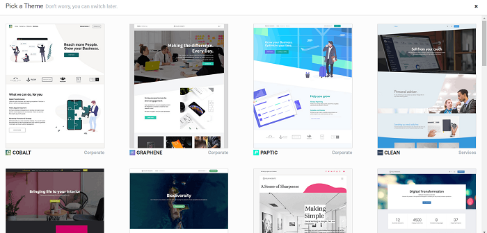

Each theme provides its own unique style (and look) that expertly cater to a variety of businesses
or personal purposes.

While they differ in initial design, each theme still provides the user with all the functionality,
options, tools, and features that Odoo has to offer. That way, you can get the most of your website,
no matter what theme you pick.

When you hover over a theme on the *Pick a Theme* page, you are presented with two options: *Use
This Theme* or *Live Preview*.

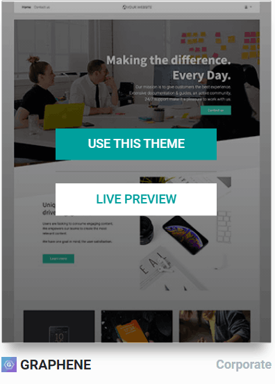

Clicking *Live Preview* presents you with a sample website in that desired theme. You can also
choose to see it in *Desktop* or *Mobile*.

If you want to choose the theme for your website, simply click *Start Now* in the upper-left
corner. If you'd like to go back to the theme selection page, click *Choose another theme*.

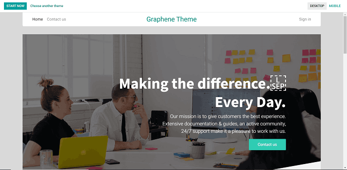

.. tip::
   You can change your theme at any time. From the front-end of the website (in *Edit* mode),
   select *Switch Theme* at the bottom of the *Options* section in the toolbar. From the backend, go
   to :menuselection:`Website app --> Configuration --> Settings` and select *Pick a Theme* from the
   *Website* section.

Getting started
---------------

When a theme is selected, Odoo takes you to a blank homepage (already in *Edit* mode) that you
can start designing with the help of Odoo's toolbar, located on the right-side of the screen.

If you're not sure where to start, you can follow the helpful purple drops that Odoo provides to
guide users through a few quick steps to begin their website building process.

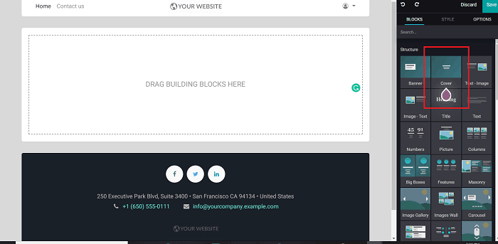

Building Blocks
---------------

Odoo provides the user with a huge collection of helpful design elements (and features) to help
them build their website. The first section you see is **Blocks**, which contains all of Odoo's
eye-catching, easy-to-use *Building Blocks*.

To use these *Building Blocks*, simply drag and drop your desired block anywhere on your page, and
start customizing it to fit the needs of your company.

They are divided into 4 categories:

-  **Structure**: core features that provide foundational elements to your site.

-  **Features**: unique array of informative, attention-grabbing aspects to help your web design
   look more professional and pleasing to visitors.

-  **Dynamic Content**: features designed to showcase more information about the company, its
   location, social presence, and so much more.

-  **Inner Content**: engaging forms of content and design elements that can be directly
   incorporated within other *Building Blocks*

Customize Building Blocks
-------------------------

Once you have dragged and dropped a *Building Block* onto your webpage, you can edit it in a number
of ways.

To do so, select the block you wish to change, and a new set of options appears in the toolbar.
These options are specific to that selected block, and can be found in the *Style* section of the
toolbar.

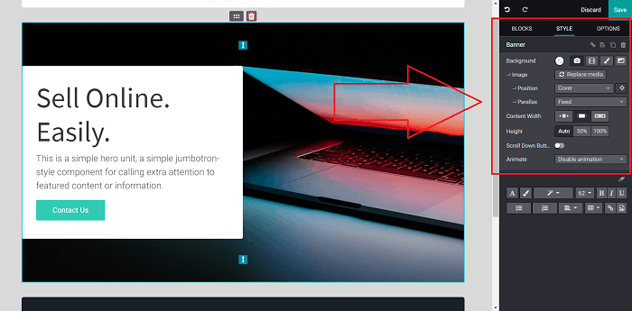

As mentioned, these options are different for every block, so be sure to consider every available
configuration as you design your website.

Shapes
------

Of course, you can change the image and background color of any block, but Odoo also provides the
user with unique design elements known as *Shapes*. These are artistic design elements that
create a stunning, completely cohesive design, without drawing attention away from your content.

When a block is selected, you can choose to add a *Shapes* element in the "Background" field,
indicated by this button

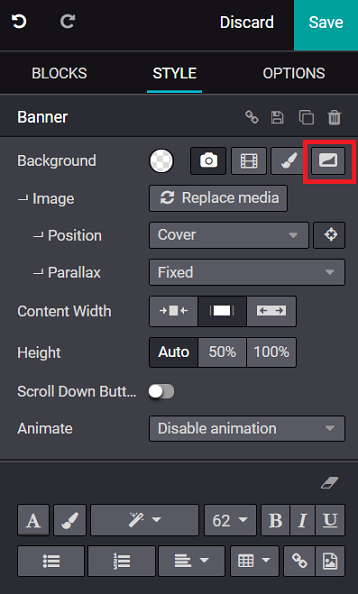

Odoo offers numerous categories, styles, and designs. Each of which can be fully customized in
many ways. To preview how they look, just hover over any *Shapes*, and Odoo instantly shows how
it looks on your website.

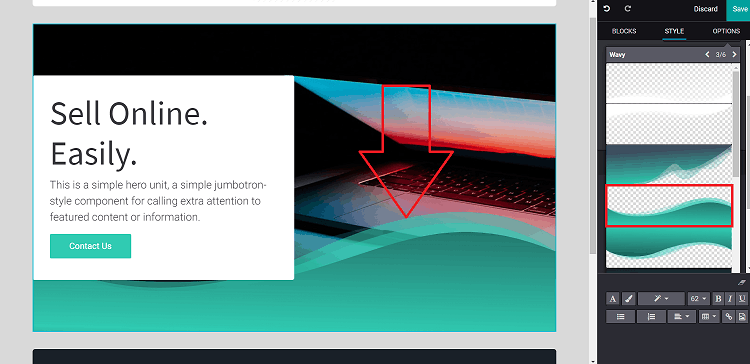

You can create cohesion between your blocks by using similar *Shapes* to seamlessly connect your
content together, creating a smooth flow throughout your page.

To do that, simply select the block you wish to connect, click the *Shapes* icon again, and Odoo
will automatically connect those elements together (if there's a perfect match). But you can
customize and choose any *Shapes* you want.

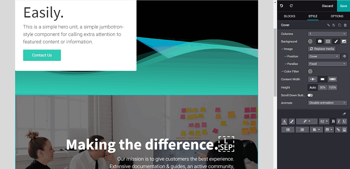

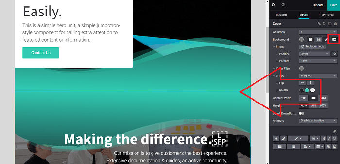

The limitless possibilities of web design brought forth by these unique *Shapes* are guaranteed
to give your website a memorable, professional look that visitors won't soon forget.

Options
-------

In the *Options* section of the toolbar, you can control numerous features that are utilized
throughout your site.

Theme Colors
************

For instance, it's here in the *Options* tab where you can customize the *Theme Colors* of your
entire site. These unique combinations of colors can be configured in any way you'd like, or you
can select one from a list of pre-made color combinations that Odoo provides.

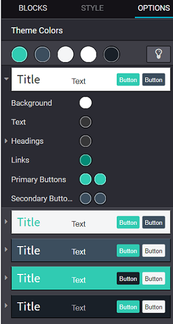

You can choose any combination of colors you'd like, and all of them are easily adapted to any
feature (or element) that you put on your page. Having pre-configured *Theme Colors* just a click
away, allows you to keep creating a beautiful website, page after page, without any delays.

Theme options
*************

In "Theme Options," you can customize the look and layout of various design aspects.

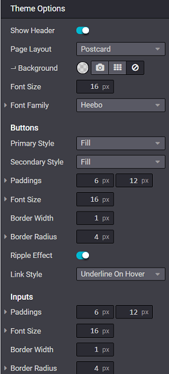

The changes you make here will become the new defaults for the site, but you can adjust, modify,
and change them at any time. You can change things like the overall layout, font, button style,
and more.

Header and Footer
-----------------

When the header or footer of your page is selected, Odoo instantly reveals a new *Style* menu
with options and features specifically designed for these elements of your website.

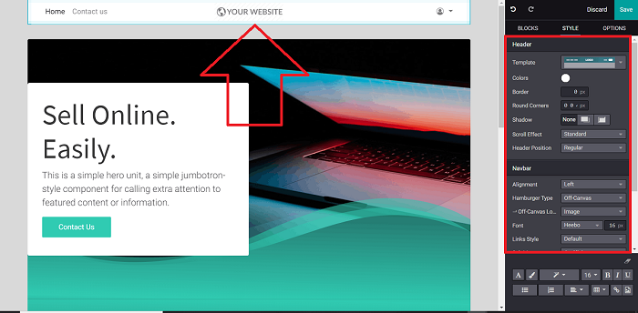

Here, you can customize the layout, the colors, the position, and so much more! So, don't forget
to play around with these options during the building of your website.

Custom domain name
==================

By default, your Odoo database (and website) have an *.odoo.com* domain name, which is seen in the
URL and emails.

However, you can change it to a custom URL (e.g. *www.yourcompany.com*) at any time.

Good domain qualities
---------------------

Choosing the right domain name for your business is extremely important for your branding.

That's why it's vital to consider the following aspects when creating a custom URL for your business
(or organization).

Make sure your domain name is:

- Simple and obvious
- Easy to remember (*and* spell)
- Concise: the shorter, the better
- Avoid special characters
- Aim for a ".com" and/or your country extension

Read more: `How to Choose a Domain Name for Maximum SEO <https://www.searchenginejournal.com/choose-a-domain-name-maximum-seo/158951/>`__

Buy a domain name
-----------------

Buy your domain name at a popular registrar site, like:

- `GoDaddy <https://www.godaddy.com>`__
- `Namecheap <https://www.namecheap.com>`__
- `OVH <https://www.ovh.com>`__

.. note:: Steps to buy a domain name are pretty straight-forward. If you have any issues, check out
   this easy-to-follow tutorial:

   - `GoDaddy <https://roadtoblogging.com/buy-domain-name-from-godaddy>`__

   Feel free to buy an email server to have email addresses using your domain name. However,
   *don't* buy any extra service to create (or host) your website - that's Odoo's job!

.. _custom_domain:

Apply domain name to Odoo
-------------------------

First, you must authorize the URL redirection (*yourcompany.com --> yourcompany.odoo.com*):

To do that, open your Odoo.com account from the homepage.

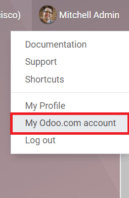

Then, select *My Databases* page under the same drop-down menu.

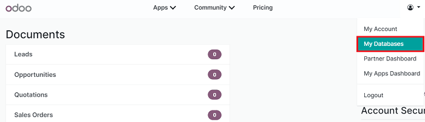

That redirects to the *Manage Your Databases* page. Here, you need to click on *Domains* to the
right of the database you want to redirect.

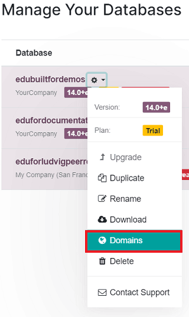

Then, a database domain prompt appears, wherein you enter your custom domain:
(e.g. *www.yourcompany.com*).

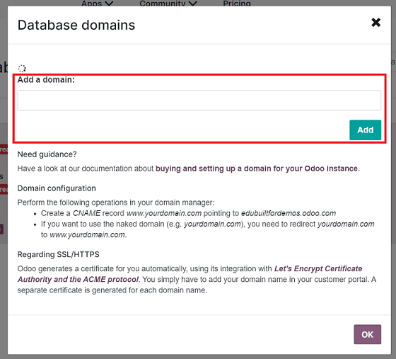

At this point, you can apply the redirection from your domain name's manager account:

In order to do that, log in to your account, and search for the DNS Zones management page.

Then, create a CNAME record (*www.yourdomain.com*) pointing to *mywebsite.odoo.com*. If you want to
use the naked domain (e.g. *yourdomain.com*), you need to redirect *yourdomain.com* to
*www.yourdomain.com*.

.. note:: Here are some specific guidelines to create a CNAME record:

   - `GoDaddy <https://be.godaddy.com/fr/help/add-a-cname-record-19236>`__
   - `Namecheap <https://www.namecheap.com/support/knowledgebase/article.aspx/9646/10/how-can-i-set-up-a-cname-record-for-my-domain>`__
   - `OVH <https://www.ovh.co.uk/g1519.exchange_20132016_how_to_add_a_cname_record>`__

Enable SSL (HTTPS) for Odoo
---------------------------

Odoo no longer requires users to use a third-party CDN service provide (like, CloudFlare) to
enable SSL. Odoo generates the certificate for you automatically, using integration with
`Let's Encrypt Certificate Authority and ACME protocol <https://letsencrypt.org/how-it-works/>`__.

In order to enable SSL, simply add your domain name in your customer portal. A separate certificate
is generated for each domain name specified.

.. warning::
  **The certificate generation may take up to 24h.**

.. note::
   If you already use CloudFlare (or a similar service), you can keep using it, or simply change to
   Odoo.

Website indexed twice by Google
-------------------------------

If you set up a custom domain name (*mydomain.com*) for *mydatabase.odoo.com*, Google indexes your
website under *both* names.

This is a minor limitation of the Odoo cloud platforms.

Website translation
===================

In addition to creating beautiful, professional-grade websites, Odoo provides users with the ability
to translate them into multiple different languages - at any time.

Translate
---------

To enable translation, go to your website, and scroll down to your footer. Click on the
language (i.e. *English - US*) to reveal a menu, then click *Add a Language*.

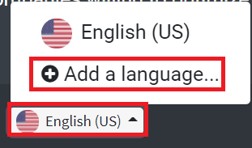

Choose the language you want from the language pop-up that appears. You can also decide which
website you'd like to apply it to here, as well. Then, click *Add*.

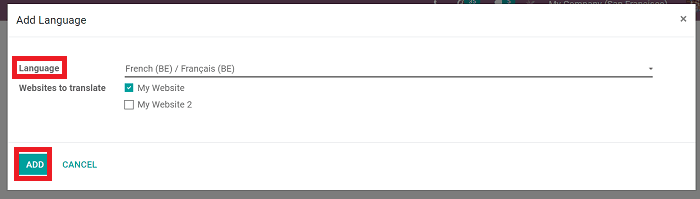

When you navigate back to your website, that new language is now an option.

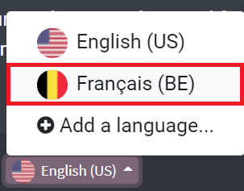

When selected, some of the text translates automatically.

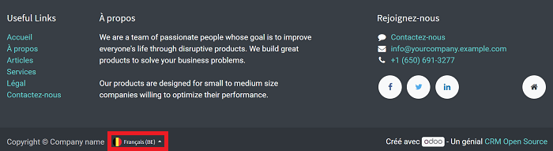

To translate the content of the website, click on **Translate** (in the upper-right corner), which
appears in that newly-chosen language.

Here, for example, it's **Traduire**, since we are translating the website in French.

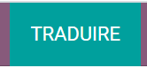

At this point, most of the content is highlighted in yellow or green.

The yellow represents content that you have to translate manually, and green represents content that
has already been translated by Odoo automatically.

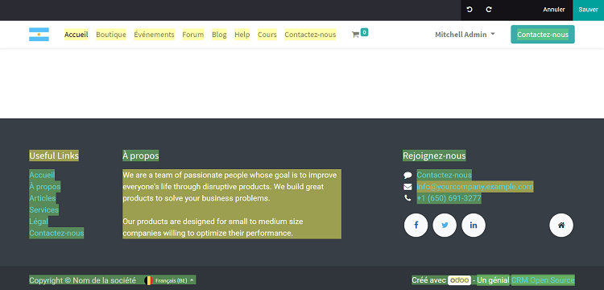

Manage multiple websites
========================

Odoo helps users to build, customize, and manage multiple websites in one easy-to-use platform.

Having multiple websites opens up the possibilities of diversification and customer segmentation
for any business. Multiple websites are also a great way to multiply your audience and boost
revenue!

Each Odoo website can work in a fully independent way, with its very own theme, branding, domain
name, pages, languages, products, blogs, forums, events, live chat channels, and so much more.

Setup
-----

To create a new website, go to :menuselection:`Website --> Configuration --> Settings`.

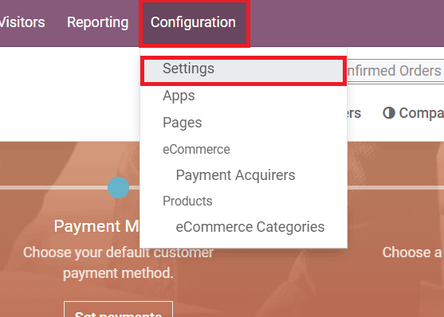

To start building a new website, simply click on *+New* located next to the title of the "Website"
section on the *Website* settings page.

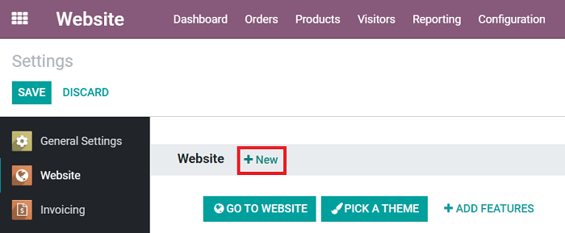

When clicked, a pop-up appears. In this pop-up, you input the name of your new website, its domain,
and a logo (if you have one).

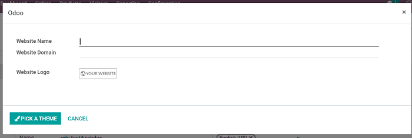

.. note::
   If you want to publish this new website under the default domain of your Odoo database, simply
   leave the domain field blank.

Once all the necessary fields have been filled, you may click *Pick a Theme* to select how you
want your new website to look.

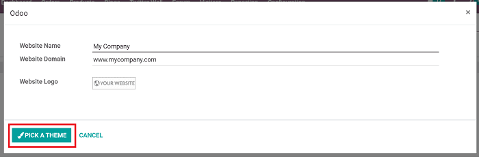

Clicking that, takes you to a catalog of professional-grade website themes that Odoo has to
choose from.

Remember, this new website may have an entirely different purpose (and/or audience) than your
initial site. So, feel free to choose a completely new theme to fit your needs. And, don't
forget, you can change themes at any time.

.. image:: publish/multi_website/multi-website-theme-selection.png
   :align: center
   :alt: various website themes

To select a theme, hover the cursor over your desired theme, and click *Use This Theme*. You can
also preview what that theme would look like, by selecting *Live Preview*.

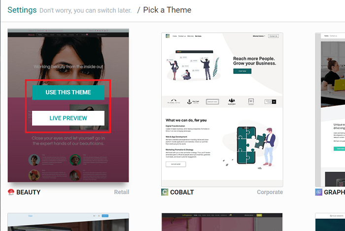

Once a theme is selected, you can start building your website. Not sure where to begin? Simply
follow the "purple drops" located on the screen. They will help get your started.

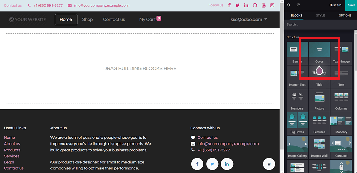

When the cursor hovers over them, they explain the function and purpose of that particular
feature.

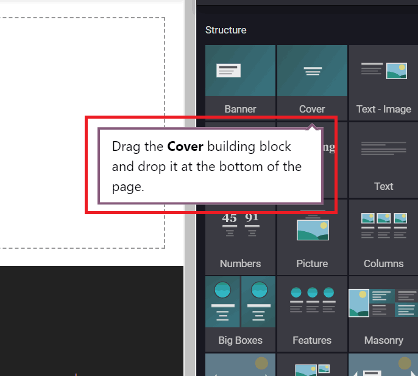

Then, you can start dragging and dropping any of Odoo's "Building Blocks" (on the right) to create
your design. Remember to hit *Save* once you are done.

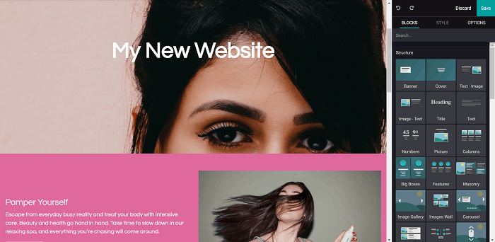

.. note::
   If you run Odoo Online, don’t forget to redirect any new domain name to your Odoo database
   (``CNAME``) and to authorize it on the Odoo-side.

Create the menu
---------------

By default, this new website has a default menu with all the installed applications.

To edit it, click :menuselection:`Pages --> Edit Menu`.

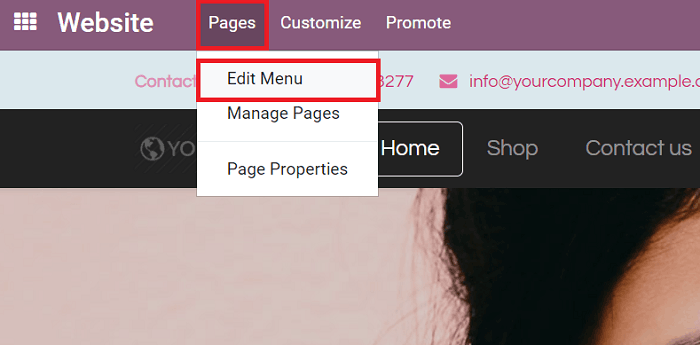

When selected, a pop-up appears, in which you can modify the header menu of your website.

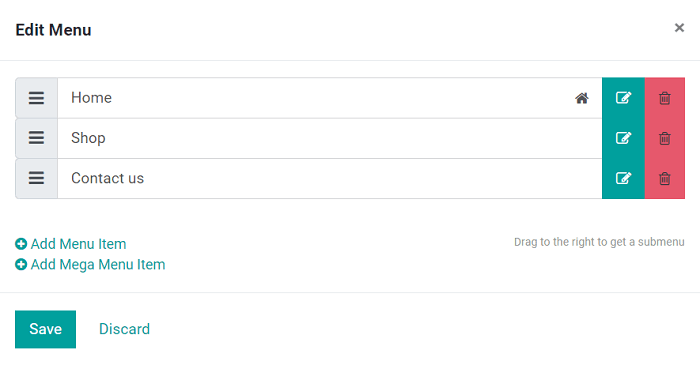

.. note::
   Moving forward, you only edit the menu of the website you are currently on.

Switching websites
------------------

In the upper-right corner, there is a "Website Switcher" drop-down menu. It will show the website
that you are currently on. When clicked, it will reveal your other websites, which you can instantly
jump to with one click.

If you use another domain for the website, the user is requested to sign in.

.. image:: publish/multi_website/multi_website03.png
   :align: center
   :alt: website switcher button in the corner

.. note::
   When switching, you are redirected to the same domain path on the other website
   (e.g., ``/shop/myproduct``). If this URL is not used, you will be redirected to a 404 page, and
   prompted to create a new page from there.

Add features
------------

The website apps you install (like *Blogs*) are made available on all your websites. Of course,
you can keep them hidden in one website by removing the menu item, as previously mentioned.

Each website comes with a wide array of features and options that can be found on the *Settings*
page (:menuselection:`Website app --> Configuration --> Settings`).

To modify those features and options, you first need to select which website you want to
customize. In order to do that, you need to select your desired website from the first section of
settings, titled: "Select the Website to Configure."

.. image:: publish/multi_website/multi_website15.png
   :align: center
   :alt: selecting which website should be configured

Once a website is selected, take a look at the options on the rest of the page, particularly the
ones flagged with an Earth icon.

This icon means that those features will only impact the very website you are currently working on.

.. image:: publish/multi_website/multi_website12.png
   :align: center
   :alt: earth icon in the website settings menu

You can, for instance, set specific:

-  Languages

-  Domain names

-  Social media links

-  Dedicated live chat channels

-  And so much more...

The other options are global and will apply to *all* your websites.

Customize the visitor experience
--------------------------------

Thanks to Odoo's *Customize* menu, there are plenty of ways you can customize (and enhance) the
overall user experience for your visitors.

All the visual-related options in this drop-down menu are specific to each page you are
customizing.

For example, the options available for your blogs won't be the same as the options available for
your online store because each page serves a different purpose. Odoo provides the user with the
professional-grade options and features to enhance every single page, no matter what.

So, while building your website, be sure to go through the different pages, and adapt them to fit
this new audience/purpose. Focus on workflows and automatic pages (eCommerce checkout, blogs,
events, etc.), as there more options to be found there.

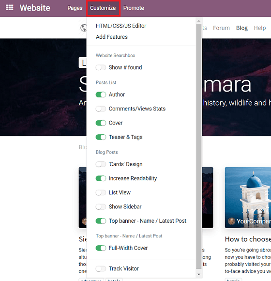

Publish specific content per website
------------------------------------

Like static pages, any content created from the front-end (product page, blog post, etc.) is always
*only* published on that current website.

You can change that by editing the form in the back-end, and leaving the *Website* field blank.
This will publish it on all your websites.

.. image:: publish/multi_website/multi_website06.png
   :align: center
   :alt: publishing content on a specific website

Here are all the objects you can link to *any (or all)* websites:

1. Products

2. Product Categories (for eCommerce)

3. Blogs

4. Pages

5. Forums

6. Events

7. Job Positions

8. eLearning Courses

Publish on all websites
-----------------------

When a new static page is created, it's only made available on that current website. However, you
can duplicate it to other websites by going to :menuselection:`Website --> Configuration --> Pages`.

Then, select the page you wish to duplicate, click *Edit*, and leave the *Website* field empty.

If you want to duplicate it in just *one* other website, duplicate the page, and select your
desired website in the the *Website* field of the newly duplicated page.

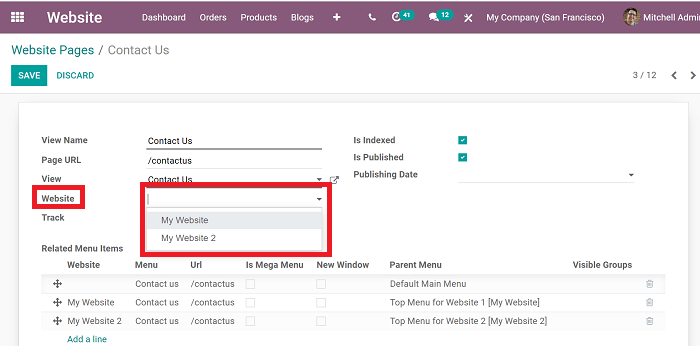

To efficiently (and quickly) manage your pages, you can click
:menuselection:`Pages --> Manage Pages` found on the front-end of the website.

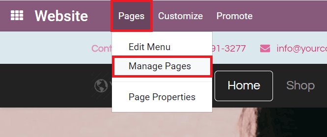

That takes you to a page with all your web pages and you can edit/modify them in a number of
different ways.

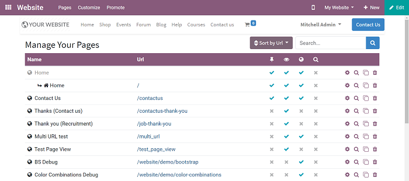

.. tip::
   By grouping pages by URL in the page manager, you quickly find the original page behind
   each edited page.

.. image:: publish/multi_website/multi_website10.png
   :align: center
   :alt: detailed look at the manage pages section

Multiple companies
------------------

If you are working in a multi-company environment, each website can be linked to a specific
company in your system.

To link each website to a specific company, go to
:menuselection:`Website application --> Configuration --> Settings` and select which company
you'd like to link to this website, located in the *Website* section.

.. image:: publish/multi_website/multi_website16.png
   :align: center
   :alt: choose which website to designate to a company

With such a configuration in place, only company-related data will appear on that website (products,
jobs, events, etc.).

Website editors can only view and edit pages of records they have access to, which is typically
only the ones that belong to their current company (and to their subsidiaries, or child companies
in Odoo language).

.. note::
   If websites are multi-companies, you don’t change the company when switching websites. To
   change the company, and see the related content, use the company selector in the menu.

   .. image:: publish/multi_website/different-company-drop-down.png
      :align: center
      :alt: company selector drop-down menu

Configure eCommerce website
---------------------------

eCommerce is a crucial feature for any online business, especially one with multiple websites. Odoo
allows users to customize the entire flow (and shopping experience) to cater to the specific
audience found on each website.

Products only available on one website
--------------------------------------

Above, you learned how to publish a specific record on only one website. The process is similar
for eCommerce products, as well.

Simply modify the *Website* field in the eCommerce tab of the product form. And remember, an
empty field means it will be available on all websites.

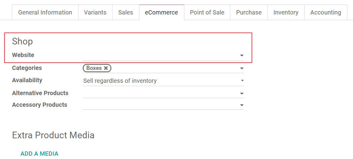

Products available on select websites
-------------------------------------

To make a product available on some websites, but not all of them, you can duplicate the product,
and assign it to each website you want it to appear on.

If you need a unique reference to manage in your inventory, you should install *Manufacturing*
and create *Kits* BoMs (Bills of Materials).

Each kit will link each published “virtual” product to the main reference managed in your inventory.
That way, any item sold from your website will be converted into the storable item in the delivery
order.

Pricelists
----------

To manage specific prices by website, go to :menuselection:`Website app --> Configuration -->
Settings` and activate *Pricelists* and *Multiple Prices per Product* in the *Pricing* section.
Then, hit *Save*.

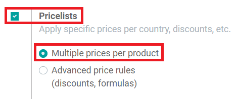

Following that, go to :menuselection:`Website --> Products --> Pricelists` to create additional
pricelists. Or you can click on *--> Pricelists* located beneath the *Pricelists* option in the
*Pricing* section of the *Website* settings.

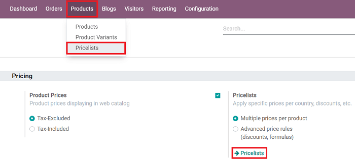

After clicking a pricelist you wish to modify, simply select a website in the *Website* field
(found in the *Configuration* tab of the pricelist detail form), and that pricelist becomes
exclusively available on that website only.

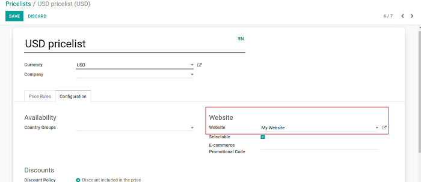

Leaving the field empty means this pricelist will be available on *all* websites, but it will
only be visible to customers if *Selectable* is activated in the pricelist detail form, as well.

Otherwise, it's only available for backend operations in the *Sales* and *Point of Sale*
applications.

Payment Acquirers and Delivery Methods
--------------------------------------

By default, published payment acquirers and delivery methods are deployed in all websites.

You could use specific payment acquirers per country (using Geo IP) by defining countries in their
configuration. Or, you can do it per website by filling in the *Website* field.

Customer accounts
-----------------

You can choose how to manage your customer accounts in the settings of the *Website* application.
Go to :menuselection:`Website --> Configuration --> Settings` and select *Specific User Account*
in the *Website* section.

Activating this feature forces your user to create a specific account for each of your websites.
This comes in handy if your websites shouldn't be related to each other in the visitor's mind.
However, you can allow customers to use one account for all your websites, by simply
deactivating that feature.

.. image:: publish/multi_website/multi_website17.png
   :align: center
   :alt: specific user account in website settings

Technical hints for customization
---------------------------------

If you want to publish custom objects on the website, here are a few tips to make it work with
multiple websites:

-  **Sitemap**: don’t forget the domain in the route to only publish available records in each
   website's sitemap.

-  **Access**: you should call the method *can_access_from_current_website* in the controller to
   make sure the visitor can see a record in the current website.

-  **Search**: when a list of records is displayed, don’t forget to specify the domain to *only*
   display records available for the current website.

.. image:: publish/multi_website/multi_website11.png
   :align: center
   :alt: coding language of technical customization

Geo IP installation (on-premises database)
==========================================

.. warning::
   Please note that the installation depends on your computer's operating system and distribution.
   In this instance, we will assume that a Linux operating system is being used.

First, install `geoip2 <https://pypi.org/project/geoip2/>`__ Python library

    .. code-block:: bash

      pip install geoip2

Following that, you need to download the
`GeoLite2 City database <https://dev.maxmind.com/geoip/geoip2/geolite2/>`_.

You will end up with a file called ``GeoLite2-City.mmdb``. Then, move the file to the folder
``/usr/share/GeoIP/``

    .. code-block:: bash

        mv ~/Downloads/GeoLite2-City.mmdb /usr/share/GeoIP/

At this point, you need to restart the server.

.. note::
   If you can't/don't want to locate the GeoIP database in ``/usr/share/GeoIP/``, you can use the
   ``--geoip-db`` option of the Odoo command line interface. This option takes the absolute path to
   the GeoIP database file, and uses it as the GeoIP database. For example:

   .. code-block:: bash

      ./odoo-bin --geoip-db= ~/Downloads/GeoLite2-City.mmdb

   .. seealso::
      - `CLI documentation <https://www.odoo.com/documentation/14.0/reference/cmdline.html>`_.

.. warning::
   ``GeoIP`` Python library can also be used. However, this version is discontinued since January
   2019. See `GeoLite Legacy databases are now discontinued
   <https://support.maxmind.com/geolite-legacy-discontinuation-notice/>`_

Test GeoIP Geolocation on Odoo website
--------------------------------------

Go to your website, and open the web page you want to test ``GeoIP``. Then, select
:menuselection:`Customize --> HTML/CSS/JS Editor`, and add the following piece of XML in the page:

.. code-block:: xml

    <h1 class="text-center" t-esc="request.session.get('geoip')"/>

That leaves you with a dictionary indicating the location of the IP address.

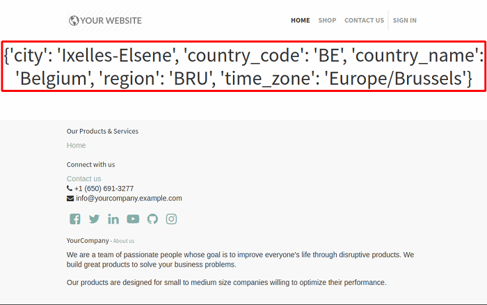

.. note::
   If the curly braces are empty ``{}``, it can be for any of the following reasons :

   - The browsing IP address is the localhost (``127.0.0.1``) or a local area network one
     (``192.168.*.*``)
   - If a reversed proxy is used, make sure to configure it correctly. See `--proxy-mode
     <https://www.odoo.com/documentation/14.0/reference/cmdline
     .html#cmdoption-odoo-bin-proxy-mode>`__
   - ``geoip2`` is not installed, or the GeoIP database file wasn't found
   - The GeoIP database was unable to resolve the given IP address
