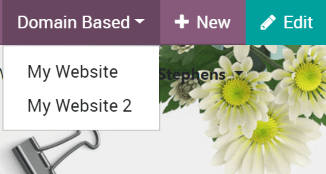
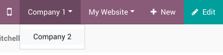
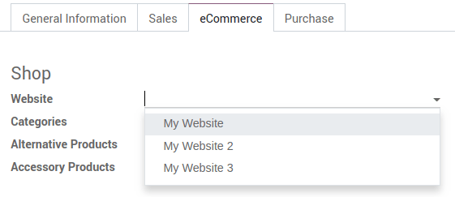
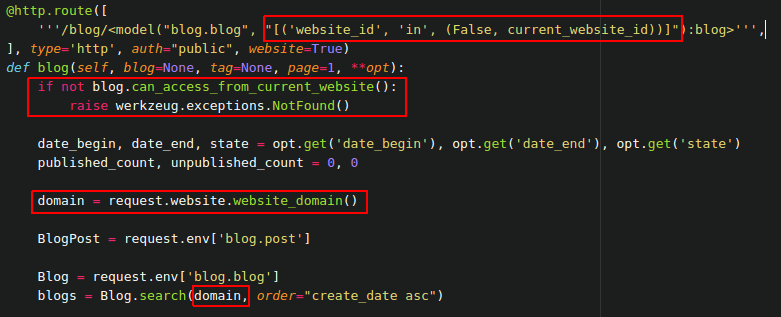

=====================
Manage Multi Websites
=====================

.. image:: multi_website/multi_website04.png
  :align: center

Odoo’s Multi-Websites opens up broad possibilities of diversification and
customer segmentation for your business. A multiplied audience and
boosted revenue are now just a few clicks away!

Each website can work in a fully independent way, with its theme,
branding, domain name, header & footer, pages, languages, products, blog
posts, forum, slides, events, live chat channels, etc. Let’s go for a
tour!

Setup
=====

To create a new website, go to :menuselection:`Website --> Configuration --> Settings`.
The button, *Create a new website*, lays in the first section.

.. image:: multi_website/multi_website05.png
  :align: center

In the upcoming prompt, set a name for your new website and a specific
domain name. Leave empty to publish the new website under the default
domain of your Odoo database. You can later set some country groups to
redirect visitors to it using Geo IP.

.. image:: multi_website/multi_website01.png
  :align: center

Then, select a theme. This new website might have an entirely different
purpose or audience than the first one. So feel free to go for a
different theme!

Once the theme is selected, you can start to build the homepage of your
website. Follow the purple drops; they will help you in the first steps.

.. image:: multi_website/multi_website08.png
  :align: center

.. note::
   If you run Odoo Online, don’t forget to redirect any new domain name to your Odoo database
   (``CNAME``) and to authorize it Odoo-side. See :ref:`domain-name/existing`.

Create the menu
===============

The new website has a default menu with all the installed applications.
To edit it, click :menuselection:`Pages --> Edit Menu`. Moving forward you only edit
the menu of the current website.

Switch from one website to another
==================================

As easy as ABC! There is a website switcher in the right corner of the
edit bar. Switching to another website will connect to the domain of
this website. If you use another domain for the website, the user is
requested to sign in.

.. note::
   When switching, you are redirected to the same domain path on the other website
   (e.g., ``/shop/myproduct``). If this URL is not used, you will be redirected to a 404 page but
   prompted to create a new page from there.

Add features
============

The website apps you install (e.g., Slides, Blogs) are made available on
all your websites. You can, of course, keep them hidden in one website by
removing the menu item.

Each website comes with a high range of specific options in the
settings. First, select the website to configure.

.. image:: multi_website/multi_website15.png
  :align: center

Then, take a look at the options flagged with the earth icon. It means
they only impact the very website you are working on.

.. image:: multi_website/multi_website12.png
  :align: center

You can, for instance, set specific :

-  languages,

-  domain names,

-  social media links,

-  customer portal mode (B2C vs. B2B),

-  dedicated live chat channels,

-  etc.

The other options are global and apply to all your websites.

Manage domain names
===================

As said earlier, your websites can either share the same domain name or
use a specific one. If you share it and want to adapt the content per
region, set country groups in the setting of each website. Visitors will
be redirected to the right website using GeoIP.

.. image:: multi_website/multi_website18.png
  :align: center

.. note::
  Geo IP is installed by default in Odoo Online. If you run Odoo
  on-premise, don’t forget to install *GeoIP* library.
  See :doc:`on-premise_geo-ip-installation`

.. seealso::
   - :doc:`/administration/maintain/domain_names`

If you setup an extra website and specify the domain name you will have to
do three things to get this feature to work:

#. Setup an A-record in the DNS configuration of your hosting provider so
   that "www.mywebsite2.ext" is redirected to the IP of your Odoo instance.
#. Create an extra Nginx ``server`` block in which you set the
   ``server_name`` that you've set in the :guilabel:`Website domain` field.
#. Reload and restart your Nginx instance to use the new ``server`` block.

Customize the visitor experience
================================

The customer experience can be customized very profoundly thanks to the menu
\*Customize\*. All the visual options available there are specific to
each website. Go through the different pages to adapt them to this new
audience. Focus on workflows, and automatic pages (eCommerce checkout,
blogs, events, etc.) as the number of available options is higher there.

.. image:: multi_website/multi_website14.png
  :align: center

Publish specific content per website
------------------------------------

Like static pages, any content created from the front-end (product, blog
post, etc.) is always only published in the current website. You can
change that from the edit form view in the backend and leave the
*Website* field blank. This will publish it in all the websites.

.. image:: multi_website/multi_website06.png
  :align: center

Here are all the objects that you can link to *either one or all the
websites*:

1. Products

2. Product Categories for eCommerce

3. Blogs

4. Slide Channels

5. Forums

6. Events

7. Job Positions

.. note::
    When you create the record from the backend and publish it,
    typically a product or an event, it is made available in all websites.

Publish a page in all websites
------------------------------

A new static page is created and only made available in the current
website. You can duplicate it to other websites from 
:menuselection:`Website --> Configuration --> Pages`. To do so, leave the *Website* field empty.

If you want to duplicate it in just one other website, duplicate the
page and set the new website.

.. image:: multi_website/multi_website09.png
  :align: center

When you edit the page again, the change only affects the current
website. A new page is duplicated and tied up to the website.
The original page still being linked to all websites.

.. tip:: 
      By grouping pages by URL in the page manager, you quickly find
      the original page behind each edited page.

.. image:: multi_website/multi_website10.png
  :align: center

Multi-companies
===============

Each website can be linked to a specific company of your system, in a
multi-companies environment.

.. image:: multi_website/multi_website16.png
  :align: center

With such a configuration, only company-related data appear on the
website (products, jobs, events, etc.).

Website editors can only view and edit the pages of the records they
have access to, typically the ones belonging to their current company
(and to their subsidiaries, or child companies in Odoo language). And so
is it for visitors.

.. note::
      If websites are multi-companies, you don’t change company when switching websites. To change the company and see the related content, use the company selector in the menu.

Configure your eCommerce website
================================

eCommerce is a crucial feature in the multi-websites environment. We made it
so that the entire flow can be customized to fit the very audience of
each website.

Products only available on one website
--------------------------------------

We already saw earlier how to publish a specific record in only one
website. You will find the \*Website\* field in the eCommerce tab of the
product edit form. Empty means available in all websites.

Products available on *some* websites
-------------------------------------

To make a product available on some websites, but not all of them, you
should duplicate the product for each website.

If you need a unique reference to manage in your inventory, you should
install *Manufacturing\ and create *Kits* BoMs (bills of materials).
Each kit will link each published “virtual” product to the main
reference managed in your inventory. That way, any item sold from your
website will be converted into the storable item in the delivery order.

Pricelists
----------

To manage specific prices by websites, you can activate *Multiple Sales
Prices per Product* in Website settings.

Then, go to :menuselection:`Website --> Products --> Pricelists` to create additional
pricelists. See :doc:`../../ecommerce/maximizing_revenue/pricing`.

If you need help. Select a website to make a pricelist only available on
this website.

.. image:: multi_website/multi_website07.png
  :align: center

Leaving the field empty means that you make it work in all websites if
*Selectable* is selected. Otherwise, it makes it only available for
backend operations of Sales and Point of Sale applications.

Payment Providers and Delivery Methods
--------------------------------------

By default, published payment providers and delivery methods are deployed in all websites.
You could already use specific payment providers per country using Geo
IP by defining countries in their configuration. Now you can also do it
per website by filling in the *Website* field.

Customer accounts
-----------------

There is a setting to choose how to manage customer accounts in Website
settings. You can either allow customers to use one account through all
the websites or compel them to create one account for each website. This
last option is convenient if your websites shouldn’t be related to each
other in the visitor mind.

.. image:: multi_website/multi_website17.png
  :align: center

Technical hints for customization
=================================

If you want to publish custom objects on the website, here are a few
tips to make it work with multi websites:

-  Sitemap: don’t forget the domain in the route to only publish
       available records in each website’s sitemap.

-  Access: you should call the method
       *can_access_from_current_website* in the controller to make
       sure the visitor can see a record in the current website.

-  Search: when a list of records is displayed, don’t forget to specify
       the domain to only display records available for the current
       website.

