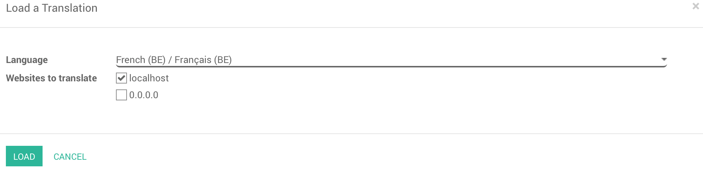

===============================
How to translate my website
===============================

Overview
========

In addition to creating great modern websites, Odoo gives you the
possibility to translate it in different languages.

Process
=======

Once your website is created, you have the opportunity to translate it
in as many different languages as you want.

You can only translate your website manually, follow the next step.

Now go to your website. On the bottom right corner of the page, click on
**Add a language**.

.. image:: translate/translate_website01.png
    :align: center

Choose the language in which you want to translate your website and then
click on **Load.**

You will see that Now, next to English there is also French, which means
that the page for the translation has been created. You can also see
that some of the text has been translated automatically.

.. image:: translate/translate_website03.png
    :align: center

To translate the content of the website, click on **Translate** (here
**Traduire** since we want to translate the website in French).

