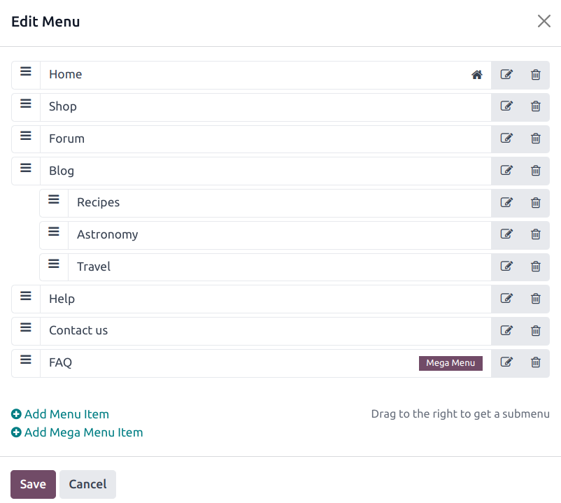
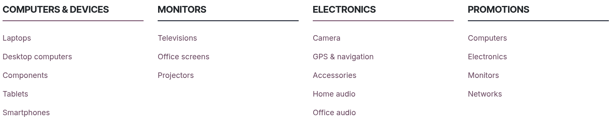

===================
Headers and footers
===================

The website header is the top section of a web page and usually contains elements such as the logo,
the :ref:`menu <website/header_footer/header-content>`, the search bar, the sign-in/customer account
button, etc. The footer is displayed at the bottom of a web page and usually contains information
such as contact details, links, legal notices, and other options.

Header design
=============

To modify the header's design, click on :guilabel:`Edit`, then click on the header. The following
options are available in the :guilabel:`Header` section of the :guilabel:`Customize` tab in the
website editor:

- Choose a :guilabel:`Template` from the drop-down menu.
- Select :guilabel:`Background` settings to change the color palette through different
  :ref:`Theme styles <website/themes/theme-colors>`, :guilabel:`Custom` color options, and
  :guilabel:`Gradient` ones.
- When adding a :guilabel:`Border` to the header, its size, style, and color can be defined.
- Adapt :guilabel:`Round corners` to fit the design.
- Add a :guilabel:`Shadow` and define its :guilabel:`Color`, :guilabel:`Offset`, :guilabel:`Blur`,
  and :guilabel:`Spread`.
- Add a :guilabel:`Scroll Effect`. Hover on an effect to preview it.
- Choose the :guilabel:`Header Position` between :guilabel:`Regular`, :guilabel:`Hidden`, and
  :guilabel:`Over The Content`. When :guilabel:`Over The Content` is selected, you can customize
  the :guilabel:`Background` and :guilabel:`Text Color`.
- Show or hide :guilabel:`Elements` such as text, the search bar, :guilabel:`Sign in` button, social
  media links, :guilabel:`Contact us` button, and logo.

To finalize changes, click on :guilabel:`Save`.

.. tip::
   To hide the header, click on :guilabel:`Edit`, click on the header, and go to the
   :guilabel:`Theme` tab of the website editor. Scroll down to the :guilabel:`Advanced` section and
   toggle the :guilabel:`Show Header` switch to hide/show the header.

.. _website/header_footer/header-content:

Header content
==============

Menus organize the header’s content and help users navigate through web pages effectively.
User-friendly and well-structured menus also play a crucial role in improving
:doc:`search engine rankings <seo>`.

.. _website/header_footer/menu-editor:

Menu editor
-----------

The menu editor allows to edit the website's header and add
:ref:`menu items <website/header_footer/menu-items>` and
:ref:`mega menus <website/header_footer/mega-menus>`.

To edit the header's content, go to :menuselection:`Website --> Site --> Menu Editor`. From there,
you can:

- **rename** a menu item or change its URL using the :guilabel:`Edit Menu Item` icon;
- **delete** a menu item using the :guilabel:`Delete Menu Item` icon;
- **move** a menu item by dragging and dropping it to the desired place in the menu;
- **create a regular drop-down menu** by dragging and dropping the sub-menu items to the right,
  underneath their parent menu.

.. note::
   You can also access the menu editor by clicking :guilabel:`Edit`, selecting any menu item, and
   clicking the :guilabel:`Edit Menu` icon.

  .. image:: header_footer/edit-menu-icon.png
     :alt: Access the Menu editor while in Edit mode.

.. _website/header_footer/menu-items:

Adding menu items
-----------------

By default, pages are added to the menu as drop-down menu items when
:doc:`they are created <../structure/pages>`. To add a new menu item, follow these steps:

#. Go to :menuselection:`Website --> Site --> Menu Editor`.
#. In the menu editor, click :guilabel:`Add Menu Item`.
#. In the pop-up window, enter the :guilabel:`Name` to be displayed in the menu.
#. Type `/` in the :guilabel:`URL or Email` field to search for a page on your website or `#` to
   search for an existing custom anchor.
#. Click :guilabel:`OK`.
#. Edit the :ref:`menu structure <website/header_footer/menu-editor>` if needed, then
   :guilabel:`Save`.

Menu item design
~~~~~~~~~~~~~~~~

To modify the menu items, click on :guilabel:`Edit`, click on a menu item, then go to the
:guilabel:`Navbar` section of the website editor. The following options are available:

- Adapt the :guilabel:`Mobile Alignment`.
- Choose the :guilabel:`Font` for the menu items.
- Change the font size, color, and alignment in the :guilabel:`Format` field.
- Select a :guilabel:`Links Style` to highlight the current page in the menu.
- Change the :ref:`style of the header buttons <website/themes/button-styles>`.
- Choose to display the :guilabel:`Sub Menus` :guilabel:`On Hover` or :guilabel:`On Click`.

.. note::
   The fields available in the :guilabel:`Navbar` section can vary depending on the chosen template.

To finalize changes, click on :guilabel:`Save`.

.. _website/header_footer/mega-menus:

Mega menus
----------

Mega menus are similar to drop-down menus, but instead of a simple list of sub-menus, they display a
panel divided into groups of navigation options. This makes them suitable for websites with large
amounts of content or :doc:`e-commerce websites <../../ecommerce>`, as they can help include all of
your web pages or :doc:`e-commerce categories <../../ecommerce/products/catalog>` in the menu while
still making all menu items visible at once.

To create a mega menu, go to :menuselection:`Website --> Site --> Menu Editor` and click
:guilabel:`Add Mega Menu Item`. Enter the :guilabel:`Name` of the mega menu in the pop-up, click
:guilabel:`OK`, then :guilabel:`Save`.

To adapt the options and content of the mega menu, click on a mega menu item in the header, then
click :guilabel:`Edit`. Mega menus are composed of building blocks, which means you can customize
each component individually. For example:

- Edit the text directly in the building block.
- Edit a menu item's URL by selecting the menu item and clicking the :guilabel:`Edit link` button
  in the small preview pop-up. Type `/` to search for a page on your website, or `#` to search for
  an existing custom anchor.

  .. image:: header_footer/mega-menu-option.png
     :alt: Edit a mega menu option.

- Move a menu item by dragging and dropping the related block to the desired position in the mega
  menu.
- Delete a menu item by deleting the related block.

To adapt the general layout of the mega menu, go to the :guilabel:`Customize` tab of the website
editor, then, in the :guilabel:`Mega Menu` section:

- Choose a :guilabel:`Template`.
- Pick the :guilabel:`Size`: either :guilabel:`Full-Width` or :guilabel:`Narrow`.

To finalize changes, click on :guilabel:`Save`.

Footer design
=============

To modify the footer, click on :guilabel:`Edit`, click on the footer, and in the :guilabel:`Footer`
section of the :guilabel:`Customize` tab in the website editor:

- Select a :guilabel:`Template`.
- Choose its :guilabel:`Colors`.
- Choose a :guilabel:`Slideout Effect`: :guilabel:`Regular` (i.e., no effect),
  :guilabel:`Slide Hover`, or :guilabel:`Shadow`.
- Toggle the :guilabel:`Copyright` switch to hide or show the copyright.
- Choose the :guilabel:`Border` size.
- Add a :guilabel:`Shadow`.
- Add a :guilabel:`Scroll Top Button` and choose its position.
- Hide or show the footer by toggling the :guilabel:`Page visibility` switch.

To finalize changes, click on :guilabel:`Save`.
