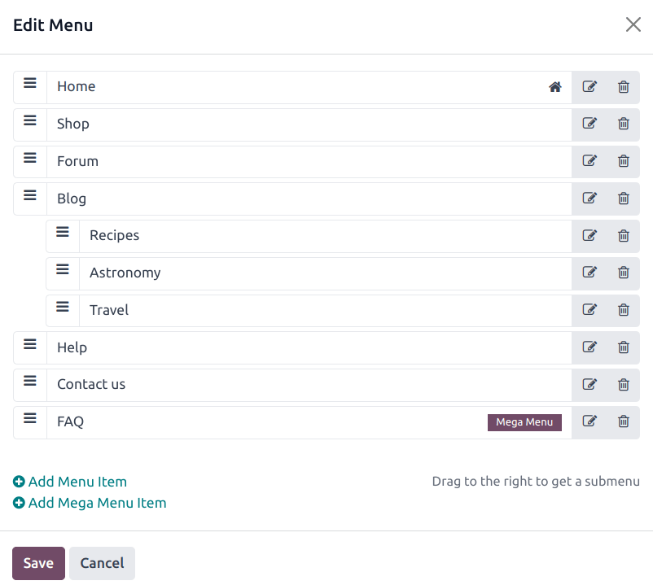

===================
Headers and footers
===================

The website header is the top section of a web page and typically includes elements such as the
logo, navigation :ref:`menu <website/header_footer/header-content>`, search bar, and sign-in or
:doc:`customer account <../../ecommerce/configuration/customer_accounts>` button. The footer is
displayed at the bottom of a web page and usually contains contact details, links, legal notices,
and other useful information. Both can be customized as needed.

.. _website/header_footer/header-content:

Header content
==============

The header includes company information, quick-access buttons, and :ref:`website menus
<website/header_footer/menu-editor>` to help users navigate the website effectively.
Well-structured, user-friendly headers and menus also play an important role in improving
:doc:`search engine rankings <seo>`.

.. _website/header_footer/menu-editor:

Menu editor
-----------

The menu editor allows you to edit the website header and add :ref:`menu items
<website/header_footer/menu-items>` and :ref:`mega menus <website/header_footer/mega-menus>`.

.. _website/header_footer/open-menu-editor:

To open the menu editor, go to :menuselection:`Website --> Site --> Menu Editor`. From there, you
can:

- **Rename** a menu item or change its URL using the :icon:`fa-pencil` (:guilabel:`Edit Menu Item`)
  icon.
- **Delete** a menu item using the :icon:`fa-trash` (:guilabel:`Delete Menu Item`) icon.
- **Move** a menu item by dragging and dropping it to the desired location in the menu.
- **Create a regular drop-down menu** by dragging and dropping the sub-menu items to the right,
  underneath their parent menu.

.. tip::
   You can also access the menu editor from the website editor. To do so, either:

   - Select any menu item and click :guilabel:`Edit Menu`, or

     .. image:: header_footer/edit-menu-icon.png
        :alt: Access the menu editor while in Edit mode.

   - Navigate to the :guilabel:`Style` tab, and click :guilabel:`Edit Menu` next to the
     :guilabel:`Header` section title.

.. _website/header_footer/menu-items:

Add menu items
~~~~~~~~~~~~~~

By default, pages are added to the menu as drop-down menu items when :doc:`they are created
<../structure/pages>`. To add a new menu item, follow these steps:

#. In the :ref:`menu editor <website/header_footer/open-menu-editor>`, click :guilabel:`Add Menu
   Item`.
#. In the pop-up window, enter the :guilabel:`Title` to be displayed in the menu.
#. In the :guilabel:`URL or Email` field, type `/` to search for an existing page on the website or
   `#` to search for an existing custom anchor.

   .. note::
      To add a menu item for a page that does not exist yet, enter the new URL or anchor and click
      :guilabel:`Create Page` in the :guilabel:`Edit Menu` pop-up. If you add the menu item
      without creating the corresponding page, the link leads to a :ref:`404 error page
      <website/pages/URL-redirection>`.

#. Click :guilabel:`Continue`.
#. Adjust the :ref:`menu structure <website/header_footer/menu-editor>` if needed.
#. Click :guilabel:`Save`.

.. _website/header_footer/menu-item-design:

Menu item design
****************

To modify the menu items' design, click :guilabel:`Edit` in the upper-right corner and select the
header. Then, go to the :guilabel:`Style` tab and navigate to the :guilabel:`Navigation` section.
The following options are available:

- Adjust the :guilabel:`Desktop Menu` alignment for desktop devices.
- Adjust the :guilabel:`Mobile Menu` alignment and position for mobile devices.
- Choose whether :guilabel:`Sub Menus` open :guilabel:`On Hover` or :guilabel:`On Click`.
- Select a :guilabel:`Link Style` to highlight the current page in the menu.

.. note::
   The options available in the :guilabel:`Navigation` section may vary depending on the selected
   template.

.. _website/header_footer/hide-menu-item:

Hide a dynamic menu item for non-logged-in users
************************************************

To hide the `Shop` menu item for non-logged-in users, :ref:`restrict e-commerce access to logged-in
users <ecommerce/customer_accounts/shop-access>`.

To hide other menu items related to :ref:`dynamic <website/pages/page_type>` pages (i.e., a menu
item generated automatically by Odoo, for example, when installing an app or module, such as
`Events`, `Courses`, etc.) to non-logged-in users, follow these steps:

#. :ref:`Enable developer mode <developer-mode>`.
#. Go to :menuselection:`Website --> Configuration --> Menus`.
#. Expand the list of menus for the relevant website if needed.
#. Select the menu item you wish to hide.
#. In the :guilabel:`Visible Groups` section, click :guilabel:`Add a line`.
#. Search for the group :guilabel:`Name` :guilabel:`Role / Portal`, and :guilabel:`Select` it.
#. Save.

.. tip::
   You can further customize the menu items on this menu item form. For example:

   - Enable the :guilabel:`New Window` checkbox to open the page in a new tab when clicked.
   - Add a :guilabel:`Related Page` or :guilabel:`Related Model Page`.
   - Assign a :guilabel:`Parent Menu`, and/or :guilabel:`Child Menus` to create a hierarchy.

.. seealso::
   :ref:`Manage the visibility of static pages <website/pages/page_properties>`

.. _website/header_footer/mega-menus:

Mega menus
~~~~~~~~~~

Mega menus are similar to drop-down menus, but instead of displaying a simple list of sub-menus,
they show a panel divided into groups of navigation options. They are especially useful for websites
with large amounts of content or :doc:`e-commerce websites <../../ecommerce>`, as they can help
include all of the web pages or :ref:`e-commerce categories
<ecommerce/categories_variants/categories>` in the menu while keeping all menu items visible at
once.

.. image:: header_footer/mega-menu.png
   :alt: Mega menu in the navigation bar.

To create a mega menu, follow these steps:

#. In the :ref:`menu editor <website/header_footer/open-menu-editor>`, click :guilabel:`Add Mega
   Menu Item`.
#. In the pop-up window, enter the :guilabel:`Title` of the mega menu.
#. Click :guilabel:`Continue`.
#. Adjust the :ref:`menu structure <website/header_footer/menu-editor>` if needed.
#. Click :guilabel:`Save`.

Mega menus are built using default :doc:`building blocks <../web_design/building_blocks>`, which
means each component must be customized individually. To do so, click :guilabel:`Edit` in the
upper-right corner, then select the mega menu. Then:

- Edit the text directly within the building block.
- Edit a :ref:`menu item's URL <website/header_footer/menu-items>` by selecting the mega menu item
  and clicking the :guilabel:`Edit` button.

  .. image:: header_footer/mega-menu-option.png
     :alt: Edit a mega menu option.

- Move a menu item by dragging and dropping the related block to the desired position in the mega
  menu.
- Delete a menu item by clicking the :icon:`fa-trash` (:guilabel:`Remove`) icon of the related
  block.

Mega menu design
****************

To customize the general layout of the mega menu and its individual :doc:`building blocks
<../web_design/building_blocks>`, open the website editor, go to the :guilabel:`Style` tab, and
navigate to the :guilabel:`Mega Menu` section. The following options are available:

- Choose a :guilabel:`Template`.
- Pick the :guilabel:`Size`: either :guilabel:`Full-Width` or :guilabel:`Narrow`.
- Toggle :ref:`eCommerce Categories <ecommerce/categories_variants/categories>` if applicable.

.. _website/header_footer/design:

Header and footer design
========================

To modify the header or footer design, click :guilabel:`Edit` in the upper-right corner and select
the header or footer. Then, go to the :guilabel:`Style` tab and navigate to the :guilabel:`Header`
or :guilabel:`Footer` section. The following options are available:

- Choose a :guilabel:`Template` from the drop-down menu.
- Select a :guilabel:`Background` color by defining a :ref:`theme <website/themes/theme-colors>`
  style, a :guilabel:`Custom` color option, or a :guilabel:`Gradient`.
- Set the :guilabel:`Content Width`.
- Add a :guilabel:`Border` to the footer and customize its size, style, and color.
- Adapt :guilabel:`Round corners` to fit the design.
- Select a :guilabel:`Shadow` option. Choose :guilabel:`None`, a :ref:`predefined theme shadow
  <website/themes/shadows>`, or configure a :guilabel:`Custom` shadow by defining its
  :guilabel:`Outset/Inset`, :guilabel:`Color`, :guilabel:`Offset`, :guilabel:`Blur`,
  and :guilabel:`Spread`.

.. tabs::

   .. tab:: Header-specific design options

      To further customize the website's header, use the following header-specific design options
      in the :guilabel:`Header` section:

      - Add a :guilabel:`Scroll Effect` to determine how the header behaves while scrolling the
        page.
        Hover over an effect to preview it.
      - Choose the :guilabel:`Header Position` for the selected page: :guilabel:`Regular`,
        :guilabel:`Hidden`, or :guilabel:`Over The Content`. When :guilabel:`Over The Content` is
        selected, you can also customize the :guilabel:`Background` and :guilabel:`Text Color`.

        .. tip::
           - To hide the header on all pages, go to the :guilabel:`Theme` tab of the website editor.
             Scroll down to the :guilabel:`Advanced` section and toggle :guilabel:`Show Header` off.
           - :guilabel:`Hidden` elements, including the header when applicable, are available under
             :ref:`Invisible Elements <website/visibility/invisible-elements>`.

      - Change the :guilabel:`Default` :guilabel:`Accent Color` to either the :guilabel:`Primary` or
        :guilabel:`Secondary` :ref:`color <website/themes/colors>` to visually distinguish
        drop-down buttons in the header.
      - Define a :ref:`font <website/themes/fonts>`.
      - Set the :guilabel:`Format` size and add a color if needed.

      To control the visibility of specific elements, navigate to the :guilabel:`Show/Hide Elements`
      section of the :guilabel:`Style` tab and click the option related to the element you wish to
      show or hide. You can show or hide:

      - :guilabel:`Visuals`, such as the :guilabel:`Company logo`, :guilabel:`Text Elements` (e.g.,
        a phone number), and :guilabel:`Social Links` for linking all social media accounts.
      - :guilabel:`Actions`, such as the :guilabel:`Search Bar`, the :ref:`Language Selector
        <translate/language-selector>`, the :guilabel:`Sign in` button, and the :guilabel:`Header
        Button` (a :guilabel:`Contact us` button by default).
      - :doc:`eCommerce <../../ecommerce>`-specific elements: the :ref:`Add to cart
        <ecommerce/checkout/cart-button-header>` and :ref:`Add to wishlist
        <ecommerce/products/additional_features/wishlists>` buttons.
      - You can enable a :guilabel:`Background` for navigation icons, such as the wishlist or search
        bar icon.

   .. tab:: Footer-specific design options

      To further customize the website's footer, use the following footer-specific design options
      in the :guilabel:`Footer` section:

      - Choose a :guilabel:`Slideout Effect`: :guilabel:`Regular` (i.e., no effect),
        :guilabel:`Slide Hover`, or :guilabel:`Slide Hover + Shadow`.
      - Toggle the :guilabel:`Scroll Top Button` option to add a :icon:`fa-caret-up`
        (:guilabel:`Scroll to Top`) button, then choose its position.
      - Toggle the :guilabel:`Copyright` switch to hide or show the copyright notice. If enabled,
        add a color in the :guilabel:`Copyright` section if needed.
      - Hide or show the footer for the current page by toggling the :guilabel:`Page visibility`
        switch. Hidden elements, including the footer when applicable, are available under
        :ref:`Invisible Elements <website/visibility/invisible-elements>`.

.. tip::
   You can also add :guilabel:`Inner Content` :ref:`blocks <website/building_blocks/add>` to the
   header or footer for further customization, such as :ref:`e-commerce-specific footer options
   <ecommerce/catalog/footer>`.
