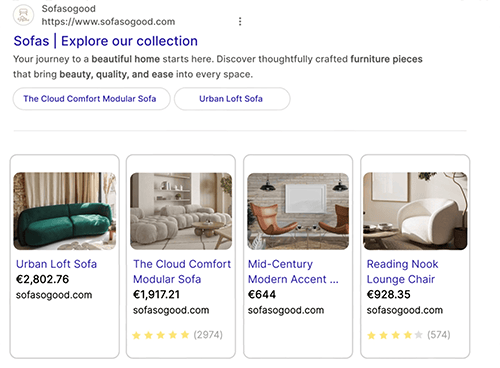

================================
Search Engine Optimization (SEO)
================================

Search Engine Optimization, often abbreviated as SEO, is a digital marketing strategy to improve a
website's visibility and ranking in search engine results (e.g., in Google). It involves optimizing
various elements on your website, including its content, social sharing, URLs, images, and page
speed.

.. note::
   - Odoo provides several modules to help you build your website content, such as
     :doc:`eCommerce <../../ecommerce>`, :doc:`Blog <../../blog>`, :doc:`eLearning
     <../../elearning>`, and :doc:`Forum <../../forum>`.
   - All Odoo :doc:`themes <../web_design/themes>` rely on the CSS Framework `Bootstrap
     <https://getbootstrap.com/>`_ to render efficiently according to the device: desktop, tablet,
     or mobile, which positively impacts ranking in search engines.

.. seealso::
   `Magic Sheet - Optimize your website [PDF]
   <https://drive.google.com/drive/folders/1Ywip4tWF2DPkcBaEbeXJxIZg2CjkwKgb>`_

Content optimization
====================

To optimize a webpage's SEO, access the page, then go to :menuselection:`Website --> Site -->
Optimize SEO`.

.. note::
   If you change the title of a blog post or the name of a product, the link to the related webpage
   is automatically updated. The old link still functions as Odoo creates a
   :ref:`301 redirect <website/pages/URL-redirection>`, maintaining the SEO.

Keywords and Meta tags
----------------------

There are two types of keywords in SEO, which serve different purposes.

In-text keywords
~~~~~~~~~~~~~~~~

In-text keywords appear naturally throughout a page’s visible content (titles, headings, and body
text) and help search engines determine the topic and relevance of the page. These keywords have a
real impact on ranking. They cannot be edited in the :guilabel:`optimize SEO` pop-up.

.. important::
   It is strongly recommended to only use one H1 title per page for SEO.

Meta tags and meta keywords
~~~~~~~~~~~~~~~~~~~~~~~~~~~

**Meta tags** are HTML elements that provide information about a webpage to search engines and
website visitors. They play a crucial role in SEO by helping search engines understand the content
and context of a webpage and attract visitors with appealing content. They can be edited in the
:guilabel:`optimize SEO` pop-up. There are two types of meta tags in Odoo:

- :guilabel:`Title` tags specify a webpage's title and are displayed as a clickable link in search
  engine results. They should be concise, descriptive, and relevant to the page's content. You can
  update the title tag of your webpage or keep it empty to use the default value based on the page’s
  content.

- :guilabel:`Description` tags summarize the webpage's content, often displayed in search engine
  results below the title. They are used to encourage the user to visit the page. You can update
  the description tag of your webpage or keep it empty to use the default value based on the page’s
  content.

.. note::
   The :guilabel:`Preview` card displays how the title and description tags should appear in search
   results. It also includes the URL of your page.

**Meta keywords** are placed in a hidden HTML tag `<meta name="keywords">`. Once used to describe a
page’s topic, this tag is now ignored by major search engines and has little or no impact on SEO.
To edit :guilabel:`Keywords`, enter the keywords you consider essential in this field and click
:guilabel:`Add` to see how they are used at different levels in your content (H1, H2, page title,
page description, page content) and the related searches in Google. The tool also suggests relevant
keywords.

Images
------

The size of images has a significant impact on page speed, which is an essential criterion for
search engines to optimize SEO ranking.

.. tip::
   Compare how your website ranks using `Google Page Speed <https://pagespeed.web.dev/?utm_source=psi&utm_medium=redirect>`_
   or `Pingdom Website Speed Test <https://tools.pingdom.com/>`_.

Odoo automatically compresses uploaded images and converts them to `Webp`. With this file format,
photos are smaller, which increases the page loading speed and, therefore, gives a better ranking in
SEO. All images used in Odoo official :doc:`themes <../web_design/themes>` are also compressed by
default. If you are using a third-party theme, it may provide images that are not compressed
efficiently.

**To modify an image** from your website, select the image, click :guilabel:`Edit`, then go to the
:guilabel:`Customize` tab, and adapt the :guilabel:`Format` in the :guilabel:`Image` section.

.. important::
   Alt tags are used to provide context to what an image is displaying, informing search engine
   crawlers and allowing them to index an image correctly. Adding alt tags keywords in the
   :guilabel:`Description` field is essential from an SEO perspective. This description is added to
   the HTML code of your image, and it is shown when the image cannot be displayed.

Image for social share
~~~~~~~~~~~~~~~~~~~~~~

When you share your page on social media, your website logo is selected by default, but you can
search the :doc:`Unsplash image library <../../../general/integrations/unsplash>` or upload any
other image by clicking the :icon:`fa-upload` :guilabel:`(upload)` button.

.. tip::
   You can set a default social share image. Go to :menuselection:`Website --> Configuration --> Settings`
   in the :guilabel:`SEO`section and tick the :guilabel:`Default Social Share Image` checkbox.

.. note::
   - The :guilabel:`Social Preview` card displays how the page's information would appear when
     shared.

Indexation
==========

Website indexation is the process by which search engines, such as Google, discover, analyze, and
store information about a website's content in their database. Search engine bots, known as crawlers
or spiders, visit web pages and follow links to collect data, including text, images, and other
media. The purpose of indexation is to make a website's content searchable and discoverable to
users. Without being indexed, a website or a specific page on that site will not appear in search
engine results, regardless of how relevant or well-designed it is. Indexation is a fundamental step
in :abbr:`SEO (Search Engine Optimization)`, serving as the foundation for a website's visibility
and organic traffic.

.. note::
   **When you first create your website on Odoo, it will not appear directly in search engine
   results.** Search engines need time to crawl and index it, which can take anywhere from a few
   days to several weeks. For Google, you can use the :doc:`Search Console <../configuration/google_search_console>`
   and request indexing for specific URLs, though this does not guarantee faster results.
   If you have an existing website and are migrating, your previous website may still appear instead
   of the new one during that timeframe.

SEO impact when migrating your existing website to Odoo
-------------------------------------------------------

In most cases, migrating to Odoo will not negatively impact your SEO. While no platform can
guarantee that rankings will remain unchanged, follow these best practices to significantly reduce
the risk.

- Keep your existing content.

- Implement :ref:`redirects <website/pages/URL-redirection>` from old URLs to their new counterparts.

- Monitor traffic and indexation to make sure that everything is going well, using :doc:`../configuration/google_search_console`.

By doing this, you help search engines reindex your site and maintain your visibility in search
results.

.. note::
   It is normal to experience a traffic decrease in the first days.

Prevent a page from being indexed
---------------------------------

To effectively prevent a page from appearing in search engine results, use one of the following
methods:

 - **noindex tag:** Access the page's :ref:`properties <website/pages/page_properties>` and toggle
   the :guilabel:`Indexed` switch off.

   .. note::
      This option is not yet available for :ref:`dynamic pages <website/pages/page_type>`.

 - **404 or 403:** Configure the page to return a 404 (Not Found) or 403 (Forbidden) HTTP status
   code. These codes signal to search engines that the page does not exist or is inaccessible,
   leading to its eventual removal from the index.

    - **404:** :ref:`Configure a 404 redirection. <website/pages/URL-redirection>`
    - **403:** Access the page's :ref:`properties <website/pages/page_properties>`
      and toggle the :guilabel:`Visibility` switch off or :ref:`unpublish the page <website/pages/un-publish-page>`.

 - **Google Search Console:** Use Google Search Console to request the removal of specific URLs from
   Google's index.

.. seealso::
   - :doc:`../configuration/google_search_console`
   - :doc:`pages`

Prevent a website from being indexed
------------------------------------

To prevent a website from appearing in search engine results, go to
:menuselection:`Configuration --> Settings`, then in the :guilabel:`Website Info` section, add a
random value in the :guilabel:`Domain` field. Doing so automatically inserts the following tag into
the page source:

.. code-block:: html

       <meta name="robots" content="noindex"/>

This tag instructs search engines not to index the site. After applying the change, it may take
several days or weeks for search engines to update their results and remove the website.

.. example::
   This can be used to prevent websites from test databases from appearing in search results.

Sitemap
=======

The sitemap points out website pages and their relation to each other to search engine crawlers.
Odoo generates a `/sitemap.xml` file, including all URLs. For performance reasons, this file is
cached and updated every 12 hours.

.. note::
   If your website has a lot of pages, Odoo automatically creates a Sitemap Index file, respecting
   the `sitemaps.org protocol <http://www.sitemaps.org/protocol.html>`_, grouping sitemap URLs in
   45000 chunks per file.

Every sitemap entry has three attributes that are computed automatically:

- `<loc>`: the URL of a page.
- `<lastmod>`: last modification date of the resource, computed automatically based on the related
  object. For a page related to a product, this could be the last modification date of the product
  or the page.
- `<priority>`: modules may implement their priority algorithm based on their content (for example,
  a forum might assign a priority based on the number of votes on a specific post). The priority of
  a static page is defined by its priority field, which is normalized (16 is the default).

.. tip::
   To prevent pages from appearing in a sitemap, go to :menuselection:`Site --> Properties`, and
   toggle off the :guilabel:`Indexed` feature.

     .. image:: seo/page-properties.png
        :alt: toggle off the “Indexed” field

robots.txt
==========

A `robots.txt` file instructs search engine crawlers which parts of a website they are permitted to
access. Its primary purpose is to:

 - **Prevent overloading the website:** By guiding crawlers away from certain sections, robots.txt
   helps manage server load.
 - **Control access to resources and detailed descriptions:** It can prevent crawlers from accessing
   media files (images, videos), CSS stylesheets, and JavaScript files, and from reading the content
   (text) of specific pages.

When indexing your website, search engines first look at the robots.txt file. Odoo automatically
creates one robot.txt file available on `mydatabase.odoo.com/robots.txt`.

.. note::
   Reputable bots adhere to robots.txt; others may require blocking via
   :ref:`Cloudflare <domain-name/naked/cloudflare>` on your custom domain.

Edit robots.txt
---------------

By editing a robots.txt file, you can control which site pages are accessible to search engine
crawlers. To add custom instructions to the file, go to :menuselection:`Website --> Configuration
--> Settings`, scroll down to the :guilabel:`SEO` section, and click :guilabel:`Edit robots.txt`.

.. example::
   If you do not want robots to crawl the `/about-us` page of your site, you can edit the
   robots.txt file to add `Disallow: /about-us`.

.. important::
   While `robots.txt` prevents content from being crawled, **it does not guarantee that a page
   will not be indexed**. A page can still appear in search results if it is linked to from other
   crawled pages (indexed by "reference"). Google generally does not recommend using robots.txt to
   block webpages that you wish to keep out of search results entirely.

Advanced features
=================

Structured data markup
----------------------

Structured data markup is used to generate rich snippets in search engine results. It is a way for
websites to send structured data to search engine crawlers, helping them understand your content and
create well-presented search results.

By default, Google supports many `rich snippets <https://developers.google.com/search/blog/2009/05/introducing-rich-snippets>`_
for content types, including Reviews, People, Products, Businesses, Events, and Organizations.

Microdata is a set of tags, introduced with HTML5, that help search engines better understand your
content and display it in a relevant way. Odoo implements microdata as defined in the schema.org
`specification <https://schema.org/docs/gs.html>`_ for events, eCommerce products, forum posts, and
contact addresses. This allows your product pages to be displayed in Google using extra information
like the price and rating of a product:

Hreflang HTML tags
------------------

Odoo automatically includes `hreflang` and `x-default` tags in the code of your website's
multilingual pages. These HTML attributes are crucial in informing search engines about a specific
page's language and geographical targeting.

.. seealso::
   :doc:`../configuration/translate`
