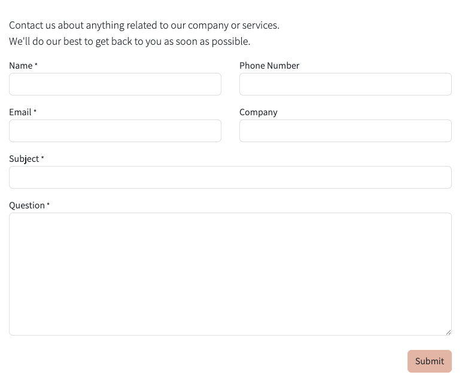
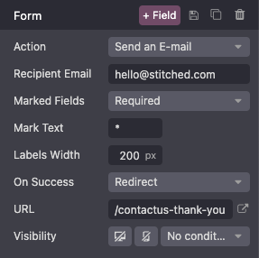
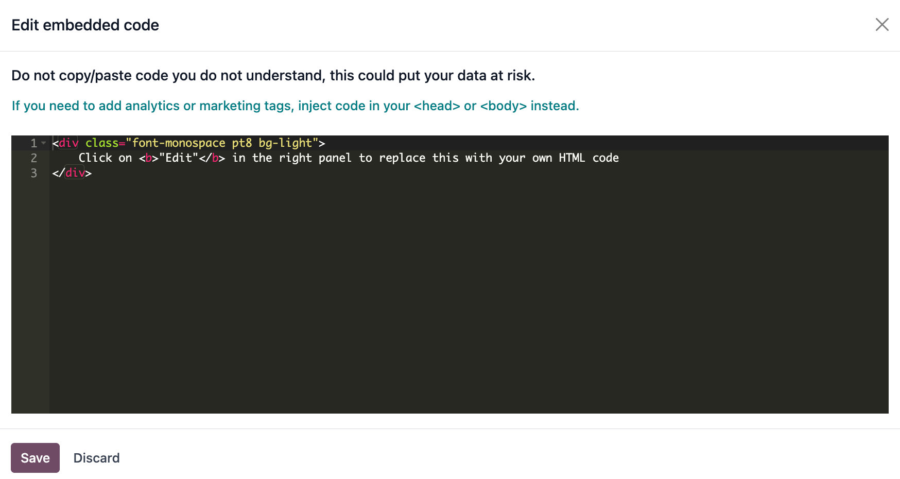

:show-content:

===============
Building blocks
===============

You can design your website by :ref:`dragging and dropping building blocks
<website/building_blocks/add>`, then :ref:`editing them <website/building_blocks/edit>` to fit your
content and layout needs.

.. seealso::
   `Odoo Tutorial: Design your website: text and colors <https://www.odoo.com/slides/slide/design-your-website-text-and-colors-6930?fullscreen=1>`_

.. _website/building_blocks/add:

Add a building block
====================

To add a block to a :doc:`website page <../structure/pages>`, access the page, click :guilabel:`Edit`, then
drag and drop the desired building block into the appropriate location. Two types of building blocks
are available: :guilabel:`Categories` and :guilabel:`Inner Content`. :guilabel:`Inner Content`
building blocks can only be added into :guilabel:`Categories` building blocks.

When clicking on a category block, a popup appears, allowing you to select between multiple
templates for each category.

.. tip::
   You can also search for a specific block in the :guilabel:`Insert a block` popup using the
   search bar.

  .. image:: building_blocks/insert-a-block.png
      :alt: Pop-up block selection

Once the category block is placed, you can drag and drop :guilabel:`Inner content` blocks
within it. The :guilabel:`Inner content` blocks allow you to add elements, such as videos, images,
social media buttons, etc., into pre-existing category blocks.

.. note::
   Access to certain blocks requires the installation of their respective application or module
   (e.g., eCommerce for the :guilabel:`Products` block).

.. example::
   Add all your social media accounts in one place with the inner content :guilabel:`Social Media`
   block. Toggle the switch on or off next to the desired platform and copy/paste your account URL.

   .. image:: building_blocks/social-media-inner-content.png
      :alt: Social Media inner content block

.. _website/building_blocks/form:

Form
----

The :guilabel:`Form` block is used to collect information from website visitors and create records
in your database, if applicable.

Action
~~~~~~

By default, when the form is submitted, an email containing the information entered by the visitor
is automatically sent. Depending on the apps installed on your database, additional actions that can
automatically create records may become available. To choose a different action, click
:guilabel:`Edit`, click the form, navigate to the :guilabel:`Customize` tab, and select the desired
:guilabel:`Action`:

- :guilabel:`Apply for a Job` (:doc:`Recruitment </applications/hr/recruitment>`)
- :guilabel:`Create a Customer` (:doc:`eCommerce <../../ecommerce>`)
- :guilabel:`Create a Ticket` (:doc:`Helpdesk </applications/services/helpdesk>`)
- :guilabel:`Create an Opportunity` (:doc:`CRM </applications/sales/crm>`)
- :guilabel:`Subscribe to Newsletter` (:doc:`Email Marketing </applications/marketing/email_marketing>`)
- :guilabel:`Create a Task` (:doc:`Project </applications/services/project>`)

By default, submitting the form redirects visitors to a *Thank you* page. Use the :guilabel:`URL`
field to send them to a different page. Alternatively, you can choose not to redirect and keep
them on the form's page by selecting :guilabel:`Nothing` or :guilabel:`Show Message` in the
:guilabel:`On Success` field.

Fields
~~~~~~

To add a new field to the form, navigate to the :guilabel:`Customize tab` and click the
:guilabel:`+ Field` button next to the :guilabel:`Form` or :guilabel:`Field` section. To modify the
new (or any other) field on the form, select the field, then use the options available in the
:guilabel:`Field` section of the :guilabel:`Customize` tab. For example, you can:

- Change the field :guilabel:`Type`.

  .. tip::
     It is also possible to select an :guilabel:`Existing Field` from the database and use the data
     it contains. The fields available depend on the selected action. Property fields added to the
     database can also be used.

  .. spoiler:: Click here to preview all field types.

     .. image:: building_blocks/all-types-of-field.png
        :alt: All types of form fields

     Some fields are visually similar, but the data entered must follow a specific format.

- Edit the field's :guilabel:`Label` and adapt its :guilabel:`Position`.
- Enable a field :guilabel:`Description`. Click the default description on the form to modify it.
- Add a :guilabel:`Placeholder` or :guilabel:`Default value`.
- Specify if the field is :guilabel:`Required`.
- Edit the field's :doc:`visibility <visibility>` settings.
- Add an :ref:`animation <website/elements/animations>`.

Once you have made the desired changes, click :guilabel:`Save`.

.. _website/building_blocks/embed_code:

Embed code
----------

Embedding code allows you to integrate content from third-party services into a page, such as videos
from YouTube, maps from Google Maps, social media posts from Instagram, etc.

After adding the block to a page, click the block, then go to the :guilabel:`Customize` tab and
click :guilabel:`Edit`. Replace the placeholder code with your custom embed code.

.. warning::
   Do not copy/paste code you do not understand, as it could put your data at risk.

.. _website/building_blocks/move_switch_delete:

Move, switch, or delete a building block
========================================

Pull the turquoise borders on the block to reduce or increase the space at the top or bottom of it.

Change the block order by clicking :icon:`fa-chevron-up` (:guilabel:`chevron up`) or
:icon:`fa-chevron-down` (:guilabel:`chevron down`) and move the block on the page by clicking
:icon:`fa-arrows` (:guilabel:`arrows`). When you have multiple :ref:`columns
<website/building_blocks/cols>`, move a column to the left or right by clicking
:icon:`fa-chevron-left` (:guilabel:`chevron left`) or :icon:`fa-chevron-right`
(:guilabel:`chevron right`).

To delete a block, click :icon:`fa-trash` (:guilabel:`trash`).

   .. image:: building_blocks/padding-building-block.png
      :alt: Extend margins on building block

.. tip::
   Quickly change the block category by clicking :icon:`fa-exchange` (:guilabel:`exchange`).

.. _website/building_blocks/edit:

Edit a building block
=====================

To edit the content of a building block, click on it and go to the :guilabel:`Customize` tab.
Available customization options vary depending on the type of block selected.

.. seealso::
   - :doc:`Web design elements <elements>`
   - :doc:`Visibility <visibility>`

Background
----------

To modify the background of a building block, select the block, go to the :guilabel:`Customize` tab,
and click the color dot or another :guilabel:`Background` option. You can change the
color and/or add an image, video, and/or shape. Once you've selected a shape, new fields appear to
allow you to customize the shape.

.. tip::
   - Position an element (image, text, etc.) behind or in front of another one by using the
     :guilabel:`Send to back` or :guilabel:`Bring to front` icons.

     .. image:: building_blocks/change-block-position.png
        :alt: Change block position

   - To resize a block, click and drag the dots around its edges to adjust it as needed.

     .. image:: building_blocks/adapt-block-size.png
       :alt: Adapt block size

.. seealso::
   :doc:`General theme <themes>`

Layout: grid and columns
------------------------

For most building blocks, you can choose between two layout styles: :ref:`grid
<website/building_blocks/grid>` or :ref:`columns (cols) <website/building_blocks/cols>`. To change
the default layout style, click the block, go to the :guilabel:`Customize` tab, and set the
:guilabel:`Layout` field to :guilabel:`Grid` or :guilabel:`Cols`.

.. _website/building_blocks/grid:

Grid
~~~~

The :guilabel:`Grid` layout allows you to reposition and resize elements, such as images or text, by
dragging and dropping them. When :guilabel:`Grid` is selected, additional options are available to
:guilabel:`Add Elements` by clicking :guilabel:`Image`, :guilabel:`Text`, or :guilabel:`Button`.

.. image:: building_blocks/grid-layout.png
   :alt: When the grid layout is selected, choose an image and drag and drop it where needed.

.. _website/building_blocks/cols:

Cols
~~~~

Choosing the :guilabel:`Cols` layout allows you to determine the number of elements per line within
the block. To do so, select the block to modify, click the dropdown next to the :guilabel:`Cols`
field, and adjust the number. You can then modify a specific column's settings using the options in
the :guilabel:`Column` section of the :guilabel:`Customize` tab.

.. note::
   By default, :doc:`on mobile devices <visibility>`, only one element (column) is visible per line
   to ensure that content remains easily readable and accessible on smaller screens. To adjust
   the value, click the :icon:`fa-mobile` (:guilabel:`mobile icon`) at the top of the website editor
   and adapt the number of columns. Shapes are hidden by default on mobiles.

.. _website/building_blocks/duplicate:

Duplicate a building block
==========================

To duplicate a building block, click the :icon:`fa-clone` (:guilabel:`duplicate`) icon at the top of
the :guilabel:`Customize` tab. Once duplicated, the new block appears on the page beneath the
original one.

.. _website/building_blocks/custom:

Save a custom building block
============================

You can save a customized building block to reuse it elsewhere. To do so, select it, navigate to
the :guilabel:`Customize` tab, and click the :icon:`fa-floppy-o` (:guilabel:`floppy disk`) icon.
Click the :guilabel:`Save and reload` button in the popup to confirm saving your custom block.

To add a saved building block to the page, navigate to the :guilabel:`Blocks` tab and drag and drop
the :guilabel:`Custom` block from the :guilabel:`Categories` section. In the popup that opens, click
the desired block in the :guilabel:`Custom` category.

.. tip::
   In the :guilabel:`Insert a block` popup, click :icon:`fa-pencil` (:guilabel:`edit`) to rename the
   custom block or :icon:`fa-trash` (:guilabel:`delete`) to delete it.

.. _website/building_blocks/anchor:

Create an anchor link
=====================

Anchor links are hyperlinks that direct users to a **specific section** of a page. To create an
anchor link for a block, follow these steps:

#. Click :guilabel:`Edit` and select the block you want to link to.
#. Click :icon:`fa-link` (:guilabel:`link`) at the top of the :guilabel:`Customize` tab.
#. To edit the default anchor name, click :guilabel:`Edit` in the green popup message that opens.
#. Replace the anchor name and click :guilabel:`Save & copy`.

Once the anchor is saved, you can :ref:`link to it <website/elements/links>` from anywhere on your
website.
