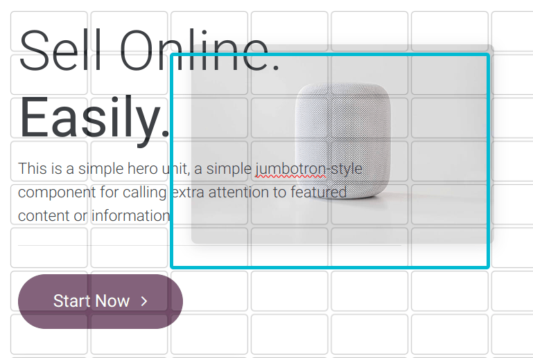
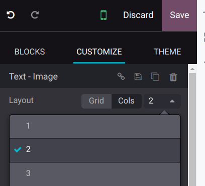
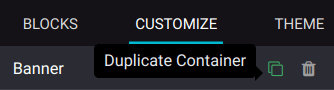
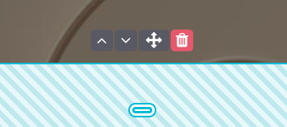
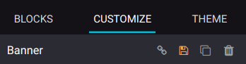
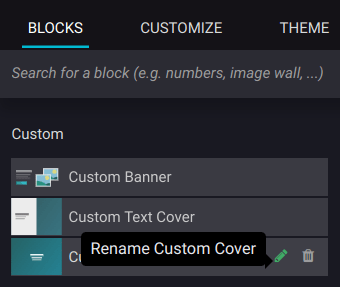
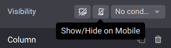

:show-content:

===============
Building blocks
===============

Building blocks let you design your website quickly by dragging and dropping them onto your web
pages. Four types of building blocks are available depending on their use:
:doc:`Structure <building_blocks/structure>`, :doc:`Features <building_blocks/features>`,
:doc:`Dynamic Content <building_blocks/dynamic_content>`, and
:doc:`Inner Content <building_blocks/inner_content>`.

.. seealso::
   `Odoo Tutorial: Design your first webpage <https://www.odoo.com/slides/slide/design-your-website-images-and-motion-6931?fullscreen=1>`_

.. _websites/website/web_design/building_blocks:

Adding a building block
=======================

To add a building block to your website page, click :guilabel:`Edit`, select the desired building
block, and drag and drop it to your page. You can add as many blocks as needed.

To edit the content of a building block, click on it and go to the :guilabel:`Customize` tab, where
available features depend on the block you selected.

Color preset and background
===========================

You can customize and apply color presets to building blocks. To proceed, select a building block,
go to the :guilabel:`Customize` tab, click the :guilabel:`Background` button, and select a
:guilabel:`Preset`.

When you modify a color preset, all elements using it are automatically updated to match the new
configuration.

.. seealso::
   :doc:`Website themes <themes>`

Layout: grid and columns
========================

You can choose between two layout styles for most building blocks: :ref:`grid
<building_blocks/grid>` or :ref:`columns (cols) <building_blocks/cols>`. To change the default
layout, go to the :guilabel:`Customize` tab. Under the :guilabel:`Banner` section, select
:guilabel:`Grid` or :guilabel:`Cols` as the :guilabel:`Layout`.

.. _building_blocks/grid:

Grid
----

The :guilabel:`Grid` layout allows you to reposition and resize elements, such as images or text, by
dragging and dropping them.

.. tip::
   Position images behind the text by using the above/below icons.

   .. image:: building_blocks/superimpose-images-to-text.png
      :alt: Positioning an image behind text

.. _building_blocks/cols:

Cols
----

Choosing the :guilabel:`Cols` layout allows you to determine the number of elements per line within
the block. To do so, select the block to modify, click the :guilabel:`Cols` :guilabel:`Layout`, and
adjust the number.

By default, **on mobile devices**, one element is visible per line to ensure that content remains
easily readable and accessible on smaller screens. To adjust the value, click the :icon:`fa-mobile`
(:guilabel:`mobile icon`) at the top of the website editor and adapt the number of columns.

Duplicating a building block
============================

You can duplicate a building block by clicking on the duplicate icon. Once duplicated, the new block
appears on your website beneath the original one.

Reordering a building block
===========================

To reorder a building block, select it and click the up arrow to move it before the previous block
or click the down arrow to move it after.

You can also use the drag-and-drop icon to move a block manually.

Saving a custom building block
==============================

You can save a customized building block and reuse it elsewhere. To do so, select it, navigate to
the :guilabel:`Customize` tab, and click the :icon:`fa-floppy-o` (:guilabel:`floppy disk`) icon to
save it.

Saved building blocks are available in the :guilabel:`Custom` section of the :guilabel:`Blocks` tab.
Click the :icon:`fa-pencil` (:guilabel:`pen`) icon to edit their name.

.. _building_blocks/visibility:

Visibility
==========

Visibility on desktop/mobile
----------------------------

You can hide specific elements depending on the visitor's device. To do so, select the element to
hide, and in the :guilabel:`Customize` tab, scroll down to :guilabel:`Visibility`, and click the
:guilabel:`Show/Hide on Mobile` or the :guilabel:`Show/Hide on Desktop` icon.

.. tip::
   Click the :icon:`fa-mobile` (:guilabel:`mobile`) icon at the top of the configurator to preview
   how your website would look on a mobile device.

   .. image:: building_blocks/phone-icon.png
      :alt: Mobile phone preview icon

Conditional visibility
----------------------

You can also hide or show building blocks using other conditions. To do so, select an element, go to
:guilabel:`Visibility`, click :guilabel:`No condition`, and select :guilabel:`Conditionally`
instead. Then, configure the condition(s) to apply by selecting :guilabel:`Visible for` or
:guilabel:`Hidden for` and which :guilabel:`Records` will be impacted.

.. seealso::
   :doc:`Link Tracker <../reporting/link_tracker>`

Invisible elements
------------------

Depending on the visibility settings, some elements can become hidden from your current view. To
make a building block visible again, go to the :guilabel:`Invisible Elements` section at the bottom
of the configurator and select a building block.

Mobile view customization
=========================

You can customize building block elements for the mobile view without impacting the desktop view.
To do so, open the website editor, click the :icon:`fa-mobile` (:guilabel:`mobile`) icon at the top,
and select the building block element. Then, you can:

- reorder the elements by clicking the :icon:`fa-angle-left` :icon:`fa-angle-right`
  (:guilabel:`left/right arrow`) icons;
- edit the :ref:`Cols <building_blocks/cols>` and :ref:`Visibility <building_blocks/visibility>`
  features in the :guilabel:`Customize` tab of the website editor.

.. toctree::
   :titlesonly:

   building_blocks/structure
   building_blocks/features
   building_blocks/dynamic_content
   building_blocks/inner_content
