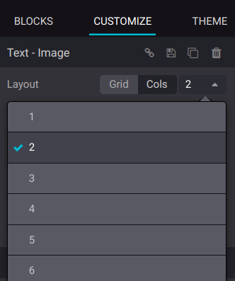

===============
Building blocks
===============

Building blocks let you design your website quickly by dragging and dropping them onto your web
pages. Four types of building blocks are available depending on their use: :guilabel:`Structure`,
:guilabel:`Features`, :guilabel:`Dynamic Content`, and :guilabel:`Inner Content`.

.. seealso::
   `Odoo Tutorial: Design your first webpage <https://www.odoo.com/slides/slide/design-your-first-web-page-1667?fullscreen=1>`_

Adding a building block
=======================

To add a building block to your website page, click :guilabel:`Edit`, select the desired building
block, and drag and drop it to your page. You can add as many blocks as needed.

To edit the content of a building block, click on it and go to the :guilabel:`Customize` tab, where
available features depend on the block you selected.

Color preset and background
===========================

You can customize and apply color presets to building blocks. To proceed, select a building block,
go to the :guilabel:`Customize` tab, click the :guilabel:`Background` button, and select a
:guilabel:`Preset`.

When you modify a color preset, all elements using it are automatically updated to match the new
configuration.

.. seealso::
   :doc:`Website themes <themes>`

Layout: grid and columns
========================

You can choose between two layout styles for most building blocks: grid or columns (cols). To
change the default layout, go to the :guilabel:`Customize` tab. Under the :guilabel:`Banner`
section, select :guilabel:`Grid` or :guilabel:`Cols` as the :guilabel:`Layout`.

Grid
----

The :guilabel:`Grid` layout allows you to reposition and resize elements, such as images or text, by
dragging and dropping them.

.. image:: building_blocks/grid-layout.png
   :alt: When the grid layout is selected, choose an image and drag and drop it where needed.

.. tip::
   Position images behind the text by using the above/below icons.

   .. image:: building_blocks/superimpose-images-to-text.png
      :alt: Positioning an image behind text

Cols
----

Choosing the :guilabel:`Cols` layout allows you to determine the number of elements per line within
the block.

.. note::
   On mobile devices, only one element per column is used by default for better visibility. You can
   adjust this value by using the :guilabel:`Mobile Preview` mode.

Duplicating a building block
============================

You can duplicate a building block by clicking on the duplicate icon. Once duplicated, the new block
appears on your website beneath the original one.

.. image:: building_blocks/duplicate-container.png
   :alt: Duplicating a building block

Reordering a building block
===========================

To reorder a building block, select it and click the up arrow to move it before the previous block
or click the down arrow to move it after.

You can also use the drag-and-drop icon to move a block manually.

.. image:: building_blocks/reordering-blocks.png
   :alt: Reordering building blocks

Visibility
==========

Visibility on desktop/mobile
----------------------------

You can hide specific elements depending on the visitor's device. To do so, select the element to
hide, and in the :guilabel:`Customize` tab, scroll down to :guilabel:`Visibility`, and click the
:guilabel:`Show/Hide on Mobile` or the :guilabel:`Show/Hide on Desktop` icon.

.. image:: building_blocks/show-hide-on-mobile.png
   :alt: Click the "show/hide on mobile" icons to show or hide some elements on mobile.

.. tip::
   Click the phone icon at the top of the configurator to preview how your website would look on a
   mobile device.

   .. image:: building_blocks/phone-icon.png
      :alt: Mobile phone preview icon

Conditional visibility
----------------------

You can also hide or show building blocks using other conditions. To do so, select an element, go to
:guilabel:`Visibility`, click :guilabel:`No condition`, and select :guilabel:`Conditionally`
instead. Then, configure the condition(s) to apply by selecting :guilabel:`Visible for` or
:guilabel:`Hidden for` and which :guilabel:`Records` will be impacted.

.. seealso::
   :doc:`Link Tracker and UTMs <../reporting/link_tracker>`

Invisible elements
------------------

Depending on the visibility settings, some elements can become hidden from your current view. To
make a building block visible again, go to the :guilabel:`Invisible Elements` section at the bottom
of the configurator and select a building block.

Saving a custom building block
==============================

You can save a customized building block and reuse it elsewhere. To do so, select it, navigate to
the :guilabel:`Customize` tab, and click the floppy disk icon to save it.

.. image:: building_blocks/saving-custom-block.png
   :alt: Saving a building block

Saved building blocks are available in the :guilabel:`Custom` section of the :guilabel:`Blocks` tab.
Click the pen icon to edit their name.

.. image:: building_blocks/custom-blocks.png
   :alt: Custom section with saved building blocks
