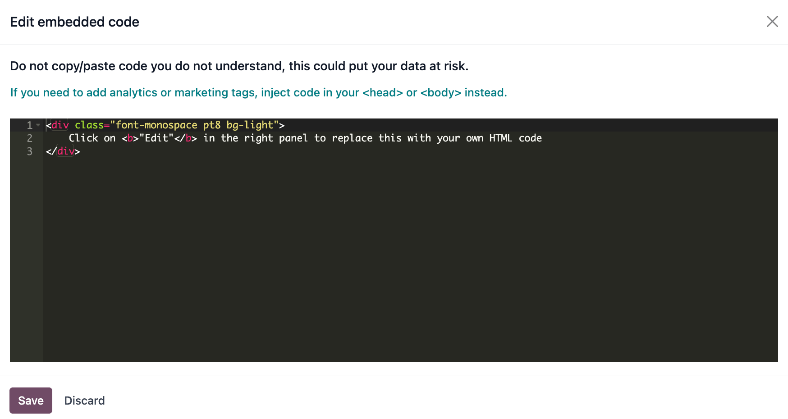
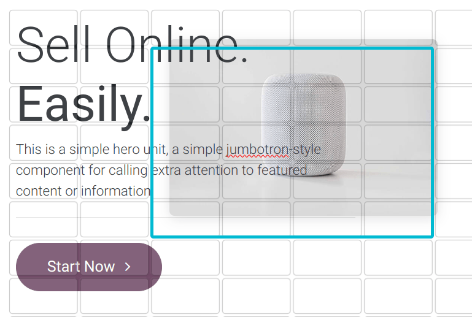

:show-content:

===============
Building blocks
===============

You can design your website by :ref:`dragging and dropping building blocks
<website/building_blocks/add>`, then :ref:`editing them <website/building_blocks/edit>` to fit your
content and layout needs.

.. seealso::
   `Odoo Tutorial: Design your website: text and colors <https://www.odoo.com/slides/slide/design-your-website-text-and-colors-6930?fullscreen=1>`_

.. _website/building_blocks/add:

Add a building block
====================

To add a block to a :doc:`website page <../structure/pages>`, access the page, click
:guilabel:`Edit`, then drag and drop the desired building block into the appropriate location. Two
types of building blocks are available: :guilabel:`Categories` and :guilabel:`Inner Content`.
:guilabel:`Inner Content` building blocks can only be added into :guilabel:`Categories` building
blocks.

When clicking a category block, a popup appears, allowing you to select between multiple
templates for each category.

.. tip::
   Search for a specific block in the :guilabel:`Insert a block` popup using the search bar.

  .. image:: building_blocks/insert-a-block.png
      :alt: Pop-up block selection

Once the category block is placed, you can drag and drop :guilabel:`Inner content` blocks
within it. The :guilabel:`Inner content` blocks allow you to add elements, such as videos, images,
social media buttons, etc., into pre-existing category blocks.

.. note::
   - You can also add a building block on the login page. To do so, navigate to the website's
     homepage, add `/web/login` to the URL and press `Enter`.
   - Access to certain blocks requires installing their respective application or module
     (e.g., eCommerce for the :guilabel:`Products` block).

.. example::
   Add all your social media accounts in one place with the inner content :guilabel:`Social Media`
   block. Toggle the switch on or off next to the desired platform and copy/paste your account URL.

   .. image:: building_blocks/social-media-inner-content-block.png
      :alt: Social Media inner content block

.. _website/building_blocks/form:

Form
----

The :guilabel:`Form` block is used to collect information from website visitors and, if applicable,
create records in your database. To add a form to a website page, drag and drop the
:guilabel:`Contact & Forms` category block, then select a block in the popup.

.. image:: building_blocks/form-block.png
   :alt: Example of a form block

.. _website/building_blocks/action:

Action
~~~~~~

By default, when the form is submitted, an email containing the information entered by the visitor
is automatically sent. Depending on the apps installed on your database, additional actions that can
automatically create records may become available. To choose a different action, click
:guilabel:`Edit`, click the form, navigate to the :guilabel:`Style` tab, and select the desired
:guilabel:`Action`:

- :guilabel:`Apply for a Job` (:doc:`Recruitment </applications/hr/recruitment>`)
- :guilabel:`Create a Customer` (:doc:`eCommerce <../../ecommerce>`)
- :guilabel:`Create a Ticket` (:doc:`Helpdesk </applications/services/helpdesk>`)
- :guilabel:`Create an Opportunity` (:doc:`CRM </applications/sales/crm>`)
- :guilabel:`Subscribe to Newsletter` (:doc:`Email Marketing </applications/marketing/email_marketing>`)
- :guilabel:`Create a Task` (:doc:`Project </applications/services/project>`)
- :guilabel:`More models`: to generate other types of records

By default, submitting the form redirects visitors to a *Thank you* page. Use the :guilabel:`URL`
field to send them to a different page. Alternatively, you can choose not to redirect and keep
them on the form's page by selecting :guilabel:`Nothing` or :guilabel:`Show Message` in the
:guilabel:`On Success` field.

.. _website/building_blocks/fields:

Fields
~~~~~~

To add a new field to the form, navigate to the :guilabel:`Style` tab and click the
:guilabel:`+ Field` button next to the :guilabel:`Form` or :guilabel:`Field` section. To modify any
field on the form, select the field, then use the options available in the :guilabel:`Field`
section of the :guilabel:`Style` tab. For example, you can:

- Change the field :guilabel:`Type`.

  .. tip::
     It is also possible to select an :guilabel:`Existing Field` from the database and use the data
     it contains. The fields available depend on the selected action. Property fields added to the
     database can also be used.

  .. spoiler:: Click here to preview all field types.

     .. image:: building_blocks/all-types-of-field.png
        :alt: All types of form fields

     Some fields are visually similar, but the data entered must follow a specific format.

- Edit the field's :guilabel:`Label` and adapt its :guilabel:`Position`.
- Enable a field :guilabel:`Description`. Toggle the switch on and click the default description on
  the form to modify it.
- Add a :guilabel:`Placeholder` or :guilabel:`Default value`.
- Specify if the field is :guilabel:`Required`.
- Edit the field's :doc:`visibility <visibility>` settings.
- Add an :ref:`animation <website/elements/animations>`.

Once you have made the desired changes, click :guilabel:`Save`.

Prefill form fields with URL parameters
~~~~~~~~~~~~~~~~~~~~~~~~~~~~~~~~~~~~~~~

Form fields can be automatically filled using URL query parameters. This is useful for marketing
campaigns, personalized links, or any scenario where you want to pre-populate a form for the
visitor.

.. _website/building_blocks/form/shareable:

Enable shareable links
**********************

URL prefill is **disabled by default** and must be enabled per form with the :guilabel:`Share &
Pre-fill` option. Forms without it ignore query parameters entirely. Once enabled, the shareable
link carries a reserved ``usp_pp`` parameter whose value targets that specific form, so prefill
applies only to it (useful when a page has multiple forms). A link without a ``usp_pp`` parameter
prefills every sharing-enabled form on the page. To enable prefill and get the shareable link for a
form:

#. Open the website editor and click the form block.
#. In the :guilabel:`Style` tab, under the :guilabel:`Form` section, enable the
   :guilabel:`Share & Pre-fill` toggle.
#. A :guilabel:`Shareable Link` field appears with the page URL and the form's ``usp_pp`` token
   (e.g., ``https://example.com/contactus?usp_pp=form-abc123``).
#. Click the :icon:`fa-clipboard` (:guilabel:`Copy Link`) button to copy the link to your
   clipboard.
#. Click :guilabel:`Save`. The link only works once the page is saved with sharing enabled.

.. _website/building_blocks/form/field-name:

Identify field names
********************

Each form field has a **Field Name** used as the query parameter key in the URL. To find it:

#. Open the website editor and click a field in the form.
#. In the :guilabel:`Style` tab, under the :guilabel:`Field` section, locate the
   :guilabel:`Field Name` value.
#. Use this exact name as the query parameter key when constructing the URL.

.. _website/building_blocks/form/construct-url:

Construct the prefill URL
*************************

Append field parameters to the shareable link using the format ``&field_name=value`` (the link
already starts with ``?usp_pp=...``). Separate multiple fields with ``&``.

.. example::
   For a contact form with the shareable link
   ``https://example.com/contactus?usp_pp=form-abc123``, prefill the :guilabel:`Name` and
   :guilabel:`Email` fields:

   .. code-block:: text

      https://example.com/contactus?usp_pp=form-abc123&name=John+Doe&email_from=john@example.com

   When a visitor opens this URL, the form fields are automatically populated with the provided
   values.

For :guilabel:`Selection`, :guilabel:`Radio`, and :guilabel:`Checkbox` fields, the parameter value
must match one of the available option values exactly. For a single checkbox, ``true``, ``1``, and
``on`` check the box, while ``false``, ``0``, and ``off`` uncheck it, even when it is checked by
default.

For :guilabel:`Date` and :guilabel:`Datetime` fields, use the `ISO 8601
<https://en.wikipedia.org/wiki/ISO_8601>`_ format, e.g., ``2026-10-22`` or ``2026-10-22T18:00``.
The value is displayed to each visitor in their own local date format.

In all cases, invalid or unmatched values are ignored and the fields keep their default values. The
exception is a :guilabel:`Selection` or :guilabel:`Radio` field with :guilabel:`Add Other` enabled:
an unmatched value selects the :guilabel:`Other` option and fills its input with that value.

For **multiple-checkbox fields**, repeat the field name in the query string for each value:

.. code-block:: text

   https://example.com/contactus?usp_pp=form-abc123&interests=sports&interests=tech

.. note::
   - Values provided by the backend always take precedence over URL parameters. This includes
     server-side ``data-for`` values (e.g., on the Contact Us form) and the ``data-fill-with``
     attribute that prefills name, phone, and email from the logged-in user's contact record.
   - Spaces in values can be encoded as ``+`` or ``%20``.

.. warning::
   On a **sharing-enabled** form, avoid naming fields after keys that commonly appear in URLs, such
   as ``usp_pp`` (reserved by this feature), tracking keys (``utm_source``, ``utm_medium``, etc.),
   or routing and search keys (``debug``, ``lang``, ``redirect``, ``page``, ``search``, etc.).
   These keys are frequently appended by analytics tools, ad networks, or Odoo itself, and a field
   bearing the same name would be silently prefilled. To capture tracking values on purpose (e.g.,
   for campaign attribution), use a hidden field bearing that name.

.. _website/building_blocks/form/no-prefill:

Disable prefill on specific fields
**********************************

To prevent a specific field from being prefilled by URL parameters while still allowing prefill on
other fields in the same form, add the ``data-no-prefill="true"`` attribute to the field's wrapper
element (the ``
`` that contains the label and input).

.. example::
   In the page's HTML editor:

   .. code-block:: html

      

          <label class="s_website_form_label">Verification code</label>
          <input class="s_website_form_input" type="text" name="code"/>
      

   Visitors opening ``?usp_pp=form-abc123&code=ABCD`` will not see ``ABCD`` injected into this
   field, even though other fields on the form continue to prefill normally.

.. note::
   - Backend ``data-for`` values and the ``data-fill-with`` attribute continue to apply to the
     field regardless of ``data-no-prefill``; only URL parameter prefill is blocked.
   - Editing this attribute currently requires the page HTML editor (:menuselection:`Site -->
     HTML/CSS editor`).

Add an Odoo contact form on a non-Odoo website
~~~~~~~~~~~~~~~~~~~~~~~~~~~~~~~~~~~~~~~~~~~~~~

You can display an Odoo contact form on another website using an iframe. To do so, follow these
steps:

#. **Prepare the Odoo form:** Create a contact form on a page in Odoo Website and remove the
   :ref:`header design <website/header_footer/header-design>` and the :ref:`footer design
   <website/header_footer/footer-design>`. Make sure only the contact form remains on the page.
#. **Generate an embeddable code:** Copy the URL of the Odoo form page and paste it into an iframe
   generator, such as `La Digitale.dev <https://ladigitale.dev/digitools/generateur-iframe>`_ or
   `iFrame Generator <https://www.iframe-generator.com/>`_ . Adjust the width and height for proper
   display.
#. **Add the embedded code to the non-Odoo website:** Open the relevant page’s HTML (in the code
   editor or CMS) and insert the embedded code where the form should be displayed.

.. example::
   Example of an embedded code:

   .. code-block:: html

       <iframe src="https://example.com/odoo-form"
               style="border:0;"
               name="odooForm"
               scrolling="no"
               frameborder="0"
               marginheight="0"
               marginwidth="0"
               height="400px"
               width="600px"
               allowfullscreen>
        </iframe>

.. _website/building_blocks/embed_code:

Embed code
----------

Embedding code allows you to integrate content from third-party services into a page, such as videos
from YouTube, maps from Google Maps, social media posts from Instagram, etc.

After dragging and dropping the :guilabel:`Embed Code` block from the :guilabel:`Inner Content`
section into a page, click the block, then go to the :guilabel:`Style` tab and click
:guilabel:`Edit`. Replace the placeholder code with your custom embed code.

.. warning::
   Do not copy/paste code you do not understand, as it could put your data at risk.

.. _website/building_blocks/move_switch_delete:

Move, switch, duplicate or delete a building block
==================================================

Pull the turquoise borders on the block to reduce or increase the space at the top or bottom of it.

Change the block order by clicking :icon:`fa-chevron-up` (:guilabel:`chevron up`) or
:icon:`fa-chevron-down` (:guilabel:`chevron down`) and move the block on the page by clicking
:icon:`fa-arrows` (:guilabel:`arrows`). When you have multiple :ref:`columns
<website/building_blocks/cols>`, move a column to the left or right by clicking
:icon:`fa-chevron-left` (:guilabel:`chevron left`) or :icon:`fa-chevron-right`
(:guilabel:`chevron right`).

To duplicate a building block, click :icon:`fa-clone` (:guilabel:`duplicate`). Once duplicated, the
new block appears on the page beneath the original one.

.. tip::
   Alternatively, click the :icon:`fa-clone` (:guilabel:`duplicate`) icon at the top of the
   :guilabel:`Style` tab to duplicate the selected block.

To delete a block, click :icon:`fa-trash` (:guilabel:`trash`).

   .. image:: building_blocks/padding-building-block.png
      :alt: Extend margins on building block

.. _website/building_blocks/edit:

Edit a building block
=====================

To edit the content of a building block, click it and go to the :guilabel:`Style` tab.
Available customization options vary depending on the type of block selected.

.. seealso::
   - :doc:`Web design elements <elements>`
   - :doc:`Visibility <visibility>`

Background
----------

To modify the background of a building block, select the block, go to the :guilabel:`Style` tab,
and click the color dot or another :guilabel:`Background` option. You can change the
color and/or add an image, video, and/or shape. Once you've selected a shape, new fields appear to
allow you to customize the shape.

.. tip::
   - Position an element (image, text, etc.) behind or in front of another one by using the
     :guilabel:`Send to back` or :guilabel:`Bring to front` icons.

     .. image:: building_blocks/change-block-position.png
        :alt: Change block position

   - To resize a block, click and drag the dots around its edges to adjust it as needed.

     .. image:: building_blocks/adapt-block-size.png
       :alt: Adapt block size

.. seealso::
   :doc:`General theme <themes>`

Layout: grid and columns
------------------------

For most building blocks, you can choose between two layout styles: :ref:`grid
<website/building_blocks/grid>` or :ref:`columns (cols) <website/building_blocks/cols>`. To change
the default layout style, click the block, go to the :guilabel:`Style` tab, and set the
:guilabel:`Layout` field to :guilabel:`Grid` or :guilabel:`Cols`.

.. _website/building_blocks/grid:

Grid
~~~~

The :guilabel:`Grid` layout allows you to reposition and resize elements, such as images or text, by
dragging and dropping them. When :guilabel:`Grid` is selected, additional options are available to
:guilabel:`Add Elements` by clicking :guilabel:`Image`, :guilabel:`Text`, or :guilabel:`Button`.

.. _website/building_blocks/cols:

Cols
~~~~

Choosing the :guilabel:`Cols` layout allows you to determine the number of elements per line within
the block. To do so, select the block to modify, click the dropdown next to the :guilabel:`Cols`
field, and adjust the number. You can then modify a specific column's settings using the options in
the :guilabel:`Column` section of the :guilabel:`Style` tab.

.. note::
   By default, :doc:`on mobile devices <visibility>`, only one element (column) is visible per line
   to ensure that content remains easily readable and accessible on smaller screens. To adjust
   the value, click the :icon:`fa-mobile` (:guilabel:`mobile icon`) at the top of the website editor
   and adapt the number of columns. Shapes are hidden by default on mobiles.

.. _website/building_blocks/custom:

Save a custom building block
============================

You can save a customized building block to reuse it elsewhere. To do so, select it, navigate to
the :guilabel:`Style` tab, and click the :icon:`fa-floppy-o` (:guilabel:`floppy disk`) icon.
Click the :guilabel:`Save` button in the popup to confirm saving your custom block.

To add a saved building block to the page, navigate to the :guilabel:`Blocks` tab and drag and drop
the :guilabel:`Custom` block from the :guilabel:`Categories` section. In the popup that opens, click
the desired block in the :guilabel:`Custom` category.

.. tip::
   In the :guilabel:`Insert a block` popup, click :icon:`fa-pencil` (:guilabel:`edit`) to rename the
   custom block or :icon:`fa-trash` (:guilabel:`delete`) to delete it.

.. _website/building_blocks/anchor:

Create an anchor link
=====================

Anchor links are hyperlinks that direct users to a **specific section** of a page. To create an
anchor link for a block, follow these steps:

#. Click :guilabel:`Edit` and select the block you want to link to.
#. Click :icon:`fa-link` (:guilabel:`link`) at the top of the :guilabel:`Style` tab.
#. To edit the default anchor name, click :guilabel:`Edit` in the green popup message that opens.
#. Replace the anchor name and click :guilabel:`Save & copy`.

Once the anchor is saved, you can :ref:`link to it <website/elements/links>` from anywhere on your
website.
