:show-content:

===============
Building blocks
===============

You can design your website quickly and easily by dragging and dropping Building blocks. Depending
on their use, two types of building blocks are available: :guilabel:`Categories`
and :guilabel:`Inner Content.` First, you need to add a category, and within this category, you
can add :ref:`inner content <building_blocks/inner_content>`.

   .. image:: building_blocks/2-types-of-blocks.png
      :alt: Two types of blocks

.. seealso::
   `Odoo Tutorial: Design your website: text and colours <https://www.odoo.com/slides/slide/design-your-website-text-and-colors-6930?fullscreen=1>`_

Add a building block
====================

To add a block, click :guilabel:`Edit`, then select the category or inner content you want to add.
When clicking on a category block, a pop-up appears, allowing you to select between multiple
templates for each category. Save when you’re finished.

You can add as many :guilabel:`category` blocks as you want on a page but keep in mind that a short
and efficient page works best. Once your category block is placed, you can drag and drop
:guilabel:`inner content` within it.

   .. image:: building_blocks/insert-a-block.png
      :alt: Pop-up block selection

  .. note::
     Access to certain blocks requires the installation of their respective application.

Edit a building block
=====================

To edit the content of a building block, click on it and go to the :guilabel:`Customize` tab, where
available features depend on the block you selected.

Pull the turquoise borders on your block to reduce or increase the space at the top or bottom of it.
Change the block order by clicking :icon:`fa-chevron-up` or :icon:`fa-chevron-down` and move the
block on your page by clicking the :icon:`fa-arrows`. Simply delete it by clicking :icon:`fa-trash`.

   .. image:: building_blocks/padding-building-block.png
      :alt: Extend margins on building block

.. tip::
   Change quickly the block category by clicking the arrows :icon:`fa-exchange`.

Color preset and background
===========================

You can customize and apply color presets to building blocks. To proceed, select a building block,
go to the :guilabel:`Customize` tab, click the :guilabel:`Background` button, and select a
:guilabel:`Preset`.

When you modify a color preset, all elements using it are automatically updated to match the new
configuration.

.. seealso::
   :doc:`General theme <themes>`

Layout: grid and columns
========================

You can choose between two layout styles for most building blocks: :ref:`grid <building_blocks/grid>`
or :ref:`columns (cols) <building_blocks/cols>`. To change the default layout, go to the
:guilabel:`Customize` tab. Under the :guilabel:`Banner` section, select :guilabel:`Grid` or
:guilabel:`Cols` as the :guilabel:`Layout` row.

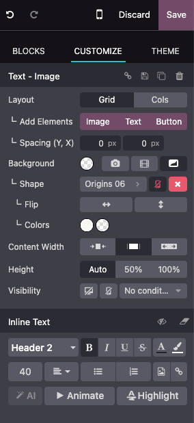

You can modify the background color and/or add an image, video as well as a shape to add some style
to your block. Once you’ve selected a shape, new rows appear allowing you to:

  - select the shape you like,
  - flip its sense (horizontally or vertically),
  - add a colour inside and/or on the shape contour,
  - remove a shape, a video or an image, by simply clicking on its icon.

.. tip::
   Position an element (image, text, etc.) behind or before another by using the above/below icons.

   .. image:: building_blocks/change-block-position.png
      :alt: Change block position

To make it bigger or smaller, click the dots around the block and adapt it to your liking.
Click save when you’re done.

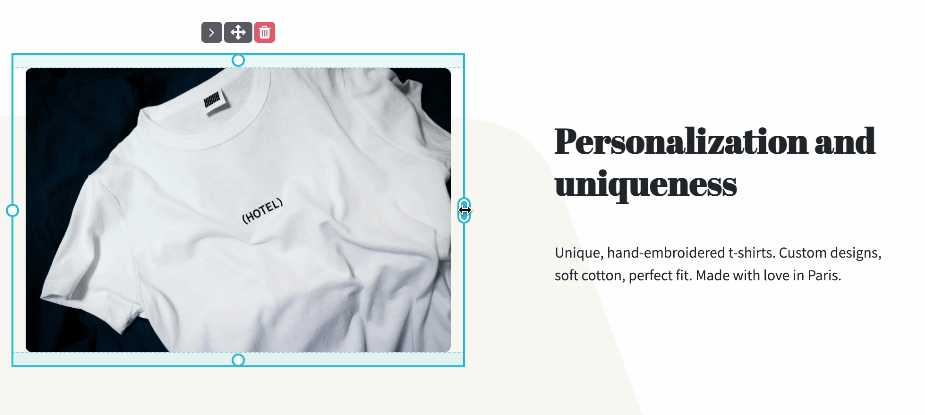

.. seealso::
   :doc:`Visibility <visibility>`

.. _building_blocks/grid:

Grid
----

The :guilabel:`Grid` layout allows you to reposition and resize elements, such as images or text, by
dragging and dropping them. Once you select :guilabel:`Grid`, a new row appears:
:guilabel:`Add Elements`, which allows you to add an Image, some Text, or a Button.

.. _building_blocks/cols:

Cols
----

Choosing the :guilabel:`Cols` layout allows you to determine the number of elements per line within
the block. To do so, select the block to modify, click the :guilabel:`Cols` :guilabel:`Layout`, and
adjust the number. You can edit the space around the column block by clicking on :guilabel:`Padding`.

By default, **on mobile devices**, one element is visible per line to ensure that content remains
easily readable and accessible on smaller screens. To adjust the value, click the :icon:`fa-mobile`
(:guilabel:`mobile icon`) at the top of the website editor and adapt the number of columns. Also,
if you selected a shape, this one will be hidden by default on mobiles too.

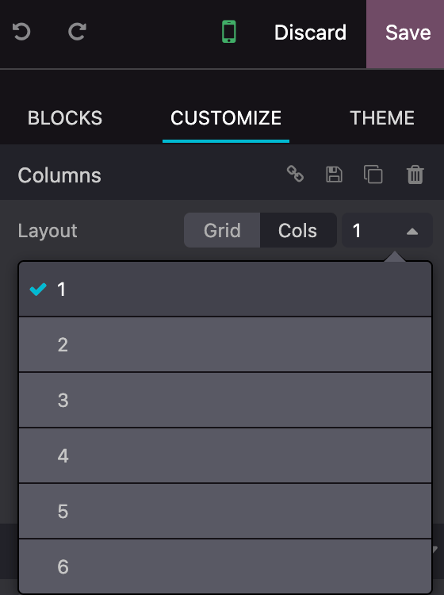

Duplicate a building block
==========================

You can duplicate a building block by clicking on the :icon:`fa-clone` duplicate icon. Once
duplicated, the new block appears on your website beneath the original one.

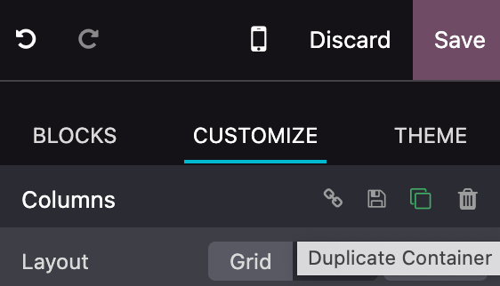

Save a custom building block
============================

You can save a customized building block and reuse it elsewhere. To do so, select it, navigate to
the :guilabel:`Customize` tab, and click the :icon:`fa-floppy-o` (:guilabel:`floppy disk`) icon to
save it.

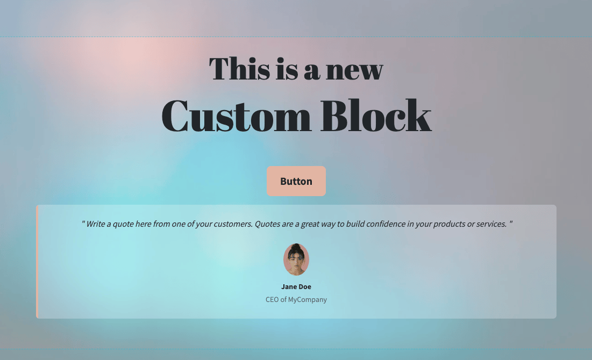

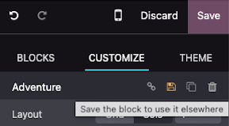

Click the :guilabel:`Save and reload` button on the pop-up to confirm saving your custom block.

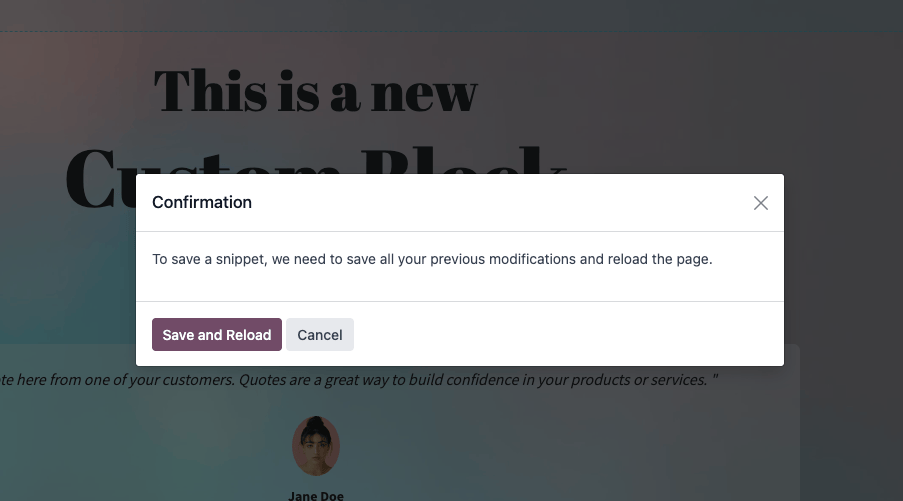

A new Custom category is now available, with your custom block on it. You can rename it
:icon:`fa-pencil` or delete it :icon:`fa-trash`.

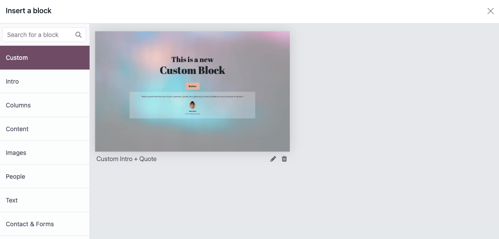

Saved building blocks are available in the :guilabel:`Custom` section of the :guilabel:`Blocks` tab.

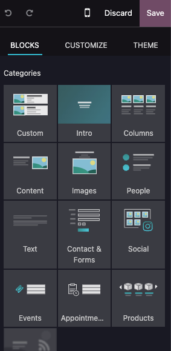

.. seealso::
   :doc:`Visibility <visibility>`

.. _building_blocks/inner_content:

Add Inner content
=================

The :guilabel:`Inner content` blocks allow you to add elements such as videos, images, social
media buttons, and so on, into pre-existing category blocks.

.. example::
   Add all your social media accounts in one place with the Inner content Social Media block.
   Simply :icon:`fa-toggle-on` or :icon:`fa-toggle-off` the desired platform and copy/paste your
   account URL.

   .. image:: building_blocks/social-media-inner-content.png
      :alt: Social Media inner content block

Add Dynamic content
===================

The :guilabel:`Dynamic Content`, such as :ref:`Form <website/dynamic_content/form>`,
:ref:`Products <building_blocks/products>`, :ref:`Embed Code <building_blocks/embed_code>`,
or :doc:`Blog Posts <../../blog>`, help you create interactive and visually appealing layouts for
your web :doc:`pages <../pages>`.

.. _website/building_blocks/form:

Form
----

The :guilabel:`Form` block is used to collect information from website visitors and create records
in your database.

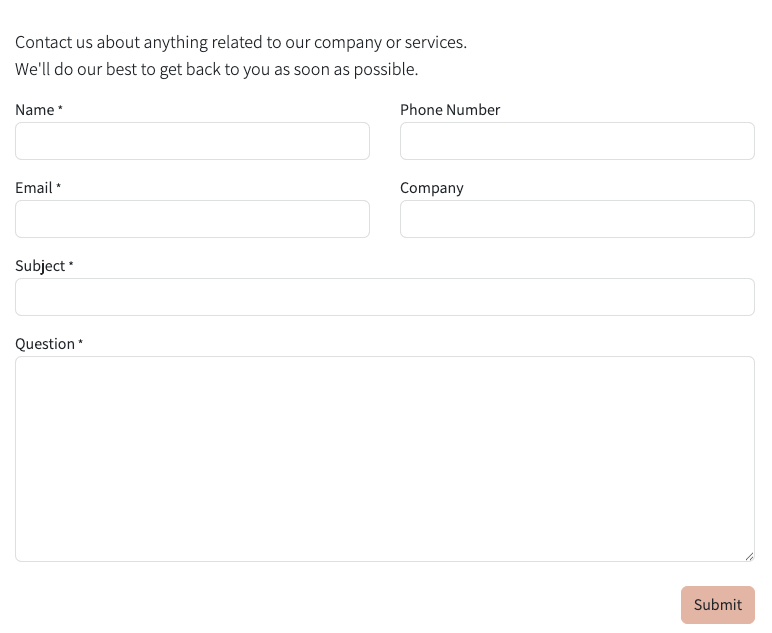

Action
------

By default, submitting the form **sends you an email** containing what the visitor entered.
Depending on the apps installed on your database, new actions that can automatically create records
become available:

- :guilabel:`Apply for a Job` (Recruitment)
- :guilabel:`Create a Customer` (eCommerce)
- :guilabel:`Create a Ticket` (Helpdesk)
- :guilabel:`Create an Opportunity` (CRM)
- :guilabel:`Subscribe to Newsletter` (Email Marketing)
- :guilabel:`Create a Task` (Project)

Select another action with the :guilabel:`Action` field found under the :guilabel:`Customize` tab's
:guilabel:`Form` section.

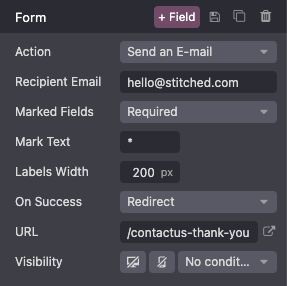

By default, actions redirect visitors to a *thank you* page after submitting the form. Use the
:guilabel:`URL` field to change where they are redirected. It is also possible to let visitors stay
on the form's page by selecting :guilabel:`Nothing` or :guilabel:`Show Message` under the
:guilabel:`On Success` field.

Fields
------

To add a new field to the form, click the :guilabel:`+ Field` button found next to the Customize
tab's :guilabel:`Form` or :guilabel:`Field` section. By default, new fields are *text* fields. To
change the type, use the :guilabel:`Type` field and select an option under the :guilabel:`Custom
Field` heading.

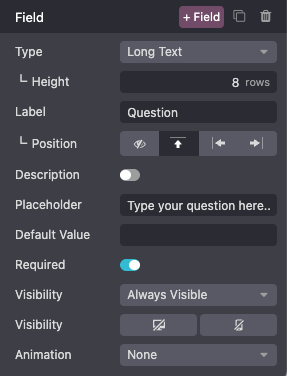

.. spoiler:: Click here to preview all field types

   .. image:: building_blocks/all-types-of-field.png
      :alt: All types of form fields

   Some fields are visually similar, but the data entered must follow a specific format.

It is also possible to select an :guilabel:`Existing Field` from a database and use the data it
contains. The fields available depend on the selected action.

.. tip::
   Property fields added to the database can also be used.

.. _website/building_blocks/products:

Products
--------

The :guilabel:`Products` block is available after installing the eCommerce app. It is used to
display a selection of products sold on your website.

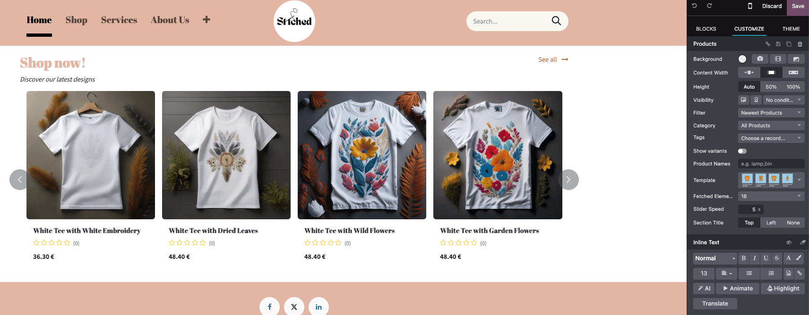

By default, the block displays the :guilabel:`Newest Products`. To change which products are shown,
go to the :guilabel:`Customize` tab's :guilabel:`Products` section and select as :guilabel:`Filter`
the :guilabel:`Recently Sold Products` or :guilabel:`Recently Viewed Products` option.

In addition, it is possible to display products from a single category only by selecting one with
the :guilabel:`Category` field.

.. _website/building_blocks/embed_code:

Embed code
----------

Embedding code allows you to integrate content from third-party services into a page, such as videos
from YouTube, maps from Google Maps, social media posts from Instagram, etc.

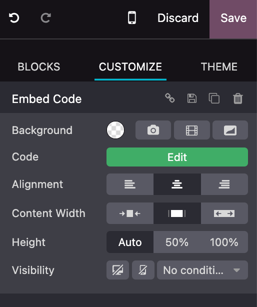

After adding the block to a page, click the :guilabel:`Edit` button found under the
:guilabel:`Customize` tab's :guilabel:`Embed Code` section and enter the code, replacing the code
used to show the block's instructions.
