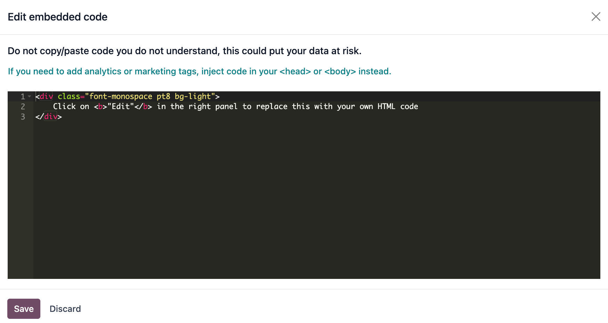

:show-content:

===============
Building blocks
===============

Design website pages by :ref:`dragging and dropping building blocks <website/building_blocks/add>`,
then :ref:`arrange <website/building_blocks/move_duplicate_delete>` and :ref:`edit
<website/building_blocks/edit>` them to fit your content and layout needs. It is also possible to
create :ref:`custom building blocks <website/building_blocks/custom>` or :ref:`anchor links
<website/building_blocks/anchor>`.

Building blocks can be added and customized using the website editor. To open it, go to the
relevant page and click :guilabel:`Edit` in the upper-right corner.

.. seealso::
   `Odoo Tutorial: Design your website: text and colors <https://www.odoo.com/slides/slide/design-your-website-text-and-colors-6930?fullscreen=1>`_

.. _website/building_blocks/add:

Add a building block
====================

To add a building block to a :doc:`website page <../structure/pages>`, access the page, then drag
and drop the desired building block from the :icon:`fa-plus` :guilabel:`Blocks` tab to the
appropriate location.

Two types of building blocks are available:

- Categorical building blocks provide templates for different content categories.
- :guilabel:`Inner Content` building blocks allow for adding elements, such as :ref:`videos
  <website/elements/videos>`, :ref:`images <website/elements/images>`, :ref:`buttons
  <website/elements/buttons>`, and more, to pre-existing categorical blocks as well as :doc:`headers
  and footers <../structure/header_footer>`.

When adding a categorical block, a pop-up window appears, allowing you to choose from multiple
templates for different categories. Once the block is placed, drag and drop :guilabel:`Inner
Content` blocks into it.

.. tip::
   Use the search bar in the :guilabel:`Insert a block` pop-up window to quickly find a specific
   block.

  .. image:: building_blocks/insert-a-block.png
      :alt: Pop-up block selection
      :scale: 75%

.. tip::
   Building blocks can also be added to the login page. To access it, navigate to the website's
   homepage, add `/web/login` to the URL, and press `Enter`.

.. note::
   Some building blocks require their corresponding application or module to be installed (e.g.,
   the **Appointments** app for the :guilabel:`Appointments` block).

.. example::
   Use the :guilabel:`Social Media` :guilabel:`Inner Content` building block to display links to
   your social media accounts. Toggle the desired platforms on or off, then enter the corresponding
   account URLs.

   .. image:: building_blocks/social-media-inner-content-block.png
      :alt: Social Media inner content block
      :scale: 75%

.. _website/building_blocks/embed_code:

Embed code
----------

Embedding code allows you to integrate content from third-party services, such as YouTube videos,
Google Maps, and Instagram posts.

After dragging and dropping the :guilabel:`Embed Code` block from the :guilabel:`Inner Content`
section onto a page, click the block, then go to the :guilabel:`Style` tab. Scroll down to the
:guilabel:`Embed Code` section, and, next to :guilabel:`Code`, click :guilabel:`Edit`. Replace the
placeholder code with the custom embed code.

.. warning::
   Only use embed code from sources you trust. Copying and pasting code you do not understand could
   put your data at risk.

.. _website/building_blocks/move_duplicate_delete:

Move, duplicate, or delete a building block
===========================================

To adjust the position and size of a building block, use the following options:

- Drag the turquoise borders on the block to increase or decrease the space at the top or bottom.
- Click the :icon:`fa-chevron-up` (:guilabel:`Move up`) or :icon:`fa-chevron-down` (:guilabel:`Move
  down`) icons to change the block's order.
- Click the :icon:`fa-arrows` (:guilabel:`Drag and move`) icon to move the block on the page.
- When a block contains multiple :ref:`columns <website/building_blocks/columns>`, move a column to
  the left or right by clicking :icon:`fa-chevron-left` (:guilabel:`Move left`) or
  :icon:`fa-chevron-right` (:guilabel:`Move right`).
- Click :icon:`fa-clone` (:guilabel:`Duplicate`) to create a copy of the block. The duplicate is
  added below the original.
- Click :icon:`fa-trash` (:guilabel:`Remove`) to delete the block.

  .. image:: building_blocks/padding-building-block.png
     :alt: Building block options to move, duplicate , or remove it.

.. tip::
   Alternatively, click the block, go to the :guilabel:`Style` tab, and click the :icon:`fa-clone`
   (:guilabel:`Duplicate this block`) or :icon:`fa-trash` (:guilabel:`Remove this block`) icon at
   the top of the tab.

.. example::
   To resize a block, click and drag the dots around its edges to adjust it as needed.

   .. image:: building_blocks/adapt-block-size.png
      :alt: Adapt block size
      :scale: 80%

.. _website/building_blocks/edit:

Edit a building block
=====================

To customize a building block, click it and go to the :guilabel:`Style` tab. Available
customization options vary depending on the type of block selected. Most blocks provide options to
customize the :ref:`background <website/building_blocks/background>`, :ref:`layout
<website/building_blocks/layout>`, and :ref:`content dimensions
<website/building_blocks/content-layout>`.

.. seealso::
   - :doc:`Web design elements <elements>`
   - :doc:`Visibility <visibility>`
   - :doc:`General theme <themes>`

.. _website/building_blocks/background:

Background
----------

To customize the background of a building block, click the color dot or another
:guilabel:`Background` option. Depending on the selected option, you can change the background
:ref:`color <website/themes/theme-colors>` and/or add an :ref:`image <website/elements/images>`,
:ref:`video <website/elements/videos>`, and/or shape. After selecting an option, additional options
are available to customize it.

.. tip::
   In the :ref:`Grid <website/building_blocks/grid>` layout, use the :guilabel:`Send to back` or
   :guilabel:`Bring to front` icons to position elements, such as images and text, behind or in
   front of other elements.

   .. image:: building_blocks/change-block-position.png
      :alt: Move a building block to the back or front.
      :scale: 80%

.. _website/building_blocks/layout:

Layout
------

Most building blocks support two layout styles: :ref:`grid <website/building_blocks/grid>` and
:ref:`column <website/building_blocks/columns>`. To change the default layout, click the block, go
to the :guilabel:`Style` tab, and set the :guilabel:`Layout` field to :guilabel:`Grid` or
:guilabel:`Column`.

.. _website/building_blocks/grid:

Grid
~~~~

The :guilabel:`Grid` layout allows you to reposition and resize elements by dragging and dropping
them. Once this layout type is selected, additional options are available to :guilabel:`Add
Elements` by clicking :guilabel:`Image`, :guilabel:`Text`, or :guilabel:`Button`. Adjust their
position and size using the :guilabel:`Spacing (Y, X)` options.

.. _website/building_blocks/columns:

Column
~~~~~~

The :guilabel:`Column` layout allows you to specify the number of elements per line in the block.
To do so, select the block to modify, click the dropdown next to the :guilabel:`Column` field, and
adjust the number. You can then modify a specific column's settings using the options in the
:guilabel:`Column` section of the :guilabel:`Style` tab.

.. note::
   By default, :doc:`on mobile devices <visibility>`, only one element (column) is visible per line
   to ensure that content remains easy to read and accessible on smaller screens. To adjust this
   value, click the :icon:`fa-mobile` (:guilabel:`Mobile Preview`) at the top of the website
   editor and adapt the number of columns. Shapes are hidden by default on mobile devices.

.. _website/building_blocks/content-layout:

Content dimensions
------------------

To adjust the content dimensions of a building block:

- Use the :guilabel:`Content Width` options to make the content fill the entire width of the page or
  add spacing around it.
- Set the :guilabel:`Auto` :guilabel:`Height` to :guilabel:`50%` or :guilabel:`100%`.

.. _website/building_blocks/custom:

Save a custom building block
============================

Save a customized building block to reuse on other pages. To do so, select it, navigate to
the :guilabel:`Style` tab, and click the :icon:`fa-floppy-o` (:guilabel:`Save this block to use it
elsewhere`) icon. Click the :guilabel:`Save` button in the pop-up window to confirm.

To add a saved building block to the page, navigate to the :icon:`fa-plus` :guilabel:`Blocks` tab
and drag and drop the :guilabel:`Custom` categorical block. In the pop-up window that opens, click
the desired block in the :guilabel:`Custom` category.

.. tip::
   In the :guilabel:`Insert a block` pop-up window, click :icon:`fa-pencil` (:guilabel:`edit`) to
   rename the custom block or :icon:`fa-trash` (:guilabel:`remove`) to delete it.

.. _website/building_blocks/anchor:

Create an anchor link
=====================

Anchor links are hyperlinks that direct users to a specific section of a page. To create an anchor
link for a block, follow these steps:

#. Click :guilabel:`Edit` and select the block you want to link to.
#. At the top of the :guilabel:`Style` tab, click :icon:`fa-link` (:guilabel:`Create and copy a link
   targeting this block or edit it`).
#. To edit the default anchor name, click :guilabel:`Edit` in the green pop-up message that opens in
   the upper-right corner.
#. Replace the anchor name and click :guilabel:`Save & Copy`.

Once the anchor is saved, you can :ref:`link to it <website/elements/links>` from anywhere on your
website.

.. toctree::
   :titlesonly:

   building_blocks/forms
