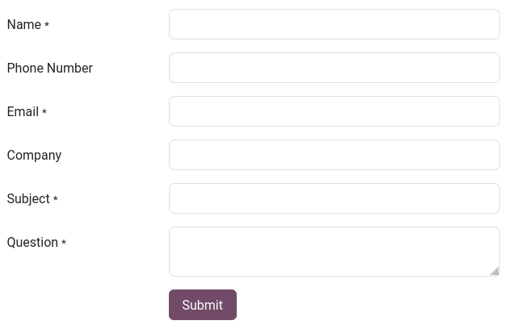
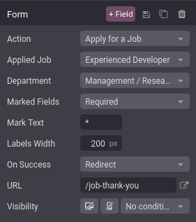
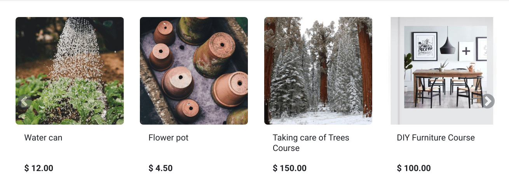
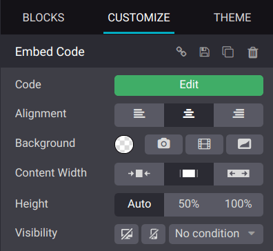

===============
Dynamic content
===============

The :guilabel:`Dynamic Content` building blocks, such as :ref:`Form <dynamic_content/form>`,
:ref:`Products <dynamic_content/products>`, :ref:`Embed Code <dynamic_content/embed_code>`, or
:doc:`Blog Posts <../../../blog>`, help you create interactive and visually appealing layouts for
your web pages.

.. note::
   To add a building block, click :guilabel:`Edit`, select the desired building block under the
   :guilabel:`Blocks` tab, and drag and drop it onto the page. To access its settings, click it and
   go to the :guilabel:`Customize` tab, where the available options depend on the type of block
   selected.

.. _dynamic_content/form:

Form
====

The :guilabel:`Form` block is used to collect information from website visitors and create records
in your database.

Action
------

By default, submitting the form **sends you an email** containing what the visitor entered.
Depending on the apps installed on your database, new actions that can automatically create records
become available:

- :guilabel:`Apply for a Job` (Recruitment)
- :guilabel:`Create a Customer` (eCommerce)
- :guilabel:`Create a Ticket` (Helpdesk)
- :guilabel:`Create an Opportunity` (CRM)
- :guilabel:`Subscribe to Newsletter` (Email Marketing)
- :guilabel:`Create a Task` (Project)

Select another action with the :guilabel:`Action` field found under the :guilabel:`Customize` tab's
:guilabel:`Form` section.

By default, actions redirect visitors to a *thank you* page after submitting the form. Use the
:guilabel:`URL` field to change where they are redirected. It is also possible to let visitors stay
on the form's page by selecting :guilabel:`Nothing` or :guilabel:`Show Message` under the
:guilabel:`On Success` field.

Fields
------

To add a new field to the form, click the :guilabel:`+ Field` button found next to the Customize
tab's :guilabel:`Form` or :guilabel:`Field` section. By default, new fields are *text* fields. To
change the type, use the :guilabel:`Type` field and select an option under the :guilabel:`Custom
Field` heading.

.. spoiler:: Click here to preview all field types

   .. image:: dynamic_content/form-field-types.png
      :alt: All types of form fields

   Some fields are visually similar, but the data entered must follow a specific format.

It is also possible to select an :guilabel:`Existing Field` from a database and use the data it
contains. The fields available depend on the selected action.

.. tip::
   Property fields added to the database can also be used.

.. _dynamic_content/products:

Products
========

The :guilabel:`Products` block is available after installing the eCommerce app. It is used to
display a selection of products sold on your website.

By default, the block displays the :guilabel:`Newest Products`. To change which products are shown,
go to the :guilabel:`Customize` tab's :guilabel:`Products` section and select as :guilabel:`Filter`
the :guilabel:`Recently Sold Products` or :guilabel:`Recently Viewed Products` option.

In addition, it is possible to display products from a single category only by selecting one with
the :guilabel:`Category` field.

.. _dynamic_content/embed_code:

Embed code
==========

Embedding code allows you to integrate content from third-party services into a page, such as videos
from YouTube, maps from Google Maps, social media posts from Instagram, etc.

After adding the block to a page, click the :guilabel:`Edit` button found under the
:guilabel:`Customize` tab's :guilabel:`Embed Code` section and enter the code, replacing the code
used to show the block's instructions.
