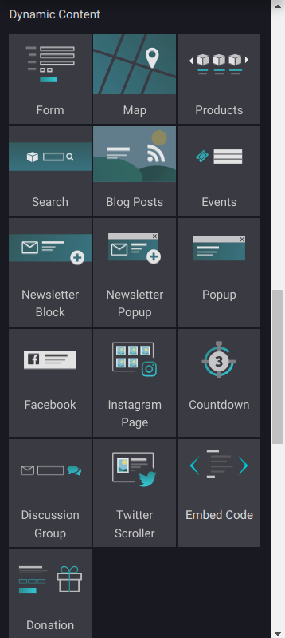
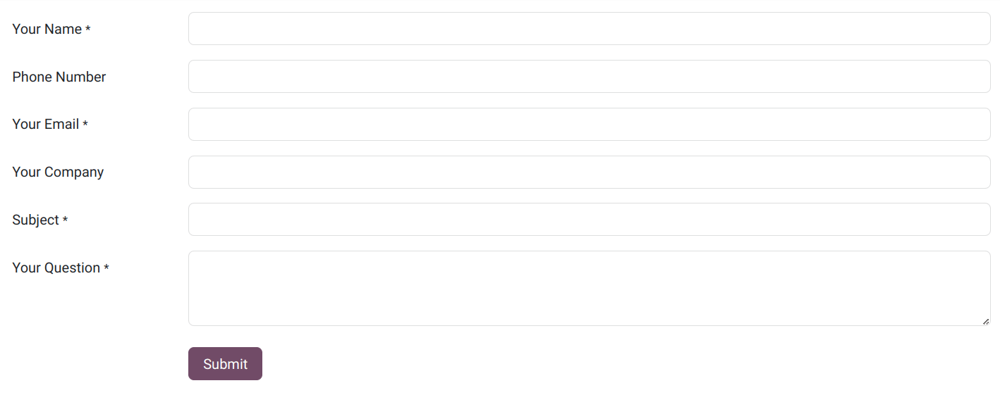
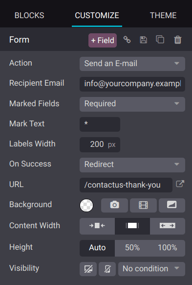

===============================
Dynamic content building blocks
===============================

The :guilabel:`Dynamic Content` blocks, such as :ref:`Form <dynamic_content/form>`,
:ref:`Products <dynamic_content/products>`, :ref:`Embed Code <dynamic_content/embed_code>`, or
:doc:`Blog Posts <../../../blog>`, offer animated and customizable building blocks to help you
create interactive and visually appealing layouts for your web pages. They are integrated with other
applications like :doc:`eCommerce <../../../ecommerce>`, enhancing the functionality of your
website.

To add a :guilabel:`Dynamic Content` block to your website, drag and drop it from the website
builder onto your page. Next, click on the block and go to the :guilabel:`Customize` tab to access
its settings.

.. seealso::
   :doc:`Building blocks <../building_blocks>`

.. _dynamic_content/form:

Form
====

You can use the :guilabel:`Form` block to collect information regarding a specific topic from your
website visitors.

Go to the :guilabel:`Customize` tab to edit the fields added by default.

You can set an :guilabel:`Action` that is triggered when the form is submitted, such as
:guilabel:`Create a customer` or :guilabel:`Send an E-mail` to the address indicated in the
:guilabel:`Recipient Email` field.

Go to the :guilabel:`On Success` dropdown to decide what happens once the form is validated. Select
:guilabel:`Nothing` if you want the user to stay on the current page, :guilabel:`Redirect` to send
them to a different page, or :guilabel:`Show Message` to display a message upon validation.

To add a new field to the form, click the :guilabel:`+ Field` button. In the :guilabel:`Field`
section that appears in the configurator, go to :guilabel:`Type` and select a
:guilabel:`Custom Field`, or scroll down to choose an :guilabel:`Existing Field`.

.. image::dynamic_content/add_new_field.png
   :alt: Select an existing field type from the dropdown list, or enter a label in the custom field.

.. note::
   If you select an :guilabel:`Existing Field`, the information entered by the user is automatically
   added to the related place in the backend; if you choose a :guilabel:`Custom Field`, the info
   entered by the user will be logged as a note in the customer's chatter.

.. _dynamic_content/products:

Products
========

The :guilabel:`Products` dynamic content block is available when you have an
:doc:`eCommerce <../../../ecommerce>` and can be used to display the products you sell on your
website.

Select the block and go to the :guilabel:`Customize` tab to access the available features. For
example, go to :guilabel:`Filter` to decide whether the :guilabel:`Newest Products`,
:guilabel:`Recently Sold Products`, or :guilabel:`Recently Viewed Products` are displayed.

.. image:: dynamic_content/products_block.png
   :alt: The products block.

.. _dynamic_content/embed_code:

Embed Code
==========

Embedding code into your website allows you to integrate third-party services and functionalities
seamlessly. For example, you can embed videos from YouTube, maps from Google Maps, images from
Flickr, audio from Soundcloud, or Instagram social media posts. By injecting HTML code into
your website, you enhance user experience, thereby enriching overall engagement.

Drag and drop the :guilabel:`Embed Code` building block to your page, go to the :guilabel:`Customize`
tab, and click :guilabel:`Edit` to insert the code you want to embed.

.. image:: dynamic_content/embed_code.png
   :alt: Add the link to the embedded code you want to point to

.. tip::
   You can find embed codes for various types of content by looking for a "Share" or "Embed" option
   provided by the hosting platform, typically located close to the content itself.
