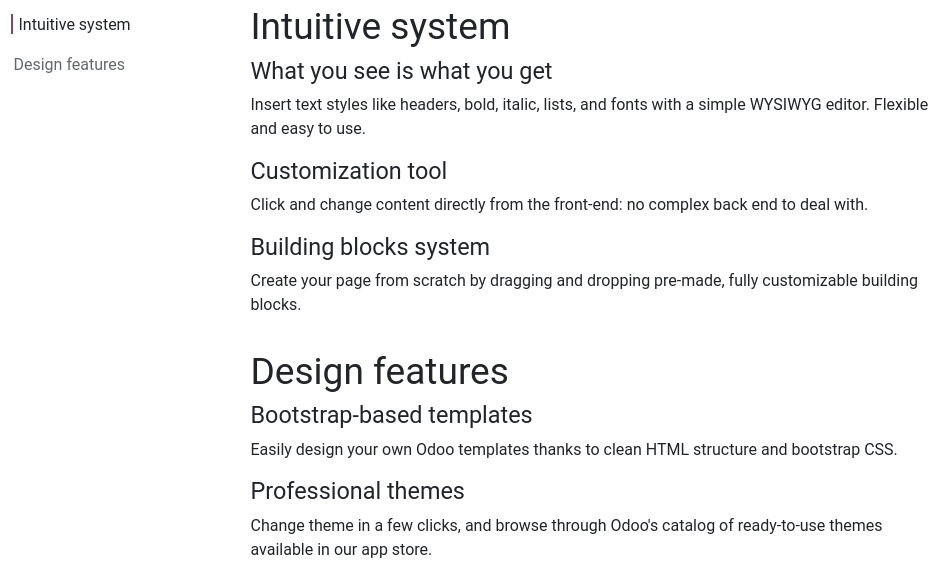

========
Features
========

The :guilabel:`Features` :doc:`building blocks <../building_blocks>` allow you to list multiple
items next to each other.

The :ref:`Table of Content <features/table_of_content>` and the :ref:`Call to Action
<features/call_to_action>` blocks are presented below.

.. note::
   To add a building block, click :guilabel:`Edit`, select the desired building block under the
   :guilabel:`Blocks` tab, and drag and drop it onto the page. To access its settings, click it and
   go to the :guilabel:`Customize` tab, where the available options depend on the type of block
   selected.

.. _features/table_of_content:

Table of content
================

The :guilabel:`Table of Content` block is used to list many different items grouped under several
headings. A clickable index is available to navigate quickly between the different categories.

.. _features/call_to_action:

Call to action
==============

The :guilabel:`Call to Action` block is used to prompt visitors to take a specific action, such
as signing up for a newsletter or contacting you.

To change the button's link, select it, go to the :guilabel:`Customize` tab's :guilabel:`Inline
Text` section and replace `/contactus` with another URL.
