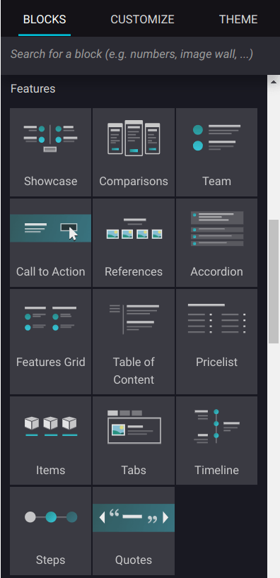
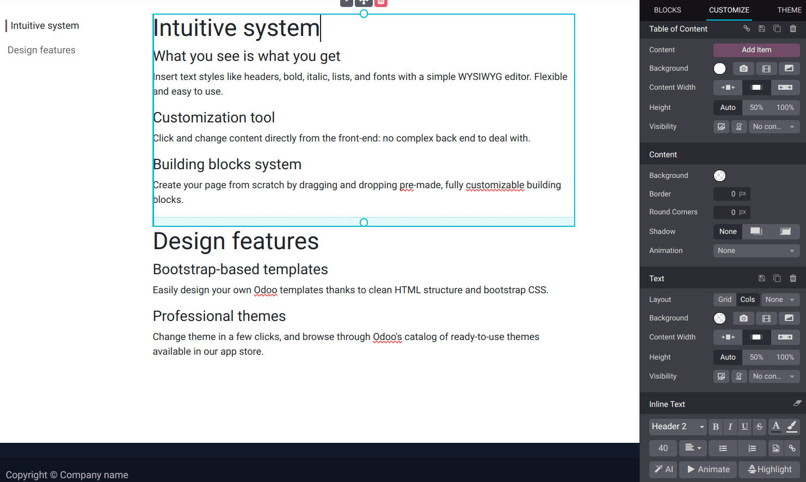

===============
Features blocks
===============

Use the :guilabel:`Features` blocks to add advanced functionalities to your website, such as
describing the attributes of a product or service. The blocks from this category allow you to
present the content of your website in an illustrative method rather than sticking to the textual
content. For example, there is the :guilabel:`Table of content` building block, which is described
:ref:`below <features_blocks/table_of_content>`.

.. seealso::
   :doc:`Building blocks <../building_blocks>`

.. _features_blocks/table_of_content:

Table of content
================

You can add a :guilabel:`Table of content` building block to your website by dragging and dropping
it from the :guilabel:`Features` blocks section in the website configurator.

Once added, you can customize the appearance and functionality of the table of contents.

Header 2 titles automatically appear on the left of your page, helping users navigate your content
more efficiently.

