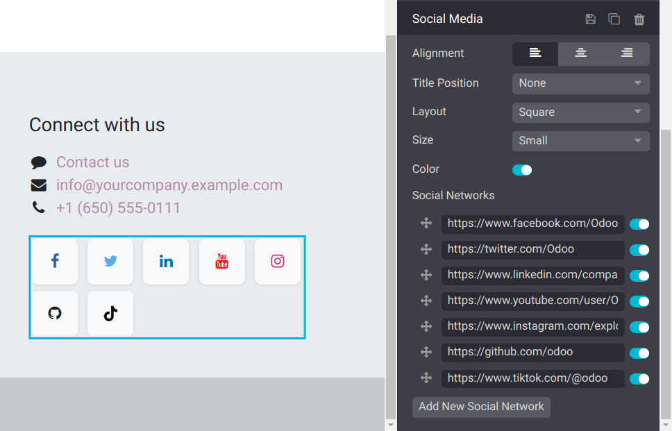

=============
Inner content
=============

The :guilabel:`Inner content` :doc:`building blocks <../building_blocks>` allow you to add elements
such as videos, images, and :ref:`social media buttons <inner_content/social_media>`, into
pre-existing blocks.

.. note::
   To add a building block, click :guilabel:`Edit`, select the desired building block under the
   :guilabel:`Blocks` tab, and drag and drop it onto the page. To access its settings, click it and
   go to the :guilabel:`Customize` tab, where the available options depend on the type of block
   selected.

.. _inner_content/social_media:

Social media
============

The :guilabel:`Social Media` block inserts clickable buttons leading to your social network's URL.
By default, the buttons display the icons of seven major social networks. You can click
:guilabel:`Add New Social Network` to create a new button and switch the buttons next to a URL to
turn them on or off.

.. Note::

   You cannot edit the default icons but can edit the ones you added by clicking
   :guilabel:`Add New Social Network`. To do so, select the icon, then click the
   :guilabel:`Replace` button found under the :guilabel:`Customize` tab's :guilabel:`Icon` section,
   and either select one of the available icons or click the :guilabel:`Images` tab and upload an
   image or add its URL.
