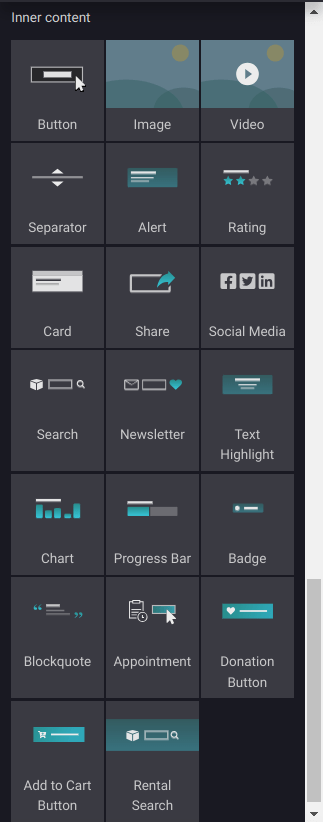
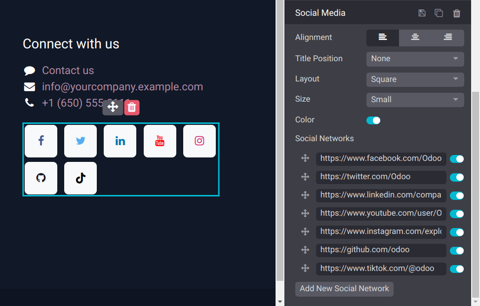

=============================
Inner content building blocks
=============================

You can use the :guilabel:`Inner content` building blocks, such as the :guilabel:`Button`,
:guilabel:`Image`, :guilabel:`Video`, or  :ref:`Social Media <inner_content_blocks/social_media>`
blocks, to enhance your website's view by providing a structure and design for the content available
on your web pages. Select a block from the :guilabel:`Inner content` section in the
:guilabel:`Blocks` tab of the website builder, and drag and drop it onto your web page.

.. seealso::
  :doc:`Building blocks <../building_blocks>`

.. _inner_content_blocks/social_media:

Social Media block
------------------

Displaying your company's social media on your website is a good manner to grow brand awareness and
improve :doc:`SEO <../../../website/pages/seo>`.

Select the :guilabel:`Social Media` building block from the :guilabel:`Inner content` section and
drag and drop it anywhere on your website, including in existing building blocks.

Once added to your web page, select the :guilabel:`Social Media` block, go to the
:guilabel:`Customize` tab, and go to the :guilabel:`Social Media` section to edit it.

.. tip::
  Use the :guilabel:`Share` building block to invite visitors to promote your content on their
  social media.
