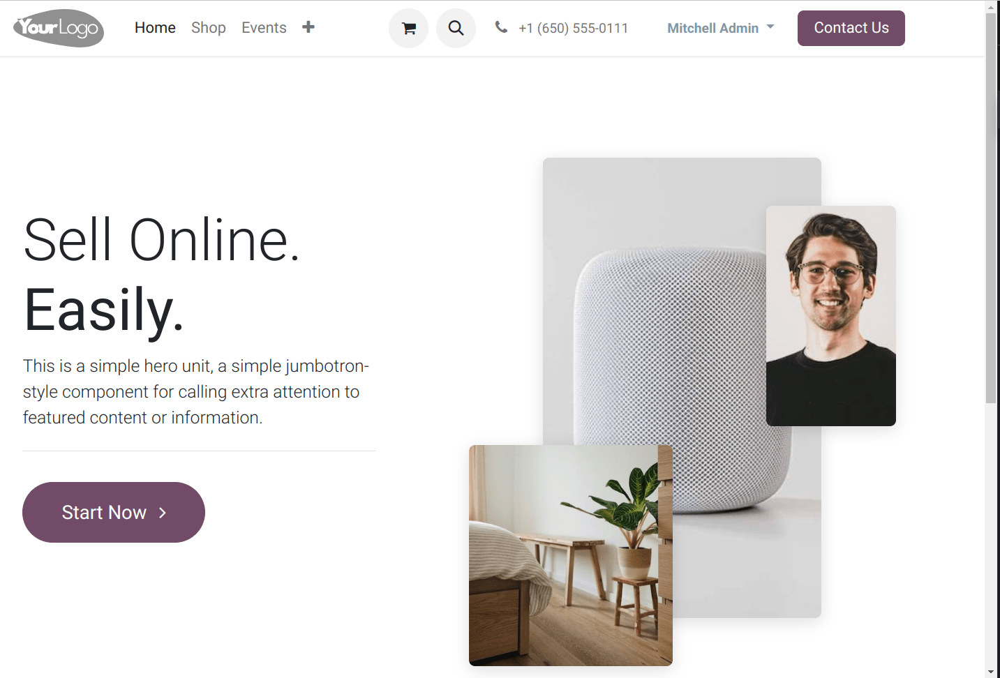
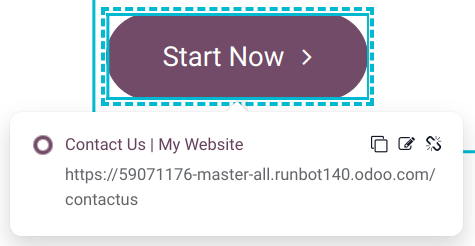
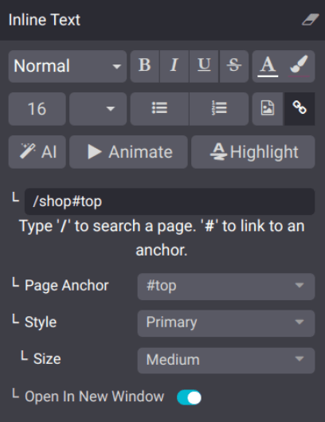
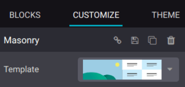

=========
Structure
=========

The website configurator provides a range of :guilabel:`Structure` :doc:`building blocks
<../building_blocks>` to design your website's layout, including headings, images, and text.

Below are presented two types of structure blocks: :ref:`Banner <structure/banner>` and
:ref:`Masonry <structure/masonry>`.

.. note::
   To add a building block, click :guilabel:`Edit`, select the desired building block under the
   :guilabel:`Blocks` tab, and drag and drop it onto the page. To access its settings, click it and
   go to the :guilabel:`Customize` tab, where the available options depend on the type of block
   selected.

.. _structure/banner:

Banner
------

The :guilabel:`Banner` block combines a title, text, images, and a call to action button, making it
suitable for placement at the top of a website.

Call to action
~~~~~~~~~~~~~~

The call to action button encourages visitors to take a specific action, for example, consulting
your shop, downloading a file, or making an appointment.

To change the button's link, select it and click the :guilabel:`Edit Link` icon. Additional
customization options are available in the :guilabel:`Inline Text` section.

.. _structure/masonry:

Masonry
-------

The :guilabel:`Masonry` block offers a range of templates that associate image and text bricks. To
change the default template, go to the :guilabel:`Customize` tab, click :guilabel:`Template` and
select one.

.. tip::
   The :guilabel:`Masonry` block allows you to add text on top of images. To do so, go to the
   :guilabel:`Customize` tab, scroll to :guilabel:`Add Elements`, and click :guilabel:`Text`.

   .. image:: structure/masonry-text-box.png
      :alt: Adding text on top of an image
