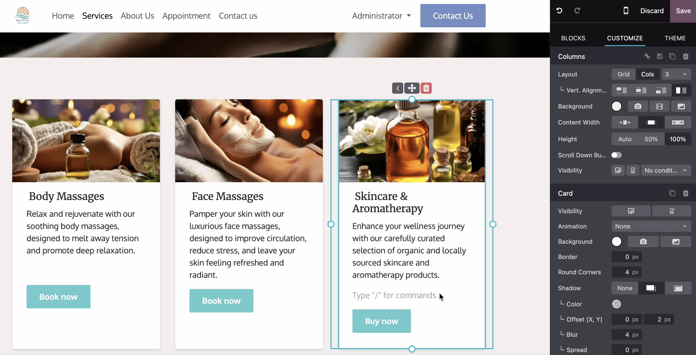

========
Elements
========

Elements help structure and present content effectively. They range from text-based components like
:ref:`titles <website/elements/titles>` and :ref:`lists <website/elements/lists>` to interactive
ones such as :ref:`buttons <website/elements/buttons>` and :ref:`links <website/elements/links>`.
Visual elements like :ref:`images <website/elements/images>`, :ref:`icons <website/elements/icons>`,
:ref:`videos <website/elements/videos>`, and :ref:`animations <website/elements/animations>` can
also be added to improve content presentation and organization.

To add or modify a website element:

#. Navigate to the relevant website page and click on :guilabel:`Edit`.
#. Click the section on the page where you want to add or modify an element.
#. Make the necessary changes.
#. Click on :guilabel:`Save`.

.. note::
   The default styles for headings, buttons, links, and paragraph text, for example, are defined in
   the :doc:`Theme tab <themes>` of the website editor.

.. _website/elements/titles:

Titles
======

Titles define headings and organize website content into different levels for clarity and structure.
To insert a title, type `/title`, choose the heading style (:guilabel:`Heading 1`,
:guilabel:`Heading 2`, or :guilabel:`Heading 3`), and type the text.

.. tip::
  Alternatively, type the text, select it, and choose the appropriate style from the
  :guilabel:`Inline Text` section in the :guilabel:`Customize` tab of the website editor. Additional
  formatting options, such as fonts and colors, are also available in this section.

.. _website/elements/buttons:

Buttons
=======

Buttons are interactive elements that allow to link to another page or to a page anchor. To insert a
button:

#. Type `/button`.
#. Enter the button's label in the :guilabel:`Link Label` field.
#. Add the :guilabel:`URL or Email`. Type `/` to search for a page and `#` to link to an anchor.
#. Set the :guilabel:`Style`, :guilabel:`Size`, and :guilabel:`Layout` to
   define the button's appearance.
#. If needed, toggle the switch to open the linked page or anchor in a new tab.
#. Click :guilabel:`Apply` to save changes.

.. tip::
   To modify an existing button, click the button and edit the options in the
   :guilabel:`Inline text` section of the website editor.

.. _website/elements/images:

Images
======

To insert an image:

#. Type `/image`.
#. :doc:`Search the Unsplash database </applications/general/integrations/unsplash>` or click
   :guilabel:`Upload an image` to choose a file from your local images.
#. Click :guilabel:`Add`.
#. To customize the image, click on the image and edit the options in the :guilabel:`Image`
   section of the website editor. For example:

   -  :guilabel:`Replace` the image.
   -  Define an `alt tag <https://help.siteimprove.com/support/solutions/articles/80000448480-where-are-alt-tags- used-and-why-are-they-important>`_
      in the :guilabel:`Description` field.
   -  Enter a title tag in the :guilabel:`Tooltip` field. This text will appear when visitors hover
      their mouse over the image.
   -  Add a :guilabel:`Shape`; some shapes also allow for color customization.
   -  Adjust the image's :guilabel:`Width`, e.g., to improve performance. A smaller size may be
      suggested if it is sufficient for display.
   -  Resize the image using the :guilabel:`Transform` tool.
   -  Adjust the :guilabel:`Padding` to add space (in pixels) around the image.
   -  Etc.

.. _website/elements/videos:

Videos
======

To add a video, type `/video`, insert the URL, and turn on the desired options:

- :guilabel:`Autoplay`: to automatically play the video when the page is accessed. The video is
  automatically muted by default.
- :guilabel:`Loop`: to play the video on a loop.
- :guilabel:`Hide player controls`
- :guilabel:`Hide fullscreen button`

.. _website/elements/icons:

Icons
=====

To insert an icon, type `/image`, go to the :guilabel:`Icons` tab, select an icon, and click
:guilabel:`Add`. To modify an icon, click on it and use the :guilabel:`Icon` section of the website
editor to customize options, such as :guilabel:`Color`, :guilabel:`Size`, :ref:`Animations
<website/elements/animations>`, :guilabel:`Shape`, etc.

.. _website/elements/links:

Links
=====

Links are used to connect different pages and resources, guiding visitors and improving navigation.
To add a link, type `/link`, then, in the pop-up that opens, enter the link's :guilabel:`Label` and
add the :guilabel:`URL or Email`. Type `/` to search for a page and `#` to link to an anchor.

.. tip::
   By default, the :guilabel:`Style` field is set to :guilabel:`Link`. Select a different style to
   transform the link into a :ref:`button <website/elements/buttons>`.

.. _website/elements/lists:

Lists
=====

Lists help organize content clearly, making information easier to read and improving web pages'
structures. Type `/list` and choose from three different types of lists: :guilabel:`Bulleted lists`,
:guilabel:`Numbered lists`, or :guilabel:`Checklists`.

.. _website/elements/animations:

Animations
==========

Animations are used to add movement to :doc:`building blocks <building_blocks>` and website
elements such as images and text. Three types of animation are available: :guilabel:`On Scroll`,
:guilabel:`On Appearance`, and :guilabel:`On Hover` (for images only).

To add an animation to a website element:

#. Click on the element.
#. In the website editor, go to the relevant section for the element (e.g., :guilabel:`Button`,
   :guilabel:`Column`, :guilabel:`Inline Text`, etc.).
#. In the :guilabel:`Animation` field, select the desired animation type.
#. Customize the animation settings as needed. Available options vary based on the selected
   animation type.

Animations on scroll
--------------------

For animations on scroll, it is possible to:

 - Choose :guilabel:`In` to add the animation when the element enters the screen and :guilabel:`Out`
   to add it when it leaves the screen.
 - Select an :guilabel:`Effect`.
 - Choose the :guilabel:`Direction` of the effect.
 - Adapt the :guilabel:`Intensity` of the effect.
 - Define the :guilabel:`Scroll Zone`, where the first value represents the percentage of the screen
   shown when the effect starts, and the second value represents its percentage at the end.

Animations on appearance
------------------------

For animations on appearance, it is possible to:

 - Choose among different effects.
 - Choose the :guilabel:`Direction` of the effect.
 - Pick a :guilabel:`Trigger` option to define when the animation occurs: either the
   :guilabel:`First Time only` or :guilabel:`Every Time`.
 - Adapt the :guilabel:`Intensity` of the effect.
 - If you want the animation to be triggered after a number of seconds, define this number in the
   :guilabel:`Start After` field.
 - Choose a :guilabel:`Duration` for the animation.

Animations on hover (for images only)
-------------------------------------

Animations :guilabel:`On hover` can be added to :ref:`images <website/elements/images>`. You can
choose the :guilabel:`Effect` of the animation, as well as the :guilabel:`Color` and the
:guilabel:`Stroke Width`.

.. seealso::
   :doc:`Odoo HTML editor </applications/essentials/html_editor>`
