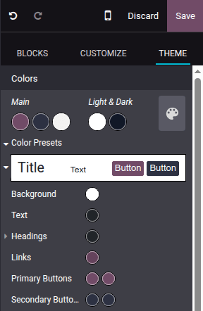
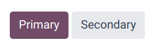

=============
General theme
=============

Odoo offers various options to shape your website’s theme, including its
:ref:`colors <website/themes/colors>`, :ref:`fonts <website/themes/fonts>`, and
:ref:`layout <website/themes/page-layouts>`.

When setting up your website for the first time, you are prompted to select a theme. Hover your
mouse over the themes to see an extended preview of each one. Click on a theme to select it.

.. note::
   - If you leave without selecting a theme, your website is created using the default one.
   - You can :ref:`switch themes later <website/themes/switch>` if needed.

In the website builder, the :guilabel:`Theme` tab offers various options to customize your website's
general theme. To access it, click :guilabel:`Edit` and go to the :guilabel:`Theme` tab.

Once you have made the desired changes, click on :guilabel:`Save` to confirm and apply them to your
website.

.. _website/themes/switch:

Theme
=====

In the :guilabel:`Website` section, click on :guilabel:`Switch Theme` to open the theme selector.
Hover your mouse over the themes to see an extended preview of each one. Click on a theme to apply
it to your website.

.. _website/themes/colors:

Colors
======

Odoo's website editor features two main types of colors: :ref:`theme colors <website/themes/theme-colors>`
and :ref:`status colors <website/themes/status-colors>`.

.. _website/themes/theme-colors:

Theme colors
------------

Theme colors refer to the set of colors displayed across all pages of your website. These are made
of five colors: three main colors and two light and dark colors.

To edit your website's colors, go to the :guilabel:`Colors` section in the website editor, then:

- Click on the color dot you want to change, then select a :guilabel:`Solid` color or click on
  :guilabel:`Custom` to pick a specific color tone manually (or add its #HEX or RGBA code).
- Click on the paint palette icon and choose a color palette. As a result, all color customizations
  are reset; click a color dot to change a specific color.

Odoo automatically creates :guilabel:`Color Presets` for your chosen palette. These are predefined
color combinations applied to different elements of your website to provide a structured and
visually appealing design. When you select a color palette, its presets define how those colors are
distributed across different elements from a building block, such as buttons, backgrounds, and text.
If you want to modify them, click on :guilabel:`Color Presets` and click on a preset to customize it
further. Each color preset contains colors for your building block’s background, text, headings,
links, primary buttons, and secondary buttons.

To apply a color preset to a building block on your site, select the building block, go to the
:guilabel:`Customize` tab, click the color dot located next to :guilabel:`Background`, and choose a
:guilabel:`Theme`.

.. note::
   Changing a color preset automatically updates the colors of both the default preset and the
   building blocks where the preset is used.

.. _website/themes/status-colors:

Status colors
-------------

Status colors are used to indicate the status of certain actions (e.g., :guilabel:`Success`,
:guilabel:`Warning`, etc.). They're used in pop-up messages that appear to provide feedback to
users and website visitors. To customize your website's :guilabel:`Status Colors`, scroll down to
the :guilabel:`Advanced` section and click on the dots to change their color.

.. example::
   .. image:: themes/advanced.png
      :alt: Status color selection

   .. image:: themes/success.png
      :alt: Success pop-up

.. _website/themes/page-layouts:

Page layout
===========

The :guilabel:`Page layout` option in the :guilabel:`Website` section allows you to change the
overall display and spacing of building blocks and website elements on pages. Click the dropdown
menu and select the desired layout. Under :guilabel:`Page Layout`, customize your
:guilabel:`Background` by choosing an :guilabel:`Image`, using a selected image in a
:guilabel:`Pattern`, or leaving it blank.

.. _website/themes/fonts:

Fonts
=====

Odoo allows you to customize the font family and size for specific elements on your website,
including paragraphs, headings, buttons, and input fields.

- :guilabel:`Font Family`: In the :guilabel:`Paragraph`, :guilabel:`Headings`, and
  :guilabel:`Button` sections, select a font from the dropdown menu.

- :guilabel:`Font Size`: In the :guilabel:`Paragraph`, :guilabel:`Headings`, :guilabel:`Button`, and
  :guilabel:`Input Fields` sections, use the :guilabel:`Font Size` field to set a default size.
  Click the :icon:`fa-caret-right` (arrow) icon to expand the section and define custom sizes
  (e.g., based on the heading level, button size, etc.).

Additionally, each element-specific section offers extra styling options, such as
:guilabel:`Line Height` and :guilabel:`Margins`, for further customization.

Custom fonts
------------

It is possible to use fonts on your website that are not offered by default in Odoo. To add a custom
font, click the dropdown menu related to the :guilabel:`Font Family` field and select :guilabel:`Add
a Custom Font` at the bottom of the dropdown menu. In the pop-up window:

- To add a Google font, click on :guilabel:`Select a Google Font` and click on the desired font
  in the list. Toggle off the :guilabel:`Serve font from Google servers` if your website is operated
  from a location where regulations require compliance with laws such as, but not limited to, the
  European Union's GDPR. This will ensure that the Google Font is stored on your website's server
  instead of Google's.
- To upload a custom font from your computer, click on :guilabel:`Choose File`.

Once done, click on :guilabel:`Save and Reload`.

Button styles
=============

To customize the style of your website's primary and secondary buttons, navigate to the
:guilabel:`Button` section in the website editor and edit the relevant options:

- Click the arrow next to the :guilabel:`Primary Style` or :guilabel:`Secondary Style` fields and
  select one of the available styles for each type of button: :guilabel:`Fill`, :guilabel:`Outline`,
  or :guilabel:`Flat`. When selecting :guilabel:`Outline`, the :guilabel:`Border Width` option
- :ref:`Modify the fonts <website/themes/fonts>`.
- Adjust the :guilabel:`Padding` to change the size of the spacing (in pixels) around the buttons'
  labels.
- Customize the buttons' border radius using the :guilabel:`Round Corners` option.
- Add an animation when a button is clicked in the :guilabel:`On Click Effect` dropdown menu.

.. tip::
   You can define custom :guilabel:`Small` and :guilabel:`Large` sizes for the buttons'
   :guilabel:`Padding`, :guilabel:`Font Size`, and :guilabel:`Round Corners`: Click on the
   :icon:`fa-caret-right` (arrow) icon and use the related fields.

   .. image:: themes/button-settings.png
      :scale: 80%
      :alt: Button padding, font size and round corners settings

Link style
==========

In the :guilabel:`Link` section, click on :guilabel:`Link Style` to choose the appearance of links
on your website. Select :guilabel:`No Underline`, :guilabel:`Underline On Hover`, or
:guilabel:`Always Underline` in the dropdown menu.
