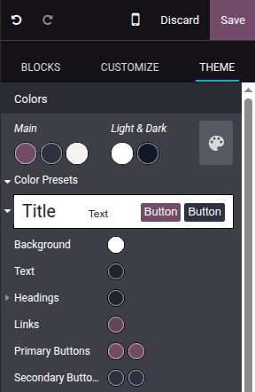

==============
Website themes
==============

Odoo offers various options to shape your website’s theme, including its colors, fonts, and layouts,
ensuring alignment with your company's brand identity and aesthetics.

To access the following design options, go to :menuselection:`Website --> Edit --> Theme`. Once you
have made the desired changes, click on :guilabel:`Save` to confirm and apply them to your website.

Choosing theme
==============

In the :guilabel:`Website` section, click on :guilabel:`Switch Theme` to open the theme selector.
Hover your mouse over the themes to see an extended preview of each page. Click on a page to apply
the theme to your website.

Editing colors
==============

In the :guilabel:`Colors` section, click on the paint palette icon to select your color palette. These are
made of five colors: three main colors and two light and dark colors. You can change the colors in
your palette by clicking on the color dots located on the left of the paint palette icon. The color
selection panel offers two options:

- **Solid**, to choose from a selection of colors.
- **Custom**, to select a specific color tone manually (or add an #HEX or RGBA code).

Odoo automatically creates presets for your chosen palette. If you want to modify them, click on
:guilabel:`Color Presets` to display them and click on a preset to customize it further. Each
color preset contains colors for your building block’s Background, Text, Headings, Links, Primary
Buttons, and Secondary Buttons.

To apply a color preset to a building block on your site, select it, go to the :guilabel:`Customize`
tab, click the color dot located next to :guilabel:`Background`, and choose a :guilabel:`Theme`,
a :guilabel:`Color`, or :guilabel:`Gradient`.

.. note::
   Changing a color preset automatically updates the colors of both the default preset and the
   building blocks where the preset is used.

Changing page layout
====================

Odoo offers multiple styles to display your pages content, such as blocks, pictures and more. In the
:guilabel:`Website` section, click on :guilabel:`Page Layout` and select one in the dropdown menu.
Under :guilabel:`Page Layout`, customize your :guilabel:`Background` by choosing an
:guilabel:`Image`, creating a :guilabel:`Pattern`, or leaving it blank.

Adding a custom font
====================

In the :guilabel:`Paragraph` section, click on :guilabel:`Font Family` and on
:guilabel:`Add a Custom Font` at the bottom of the dropdown menu. In the pop-up window:

- To add a Google font, click on :guilabel:`Select a Google Font` and click on a font that you like
  from the list.
- To upload a custom font from your computer, click on :guilabel:`Choose File`.

To complete the new font addition and make it available in the font family menu, click on
:guilabel:`Save and Reload`.

Modifying theme fonts
=====================

Odoo allows you to customize the font family and size for specific text elements on your website,
including paragraphs, headings, buttons, and input fields.

- **Font Family**: In the :guilabel:`Paragraph`, :guilabel:`Headings`, and :guilabel:`Button` sections,
  click on :guilabel:`Font Family` and select a font from the dropdown menu.

- **Font Size**: In the :guilabel:`Paragraph`, :guilabel:`Headings`, :guilabel:`Button` and
  :guilabel:`Input Fields` sections, use the :guilabel:`Font Size` field to set a default size. Click
  the arrow next to it to define custom :guilabel:`Small` and :guilabel:`Large` sizes.

Additionally, each section offers extra text styling options, such as :guilabel:`Line Height` and
:guilabel:`Margins`, for further customization.

Modifying button style
======================

In the :guilabel:`Button` section, click on :guilabel:`Primary Style` or :guilabel:`Secondary Style`
and select :guilabel:`Fill`, :guilabel:`Outline`, or :guilabel:`Flat`. When selecting
:guilabel:`Outline`, the :guilabel:`Border Width` option appears below, allowing you to adjust the
width of the button's outline.

The :guilabel:`Paddings` fields allows you to change the size of the spacing around the text
displayed on a button. You can also customize the border radius of buttons using the
:guilabel:`Round Corners` option and add an animation when a button is clicked in the
:guilabel:`On Click Effect` dropdown menu.

Modifying link style
====================

In the :guilabel:`Link` section, click on :guilabel:`Link Style` to choose the appearance of links
on your website: select :guilabel:`No Underline`, :guilabel:`Underline On Hover`, or
:guilabel:`Always Underline` in the dropdown menu.
