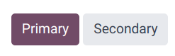

=============
General theme
=============

Odoo provides a range of theme :ref:`customization options <website/themes/page-layouts>` to define
the website's :ref:`colors <website/themes/colors>`, :ref:`fonts <website/themes/fonts>`, and
:ref:`shadow styles <website/themes/shadows>`, and the appearance of :ref:`paragraphs and headings
<website/themes/paragraphs-headings>`, :ref:`buttons <website/themes/button-styles>`, :ref:`links
<website/themes/link-style>`, and :ref:`input fields <website/themes/input-fields>`. Additional
:ref:`advanced settings <website/themes/advanced>` are also available.

When setting up a website for the first time, you are prompted to select a theme. Hover the mouse
over the themes to see an extended preview of each one. Click a theme to select it, or click the
:guilabel:`View more themes` button to display the full list of available themes.

.. note::
   If you leave without selecting a theme, the website is created with the default theme.

.. _website/themes/page-layouts:

To customize the theme, open the website editor, navigate to the :guilabel:`Theme` tab, and go to
the :guilabel:`Website` section. You can:

- Click :guilabel:`Switch Theme` to open the theme selector. Hover the mouse over the themes to see
  an extended preview of each one. Click :guilabel:`Use this theme` to apply it to the website.
- Add a :doc:`language <../configuration/multi_website>` for the website.
- Select the :guilabel:`Page Layout` to change the overall display and spacing of building blocks
  and website elements on pages.
- Customize the layout's background:

  - Choose a :guilabel:`Background` :ref:`color <website/themes/colors>`.
  - Add a background :ref:`image <website/elements/images>` or :guilabel:`Replace` it. Then
    configure its :guilabel:`Position`:

    - Use the selected image as a :guilabel:`Cover` or in a :guilabel:`Repeat Pattern`.
    - Click the :icon:`fa-arrows` (:guilabel:`Background Position`) icon to adjust the image
      position, then click :guilabel:`Apply`.

Click :guilabel:`Save` to apply the changes to the website.

.. _website/themes/colors:

Colors
======

Odoo's website editor features two main types of colors: :ref:`theme colors
<website/themes/theme-colors>` and :ref:`status colors <website/themes/status-colors>`. Click the
color palette bar to open the :guilabel:`Website / Colors` menu in the :guilabel:`Theme` tab.

.. _website/themes/theme-colors:

Theme colors
------------

Theme colors refer to the set of colors displayed across all pages of the website. They consist of
five colors: three :guilabel:`Main` colors, used mainly for buttons and links, and two
:guilabel:`Light & Dark` colors, used mainly for text and headings.

To customize the theme colors:

- Click the color you want to change, then select a predefined :guilabel:`Solid` color or click
  :guilabel:`Custom` to pick a specific color tone manually (or add its #HEX or RGBA code). Click
  :icon:`fa-trash` (:guilabel:`Reset`) to remove the color selection.
- Click the paint palette icon and choose a color palette. As a result, all color customizations
  are reset.

Odoo automatically creates :guilabel:`Color Presets` for the chosen colors or palette. These
predefined color combinations are applied to various elements of the website to create a
structured and visually appealing design. When selecting a color palette, its presets define how
those colors are distributed across different elements. To modify them, click :guilabel:`Color
Presets`, then select a preset to open the customization dropdown. Each color preset contains colors
for the building block’s :guilabel:`Background`, :guilabel:`Text`, :guilabel:`Headings`,
:guilabel:`Links`, :guilabel:`Primary Buttons`, and :guilabel:`Secondary Buttons`.

.. tip::
   To apply a color preset to a building block, select the building block, go to the
   :guilabel:`Style` tab, click the color dot located next to :guilabel:`Background`, and choose a
   :guilabel:`Theme`.

.. note::
   Changing a color preset automatically updates the colors of both the default preset and the
   building blocks that use it.

.. _website/themes/status-colors:

Status colors
-------------

Status colors indicate the status of certain actions (e.g., :guilabel:`Success`,
:guilabel:`Warning`, etc.). They are used in pop-up messages that appear to provide feedback to
users and website visitors. To customize the website's :guilabel:`Status Colors`, go to the
:guilabel:`Advanced` section and click the dots to change their color. You can also configure
:guilabel:`Grays`.

.. example::

   Information related to a successful action on the website appears in :icon:`oi-green-dot` green.

   .. image:: themes/status-colors.png
      :alt: Status color selection

   .. image:: themes/success.png
      :alt: Success pop-up

.. _website/themes/fonts:

Fonts
=====

Odoo allows you to customize the font family and font size of website elements, including
:ref:`paragraphs and headings <website/themes/paragraphs-headings>`, :ref:`buttons
<website/themes/button-styles>`, and :ref:`input fields <website/themes/input-fields>`.

- :guilabel:`Font Size`: In the :guilabel:`Paragraph`, :guilabel:`Headings`, :guilabel:`Button`, and
  :guilabel:`Input Fields` sections, use the :guilabel:`Font Size` field to set a default size.
  Click the :icon:`fa-caret-right` (:guilabel:`Toggle more options`) icon to expand the section and
  define custom sizes (e.g., based on the heading level, button size, etc.).
- :guilabel:`Font Family`: In the :guilabel:`Paragraph`, :guilabel:`Headings`, and
  :guilabel:`Button` sections, select a font from the dropdown menu.

  .. note::
     When :guilabel:`System Fonts` is selected, Odoo uses the native fonts already installed on the
     visitor's operating system. For example, Android uses **Roboto** as its default system font.

Custom fonts
------------

To add a custom font not available by default in Odoo, click the :guilabel:`Font Family` dropdown
and select :guilabel:`Add a Custom Font` at the bottom. In the :guilabel:`Add a Google font or
upload a custom font` pop-up:

- To add a Google font, open the :guilabel:`Select a Google Font` dropdown and select the desired
  font. Toggle off the :guilabel:`Serve font from Google servers` if your website is operated
  from a location where regulations require compliance with laws such as, but not limited to, the
  European Union's GDPR. This will ensure the Google Font is stored on the website's server rather
  than on Google's servers.
- To upload a :guilabel:`Custom Font` from your computer, click :guilabel:`Choose File`.

Once done, click :guilabel:`Save and Reload`.

.. tip::
   A :guilabel:`Preview` of the selected font is displayed on the right side of the window.

Styles
======

The appearance of website elements can be further customized. For example, you can customize
:ref:`paragraphs and headings <website/themes/paragraphs-headings>`, :ref:`buttons
<website/themes/button-styles>`, :ref:`links <website/themes/link-style>`, and :ref:`input fields
<website/themes/input-fields>`.

.. _website/themes/paragraphs-headings:

Paragraphs & headings
---------------------

The :guilabel:`Paragraph` and :guilabel:`Headings` sections offer additional styling options for
these text elements. You can:

- Modify the :ref:`font settings <website/themes/fonts>`.
- Adjust the :guilabel:`Line Height` to define the spacing between lines of text.
- Adjust :guilabel:`Margins` to define the spacing around paragraphs and headings.

.. _website/themes/button-styles:

Buttons
-------

To customize the style of the website's primary and secondary buttons, navigate to the
:guilabel:`Button` section and edit the relevant options:

- Open the :icon:`fa-caret-down` dropdown menu next to the :guilabel:`Primary Style` or
  :guilabel:`Secondary Style` fields to change the style for each button type, such as
  :guilabel:`Fill`, :guilabel:`Outline`, or :guilabel:`Flat`. When selecting :guilabel:`Outline`,
  the :guilabel:`Border Width` option appears below, allowing you to adjust the width of the
  button's outline.
- Modify the :ref:`font settings <website/themes/fonts>`.
- Adjust the :guilabel:`Padding` to change the spacing around the buttons' labels.
- Use the :guilabel:`Round Corners` option to adjust the buttons' border radius.
- Add an animation when a button is clicked in the :guilabel:`On Click Effect` dropdown menu.

.. tip::
   To define custom :guilabel:`Small` and :guilabel:`Large` sizes for the buttons'
   :guilabel:`Padding`, :guilabel:`Font Size`, and :guilabel:`Round Corners`, click the
   :icon:`fa-caret-right` (:guilabel:`Toggle more options`) icon, then use the related fields.

.. _website/themes/link-style:

Links
-----

In the :guilabel:`Link` section, open the :icon:`fa-caret-down` dropdown menu next to
:guilabel:`Link Style` to choose the appearance of links on the website. You can choose between:

- :guilabel:`No Underline`;
- :guilabel:`Underline On Hover`; or
- :guilabel:`Always Underline`.

.. _website/themes/input-fields:

Input fields
------------

To customize the style of the website's input fields, navigate to the :guilabel:`Input Fields`
section and edit the relevant options:

- Adjust the :guilabel:`Padding` to change the spacing around the fields.
- Modify the :ref:`font settings <website/themes/fonts>`.
- Customize the :guilabel:`Border Width` around fields.
- Define a :guilabel:`Border Radius` to round the fields' corners.
- Choose a :guilabel:`Background` :ref:`color <website/themes/colors>` to fill the fields.

.. _website/themes/shadows:

Shadows
=======

Configure the default shadow styles used across sections, cards, and other elements. To customize
them, go to the :guilabel:`Shadow` section, and define the :ref:`Color <website/themes/colors>`,
:guilabel:`Blur`, and :guilabel:`Spread` values for each shadow size: :guilabel:`Normal`,
:guilabel:`Small`, and :guilabel:`Large`. These settings serve as the default shadow styles.
Whenever you apply a shadow option to a :doc:`building block <building_blocks>` or another website
element, the corresponding configured shadow option is automatically applied.

.. _website/themes/advanced:

Advanced settings
=================

Additional settings can be configured in the :guilabel:`Advanced` section, such as :doc:`showing or
hiding the header <../structure/header_footer>` and using :guilabel:`Code Injection` for
:ref:`website verification through an HTML tag <website/google_search_console/HTML-tag>`.

You can also configure Google Maps to display maps and enable geolocation features on the
website, e.g., on the :guilabel:`Contact Us` page and in specific snippets. To configure this
option:

#. Go to your `Google account <https://console.cloud.google.com/getting-started>`_.
#. :ref:`Enable <address_autocomplete/enable-api>` the :guilabel:`Maps Static API`, :guilabel:`Maps
   JavaScript API`, and :guilabel:`Places API`.

   .. important::
      - Do not enable :guilabel:`Places API (New)`, as it is not yet supported by Odoo.
      - Using the Google APIs could require `payment to Google
        <https://mapsplatform.google.com/pricing/>`_.

#. :ref:`Create an API key <address_autocomplete/generate_api_key>` and copy it.
#. In Odoo's website editor, go to the :guilabel:`Theme` tab, and, in the :guilabel:`Advanced`
   section, click :guilabel:`Custom Key` next to :guilabel:`Google Map`.
#. Paste the generated API key into the :guilabel:`API Key` field.
#. Click :guilabel:`Save`.
