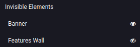

==========
Visibility
==========

:doc:`Building blocks <building_blocks>` can be displayed or hidden based on a visitor's
:ref:`device type (mobile or desktop) <website/visibility/mobile-and-computer>` or :ref:`specific
conditions <website/visibility/conditions>`.

To configure a building block’s visibility, open the website editor and select a building block.
In the :guilabel:`Style` tab, under the block's customization options, go to :guilabel:`Visibility`.

.. _website/visibility/mobile-and-computer:

Mobile/desktop
==============

.. role:: raw-html(raw)
   :format: html

.. |desktop icon| replace:: :raw-html:`<svg viewBox="0 0 465 462" xmlns="http://www.w3.org/2000/svg" width="18" height="18"><path d="M456.969 9.84743L454.026 6.90425C444.956 -2.16512 429.098 -1.01124 418.605 9.48152L10.8984 417.188C0.405681 427.681 -0.748186 443.539 8.32118 452.609L11.2644 455.552C20.3337 464.621 36.1919 463.467 46.6847 452.975L454.392 45.2678C464.884 34.775 466.038 18.9168 456.969 9.84743Z"></path><path d="M346.673 26.269H39.1908C17.8303 26.269 0.5 43.6036 0.5 64.9695V322.973C0.5 336.409 7.35309 348.251 17.752 355.19L114.47 258.472H62.9696C56.9597 258.472 52.0878 253.601 52.0878 247.591V88.7515C52.0878 82.7417 56.9597 77.8697 62.9696 77.8697H295.072L346.673 26.269Z"></path><path d="M296.331 258.472H402.32C408.33 258.472 413.202 253.601 413.202 247.591V141.602L464.79 90.0139V322.973C464.79 344.339 447.46 361.674 426.099 361.674H271.336L284.233 400.375H342.269C352.949 400.375 361.614 409.042 361.614 419.725C361.614 430.408 352.949 439.075 342.269 439.075H123.021C120.837 439.075 118.734 438.708 116.771 438.033L154.429 400.375H181.057L193.954 361.674H193.13L226.244 328.56C228.268 329.181 230.417 329.516 232.645 329.516C244.665 329.516 254.409 319.772 254.409 307.753C254.409 305.525 254.074 303.376 253.452 301.352L296.331 258.472Z"></path></svg>`

.. |mobile icon| replace:: :raw-html:`<svg viewBox="0 0 566.93 566.93" xmlns="http://www.w3.org/2000/svg" width="18" height="18"><rect transform="translate(283.46 -117.41) rotate(45)" x="255.56" y="-16.93" width="55.81" height="600.8" rx="25.61"></rect><path d="m395.46 399.46a12 12 0 0 1-12 12h-128.4l-115.68 115.69a47.8 47.8 0 0 0 32.08 12.31h224a48 48 0 0 0 48-48v-268.4l-48 48zm-112 108a32 32 0 1 1 32-32 32 32 0 0 1-32 32z"></path><path d="m171.46 87.46a12 12 0 0 1 12-12h200a11.89 11.89 0 0 1 6.48 1.93l37.61-37.61a47.82 47.82 0 0 0-32.09-12.32h-224a48 48 0 0 0-48 48v268.41l48-48z"></path></svg>`

To control the visibility of a building block based on the visitor's device type:

- Click the |desktop icon| (:guilabel:`Show/Hide on Desktop`) button to hide the block for visitors
  using a desktop or laptop computer.
- Click the |mobile icon| (:guilabel:`Show/Hide on Mobile`) button to hide the block for visitors
  using a mobile device.

Then, click :guilabel:`Save` to apply the changes.

Some :doc:`elements <elements>` within building blocks can also be hidden individually.
This is particularly useful for elements that are too wide to display properly on smaller screens.
To check whether this option is available, select an element within a building block and look for
the :guilabel:`Visibility` option in the element's customization options.

.. example::
   The red |mobile icon| (:guilabel:`Show/Hide on Mobile`) button indicates that the selected image
   is hidden on mobile devices.

   .. image:: visibility/visibility-for-element.png
      :alt: Example of a column element hidden on mobile devices.

.. tip::
   It is also possible to :ref:`align the header menu based on the device type
   <website/header_footer/menu-item-design>`.

.. _website/visibility/conditions:

Conditions
==========

Set one or more conditions to control whether visitors can see a :doc:`building block
<building_blocks>` or :doc:`element <elements>` based on their country (IP geolocation), website
:ref:`language <translate/language-selector>`, :ref:`UTM parameters
<website/link_tracker/create-urls>`, or :doc:`login status
<../../ecommerce/configuration/customer_accounts>`.

To define conditions, click the :guilabel:`No condition` :icon:`fa-caret-down` field in the
:guilabel:`Visibility` options and select :guilabel:`Conditionally` instead to display the available
options:

- :guilabel:`Country`: The visitor’s country, determined from their IP address.
- :guilabel:`Languages`: The website language selected by the visitor.

  .. note::
     This option is only available if multiple :doc:`languages are defined for the website
     <../configuration/translate>`.

- :guilabel:`UTM Campaign`: The selected campaign.
- :guilabel:`UTM Medium`: The selected medium of any campaign.
- :guilabel:`UTM Source`: The selected source of any campaign.
- :guilabel:`Users`: Select whether the block should be :guilabel:`Visible for Logged In` or
  :guilabel:`Visible for Logged Out` users. By default, the option is set to :guilabel:`Visible
  for Everyone`.

For any of the first five conditions, choose whether the block should be :guilabel:`Visible for`
or :guilabel:`Hidden for`, then click :guilabel:`Choose a record...` and select one or multiple
options. Click the :icon:`fa-minus` (:guilabel:`remove`) button to remove an option.

Then, click :guilabel:`Save` to apply the changes.

.. example::
   A building block configured with the following conditions is displayed only to visitors:

   - whose IP address is located in Belgium,
   - who are viewing the website in French, and
   - who did *not* access the page through a tracked `Sales` campaign URL.

   .. image:: visibility/visibility-conditions.png
      :alt: Example of a block configured with several visibility conditions

.. _website/visibility/invisible-elements:

Invisible elements
==================

Blocks and elements with custom visibility settings are listed at the bottom of the website editor
sidebar. Click a block or an element in the :guilabel:`Invisible Elements` section to preview the
page with or without it.

.. tip::
   You can also :guilabel:`Show/Hide Elements` in the :ref:`header or footer
   <website/header_footer/design>`.

.. seealso::
   - :ref:`Manage the visibility of dynamic pages <website/header_footer/hide-menu-item>`
   - :ref:`Manage the visibility of static pages <website/pages/page_properties>`
