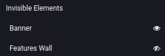

==========
Visibility
==========

You can choose to display or hide building blocks based on a visitor's:

- device type (mobile or computer),
- country (IP-based geolocation),
- website language,
- :doc:`UTM parameters <../reporting/link_tracker>`, and
- login state.

.. _website/visibility/mobile-and-computer:

Mobile/computer
===============

.. role:: raw-html(raw)
   :format: html

.. |desktop icon| replace:: :raw-html:`<svg viewBox="0 0 465 462" xmlns="http://www.w3.org/2000/svg" width="18" height="18"><path d="M456.969 9.84743L454.026 6.90425C444.956 -2.16512 429.098 -1.01124 418.605 9.48152L10.8984 417.188C0.405681 427.681 -0.748186 443.539 8.32118 452.609L11.2644 455.552C20.3337 464.621 36.1919 463.467 46.6847 452.975L454.392 45.2678C464.884 34.775 466.038 18.9168 456.969 9.84743Z"></path><path d="M346.673 26.269H39.1908C17.8303 26.269 0.5 43.6036 0.5 64.9695V322.973C0.5 336.409 7.35309 348.251 17.752 355.19L114.47 258.472H62.9696C56.9597 258.472 52.0878 253.601 52.0878 247.591V88.7515C52.0878 82.7417 56.9597 77.8697 62.9696 77.8697H295.072L346.673 26.269Z"></path><path d="M296.331 258.472H402.32C408.33 258.472 413.202 253.601 413.202 247.591V141.602L464.79 90.0139V322.973C464.79 344.339 447.46 361.674 426.099 361.674H271.336L284.233 400.375H342.269C352.949 400.375 361.614 409.042 361.614 419.725C361.614 430.408 352.949 439.075 342.269 439.075H123.021C120.837 439.075 118.734 438.708 116.771 438.033L154.429 400.375H181.057L193.954 361.674H193.13L226.244 328.56C228.268 329.181 230.417 329.516 232.645 329.516C244.665 329.516 254.409 319.772 254.409 307.753C254.409 305.525 254.074 303.376 253.452 301.352L296.331 258.472Z"></path></svg>`

.. |mobile icon| replace:: :raw-html:`<svg viewBox="0 0 566.93 566.93" xmlns="http://www.w3.org/2000/svg" width="18" height="18"><rect transform="translate(283.46 -117.41) rotate(45)" x="255.56" y="-16.93" width="55.81" height="600.8" rx="25.61"></rect><path d="m395.46 399.46a12 12 0 0 1-12 12h-128.4l-115.68 115.69a47.8 47.8 0 0 0 32.08 12.31h224a48 48 0 0 0 48-48v-268.4l-48 48zm-112 108a32 32 0 1 1 32-32 32 32 0 0 1-32 32z"></path><path d="m171.46 87.46a12 12 0 0 1 12-12h200a11.89 11.89 0 0 1 6.48 1.93l37.61-37.61a47.82 47.82 0 0 0-32.09-12.32h-224a48 48 0 0 0-48 48v268.41l48-48z"></path></svg>`

To toggle the visibility of a building block based on the visitor's device type:

- Open the website editor and select a block.
- In the :guilabel:`Customize` tab, under the block's customization options, look for
  :guilabel:`Visibility`.

  - Click the |desktop icon| (:guilabel:`Show/Hide on Desktop`) button to hide
    the block for users visiting your website from a computer.
  - Click the |mobile icon| (:guilabel:`Show/Hide on Mobile`) button to hide the block
    for users visiting your website from a mobile device.

- Click :guilabel:`Save` to apply the changes.

It is also sometimes possible to hide elements within blocks. It is mostly used to hide specific
elements inside blocks that may be too wide to be correctly displayed on mobile devices. To see if
the option is available, select an element within a block and look for the :guilabel:`Visibility`
option under the element's customization option.

.. example::
   The selected image is hidden on mobile devices.

   .. image:: visibility/element-visibility.png
      :alt: Example of an column element hidden on mobile devices

.. _website/visibility/conditions:

Conditions
==========

To access the country, website language, UTM parameters, and login state conditions:

- Open the website editor and select a building block.
- In the :guilabel:`Customize` tab, look for :guilabel:`Visibility`.
- Click :guilabel:`No condition` and select :guilabel:`Conditionally` instead to display the
  different options:

  - :guilabel:`Country`: the country of the visitor's IP address.
  - :guilabel:`Languages`: the website language used by the visitor.

    .. note::
       This option is only available if more than one :doc:`language is installed
       <../configuration/translate>`.

  - :guilabel:`UTM Campaign`: the selected campaign.
  - :guilabel:`UTM Medium`: the selected medium of any campaign.
  - :guilabel:`UTM Source`: the selected source of any campaign.
  - :guilabel:`Users`: select whether the visitor should be :guilabel:`Logged In` or
    :guilabel:`Logged Out` to view the block. By default, the option is set to :guilabel:`Visible
    for Everyone`.

- For one or more of the first five options, choose if the block should be :guilabel:`Visible for`
  or :guilabel:`Hidden for`, then click :guilabel:`Choose a record...` and select it.

.. tip::
   - You can select multiple records for each option by clicking :guilabel:`Choose a record...`
     again.
   - Click the :icon:`fa-minus` (:guilabel:`remove`) button to remove an option.

Click :guilabel:`Save` to apply the changes.

.. example::
   A block with the following configuration will only be displayed to visitors with a Belgian IP
   address, for which the website is displayed in French, unless they visit the page using the
   `Sales` campaign tracked URL.

   .. image:: visibility/visibility-conditions.png
      :alt: Example of a block configured with several visibility conditions

.. _website/visibility/invisible-elements:

Invisible elements
==================

Blocks and elements with custom visibility settings are listed at the bottom of the website editor
sidebar. You can preview how the page would look like by clicking the :icon:`fa-eye`
(:guilabel:`visible`) button to hide a block or element, or the :icon:`fa-eye-slash`
(:guilabel:`hidden`) to show it in the website editor.

