===========================
Chapter 3: Fields and Views
===========================

In the previous chapter, we learned a range of skills, including how to create and use services,
work with the Layout component, make the dashboard translatable, and lazy load a JavaScript library
like Chart.js. Now, let's move on to learning how to create new fields and views.

.. graph TD
..     subgraph "Owl"
..         C[Component]
..         T[Template]
..         H[Hook]
..         S[Slot]
..         E[Event]
..     end

..     subgraph "odoo"[Odoo Javascript framework]
..         Services
..         Translation
..         lazy[Lazy loading libraries]
..         SCSS
..         action --> Services
..         rpc --> Services
..     end

..     odoo[Odoo JavaScript framework] --> Owl



   This is the progress that we have made in discovering the JavaScript web framework at the end of
   :doc:`02_odoo_web_framework`.

Fields and views are among the most important concepts in the Odoo user interface. They are key to
many important user interactions, and should therefore work perfectly.

In the context of the JavaScript framework, fields are components specialized for
visualizing/editing a specific field for a given record.

For example, a (Python) model may define a char field, which will be represented by a field
component `CharField`.

A field component is basically just a component registered in the `fields` :ref:`registry
<frontend/registries>`. The field component may define some additional static keys (metadata), such
as `displayName` or `supportedTypes`, and the most important one: `extractProps`, which prepare the
base props received by the `CharField`.

.. example::
   Let us discuss a simplified implementation of a `CharField`.

   First, here is the template:

   .. code-block:: xml

      <t t-name="web.CharField" owl="1">
          <t t-if="props.readonly">
              <span t-esc="formattedValue" />
          </t>
          <t t-else="">
              <input
                  class="o_input"
                  t-att-type="props.isPassword ? 'password' : 'text'"
                  t-att-placeholder="props.placeholder"
                  t-on-change="updateValue"
               />
          </t>
      </t>

   It features a readonly mode and an edit mode, which is an input with a few attributes. Now, here
   is the JavaScript code:

   .. code-block:: js

      export class CharField extends Component {
          get formattedValue() {
              return formatChar(this.props.value, { isPassword: this.props.isPassword });
          }

          updateValue(ev) {
             let value = ev.target.value;
             if (this.props.shouldTrim) {
                 value = value.trim();
             }
             this.props.update(value);
          }
      }

      CharField.template = "web.CharField";
      CharField.displayName = _lt("Text");
      CharField.supportedTypes = ["char"];

      CharField.extractProps = ({ attrs, field }) => {
          return {
              shouldTrim: field.trim && !archParseBoolean(attrs.password),
              maxLength: field.size,
              isPassword: archParseBoolean(attrs.password),
              placeholder: attrs.placeholder,
          };
      };

      registry.category("fields").add("char", CharField);

   There are a few important things to notice:

   - The `CharField` receives its (raw) value in props. It needs to format it before displaying it.
   - It receives an `update` function in its props, which is used by the field to notify the owner
     of the state that the value of this field has been changed. Note that the field does not (and
     should not) maintain a local state with its value. Whenever the change has been applied, it
     will come back (possibly after an onchange) by the way of the props.
   - It defines an `extractProps` function. This is a step that translates generic standard props,
     specific to a view, to specialized props, useful to the component. This allows the component to
     have a better API, and may make it so that it is reusable.

Fields have to be registered in the `fields` registry. Once it's done, they can be used in some
views (namely: `form`, `list`, `kanban`) by using the `widget` attribute.

.. example::

   .. code-block:: xml

      <field name="preview_moves" widget="account_resequence_widget"/>

.. admonition:: Goal

   .. image:: 03_fields_and_views/overview_03.png
      :align: center

.. spoiler:: Solutions

   The solutions for each exercise of the chapter are hosted on the `official Odoo tutorials
   repository <https://github.com/odoo/tutorials/commits/{BRANCH}-solutions/awesome_tshirt>`_.

1. An `image_preview` field
===========================

Each new order on the website will be created as an `awesome_tshirt.order`. This model has a
`image_url` field (of type `char`), which is currently only visible as a string. We want to be able
to see it in the form view.

For this task, we need to create a new field component `image_preview`. This component is
specified as follows: In readonly mode, it is only an image tag with the correct `src` if the field
is set; In edit mode, it also behaves like classical `char` fields (you can use the `CharField` in
your template by passing it in the props). An `input` should be displayed with the text value of the
field, so it can be edited.

.. exercise::

   #. Create a new `ImagePreview` component and use the `CharField` component in your template. You
      can use `t-props
      <{OWL_PATH}/doc/reference/props.md#dynamic-props>`_ to pass props
      received by `ImagePreview` to `CharField`.
   #. Register your field in the proper :ref:`registry <frontend/registries>`.
   #. Update the arch of the form view to use your new field by setting the `widget` attribute.

   .. note::
      It is possible to solve this exercise by inheriting `CharField` , but the goal of this
      exercise is to create a field from scratch.

   .. image:: 03_fields_and_views/image_field.png
      :align: center
      :scale: 50%

.. seealso::

   `Code: CharField <{GITHUB_PATH}/addons/web/static/src/views/fields/char/char_field.js>`_

2. Improving the `image_preview` field
======================================

.. exercise::

   We want to improve the field of the previous task to help the staff recognize orders for which
   some action should be done. In particular, we want to display a warning "MISSING TSHIRT DESIGN"
   in red if there is no image URL specified on the order.

   .. image:: 03_fields_and_views/missing_image.png
      :align: center

3. Customizing a field component
================================

Let's see how to use inheritance to extend an existing component.

There is a `is_late`, readonly, boolean field on the task model. That would be useful information to
see on the list/kanban/view. Then, let us say that we want to add a red word "Late!" next to it
whenever it is set to true.

.. exercise::

   #. Create a new `LateOrderBoolean` field inheriting from `BooleanField`. The template of
      `LateOrderBoolean` can also :ref:`inherit <reference/qweb/template_inheritance>` from the
      `BooleanField` template.
   #. Use it in the list/kanban/form view.
   #. Modify it to add a red `Late` next to it, as requested.

   .. image:: 03_fields_and_views/late_field.png
      :align: center

.. seealso::

   - `Example: A field inheriting another (JS)
     <{GITHUB_PATH}/addons/account/static/src/components/account_type_selection/account_type_selection.js>`_
   - `Example: A field inheriting another (XML)
     <{GITHUB_PATH}/addons/account/static/src/components/account_type_selection/account_type_selection.xml>`_
   - :ref:`Documentation on xpath <reference/views/inheritance>`

4. Message for some customers
=============================

Odoo form views support a `widget` API, which is like a field, but more generic. It is useful to
insert arbitrary components in the form view. Let us see how we can use it.

.. exercise::

   For a super efficient workflow, we would like to display a message/warning box with some
   information in the form view, with specific messages depending on some conditions:

   - If the `image_url` field is not set, it should display "No image".
   - If the amount of the order is higher than 100 euros, it should display "Add promotional
     material".
   - Make sure that your widget is updated in real time.

   .. image:: 03_fields_and_views/warning_widget.png
      :align: center

.. seealso::

   - `Example: Using the tag <widget> in a form view
     <{GITHUB_PATH}/addons/calendar/views/calendar_views.xml#L197>`_
   - `Example: Implementation of a widget (JS)
     <{GITHUB_PATH}/addons/web/static/src/views/widgets/week_days/week_days.js>`_
   - `Example: Implementation of a widget (XML)
     <{GITHUB_PATH}/addons/web/static/src/views/widgets/week_days/week_days.xml>`_

5. Use `markup`
===============

Let's see how we can display raw HTML in a template. Before, there was a `t-raw` directive that
would just output anything as HTML. This was unsafe, and has been replaced by a `t-out
<{OWL_PATH}/doc/reference/templates.md#outputting-data>`_ directive that acts like a `t-esc` unless
the data has been marked explicitly with a `markup` function.

.. exercise::

   #. Modify the previous exercise to put the `image` and `material` words in bold.
   #. The warnings should be markuped, and the template should be modified to use `t-out`.

   .. note::
      This is an example of a safe use of `t-out` , since the string is static.

   .. image:: 03_fields_and_views/warning_widget2.png
      :align: center

6. Add buttons in the control panel
===================================

Views are among the most important components in Odoo: they allow users to interact with their
data. Let us discuss how Odoo views are designed.

The power of Odoo views is that they declare how a particular screen should work with an XML
document (usually named `arch`, short for architecture). This description can be extended/modified
by xpaths serverside. Then, the browser loads that document, parses it (fancy word to say that it
extracts the useful information), and then represents the data accordingly.

.. example::

   The `arch` document is view specific. Here is how a `graph` view or a `calendar` view could be
   defined:

   .. code-block:: xml

      <graph string="Invoices Analysis" type="line" sample="1">
          <field name="product_categ_id"/>
          <field name="price_subtotal" type="measure"/>
      </graph>

      <calendar string="Leads Generation" create="0" mode="month" date_start="activity_date_deadline" color="user_id" hide_time="true" event_limit="5">
          <field name="expected_revenue"/>
          <field name="partner_id" avatar_field="avatar_128"/>
          <field name="user_id" filters="1" invisible="1"/>
      </calendar>

A view is defined in the view registry by an object with a few specific keys.

- `type`: The (base) type of a view (for example, `form`, `list`...).
- `display_name`: What should be displayed in the tooltip in the view switcher.
- `icon`: Which icon to use in the view switcher.
- `multiRecord`: Whether the view is supposed to manage a single record or a set of records.
- `Controller`: The component that will be used to render the view (the most important information).

.. example::

   Here is a minimal `Hello` view, which does not display anything:

   .. code-block:: js

      /** @odoo-module */

      import { registry } from "@web/core/registry";

      export const helloView = {
         type: "hello",
         display_name: "Hello",
         icon: "fa fa-picture-o",
         multiRecord: true,
         Controller: Component,
      };

      registry.category("views").add("hello", helloView);

Most (or all?) Odoo views share a common architecture:

.. ```mermaid
.. graph TD
..     subgraph View description
..         V(props function)
..         G(generic props)
..         X(arch parser)
..         S(others ...)
..         V --> X
..         V --> S
..         V --> G
..     end
..     A[Controller]
..     L[Layout]
..     B[Renderer]
..     C[Model]

..     V == compute props ==> A
..     A --- L
..     L --- B
..     A --- C
.. ```



The view description can define a `props` function, which receives the standard props, and computes
the base props of the concrete view. The `props` function is executed only once, and can be thought
of as being some kind of factory. It is useful to parse the `arch` XML document, and to allow the
view to be parameterized (for example, it can return a Renderer component that will be used as
Renderer), but then it makes it easy to customize the specific renderer used by a sub view.

These props will be extended before being given to the Controller. In particular, the search props
(domain/context/groupby) will be added.

Then, the root component, commonly called the `Controller`, coordinates everything. It uses the
generic `Layout` component (to add a control panel), instantiates a `Model`, and uses a `Renderer`
component in the `Layout` default slot. The `Model` is tasked with loading and updating data, and
the `Renderer` is supposed to handle all rendering work, along with all user interactions.

In practice, once the t-shirt order is printed, we need to print a label to put on the package. To
do that, let us add a button in the order form view control panel which will call a model method.

There is a service dedicated to calling models methods: `orm_service`, located in
`core/orm_service.js`. It provides a way to call common model methods, as well as a generic
`call(model, method, args, kwargs)` method.

.. example::

   .. code-block:: js

      setup() {
          this.orm = useService("orm");
          onWillStart(async () => {
              // will read the fields 'id' and 'descr' from the record with id=3 of my.model
              const data = await this.orm.read("my.model", [3], ["id", "descr"]);
              // ...
          });
      }

.. exercise::

   #. Create a customized form view extending the web form view and register it as
      `awesome_tshirt.order_form_view`.
   #. Add a `js_class` attribute to the arch of the form view so Odoo will load it.
   #. Create a new template inheriting from the form controller template to add a button after the
      create button.
   #. Add a button. Clicking on this button should call the method `print_label` from the model
      `awesome_tshirt.order` with the proper id. Note: `print_label` is a mock method, it only
      displays a message in the logs.
   #. The button should be disabled if the current order is in `create` mode (i.e., it does not
      exist yet).
   #. The button should be displayed as a primary button if the customer is properly set and if the
      task stage is `printed`. Otherwise, it is displayed as a secondary button.
   #. Bonus point: clicking twice on the button should not trigger 2 RPCs.

   .. image:: 03_fields_and_views/form_button.png
      :align: center

.. seealso::
   - `Example: Extending a view (JS)
     <{GITHUB_PATH}/addons/mass_mailing/static/src/views/mailing_contact_view_kanban.js>`_
   - `Example: Extending a view (XML)
     <{GITHUB_PATH}/addons/mass_mailing/static/src/views/mass_mailing_views.xml>`_
   - `Example: Using a js_class attribute
     <{GITHUB_PATH}/addons/mass_mailing/views/mailing_contact_views.xml#L44>`_
   - `Code: orm service <{GITHUB_PATH}/addons/web/static/src/core/orm_service.js>`_
   - `Example: Using the orm service
     <{GITHUB_PATH}/addons/account/static/src/components/open_move_widget/open_move_widget.js>`_

7. Auto-reload the kanban view
==============================

Bafien is upset: he wants to see the kanban view of the tshirt orders on his external monitor, but
the view needs to be up-to-date. He is tired of clicking on the :guilabel:`refresh` icon every 30s,
so he tasked you to find a way to do it automatically.

Just like the previous exercise, that kind of customization requires creating a new JavaScript view.

.. exercise::

   #. Extend the kanban view/controller to reload its data every minute.
   #. Register it in the view registry, under `awesome_tshirt.autoreloadkanban`.
   #. Use it in the arch of the kanban view (with the `js_class` attribute).

.. important::
   If you use `setInterval` or something similar, make sure that it is properly canceled when your
   component is unmounted. Otherwise, you will introduce a memory leak.
