.. _howto/jstraining/03_fields_and_views:

===========================
Chapter 3: Fields and Views
===========================

Fields and views are among the most important concepts in the Odoo user interface.
They are key to many important user interactions, and should therefore work
perfectly.

In the context of the javascript framework, fields are components specialized for
visualizing/editing a specific field for a given record.

For example, a (python) model may define a boolean field, which will be represented
by a field component `BooleanField`.

Usually, fields can display data in `readonly` or in `edit` mode. Also, they are
often specific to a field type: `boolean`, `float`, `many2one`, ...

Fields have to be registered in the `fields` registry. Once it's done, they can
be used in some views (namely: `form`, `list`, `kanban`) by using the `widget`
attribute:

.. code-block:: xml

    <field name="preview_moves" widget="account_resequence_widget"/>

Note that fields may in some case be used outside the context of a view.

Defining a field component
==========================

A field component is basically just a component registered in the `fields` registry.
It may define some additional static keys (metadata), such as `displayName` or `supportedTypes`,
and the most important one: `extractProps`, which prepare the base props received
by the `CharField`.

.. example::
   Let us discuss a (simplified) implementation of a `CharField`.

   First, here is the template:

   .. code-block:: xml

      <t t-name="web.CharField" owl="1">
         <t t-if="props.readonly">
            <span t-esc="formattedValue" />
         </t>
         <t t-else="">
            <input
               class="o_input"
               t-att-type="props.isPassword ? 'password' : 'text'"
               t-att-placeholder="props.placeholder"
               t-on-change="updateValue"
            />
        </t>
      </t>

   It features a readonly mode, an edit mode, which is an input with a few attributes.
   Now, here is the code:

   .. code-block:: js

      export class CharField extends Component {
         get formattedValue() {
            return formatChar(this.props.value, { isPassword: this.props.isPassword });
         }

         updateValue(ev) {
            let value = ev.target.value;
            if (this.props.shouldTrim) {
               value = value.trim();
            }
            this.props.update(value);
         }
      }

      CharField.template = "web.CharField";
      CharField.displayName = _lt("Text");
      CharField.supportedTypes = ["char"];

      CharField.extractProps = ({ attrs, field }) => {
         return {
            shouldTrim: field.trim && !archParseBoolean(attrs.password),
            maxLength: field.size,
            isPassword: archParseBoolean(attrs.password),
            placeholder: attrs.placeholder,
         };
      };

      registry.category("fields").add("char", CharField);

   There are a few important things to notice:

   - the `CharField` receives its (raw) value in props. It needs to format it before displaying it
   - it receives a `update` function in its props, which is used by the field to notify
     the owner of the state that the value of this field has been changed. Note that
     the field does not (and should not) maintain a local state with its value. Whenever
     the change has been applied, it will come back (possibly after an onchange) by the
     way of the props.
   - it defines an `extractProps` function. This is a step that translates generic
     standard props, specific to a view, to specialized props, useful to the component.
     This allows the component to have a better API, and may make it so that it is
     reusable.

Registries
==========

In the previous section we said that components representing fields are registered in the registry.
:ref:`Registries <frontend/registries>` are central to the code architecture: they maintain a
collection of key/value pairs, that are used in many places to read some information. This is
the main way to extend or customize the web client.

For example, a common usecase is to register a field or a view in a registry, then add the
information in a view arch xml, so the web client will know what it should use.

.. example::

   .. code-block:: js

      registry.category("fields").add("char", CharField);

But fields and views are only two usecases. There are many situations where we decides to go with
a registry, because it makes it easy to extend. For example,

- service registry
- field registry
- user menu registry
- effect registry
- systray registry
- ...

An ``image_preview`` field
==========================

Each new order on the website will be created as an ``awesome_tshirt.order``. This model has a
``image_url`` field (of type char), which is currently only visible as a string. We want to be
able to see it in the form view.

For this task, we need to create a new field component ``image_preview``. This component is
specified as follows:

In readonly mode, it is only an image tag with the correct src if field is set. In edit mode, it
also behaves like classical char fields (you can use the ``CharField`` in your template by passing
it props): an ``input`` should be displayed with the text value of the field, so it can be edited.

.. exercise::

   #. Register your field in the proper registry
   #. Update the arch of the form view to use your new field.

   .. note::
      It is possible to solve this exercise by inheriting ``CharField``\ , but the goal of this
      exercise is to create a field from scratch.

   .. image:: 03_fields_and_views/image_field.png
      :align: center
      :alt: image field

.. note:: References:

   - `code: CharField <https://github.com/odoo/odoo/blob/baecd946a09b5744f9cb60318563a9720c5475f9/addons/web/static/src/views/fields/char/char_field.js>`_
   - `owl: t-props directive <https://github.com/odoo/owl/blob/master/doc/reference/props.md#dynamic-props>`_

Improving the image_preview field
=================================

.. exercise::

   We want to improve the widget of the previous task to help the staff recognize orders for which
   some action should be done. In particular, we want to display a warning 'MISSING TSHIRT DESIGN' in
   red, if there is no image url specified on the order.

   .. image:: 03_fields_and_views/missing_image.png
         :align: center
         :alt: missing image when no url

Customizing a field component
=============================

Let's see how to use inheritance to extend an existing component.

There is a ``is_late``\ , readonly, boolean field on the task model. That would be a useful
information to see on the list/kanban/view. Then, let us say that we want to add a red word
``Late!`` next to it whenever it is set to true.

.. exercise::

   #. Create a new field ``late_order_boolean`` inheriting from ``BooleanField``
   #. Use it in the list/kanban/form view
   #. Modify it to add a red ``Late`` next to it, as requested

   .. image:: 03_fields_and_views/late_field.png
      :align: center
      :alt: is late field

.. note:: References:

   - `example: field inheriting another (js) <https://github.com/odoo/odoo/blob/f7b8f07501315233c8208e99b311935815039a3a/addons/account/static/src/components/account_type_selection/account_type_selection.js>`_
   - `example: field inheriting another (xml) <https://github.com/odoo/odoo/blob/f7b8f07501315233c8208e99b311935815039a3a/addons/account/static/src/components/account_type_selection/account_type_selection.xml>`_
   - :ref:`odoo: doc on xpath <reference/views/inheritance>`

Message for some customers
==========================

Odoo form views support a ``widget`` api, which is like a field, but more generic. It is useful to
insert arbitrary components in the form view. Let us see how we can use it.

.. exercise::

   For a super efficient workflow, we would like to display a message/warning box with some
   information in the form view, with specific messages depending on some conditions:

   - If the image_url field is not set, it should display "No image"
   - If the amount of the order is higher than 100 euros, it should display "Add promotional material"
   - Make sure that your widget is updated in real time.

   .. image:: 03_fields_and_views/warning_widget.png
      :align: center
      :alt: Warning widget

.. note:: References:

   - `example: using tag <widget> in a form view <https://github.com/odoo/odoo/blob/f7b8f07501315233c8208e99b311935815039a3a/addons/calendar/views/calendar_views.xml#L197>`_
   - `example: implementation of widget (js) <https://github.com/odoo/odoo/blob/f7b8f07501315233c8208e99b311935815039a3a/addons/web/static/src/views/widgets/week_days/week_days.js>`_
   - `example: implementation of widget (xml) <https://github.com/odoo/odoo/blob/f7b8f07501315233c8208e99b311935815039a3a/addons/web/static/src/views/widgets/week_days/week_days.xml>`_

Use ``markup``
==============

Let's see how we can display raw html in a template. Before, there was a ``t-raw`` directive that
would just output anything as html. This was unsafe, and has been replaced by a ``t-out``
directive, that acts like a ``t-esc`` unless the data has been marked explicitely with a ``markup``
function.

.. exercise::

   #. Modify the previous exercise to put the ``image`` and ``material`` words in bold
   #. The warnings should be markuped, and the template should be modified to use ``t-out``

   .. image:: 03_fields_and_views/warning_widget2.png
      :align: center
      :alt: Warning widget

This is an example of a safe use of ``t-out``\ , since the string is static.

.. note:: References:

   - `owl: doc on t-out <https://github.com/odoo/owl/blob/master/doc/reference/templates.md#outputting-data>`_

Views
=====

Views are among the most important components in Odoo: they allow users to interact with their
data. Let us discuss how Odoo views are designed.

The power of Odoo views is that they declare how a particular screen should work, with a xml
document (usually named `arch`, short for `architecture`). This description can be
extended/modified by xpaths serverside. Then the browser will load that document, parse it (fancy
word to say that it will extract the useful information), then represent the data accordingly.

.. example::

   The `arch` document is view specific, here is how a `graph` view or a `calendar` view could be
   defined:

   .. code-block:: xml

      <graph string="Invoices Analysis" type="line" sample="1">
         <field name="product_categ_id"/>
         <field name="price_subtotal" type="measure"/>
      </graph>

      <calendar string="Leads Generation" create="0" mode="month" date_start="activity_date_deadline" color="user_id" hide_time="true" event_limit="5">
         <field name="expected_revenue"/>
         <field name="partner_id" avatar_field="avatar_128"/>
         <field name="user_id" filters="1" invisible="1"/>
      </calendar>

The generic `View` component
----------------------------

Most of the time, views are created with the help of a generic `View` component, located in
`@web/views/view`. For example, here is what it look like for a kanban view:

.. ```mermaid
.. graph TD
..     A[View]
..     B[KanbanController]

..     A ---|props| B
.. ```


The `View` component is responsible for many tasks:

- loading the view arch description from the server
- loading the search view description, if necessary
- loading the active filters
- if there is a `js_class` attribute on the root node of the arch, get the
  correct view from the view registry
- creating a searchmodel (that manipulates the current domain/context/groupby/facets)

Defining a javascript view
--------------------------

A view is defined in the view registry by an object with a few specific keys.

- `type`: the (base) type of a view (so, for example, `form`, `list`, ...)
- `display_name`: what shoul be displayed in tooltip in the view switcher
- `icon`: what icon to use in the view switcher
- `multiRecord`: if the view is supposed to manage 1 or a set of records
- `Controller`: the most important information: the component that will be used
  to render the view.

.. example::

   Here is a minimal `Hello` view, which does not display anything:

   .. code-block:: js

      /** @odoo-module */

      import { registry } from "@web/core/registry";

      export const helloView = {
         type: "hello",
         display_name: "Hello",
         icon: "fa fa-picture-o",
         multiRecord: true,
         Controller: Component,
      };

      registry.category("views").add("hello", helloView);

The Standard View Architecture
------------------------------

Most (or all?) odoo views share a common architecture:

.. ```mermaid
.. graph TD
..     subgraph View description
..         V(props function)
..         G(generic props)
..         X(arch parser)
..         S(others ...)
..         V --> X
..         V --> S
..         V --> G
..     end
..     A[Controller]
..     L[Layout]
..     B[Renderer]
..     C[Model]

..     V == compute props ==> A
..     A --- L
..     L --- B
..     A --- C

.. ```
.. image:: 03_fields_and_views/view_architecture.svg
   :align: center
   :alt: Architecture of a view.
   :width: 75%
   :class: o-no-modal

The view description can define a `props` function, which receive the standard props, and compute
the base props of the concrete view. The `props` function is executed only once, and can be thought
of as being some kind of factory. It is useful to parse the `arch` xml document, and to allow the
view to be parameterized (for example, it can return a Renderer component that will be used as
Renderer), but then it makes it easy to customize the specific renderer used by a sub view.

Note that these props will be extended before being given to the Controller. In particular, the
search props (domain/context/groupby) will be added.

Then the root component, commonly called the `Controller`, coordinates everything. Basically, it
uses the generic `Layout` component (to add a control panel), instantiates a `Model`, and uses a
`Renderer` component in the `Layout` default slot. The `Model` is tasked with loading and updating
data, and the `Renderer` is supposed to handle all rendering work, along with all user interactions
.

Add buttons in control panel
============================

In practice, once the t-shirt order is printed, we need to print a label to put on the package.
To do that, let us add a button in the order form view control panel which will call a model
method.

There is a service dedicated to calling models methods: `orm_service`, located in
`core/orm_service.js`. It provides a way to call common model methods, as well as a generic `call`
method

.. example::

   .. code-block:: js

      setup() {
         this.orm = useService("orm");
         onWillStart(async () => {
            // will read the fields 'id' and 'descr' from the record with id=3 of my.model
            const data = await this.orm.read("my.model", [3], ["id", "descr"]);
            // ...
         });
      }


Here is a list of its various methods:

- `create(model, records, kwargs)`
- `nameGet(model, ids, kwargs)`
- `read(model, ids, fields, kwargs)`
- `readGroup(model, domain, fields, groupby, kwargs)`
- `search(model, domain, kwargs)`
- `searchRead(model, domain, fields, kwargs)`
- `searchCount(model, domain, kwargs)`
- `unlink(model, ids, kwargs)`
- `webReadGroup(model, domain, fields, groupby, kwargs)`
- `webSearchRead(model, domain, fields, kwargs)`
- `write(model, ids, data, kwargs)`

Also, in case one needs to call an arbitrary method on a model, there is:

- `call(model, method, args, kwargs)`

Note that the specific methods should be preferred, since they can perform some light validation on
the shape of their arguments.

.. exercise::

   #. Create a customized form view extending the web form view and register it as
      ``awesome_tshirt.order_form_view``
   #. Add a ``js_class`` attribute to the arch of the form view so Odoo will load it
   #. Create a new template inheriting from the form controller template to add a button after the
      create button
   #. Add a button, clicking on this button should call the method ``print_label`` from the model
      ``awesome_tshirt.order``\ , with the proper id (note: ``print_label`` is a mock method, it
      only display a message in the logs)
   #. It should be disabled if the current order is in ``create`` mode (i.e., it does not exist yet
      )
   #. It should be displayed as a primary button if the customer is properly set and if the task
      stage is ``printed``. Otherwise, it is only displayed as a secondary button.
   #. Bonus point: clicking twice on the button should not trigger 2 rpcs

   .. image:: 03_fields_and_views/form_button.png
      :align: center
      :alt: control panel button

.. note:: References:

   - `example: extending a view (js) <https://github.com/odoo/odoo/blob/f7b8f07501315233c8208e99b311935815039a3a/addons/mass_mailing/static/src/views/mailing_contact_view_list.js>`_
   - `example: extending a view (xml) <https://github.com/odoo/odoo/blob/f7b8f07501315233c8208e99b311935815039a3a/addons/mass_mailing/static/src/views/mass_mailing_views.xml>`_
   - `example: using a js_class attribute <https://github.com/odoo/odoo/blob/f7b8f07501315233c8208e99b311935815039a3a/addons/mass_mailing/views/mailing_contact_views.xml#L44>`_
   - `code: orm service <https://github.com/odoo/odoo/blob/f7b8f07501315233c8208e99b311935815039a3a/addons/web/static/src/core/orm_service.js>`_
   - `example: using the orm service <https://github.com/odoo/odoo/blob/f7b8f07501315233c8208e99b311935815039a3a/addons/account/static/src/components/open_move_widget/open_move_widget.js>`_

Auto reload the kanban view
===========================

Bafien is upset: he wants to see the kanban view of the tshirt orders on his external monitor, but
it needs to be up to date. He is tired of clicking on the ``refresh`` icon every 30s, so he tasked
you to find a way to do it automatically.

Just like the previous exercise, that kind of customization requires creating a new javascript view
.

.. exercise::

   #. Extend the kanban view/controller to reload its data every minute
   #. Register it in the view registry, under the ``awesome_tshirt.autoreloadkanban``
   #. Use it in the arch of the kanban view (with the ``js_class`` attribute)

.. warning::

   Make sure that if you use a ``setInterval``\ , or something similar, that it is properly
   cancelled when your component is unmounted. Otherwise, you would introduce a memory leak.
