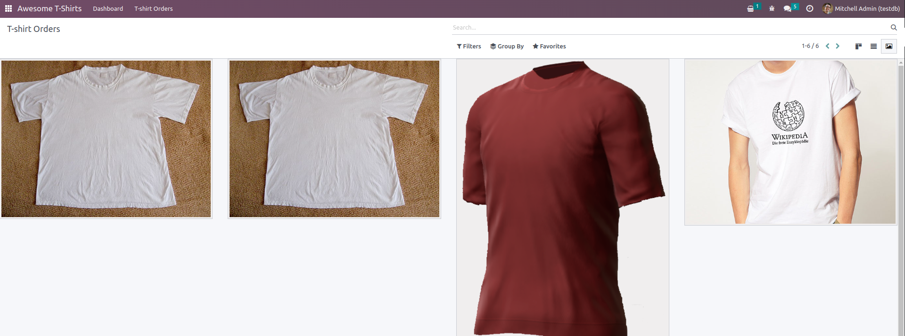

.. _howto/jstraining/06_creating_view_from_scratch:

=====================================
Chapter 6: Creating view from scratch
=====================================

Let us see how one can create a new view, completely from scratch. In a way, it is not very
difficult to do so, but there are no really good resources on how to do it. Note that most
situations should be solved by either a customized existing view, or a client action.

For this exercise, let's assume that we want to create a ``gallery`` view, which is a view that let
us represent a set of records with a image field. In our Awesome Tshirt scenario, we would like to
be able to see a set of t-shirts images.

The problem could certainly be solved with a kanban view, but this means that it is not possible to
have in the same action our normal kanban view and the gallery view.

Let us make a gallery view. Each gallery view will be defined by a ``image_field`` attribute in its
arch:

.. code-block:: xml

   <gallery image_field="some_field"/>

Setup
=====

Simply install the ``awesome_gallery`` addon. It contains the few server files necessary to add a
new view.

Make a hello world view
=======================

First step is to create a javascript implementation with a simple component.

.. exercise::

   #. Create the ``gallery_view.js``\ ,\ ``gallery_controller.js`` and ``gallery_controller.xml``
      files in ``static/src``
   #. In ``gallery_controller.js``\ , implement a simple hello world component
   #. In ``gallery_view.js``\ , import the controller, create a view object, and register it in the
      view registry under the name ``gallery``
   #. Add ``gallery`` as one of the view type in the orders action
   #. Make sure that you can see your hello world component when switching to the gallery view

   .. image:: 06_creating_view_from_scratch/view_button.png
      :align: center
      :alt: new view button

   .. image:: 06_creating_view_from_scratch/new_view.png
      :align: center
      :alt: gallery view

Use the Layout component
========================

So far, our gallery view does not look like a standard view. Let use the ``Layout`` component to
have the standard features like other views.

.. exercise::

   #. Import the ``Layout`` component and add it to the ``components`` of ``GalleryController``
   #. Update the template to use ``Layout`` (it needs a ``display`` prop, which can be found in ``props.display``\ ),

   .. image:: 06_creating_view_from_scratch/layout.png
      :align: center
      :alt: layout in the gallery view

Parse the arch
==============

For now, our gallery view does not do much. Let's start by reading the information contained in the
arch of the view.

The process of parsing an arch (xml document) is usually done with a `ArchParser`, specific to each
view. It inherits from a generic `XMLParser` class. For example, it could look like this:

.. example::

   .. code-block:: js

      import { XMLParser } from "@web/core/utils/xml";

      export class GraphArchParser extends XMLParser {
         parse(arch, fields) {
            const result = {};
            this.visitXML(arch, (node) => {
               ...
            });
            return result;
         }
      }

.. exercise::

   #. Create a ``ArchParser`` file and class, it can inherit from ``XMLParser`` in
      ``@web/core/utils/xml``
   #. Use it to read the ``image_field`` information,
   #. Update the ``gallery`` view code to add it to the props received by the controller

   .. note::
      It is probably a little overkill to do it like that, since we basically only need to read one
      attribute from the arch, but it is a design that is used by every other odoo views, since it
      let us extract some upfront processing out of the controller.

.. note:: References:

   - `example: graph arch parser <https://github.com/odoo/odoo/blob/master/addons/web/static/src/views/graph/graph_arch_parser.js>`_

Load some data
==============

Let us now get some real data.

.. exercise::

   #. Add a ``loadImages(domain) {...}`` method to the ``GalleryController``. It should perform a
      ``webSearchRead`` call to fetch records corresponding to the domain, and use the
      ``imageField`` received in props
   #. Modify the ``setup`` code to call that method in the ``onWillStart`` and
      ``onWillUpdateProps`` hooks
   #. Modify the template to display the data inside the default slot of the ``Layout`` component

   .. note::
      The loading data code will be moved into a proper model in the next exercise.

   .. image:: 06_creating_view_from_scratch/gallery_data.png
      :align: center
      :alt: showing data in the new view

Reorganize code
===============

Real views are a little bit more organized. This may be overkill in this example, but it is
intended to learn how to structure code in Odoo. Also, this will scale better with changing
requirements.

.. exercise::

   #. Move all the model code in its own class: ``GalleryModel``\ ,
   #. Move all the rendering code in a ``GalleryRenderer`` component
   #. Adapt the ``GalleryController`` and the ``gallery_view`` to make it work

Display images
==============

.. exercise::

   Update the renderer to display images in a nice way (if the field is set). If the image_field
   is empty, display an empty box instead.

   .. image:: 06_creating_view_from_scratch/tshirt_images.png
      :align: center
      :alt: displaying images

Switch to form view on click
============================

.. exercise::

   Update the renderer to react to a click on an image and switch to a form view

.. note:: References:

   - `code: switchView function <https://github.com/odoo/odoo/blob/master/addons/web/static/src/webclient/actions/action_service.js#L1329>`_

Add an optional tooltip
=======================

It is useful to have some additional information on mouse hover.

.. exercise::

   #. Update the code to allow an optional additional attribute on the arch:

      .. code-block:: xml

         <gallery image_field="some_field" tooltip_field="some_other_field"/>

   #. On mouse hover, display the content of the tooltip field (note that it should work if the
      field is a char field, a number field or a many2one field)
   #. Update the orders gallery view to add the customer as tooltip field.

   .. image:: 06_creating_view_from_scratch/image_tooltip.png
      :align: center
      :alt: tooltip

.. note:: References:

   - `code: tooltip hook <https://github.com/odoo/odoo/blob/master/addons/web/static/src/core/tooltip/tooltip_hook.js>`_

Add pagination
==============

.. exercise::

   Let's add a pager on the control panel, and manage all the pagination like a normal odoo view.
   Note that it is surprisingly difficult.

   .. image:: 06_creating_view_from_scratch/pagination.png
      :align: center
      :alt: view pagination

.. note:: References:

   - `code: usePager hook <https://github.com/odoo/odoo/blob/master/addons/web/static/src/search/pager_hook.js>`_

Validating views
================

We have a nice and useful view so far. But in real life, we may have issue with users incorrectly
encoding the ``arch`` of their Gallery view: it is currently only an unstructured piece of xml.

Let us add some validation! XML document in Odoo can be described with a rng file (relax ng), and
then validated.

.. exercise::

   #. Add a rng file that describes the current grammar:

      - a mandatory attribute ``image_field``
      - an optional attribute: ``tooltip_field``

   #. Add some code to make sure all views are validated against this rng file
   #. While we are at it, let us make sure that ``image_field`` and ``tooltip_field`` are
      fields from the current model.

   Since validating rng file is not trivial, here is a snippet to help:

   .. code-block:: python

      # -*- coding: utf-8 -*-
      import logging
      import os

      from lxml import etree

      from odoo.loglevels import ustr
      from odoo.tools import misc, view_validation

      _logger = logging.getLogger(__name__)

      _viewname_validator = None

      @view_validation.validate('viewname')
      def schema_viewname(arch, **kwargs):
         """ Check the gallery view against its schema

         :type arch: etree._Element
         """
         global _viewname_validator

         if _viewname_validator is None:
            with misc.file_open(os.path.join('modulename', 'rng', 'viewname.rng')) as f:
                  _viewname_validator = etree.RelaxNG(etree.parse(f))

         if _viewname_validator.validate(arch):
            return True

         for error in _viewname_validator.error_log:
            _logger.error(ustr(error))
         return False

.. note:: References:

   - `example: graph view rng file <https://github.com/odoo/odoo/blob/master/odoo/addons/base/rng/graph_view.rng>`_
