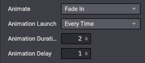

==========
Animations
==========

Eye-catching animations can bring your website to life.

On appearance
=============

In standard, you can add animations to columns when they appear, thanks to the Website Builder. Odoo
detects when your element is in the viewport and launches the animation. A large selection of
animations is available:

- Fade in
- Bounce in
- Rotate in
- Zoom in
- …

You can easily define an animation on a column in your custom theme. You need to add two classes:
`o_animate` and `o_anim_fade_in`. The second class changes depending on the type of animation you
want to use.

Add the `o_animate_both_scroll` class to launch the animation every time the column appears on the
screen. The animation is only launched once by default.

You can also define an `animation-duration` and an `animation-delay` directly in the `style`
attribute.

**Use**

.. code-block:: xml

   

       <h2>A Section Subtitle</h2>
       
Write one or two paragraphs describing your product or services.

   

.. seealso::
   `Website Animate
   <https://github.com/odoo/odoo/blob/34c0c9c1ae00aba391932129d4cefd027a9c6bbd/addons/website/static/src/scss/website.scss#L1638>`_
