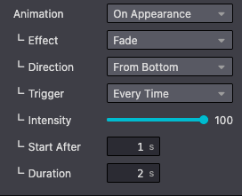
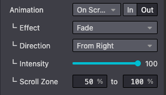
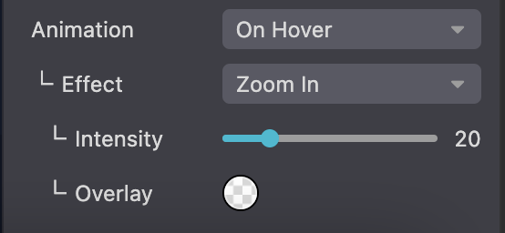

==========
Animations
==========

Odoo uses eye-catching animations that can bring your website to life. By default, we can use three
kinds of animations:

- Animations on appearance
- Animations on scroll
- Animations on hover

.. _website_themes/animations/appearance:

On appearance
=============

In standard, you can add animations to column, text and image elements when they appear, thanks
to the Website Builder. Odoo detects when your element is in the viewport and launches the
animation. A large selection of animations is available:

- Fade in
- Bounce in
- Rotate in
- Zoom in
- …

You can easily define an animation on a column in your custom theme. You need to add two classes:
`o_animate` and `o_anim_fade_in`. The second class changes depending on the type of animation you
want to use.

Add the `o_animate_both_scroll` class to launch the animation every time the column appears on the
screen. The animation is only launched once by default.

You should also define an `animation-duration` and an `animation-delay` directly in the `style`
attribute.

Additionally, you can add an animation direction. For instance, to animate the element from the
bottom of the screen, add a `o_anim_from_bottom` class and set a `--wanim-intensity` in the `style`
attribute to control the animation's direction intensity.

**Use**

.. code-block:: xml

   

       <h2>A Section Subtitle</h2>
       
Write one or two paragraphs describing your product or services.

   

.. _website_themes/animations/scroll:

On scroll
=========

In the same way as we have seen above, you can add animations on scroll to column, text and image
elements whenever the viewport scrolls through the animated element.

We can add 6 animation on scroll effects:

- Fade
- Slide
- Bounce
- Rotate
- Zoom Out
- Zoom In

Additionally, we can also set an `in` or `out` effect, an animation `direction` , the animation
`intensity`  and a `scroll zone`.

**Use**

.. code-block:: xml

    

        <h2>A Section Subtitle</h2>
        
Write one or two paragraphs describing your product or services.

    

.. list-table::
   :header-rows: 1
   :stub-columns: 1
   :widths: 30 50 50

   * - Option
     - Data attribute
     - Value type
   * - Intensity
     - `--wanim-intensity`
     - Integer (in the CSS)
   * - Scroll Zone Start
     - `data-scroll-zone-start`
     - Integer
   * - Scroll Zone End
     - `data-scroll-zone-end`
     - Integer

.. seealso::
   `Website Animate
   <https://github.com/odoo/odoo/blob/c272c49657e8b7865bb93e5f1dcc183cc7d44f17/addons/website/static/src/scss/website.scss#L2075>`_

.. _website_themes/animations/hover:

On hover
========

This third kind of animations is only related to images and triggered every time we hover on the
animated image.

We can add 6 animation on hover effects:

- Overlay
- Zoom In
- Zoom Out
- Dolly Zoom
- Outline
- Mirror Blur

**Use**

Enable animations on hover by adding the `o_animate_on_hover` class on your image tag. You can
also define the type of animation in the `data-hover-effect` attribute.

.. code-block:: xml

    

.. list-table::
   :header-rows: 1
   :stub-columns: 1
   :widths: 30 50 50

   * - Option
     - Data attribute
     - Value type
   * - Animation
     - `data-hover-effect`
     - String
   * - Intensity
     - `data-hover-effect-intensity`
     - Integer
   * - Overlay / Stroke color
     - `data-hover-effect-color`
     - Hexadecimal or RGBA value
   * - Stroke width
     - `data-hover-stroke-width`
     - Integer (saved as `px`)

.. seealso::
   `Hover effect options
   <https://github.com/odoo/odoo/blob/c272c49657e8b7865bb93e5f1dcc183cc7d44f17/addons/website/views/snippets/snippets.xml#L694>`_
