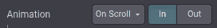
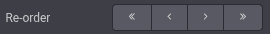
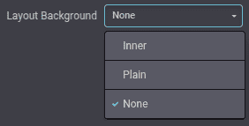
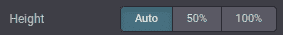
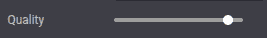

===============
Building blocks
===============

Building blocks, also known as snippets, are how users design and layout pages. They are important
XML elements of your design.

The building blocks are classified into two types:

#. **Structure blocks**: visually used as "whole rows" and distributed into multiples categories
   (:guilabel:`Intro`, :guilabel:`Columns`, :guilabel:`Content`, :guilabel:`Images`,
   :guilabel:`People`, etc)
#. **Inner Content blocks**: used inside other building blocks

At the end of this chapter, you will be able to :ref:`create custom snippets
<website_themes/building_blocks/custom>` and to add them into a dedicated category.

.. _website_themes/building_blocks/file_structure:

File structure
==============

The view templates live under `views/snippets/`:

::

   views
   └── snippets
       ├── snippets.xml
       └── s_snippet_name.xml

Client-side assets live under `static/src/` and are grouped by purpose:

::

   static
   └── src
       ├── snippets
       │   └── s_snippet_name
       │       ├── snippet_name.js
       │       ├── 000.scss
       │       └── 000.xml
       └── website_builder
           ├── snippet_name_option.js
           ├── snippet_name_option.xml
           └── snippet_name_option_plugin.js

.. seealso::
   `Snippets and groups registry in XML
   <https://github.com/odoo/odoo/blob/8fe9109b8915c940998108ded22960eb699c1f4b/addons/website/views/snippets/snippets.xml>`_

.. tip::
   JS Files under `/snippets` are interactions:
   `example <https://github.com/odoo/odoo/blob/dd148d22a03e27c0687f106aeb5179741e8f1e5e/addons/website/static/src/snippets/s_floating_blocks/floating_blocks.js>`_ with the `s_floating_blocks` snippet and the base `Interaction <https://github.com/odoo/odoo/blob/78fdef11cb79a40222e26c3a1f9971c0b45cb000/addons/web/static/src/public/interaction.js>`_ class.

.. admonition:: Demo page

   Demo data have to be installed to access this page:

   ::

      https://your-database.com/website/demo/snippets

.. _website_themes/building_blocks/layout:

Layout
======

Snippets are editable by the user using the Website Builder. Some Bootstrap classes are important as
**they trigger some Website Builder options**.

.. _website_themes/building_blocks/layout/wrapper:

Wrapper
-------

The standard main container of any snippet is a `section`. Any section element can be edited like a
block of content that you can move or duplicate.

.. code-block:: xml

   <section class="s_snippet_name" data-name="..." data-snippet="...">
       <!-- Content -->
   </section>

For inner content snippets, any other HTML tag can be used.

.. code-block:: xml

   

       <!-- Content -->
   

.. list-table::
   :header-rows: 1
   :stub-columns: 1
   :widths: 20 80

   * - Attribute
     - Description
   * - class
     - Unique class name for this snippet
   * - data-name
     - Displayed in the right panel as the name of the snippet. If not found, it will fall back to
       *Block*.
   * - data-snippet
     - Used by the system to identify the snippet

The system automatically adds the `data-name` and `data-snippet` attributes during the drag and
drop based on the template's name.

.. warning::
   Those attributes should be specifically added when a snippet is declared on a theme page.

.. warning::
   Avoid adding a `section` tag inside another `section` tag: this will trigger twice the Website
   Builder's options. You can use inner content snippets instead.

.. tip::
   To write the content of a static page with standard snippets, there are two possible approaches:

   - **Pre-build the custom static pages with the Website Builder:** Drag & drop snippets, then
      copy/paste the code into your file and clean it up.

   |  **OR**

   - **Code everything directly:** But beware of compatibility with the Website Builder. It
      requires certain classes, names, id, data, etc. to work properly. A good practice is to seek
      out the snippets code created in standard code in the Odoo source files. Pay attention that
      the Website Builder sometimes adds classes to the snippets after dropped in the page.

.. _website_themes/building_blocks/layout/elements:

Elements
--------

There is a list of "features" we can enable/disable by using specific CSS classes.

.. _website_themes/building_blocks/layout/elements/sizing:

Sizing
~~~~~~

Any large Bootstrap columns directly descending from a `.row` element (respecting Bootstrap
structure) will be triggered by the Website Builder to make them resizable.

.. code-block:: css

   .row > .col-lg-*

Add padding on columns and `<section>`.

.. code-block:: xml

   class="pt80 pb80"

.. note::

   `pb*` and `pt*` are the Odoo classes used to control the handlers. Their values are
   increased by **multiples of 8**, till a **max of 256** (0, 8, 16, 24, 32, 40, 48, ...).

Enable the columns selector.

.. code-block:: xml

   

Disable the columns amount option.

.. code-block:: xml

   

Disable the size option for all child columns.

.. code-block:: xml

   

Disable the size option for one specific column.

.. code-block:: xml

   

.. _website_themes/building_blocks/layout/elements/colors:

Colors
~~~~~~

Add a background based on the color palette for columns and `<section>`.

.. code-block:: xml

   class="o_cc o_cc*"

Disable the background color option for all columns.

.. code-block:: xml

   

Disable the background color option of one specific column.

.. code-block:: xml

   

Add a black color filter with an opacity of 50%.

.. code-block:: xml

   <section>
       

       

           <!-- Content -->
       

   </section>

Add a white color filter with an opacity of 85%.

.. code-block:: xml

   <section>
       

       

           <!-- Content -->
       

   </section>

Add a custom color filter.

.. code-block:: xml

   <section>
       

       

           <!-- Content -->
       

   </section>

Add a custom gradient filter.

.. code-block:: xml

   <section>
       

       

           <!-- Content -->
       

   </section>

.. _website_themes/building_blocks/layout/elements/features:

Features
~~~~~~~~

.. _website_themes/building_blocks/layout/non_editable_areas:

Non-editable areas
******************

Make an element not editable.

.. code-block:: xml

   

Make an element not removable.

.. code-block:: xml

   

.. _website_themes/building_blocks/layout/background:

Backgrounds
***********

Add a background image and have it centered.

.. code-block:: xml

   

Add parallax effect.

.. code-block:: xml

   <section class="parallax s_parallax_is_fixed s_parallax_no_overflow_hidden" data-scroll-background-ratio="1">
       
       

           <!-- Content -->
       

   </section>

.. todo:: Update the ref below after the Media section has been created (howto/website_themes/media_videos).

.. note::

   A video background can be set on a section. Refer to the ":doc:`media`" chapter of this documentation.

.. _website_themes/building_blocks/layout/text_highlights:

Text highlights
***************

Text highlights are SVG files that can be incorporated onto specific words or phrases to emphasize them. Text highlights offer customizable options for colors and thickness.

.. image:: building_blocks/text-highlight.jpg
   :alt: Example of text highlight
   :width: 500

.. code-block:: xml

   <h2>
      Title with
      
         
            highlighted text
            <svg fill="none" class="o_text_highlight_svg o_content_no_merge position-absolute overflow-visible top-0 start-0 w-100 h-100 pe-none">
               <!-- SVG path -->
            </svg>
         
      
   </h2>

.. list-table::
   :header-rows: 1
   :stub-columns: 1
   :widths: 35 65

   * - CSS custom property
     - Description
   * - `--text-highlight-width`
     - Thickness of the SVG borders
   * - `--text-highlight-color`
     - Color of the SVG object

.. _website_themes/building_blocks/layout/grid:

Grid layout
-----------

Grid Layout is a powerful and flexible layout system in CSS that enables users to design complex
building block layouts with ease.

.. _website_themes/building_blocks/layout/grid_use:

Use
~~~

Enable the Grid Layout by adding the `o_grid_mode` CSS class on the `row`. The number of rows in
your grid is defined by the `data-row-count` attribute. The grid always contains 12 columns. The
grid gap, specified in the `style` attribute, determines the gaps (or gutters) between rows and
columns.

.. code-block:: xml

   

      <!-- Content -->
   

.. _website_themes/building_blocks/layout/grid_items:

Items in a grid
~~~~~~~~~~~~~~~

Add items in the grid with the `o_grid_item` class. If the grid item contains an image, use the
`o_grid_item_image` class.

.. code-block:: xml
   :emphasize-lines: 2,3,4,5,6

   

      

         <!-- Content -->
      

      

         
      

   

The dimensions and position of a grid item are defined by the grid-area that can be explicitly set
in the `style` attribute along with the z-index.

The `g-height-*` and `g-col-lg-*` classes are generated by the Website Builder for editing purposes.

.. _website_themes/building_blocks/layout/grid_items_padding:

Grid item padding
~~~~~~~~~~~~~~~~~

.. code-block:: xml
   :emphasize-lines: 2

   

      

         <!-- Content -->
      

   

.. list-table::
   :header-rows: 1
   :stub-columns: 1
   :widths: 35 65

   * - CSS custom property
     - Description
   * - `--grid-item-padding-y`
     - Vertical paddings (Y axis)
   * - `--grid-item-padding-x`
     - Horizontal paddings (X axis)

.. _website_themes/building_blocks/compatibility:

Compatibility system
====================

When a snippet has a `data-vcss`, `data-vjs` and/or `data-vxml` attribute, it means it is an updated
 version, not the original one.

.. code-block:: xml

   <section class="s_snippet_name" data-vcss="001" data-vxml="001" data-js="001">
       <!-- Content -->
   </section>

These data attributes indicate to the system which file version to load for that
snippet (e.g., :file:`001.js`, :file:`002.scss`).

.. _website_themes/building_blocks/custom:

Custom snippet
==============

Some more specific needs will require the creation of custom snippets. Here is how to create a
custom snippet/

.. _website_themes/building_blocks/custom/template:

Template
--------

Create first the snippet template. Then, add it to the list and make it available via the Website
Builder.

1. Declaration
~~~~~~~~~~~~~~

First, create the template of the custom snippet:

.. code-block:: xml
   :caption: ``/website_airproof/views/snippets/s_airproof_snippet.xml``

   <?xml version="1.0" encoding="utf-8"?>
   <odoo>

       <template id="s_airproof_snippet" name="...">
           <section class="s_airproof_snippet">
               <!-- Content -->
           </section>
       </template>

   </odoo>

.. warning::
   `data-name` and `data-snippet` attributes have to be specified when a snippet is declared on a
   theme page. Otherwise, the snippet won't be recognised by the Website Builder and issues might
   occur whenever a database upgrade is done. Additionally, remember that the name attribute is
   shown as the name of your custom snippet in the :guilabel:`Blocks` section of the options panel.

.. tip::
   - Use Bootstrap native classes as much as possible.
   - Prefix all your custom classes.
   - Use underscore lowercase notation to name classes, e.g., `.x_nav`, `.x_nav_item`.
   - Avoid using ID attribute within your `section` as several instances of a snippet may appear
     throughout the page (An ID attribute has to be unique on a page).

Add the custom snippet to the list of standard snippets, so the user can drag and drop it on the
page, directly from the edit panel.

2. Group creation
~~~~~~~~~~~~~~~~~

Add a group at the top of the list (feel free to put it where needed in this list).

.. code-block:: xml
   :caption: ``/website_airproof/views/snippets/snippets.xml``

   <template id="snippets" inherit_id="website.snippets" name="Airproof - Snippets">
      <!-- Create the group -->
      <xpath expr="//snippets[@id='snippet_groups']/*[1]" position="before">
         <t snippet-group="airproof" t-snippet="website.s_snippet_group" string="Airproof" t-thumbnail="/website_airproof/static/src/img/wbuilder/s_airproof_group_thumbnail.svg"/>
      </xpath>
   </template>

.. list-table::
   :header-rows: 1
   :stub-columns: 1
   :widths: 20 80

   * - Attribute
     - Description
   * - snippet-group
     - ID of the group
   * - t-snippet
     - Inherited template ID
   * - string
     - Group name displayed to the users
   * - t-thumbnail
     - The path to the thumbnail of the group

3. Snippet addition
~~~~~~~~~~~~~~~~~~~

Then add the custom snippet into the `<snippets id="snippet_structure">` which contains
all existing ones on the same level. The Website Builder will split them automatically into
categories by reading the `group` attribute on the `<t t-snippet="">`

.. code-block:: xml
   :caption: ``/website_airproof/views/snippets/snippets.xml``
   :emphasize-lines: 7-12

   <template id="snippets" inherit_id="website.snippets" name="Airproof - Snippets">
      <!-- Create the group -->
      <xpath expr="//snippets[@id='snippet_groups']/*[1]" position="before">
         <t snippet-group="airproof" t-snippet="website.s_snippet_group" string="Airproof" t-thumbnail="/website_airproof/static/src/img/wbuilder/s_airproof_group_thumbnail.svg"/>
      </xpath>

      <!-- Add the custom snippet to the group -->
      <xpath expr="//snippets[@id='snippet_structure']/*[1]" position="before">
         <t t-snippet="website_airproof.s_airproof_snippet" string="Custom snippet" group="airproof">
            <keywords>Snippet</keywords>
         </t>
      </xpath>
   </template>

.. list-table::
   :header-rows: 1
   :stub-columns: 1
   :widths: 20 80

   * - Attribute
     - Description
   * - t-snippet
     - The snippet template to use
   * - group
     - The group in which the snippet is added.
   * - <keywords>
     - Keywords entered by the user in the search field in the Snippets panel

.. _website_themes/building_blocks/custom/inner_content_snippet:

Inner content snippet
~~~~~~~~~~~~~~~~~~~~~

To make a custom snippet appear in the :guilabel:`Inner content` list, add it to `snippet_content`
instead:

.. code-block:: xml
   :caption: ``/website_airproof/views/snippets/snippets.xml``

   <template id="snippets" inherit_id="website.snippets" name="Airproof - Snippets">
      <!-- Add the custom snippet to the group -->
      <xpath expr="//snippets[@id='snippet_content']/*[1]" position="before">
         <t t-snippet="website_airproof.s_airproof_snippet" string="Custom snippet" t-thumbnail="/website_airproof/static/src/img/wbuilder/s_airproof_snippet.svg" />
      </xpath>
   </template>

.. _website_themes/building_blocks/custom/options/inner_content:

Inner content selectors
***********************

To make a custom snippet "inner content" (droppable in another building block), add its selector
to the `so_content_addition_selector` resource, which contains all selectors for existing inner
content building blocks.

.. code-block:: javascript
   :caption: ``/website_airproof/static/src/builder/airproof_snippet_option_plugin.js``

   export class AirproofSnippetOptionPlugin extends Plugin {
       static id = "airproofSnippetOption";
       resources = {
           so_content_addition_selector: [".s_airproof_snippet"],
       };
   }

.. important::
   - Don't forget to add a `t-thumbnail` and remove the `group` attribute as this kind of building
     blocks is directly available in the right options panel of the Website Builder.
   - Don't forget to :ref:`add the snippet to the list of all available "Inner content" snippets
     <website_themes/building_blocks/custom/inner_content_snippet>`.

.. _website_themes/building_blocks/custom/options:

Options
-------

Options allow users to edit a snippet's appearance and behavior using the Website Builder. Options
are OWL components defined in JavaScript and rendered with XML templates. Each option is registered
through a builder plugin and loaded in the editor assets.

.. note::
   Add the JavaScript and XML files to the `website.website_builder_assets` bundle in your module.

.. seealso::
   - `HTML Builder options <https://github.com/odoo/odoo/tree/edc67e78046cddb5ca06aa8f928075337a328aa9/addons/html_builder/static/src/plugins>`_
   - `Website builder options <https://github.com/odoo/odoo/tree/edc67e78046cddb5ca06aa8f928075337a328aa9/addons/website/static/src/builder/plugins>`_
   - `Alert option example <https://github.com/odoo/odoo/blob/edc67e78046cddb5ca06aa8f928075337a328aa9/addons/html_builder/static/src/plugins/alert_option_plugin.js>`_

.. _website_themes/building_blocks/custom/options/template:

Component and template
~~~~~~~~~~~~~~~~~~~~~~

Define the option component and register it in a builder plugin.

.. code-block:: javascript
   :caption: ``/website_airproof/static/src/builder/airproof_snippet_option_plugin.js``

   import { BaseOptionComponent } from "@html_builder/core/utils";
   import { Plugin } from "@html_editor/plugin";
   import { registry } from "@web/core/registry";

   export class AirproofSnippetOption extends BaseOptionComponent {
       static template = "website_airproof.AirproofSnippetOption";
       static selector = ".s_airproof_snippet";
       static applyTo = ":scope > .row";
   }

   export class AirproofSnippetOptionPlugin extends Plugin {
       static id = "airproofSnippetOption";
       resources = {
           builder_options: [AirproofSnippetOption],
       };
   }

   registry.category("website-plugins").add(
       AirproofSnippetOptionPlugin.id,
       AirproofSnippetOptionPlugin
   );

Then define the XML template rendered in the options panel.

.. code-block:: xml
   :caption: ``/website_airproof/static/src/builder/airproof_snippet_option.xml``
   :emphasize-lines: 3-16

   <templates xml:space="preserve">
      <t t-name="website_airproof.AirproofSnippetOption">
         <BuilderRow label.translate="Layout">
            <BuilderSelect>
               <BuilderSelectItem classAction="''">Default</BuilderSelectItem>
               <BuilderSelectItem classAction="'s_airproof_snippet_portrait'">Portrait</BuilderSelectItem>
               <BuilderSelectItem classAction="'s_airproof_snippet_square'">Square</BuilderSelectItem>
               <BuilderSelectItem classAction="'s_airproof_snippet_landscape'">Landscape</BuilderSelectItem>
            </BuilderSelect>
         </BuilderRow>
         <BuilderRow label.translate="Space">
            <BuilderButtonGroup>
               <BuilderButton classAction="'mt-0'">1</BuilderButton>
               <BuilderButton classAction="'mt-3'">2</BuilderButton>
               <BuilderButton classAction="'mt-5'">3</BuilderButton>
            </BuilderButtonGroup>
         </BuilderRow>
      </t>
   </templates>

.. _website_themes/building_blocks/custom/options/option_logic:

Option logic
~~~~~~~~~~~~

Define option behavior in JavaScript on the `BaseOptionComponent` class and register any
`BuilderAction` used by the template in the builder plugin resources.

.. _website_themes/building_blocks/custom/options/plugin_api:

Plugin API
**********

Builder plugins register option components, actions, and editor hooks through the `resources`
object. They are added to the `website-plugins` registry category to be accessible by the editor.

.. list-table::
   :header-rows: 1
   :stub-columns: 1
   :widths: 30 70

   * - Property
     - Purpose
   * - `static dependencies`
     - Declare required plugins before setup runs.
   * - `static shared`
     - Expose shared methods to other plugins.
   * - `setup()`
     - Initialize plugin state.

.. list-table::
   :header-rows: 1
   :stub-columns: 1
   :widths: 30 70

   * - Resources
     - Purpose
   * - `builder_options`
     - Register `BaseOptionComponent` classes for the options panel.
   * - `builder_actions`
     - Register `BuilderAction` classes referenced by option templates.
   * - `dropzone_selector`
     - Define snippet drop rules (`selector`, `dropIn`, `dropNear`, `exclude`, `excludeNearParent`).
   * - `so_content_addition_selector`
     - Extend the list of inner content selectors.
   * - **Handlers**
     - Editor lifecycle hooks registered on the plugin.
   * - `on_snippet_dropped_handlers`
     - Called after a snippet is dropped and inserted in the DOM.
   * - `on_cloned_handlers`
     - Called after an element is cloned and inserted in the DOM.
   * - `on_will_remove_handlers`
     - Called just before an element is removed.
   * - `on_removed_handlers`
     - Called after an element has been removed.
   * - `clean_for_save_handlers`
     - Called on a cleaned clone of the DOM before saving.
   * - `before_save_handlers`
     - Called at the beginning of the save process.
   * - `after_save_handlers`
     - Called after the save process completes.

.. seealso::
   `Full resources list <https://github.com/odoo/odoo/blob/edc67e78046cddb5ca06aa8f928075337a328aa9/addons/html_builder/static/src/%40types/plugins.d.ts#L63-L153>`_

.. _website_themes/building_blocks/custom/options/base_option_component:

BaseOptionComponent API
***********************

Option components inherit from `BaseOptionComponent` and define static metadata plus optional
component behavior.

.. list-table::
   :header-rows: 1
   :stub-columns: 1
   :widths: 30 70

   * - Property
     - Description
   * - `static template`
     - OWL template name rendered in the options panel.
   * - `static selector`
     - CSS selector that binds the option to elements.
   * - `static exclude`
     - CSS selector of elements to exclude from the match.
   * - `static applyTo`
     - CSS selector targeting a child element of the matched snippet.
   * - `static components`
     - Child builder components used in the template.
   * - `setup()`
     - Initialize component state.

.. _website_themes/building_blocks/custom/options/binding:

Binding
~~~~~~~

.. _website_themes/building_blocks/custom/options/binding/selector:

selector
********

Option components declare a selector property that controls when they appear.

`selector` binds the option component to elements matching a CSS selector (class, ID, etc). The
option appears when a matching element is selected.

.. code-block:: javascript

   export class AirproofSnippetOption extends BaseOptionComponent {
       static selector = "section, h1, .custom_class, #custom_id";
   }

It can be used in combination with `exclude` or `applyTo`.

.. _website_themes/building_blocks/custom/options/binding/apply_to:

applyTo
*******

`applyTo` allows the option to apply to a child element of the matched selector.

.. code-block:: javascript

   export class AirproofSnippetOption extends BaseOptionComponent {
       static selector = ".s_airproof_snippet";
       static applyTo = ".row";
   }

.. _website_themes/building_blocks/custom/options/binding/exclude:

exclude
*******

`exclude` removes specific selectors from the match.

.. code-block:: javascript
   :caption: The option appears if an `<ul>` tag (without `.navbar-nav` class) is selected

   export class AirproofSnippetOption extends BaseOptionComponent {
       static selector = "ul";
       static exclude = ".navbar-nav";
   }

.. _website_themes/building_blocks/custom/options/binding/drop_in:

dropzone_selector (dropIn)
**************************

`dropIn` defines the elements the snippet can be dropped into.

.. code-block:: javascript

   export class AirproofSnippetOptionPlugin extends Plugin {
       static id = "airproofSnippetOption";
       resources = {
           dropzone_selector: {
               selector: ".s_airproof_snippet",
               dropIn: ".x_custom_location",
           },
       };
   }

.. _website_themes/building_blocks/custom/options/binding/drop_near:

dropzone_selector (dropNear)
****************************

`dropNear` defines the elements the snippet can be dropped next to.

.. code-block:: javascript

   export class AirproofSnippetOptionPlugin extends Plugin {
       static id = "airproofSnippetOption";
       resources = {
           dropzone_selector: {
               selector: ".s_airproof_snippet_card",
               dropNear: ".card",
           },
       };
   }

.. _website_themes/building_blocks/custom/options/layout_fields:

Layout & fields
~~~~~~~~~~~~~~~

Use builder components to compose the options panel UI.

.. _website_themes/building_blocks/custom/options/layout_fields/builder_row:

`<BuilderRow>`
**************

Create a labeled row to group option fields. Use `label.translate` for the row title and `level` to
indent nested rows.

.. code-block:: xml

   <BuilderRow label.translate="My option">
      <BuilderSelect>...</BuilderSelect>
      <BuilderButtonGroup>...</BuilderButtonGroup>
   </BuilderRow>

The perfect example for this case is the :guilabel:`Animation` row:

.. _website_themes/building_blocks/custom/options/layout_fields/builder_button:

`<BuilderButton>`
*****************

This tag is used inside `<BuilderButtonGroup>` or on its own.

.. code-block:: xml
   :emphasize-lines: 2-4

   <BuilderButtonGroup>
      <BuilderButton classAction="'mt-0'">1</BuilderButton>
      <BuilderButton classAction="'mt-3'">2</BuilderButton>
      <BuilderButton classAction="'mt-5'">3</BuilderButton>
   </BuilderButtonGroup>

Add `classAction` to indicate which class is applied to the targeted element when this choice is
selected. Like any XML node, add other attributes to improve the style and/or the user experience.

.. code-block:: xml

   <BuilderButton
      icon="'fa-align-right'"
      title.translate="Align right"
      classAction="'ms-auto'" />

.. _website_themes/building_blocks/custom/options/layout_fields/builder_select:

`<BuilderSelect>`
*****************

Formats the option as a dropdown list.

.. code-block:: xml

   <BuilderSelect>
      <BuilderSelectItem classAction="''">Default</BuilderSelectItem>
      <BuilderSelectItem classAction="'s_layout_variant'">Variant</BuilderSelectItem>
   </BuilderSelect>

.. _website_themes/building_blocks/custom/options/layout_fields/builder_button_group:

`<BuilderButtonGroup>`
**********************

Formats the option as buttons next to each other and handles selection state.

.. code-block:: xml

   <BuilderButtonGroup>...</BuilderButtonGroup>

.. _website_themes/building_blocks/custom/options/layout_fields/builder_checkbox:

`<BuilderCheckbox>`
*******************

Formats the option as a toggle switch.

.. code-block:: xml

   <BuilderCheckbox
      classAction="'s_airproof_snippet_tooltip'" />

.. _website_themes/building_blocks/custom/options/layout_fields/builder_range:

`<BuilderRange>`
****************

Formats the option as a slider.

`<BuilderRange>` can be used to set a numeric value:

.. code-block:: xml

   <BuilderRange
      action="'setSpeed'"
      min="0"
      max="10"
      step="1"
      displayRangeValue="true" />

It can also be used to map each step to an entry in `actionParam`:

.. code-block:: xml

   <BuilderRange
      action="'setClassRange'"
      actionParam="['o_spc-none', 'o_spc-small', 'o_spc-medium', 'o_spc-big']"
      max="3" />

.. _website_themes/building_blocks/custom/options/layout_fields/builder_input:

`<BuilderNumberInput>` and `<BuilderTextInput>`
***********************************************

Format the option as a numeric or text field.

.. code-block:: xml
   :emphasize-lines: 3-5
   :caption: `unit`, `saveUnit` and `step` are optional

   <BuilderNumberInput
      styleAction="'animation-duration'"
      unit="'s'"
      saveUnit="'ms'"
      step="0.1" />

`<BuilderNumberInput>` comes with optional props:

.. list-table::
   :header-rows: 1
   :stub-columns: 1
   :widths: 30 70

   * - Attribute
     - Description
   * - `unit`
     - Shows the expected unit of measure.
   * - `saveUnit`
     - Set the unit of measure to which the value entered by the user is converted and saved.
   * - `step`
     - Set the numerical value by which the field can be incremented.

.. _website_themes/building_blocks/custom/options/layout_fields/builder_list:

`<BuilderList>`
***************

Render and edit a list of items (add, remove, reorder) in the options panel. Useful for prefilled
values, custom options, or settings that map to a list of objects.

.. code-block:: xml
   :caption: Simple list with two fields

   <BuilderList
      action="'setPrefilledOptions'"
      addItemTitle.translate="Add"
      itemShape="{ value: 'number', description: 'text' }"
      default="{ value: '50', description: 'Add a description here' }"
      columnWidth="{ value: 'w-25' }"
      sortable="true" />

.. list-table::
   :header-rows: 1
   :stub-columns: 1
   :widths: 30 70

   * - Prop
     - Description
   * - `itemShape`
     - Field types per column. Supported types: `text`, `number`, `boolean`, `exclusive_boolean`.
   * - `default`
     - Default values for new items. Keys must match `itemShape`.
   * - `records`
     - Optional list of available records (JSON list). When set, the add button becomes a dropdown.
   * - `defaultNewValue`
     - Extra values injected when creating a new item (e.g., record ID).
   * - `sortable`
     - Allow drag-and-drop reordering (default: true).
   * - `hiddenProperties`
     - Hide specific columns by name.
   * - `columnWidth`
     - CSS classes applied per column (e.g., `w-25`).
   * - `forbidLastItemRemoval`
     - Prevent removing the last remaining item.

.. _website_themes/building_blocks/custom/options/layout_fields/builder_colorpicker:

`<BuilderColorPicker>`
**********************

Formats the option as a color/gradient to choose from.

.. code-block:: xml

   <BuilderColorPicker
      action="'selectFilterColor'"
      defaultOpacity="50"
      enabledTabs="['custom', 'gradient']" />

.. list-table::
   :header-rows: 1
   :stub-columns: 1
   :widths: 30 70

   * - Attribute
     - Description
   * - `enabledTabs`
     - Restrict the available picker tabs (e.g., `['theme', 'gradient', 'custom']`).
   * - `defaultColor`
     - Default color shown when no selection is applied.
   * - `defaultOpacity`
     - Default alpha value for the picker.

.. _website_themes/building_blocks/custom/options/actions:

Actions
~~~~~~~

Builder components trigger `BuilderAction` classes. Use shorthand action props or declare custom
actions and reference them by `action` id in the template.

.. _website_themes/building_blocks/custom/options/actions/core:

Core actions
************

Core actions are available as shorthand props on builder components.

.. list-table::
   :header-rows: 1
   :stub-columns: 1
   :widths: 35 65

   * - Action/prop
     - Description
   * - `classAction`
     - Add/remove CSS classes on the target element.
   * - `styleAction`
     - Set an inline style property on the target element.
   * - `attributeAction`
     - Set or remove a DOM attribute.
   * - `dataAttributeAction`
     - Set or remove a dataset key (without the `data-` prefix).
   * - `setClassRange`
     - Apply one class from a predefined list based on the selected range value.
   * - `action` + `actionParam`
     - Call a custom action registered in the builder plugin.

.. _website_themes/building_blocks/custom/options/actions/lifecycle:

Action lifecycle
****************

`BuilderAction` classes can implement a lifecycle that the builder invokes depending on the widget:

.. list-table::
   :header-rows: 1
   :stub-columns: 1
   :widths: 20 80

   * - Method
     - Description
   * - `prepare`
     - Prepare asynchronous data before a component is used.
   * - `load`
     - Load data before `apply` when actions are previewed.
   * - `apply`
     - Apply the action to the targeted element.
   * - `clean`
     - Reset the action when a new choice supersedes it.
   * - `getValue`
     - Return the current value for input widgets.
   * - `isApplied`
     - Return whether the action is active for selectable widgets.
   * - `getPriority`
     - Decide which selectable item wins when multiple are valid.

.. _website_themes/building_blocks/custom/options/actions/custom:

Custom actions
**************

To create custom behaviors, define a `BuilderAction` and register it in your builder plugin.

.. code-block:: javascript
   :caption: ``/website_airproof/static/src/builder/airproof_snippet_option_plugin.js``

   import { BuilderAction } from "@html_builder/core/builder_action";
   import { Plugin } from "@html_editor/plugin";
   import { registry } from "@web/core/registry";

   export class AirproofLayoutAction extends BuilderAction {
       static id = "airproofLayout";
       apply({ editingElement, params: { mainParam } }) {
           editingElement.classList.toggle("s_airproof_snippet_portrait", mainParam === "portrait");
           editingElement.classList.toggle("s_airproof_snippet_square", mainParam === "square");
       }
       isApplied({ editingElement, params: { mainParam } }) {
           return editingElement.classList.contains(`s_airproof_snippet_${mainParam}`);
       }
   }

   export class AirproofSnippetOptionPlugin extends Plugin {
       static id = "airproofSnippetOption";
       resources = {
           builder_actions: { AirproofLayoutAction },
       };
   }

   registry.category("website-plugins").add(
       AirproofSnippetOptionPlugin.id,
       AirproofSnippetOptionPlugin
   );

Finally, the custom action can be called from the XML template.

.. code-block:: xml
   :emphasize-lines: 3-5

   <t t-name="website_airproof.AirproofSnippetOption">
      <BuilderRow label.translate="Layout">
         <BuilderButtonGroup action="'airproofLayout'">
            <BuilderButton actionParam="'portrait'">Portrait</BuilderButton>
            <BuilderButton actionParam="'square'">Square</BuilderButton>
         </BuilderButtonGroup>
      </BuilderRow>
   </t>

.. seealso::
   - `Builder actions API <https://github.com/odoo/odoo/blob/edc67e78046cddb5ca06aa8f928075337a328aa9/addons/html_builder/static/src/core/builder_action.js>`_

.. _website_themes/building_blocks/custom/dynamic:

Dynamic Content templates
-------------------------

By default, Dynamic Content blocks have a selection of templates available in the Website Builder.
Custom templates can also be added to the list automatically by use the same naming convention for
the template id attribute.

.. _website_themes/building_blocks/custom/dynamic/call:

Call the template
~~~~~~~~~~~~~~~~~

The selected dynamic snippet replace the `
` placeholder by
the right template based on the `data-template-key` and the custom CSS class:

.. code-block:: xml
   :emphasize-lines: 3,4

   <section
      data-snippet="s_blog_posts"
      data-name="Blog Posts"
      class="s_blog_post_airproof s_dynamic_snippet_blog_posts s_blog_posts_effect_marley s_dynamic pb32 o_cc o_cc2 o_dynamic_empty"
      data-template-key="website_airproof.dynamic_filter_template_blog_post_airproof"
      data-filter-by-blog-id="-1"
      data-number-of-records="3"
      data-number-of-elements="3"
   >
      

         

               

                  Your Dynamic Snippet will be displayed here... This message is displayed because you did not provided both a filter and a template to use. 
               

         

         

      

   </section>

.. _website_themes/building_blocks/custom/dynamic/examples:

Examples
~~~~~~~~

.. tabs::

   .. tab:: Blog posts

      .. code-block:: xml
         :caption: ``/website_airproof/views/snippets/s_snippet_name.xml``

         <template id="dynamic_filter_template_blog_post_airproof" name="...">
            

               <t t-set="record" t-value="data['_record']"/>
               <!-- Content -->
            

         </template>

      .. list-table::
         :header-rows: 1
         :stub-columns: 1
         :widths: 20 80

         * - Attribute
           - Description
         * - id
           - The ID of the template. Has to start with `dynamic_filter_template_blog_post_`
         * - name
           - Human-readable name of the template

   .. tab:: Products

      .. code-block:: xml
         :caption: ``/website_airproof/views/snippets/s_snippet_name.xml``

         <template id="dynamic_filter_template_product_product_airproof" name="...">
            <t t-foreach="records" t-as="data" data-number-of-elements="4" data-number-of-elements-sm="1" data-number-of-elements-fetch="8">
               <t t-set="record" t-value="data['_record']"/>
               <!-- Content -->
            </t>
         </template>

      .. list-table::
         :header-rows: 1
         :stub-columns: 1
         :widths: 40 60

         * - Attribute
           - Description
         * - id
           - The ID of the template. Has to start with `dynamic_filter_template_product_product_`
         * - name
           - Human-readable name of the template
         * - data-number-of-elements
           - Number of products per slide on desktop
         * - data-number-of-elements-sm
           - Number of products per slide on mobile
         * - data-number-of-elements-fetch
           - The total amount of fetched products

   .. tab:: Events

      .. code-block:: xml
         :caption: ``/website_airproof/views/snippets/s_snippet_name.xml``

         <template id="dynamic_filter_template_event_event_airproof" name="...">
            

               <t t-set="record" t-value="data['_record']._set_tz_context()"/>
               <!-- Content -->
            

         </template>

      .. list-table::
         :header-rows: 1
         :stub-columns: 1
         :widths: 20 80

         * - Attribute
           - Description
         * - id
           - The ID of the template. Has to start with `dynamic_filter_template_event_event_`
         * - name
           - Human-readable name of the template
