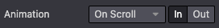

===============
Building blocks
===============

Building blocks, also known as snippets, are how users design and layout pages. They are important
XML elements of your design.

The building blocks are classified into two types:

#. **Structure blocks**: visually used as "whole rows" and distributed into multiples categories
   (:guilabel:`Intro`, :guilabel:`Columns`, :guilabel:`Content`, :guilabel:`Images`,
   :guilabel:`People`, etc)
#. **Inner Content blocks**: used inside other building blocks

At the end of this chapter, you will be able to :ref:`create custom snippets
<website_themes/building_blocks/custom>` and to add them into a dedicated category.

.. _website_themes/building_blocks/file_structure:

File structure
==============

The layout's file structure is the following.

::

   views
   ├── snippets
   │   └── options.xml
   │   └── s_snippet_name.xml

The styles' file structure is the following.

::

   static
   ├── src
   │   └── snippets
   │       └── s_snippet_name
   │           └── 000.js
   │           └── 000.scss
   │           └── 000.xml
   │           └── options.js

.. seealso::
   `XML templates of the different snippets
   <https://github.com/odoo/odoo/blob/ccb78f7af2a4413836a969ff8009dc3df6c2df33/addons/website/views/snippets/snippets.xml>`_

.. admonition:: Demo page

   Demo data have to be installed to access this page:

   ::

      https://your-database.com/website/demo/snippets

.. _website_themes/building_blocks/layout:

Layout
======

Snippets are editable by the user using the Website Builder. Some Bootstrap classes are important as
**they trigger some Website Builder options**.

.. _website_themes/building_blocks/layout/wrapper:

Wrapper
-------

The standard main container of any snippet is a `section`. Any section element can be edited like a
block of content that you can move or duplicate.

.. code-block:: xml

   <section class="s_snippet_name" data-name="..." data-snippet="...">
       <!-- Content -->
   </section>

For inner content snippets, any other HTML tag can be used.

.. code-block:: xml

   

       <!-- Content -->
   

.. list-table::
   :header-rows: 1
   :stub-columns: 1
   :widths: 20 80

   * - Attribute
     - Description
   * - class
     - Unique class name for this snippet
   * - data-name
     - Displayed in the right panel as the name of the snippet. If not found, it will fall back to
       *Block*.
   * - data-snippet
     - Used by the system to identify the snippet

The system automatically adds the `data-name` and `data-snippet` attributes during the drag and
drop based on the template's name.

.. warning::
   Those attributes should be specifically added when a snippet is declared on a theme page.

.. warning::
   Avoid adding a `section` tag inside another `section` tag: this will trigger twice the Website
   Builder's options. You can use inner content snippets instead.

.. tip::
   To write the content of a static page with standard snippets, there are two possible approaches:

   - **Pre-build the custom static pages with the Website Builder:** Drag & drop snippets, then
      copy/paste the code into your file and clean it up.

   |  **OR**

   - **Code everything directly:** But beware of compatibility with the Website Builder. It
      requires certain classes, names, id, data, etc. to work properly. A good practice is to seek
      out the snippets code created in standard code in the Odoo source files. Pay attention that
      the Website Builder sometimes adds classes to the snippets after dropped in the page.

.. _website_themes/building_blocks/layout/elements:

Elements
--------

There is a list of "features" we can enable/disable by using specific CSS classes.

.. _website_themes/building_blocks/layout/elements/sizing:

Sizing
~~~~~~

Any large Bootstrap columns directly descending from a `.row` element (respecting Bootstrap
structure) will be triggered by the Website Builder to make them resizable.

.. code-block:: css

   .row > .col-lg-*

Add padding on columns and `<section>`.

.. code-block:: xml

   class="pt80 pb80"

.. note::

   `pb*` and `pt*` are the Odoo classes used to control the handlers. Their values are
   increased by **multiples of 8**, till a **max of 256** (0, 8, 16, 24, 32, 40, 48, ...).

Enable the columns selector.

.. code-block:: xml

   

Disable the columns amount option.

.. code-block:: xml

   

Disable the size option for all child columns.

.. code-block:: xml

   

Disable the size option for one specific column.

.. code-block:: xml

   

.. _website_themes/building_blocks/layout/elements/colors:

Colors
~~~~~~

Add a background based on the color palette for columns and `<section>`.

.. code-block:: xml

   class="o_cc o_cc*"

Disable the background color option for all columns.

.. code-block:: xml

   

Disable the background color option of one specific column.

.. code-block:: xml

   

Add a black color filter with an opacity of 50%.

.. code-block:: xml

   <section>
       

       

           <!-- Content -->
       

   </section>

Add a white color filter with an opacity of 85%.

.. code-block:: xml

   <section>
       

       

           <!-- Content -->
       

   </section>

Add a custom color filter.

.. code-block:: xml

   <section>
       

       

           <!-- Content -->
       

   </section>

Add a custom gradient filter.

.. code-block:: xml

   <section>
       

       

           <!-- Content -->
       

   </section>

.. _website_themes/building_blocks/layout/elements/features:

Features
~~~~~~~~

.. _website_themes/building_blocks/layout/non_editable_areas:

Non-editable areas
******************

Make an element not editable.

.. code-block:: xml

   

Make an element not removable.

.. code-block:: xml

   

.. _website_themes/building_blocks/layout/background:

Backgrounds
***********

Add a background image and have it centered.

.. code-block:: xml

   

Add parallax effect.

.. code-block:: xml

   <section class="parallax s_parallax_is_fixed s_parallax_no_overflow_hidden" data-scroll-background-ratio="1">
       
       

           <!-- Content -->
       

   </section>

.. todo:: Update the ref below after the Media section has been created (howto/website_themes/media_videos).

.. note::

   A video background can be set on a section. Refer to the ":doc:`media`" chapter of this documentation.

.. _website_themes/building_blocks/layout/text_highlights:

Text highlights
***************

Text highlights are SVG files that can be incorporated onto specific words or phrases to emphasize them. Text highlights offer customizable options for colors and thickness.

.. code-block:: xml

   <h2>
      Title with
      
         
            highlighted text
            <svg fill="none" class="o_text_highlight_svg o_content_no_merge position-absolute overflow-visible top-0 start-0 w-100 h-100 pe-none">
               <!-- SVG path -->
            </svg>
         
      
   </h2>

.. list-table::
   :header-rows: 1
   :stub-columns: 1
   :widths: 35 65

   * - CSS custom property
     - Description
   * - `--text-highlight-width`
     - Thickness of the SVG borders
   * - `--text-highlight-color`
     - Color of the SVG object

.. _website_themes/building_blocks/layout/grid:

Grid layout
-----------

Grid Layout is a powerful and flexible layout system in CSS that enables users to design complex
building block layouts with ease.

.. _website_themes/building_blocks/layout/grid_use:

Use
~~~

Enable the Grid Layout by adding the `o_grid_mode` CSS class on the `row`. The number of rows in
your grid is defined by the `data-row-count` attribute. The grid always contains 12 columns. The
grid gap, specified in the `style` attribute, determines the gaps (or gutters) between rows and
columns.

.. code-block:: xml

   

      <!-- Content -->
   

.. _website_themes/building_blocks/layout/grid_items:

Items in a grid
~~~~~~~~~~~~~~~

Add items in the grid with the `o_grid_item` class. If the grid item contains an image, use the
`o_grid_item_image` class.

.. code-block:: xml
   :emphasize-lines: 2,3,4,5,6

   

      

         <!-- Content -->
      

      

         
      

   

The dimensions and position of a grid item are defined by the grid-area that can be explicitly set
in the `style` attribute along with the z-index.

The `g-height-*` and `g-col-lg-*` classes are generated by the Website Builder for editing purposes.

.. _website_themes/building_blocks/layout/grid_items_padding:

Grid item padding
~~~~~~~~~~~~~~~~~

.. code-block:: xml
   :emphasize-lines: 2

   

      

         <!-- Content -->
      

   

.. list-table::
   :header-rows: 1
   :stub-columns: 1
   :widths: 35 65

   * - CSS custom property
     - Description
   * - `--grid-item-padding-y`
     - Vertical paddings (Y axis)
   * - `--grid-item-padding-x`
     - Horizontal paddings (X axis)

.. _website_themes/building_blocks/compatibility:

Compatibility system
====================

When a snippet has a `data-vcss`, `data-vjs` and/or `data-vxml` attribute, it means it is an updated
 version, not the original one.

.. code-block:: xml

   <section class="s_snippet_name" data-vcss="001" data-vxml="001" data-js="001">
       <!-- Content -->
   </section>

These data attributes indicate to the system which file version to load for that
snippet (e.g., :file:`001.js`, :file:`002.scss`).

.. _website_themes/building_blocks/custom:

Custom snippet
==============

Some more specific needs will require the creation of custom snippets. Here is how to create a
custom snippet/

.. _website_themes/building_blocks/custom/template:

Template
--------

Create first the snippet template. Then, add it to the list and make it available via the Website
Builder.

1. Declaration
~~~~~~~~~~~~~~

First, create the template of the custom snippet:

.. code-block:: xml
   :caption: ``/website_airproof/views/snippets/s_airproof_snippet.xml``

   <?xml version="1.0" encoding="utf-8"?>
   <odoo>

       <template id="s_airproof_snippet" name="...">
           <section class="s_airproof_snippet">
               <!-- Content -->
           </section>
       </template>

   </odoo>

.. warning::
   `data-name` and `data-snippet` attributes have to be specified when a snippet is declared on a
   theme page. Otherwise, the snippet won't be recognised by the Website Builder and issues might
   occur whenever a database upgrade is done. Additionally, remember that the name attribute is
   shown as the name of your custom snippet in the :guilabel:`Blocks` section of the options panel.

.. tip::
   - Use Bootstrap native classes as much as possible.
   - Prefix all your custom classes.
   - Use underscore lowercase notation to name classes, e.g., `.x_nav`, `.x_nav_item`.
   - Avoid using ID attribute within your `section` as several instances of a snippet may appear
     throughout the page (An ID attribute has to be unique on a page).

Add the custom snippet to the list of standard snippets, so the user can drag and drop it on the
page, directly from the edit panel.

2. Group creation
~~~~~~~~~~~~~~~~~

Add a group at the top of the list (feel free to put it where needed in this list).

.. code-block:: xml
   :caption: ``/website_airproof/views/snippets/options.xml``

   <template id="snippets" inherit_id="website.snippets" name="Airproof - Snippets">
      <!-- Create the group -->
      <xpath expr="//snippets[@id='snippet_groups']/*[1]" position="before">
         <t snippet-group="airproof" t-snippet="website.s_snippet_group" string="Airproof" t-thumbnail="/website_airproof/static/src/img/wbuilder/s_airproof_group_thumbnail.svg"/>
      </xpath>
   </template>

.. list-table::
   :header-rows: 1
   :stub-columns: 1
   :widths: 20 80

   * - Attribute
     - Description
   * - snippet-group
     - ID of the group
   * - t-snippet
     - Inherited template ID
   * - string
     - Group name displayed to the users
   * - t-thumbnail
     - The path to the thumbnail of the group

3. Snippet addition
~~~~~~~~~~~~~~~~~~~

Then add the custom snippet into the `<snippets id="snippet_structure">` which contains
all existing ones on the same level. The Website Builder will split them automatically into
categories by reading the `group` attribute on the `<t t-snippet="">`

.. code-block:: xml
   :caption: ``/website_airproof/views/snippets/options.xml``
   :emphasize-lines: 7-12

   <template id="snippets" inherit_id="website.snippets" name="Airproof - Snippets">
      <!-- Create the group -->
      <xpath expr="//snippets[@id='snippet_groups']/*[1]" position="before">
         <t snippet-group="airproof" t-snippet="website.s_snippet_group" string="Airproof" t-thumbnail="/website_airproof/static/src/img/wbuilder/s_airproof_group_thumbnail.svg"/>
      </xpath>

      <!-- Add the custom snippet to the group -->
      <xpath expr="//snippets[@id='snippet_structure']/*[1]" position="before">
         <t t-snippet="website_airproof.s_airproof_snippet" string="Custom snippet" group="airproof">
            <keywords>Snippet</keywords>
         </t>
      </xpath>
   </template>

.. list-table::
   :header-rows: 1
   :stub-columns: 1
   :widths: 20 80

   * - Attribute
     - Description
   * - t-snippet
     - The snippet template to use
   * - group
     - The group in which the snippet is added.
   * - <keywords>
     - Keywords entered by the user in the search field in the Snippets panel

Inner content snippet
~~~~~~~~~~~~~~~~~~~~~

To make a custom snippet appearing in the :guilabel:`Inner content` list, add it to the `snippet_content`
instead:

.. code-block:: xml
   :caption: ``/website_airproof/views/snippets/options.xml``

   <template id="snippets" inherit_id="website.snippets" name="Airproof - Snippets">
      <!-- Add the custom snippet to the group -->
      <xpath expr="//snippets[@id='snippet_content']/*[1]" position="before">
         <t t-snippet="website_airproof.s_airproof_snippet" string="Custom snippet" t-thumbnail="/website_airproof/static/src/img/wbuilder/s_airproof_snippet.svg" />
      </xpath>
   </template>

.. important::
   - Don't forget to add a `t-thumbnail` and remove the `group` attribute as this kind of building
     blocks is directly available in the right options panel of the Website Builder.
   - Don't forget to :ref:`add the snippet to the list of all available "Inner content" snippets
     <website_themes/building_blocks/custom/options/inner_content>`.

.. _website_themes/building_blocks/custom/options:

Options
-------

Options allow users to edit a snippet's appearance/behavior using the Website Builder. You can create
snippet options easily and automatically add them to the Website Builder.

.. seealso::
   `Standard snippet options <https://github.com/odoo/odoo/blob/247f28fdec788c7eb7c4288db29b931c73a23757/addons/website/views/snippets/snippets.xml>`_

.. _website_themes/building_blocks/custom/options/template:

Template
~~~~~~~~

There are a bunch of commands to set the options of a custom snippet. These options can be created
into :file:`/website_airproof/views/snippets/s_airproof_snippet.xml`.

.. code-block:: xml
   :caption: ``/website_airproof/views/snippets/s_airproof_snippet.xml``

   <template id="s_airproof_snippet_options" inherit_id="website.snippet_options" name="Airproof - Snippets Options">
      <xpath expr="." position="inside">
         <!-- Options -->
      </xpath>
   </template>

Then insert the different available options:

.. code-block:: xml
   :caption: ``/website_airproof/views/snippets/s_airproof_snippet.xml``
   :emphasize-lines: 3-16

   <template id="s_airproof_snippet_options" inherit_id="website.snippet_options" name="Airproof - Snippets Options">
      <xpath expr="." position="inside">
         

            <we-select string="Layout">
               <we-button data-select-class="">Default</we-button>
               <we-button data-select-class="s_airproof_snippet_portrait">Portrait</we-button>
               <we-button data-select-class="s_airproof_snippet_square">Square</we-button>
               <we-button data-select-class="s_airproof_snippet_landscape">Landscape</we-button>
            </we-select>
            <we-title>Space</we-title>
            <we-button-group string="Before">
               <we-button data-select-class="mt-0">1</we-button>
               <we-button data-select-class="mt-3">2</we-button>
               <we-button data-select-class="mt-5">3</we-button>
            </we-button-group>
         

      </xpath>
   </template>

.. _website_themes/building_blocks/custom/options/inner_content:

**Inner content**

Make a custom snippet "inner content" (droppable in an other building block) by extending the
`so_content_addition_selector` variable which contains all CSS selectors referring to the existing
inner content building blocks:

.. code-block:: xml
   :caption: `/website_airproof/views/snippets/options.xml`

   <template id="snippet_options" inherit_id="website.snippet_options" name="Airproof - Snippets Options">
      <xpath expr="//t[@t-set='so_content_addition_selector']" position="after">
         <t t-set="so_content_addition_selector"
            t-value="so_content_addition_selector + ', .s_airproof_snippet'" />
      </xpath>
   </template>

.. seealso::

   `Standard "inner content" snippets declaration on Odoo's GitHub repository <https://github.com/odoo/odoo/blob/cc05d9d50ac668eaa26363e1127f914897a4b125/addons/website/views/snippets/snippets.xml#L988>`_

.. _website_themes/building_blocks/custom/options/binding:

Binding
~~~~~~~

These options use CSS selectors (class, XML tag, id, etc).

.. _website_themes/building_blocks/custom/options/binding/data_selector:

data-selector
*************

Options are wrapped in groups. Groups can have properties that define how the included options
interact with the user interface.

`data-selector` binds all the options included in the group to a particular element matching the
selector value (CSS class, ID, etc). The option will appear when the matching selector is selected.

.. code-block:: xml

   

It can be used in combination with other attributes like `data-target`, `data-exclude` or
`data-apply-to`.

.. _website_themes/building_blocks/custom/options/binding/data_target:

data-target
***********

`data-target=""` allows to apply the option to a child element of the `data-selector=""`.

.. code-block:: xml

   

.. _website_themes/building_blocks/custom/options/binding/data_exclude:

data-exclude
************

`data-exclude=""` allows to exclude some particular selectors from the rule.

.. code-block:: xml
   :caption: The option appears if an `<ul>` tag (without `.navbar-nav` class) is selected

   

.. _website_themes/building_blocks/custom/options/binding/data_drop_in:

data-drop-in
************

`data-drop-in` defines the list of elements where the snippet can be dropped into.

.. code-block:: xml

   

.. _website_themes/building_blocks/custom/options/binding/data_drop_near:

data-drop-near
**************

`data-drop-near` defines the list of elements where the snippet can be dropped beside.

.. code-block:: xml

   

.. _website_themes/building_blocks/custom/options/binding/data_js:

data-js
*******

`data-js` binds a custom JavaScript methods.

.. code-block:: xml

   

.. _website_themes/building_blocks/custom/options/layout_fields:

Layout & fields
~~~~~~~~~~~~~~~

.. _website_themes/building_blocks/custom/options/layout_fields/we_title:

`<we-title>`
************

Add titles between options to categorize them.

.. code-block:: xml

   <we-title>Option subtitle 1</we-title>

.. _website_themes/building_blocks/custom/options/layout_fields/we_row:

`<we-row>`
**********

Create a row in which elements is displayed next to each other.

.. code-block:: xml

   <we-row string="My option">
      <we-select>...</we-select>
      <we-button-group>...</we-button-group>
   </we-row>

The perfect example for this case is the :guilabel:`Animation` row:

.. _website_themes/building_blocks/custom/options/layout_fields/we_button:

`<we-button>`
*************

This tag is used inside `<we-select>` and `<we-button-group>`.

.. code-block:: xml
   :emphasize-lines: 2-4

   <we-button-group string="Before">
      <we-button data-select-class="mt-0">1</we-button>
      <we-button data-select-class="mt-3">2</we-button>
      <we-button data-select-class="mt-5">3</we-button>
   </we-button-group>

Add `data-select-class=""` to indicate which class is added to the targeted element when this
choice is selected. Like any XML node, add other attributes allows to improve the style and/or the
user experience.

.. code-block:: xml

   <we-button
      class="fa fa-fw fa-angle-double-right"
      title="Move to last"
      data-position="last" />

.. _website_themes/building_blocks/custom/options/layout_fields/we_select:

`<we-select>`
*************

Formats the option as a dropdown list. Add `string=""` to indicate the field name.

.. code-block:: xml

   <we-select string="Layout">...</we-select>

.. _website_themes/building_blocks/custom/options/layout_fields/we_button_group:

`<we-button-group>`
*******************

Formats the option as buttons next to each other.

.. code-block:: xml

   <we-button-group string="Before">...</we-button-group>

.. _website_themes/building_blocks/custom/options/layout_fields/we_checkbox:

`<we-checkbox>`
***************

Formats the option as a toggle switch.

.. code-block:: xml

   <we-checkbox
      string="Tooltip"
      data-select-class="s_airproof_snippet_tooltip" />

.. _website_themes/building_blocks/custom/options/layout_fields/we_range:

`<we-range>`
************

Formats the option as a slider.

.. code-block:: xml

   <we-range
      string="Images Spacing"
      data-select-class="o_spc-none|o_spc-small|o_spc-medium|o_spc-big" />

Each step of the range is separated by a `|`. Here, each class name corresponds to a step.

.. _website_themes/building_blocks/custom/options/layout_fields/we_input:

`<we-input>`
************

Formats the option as a text field.

.. code-block:: xml
   :emphasize-lines: 3-5
   :caption: `data-unit`, `data-save-unit` and `data-step` are optional

   <we-input
      string="Speed"
      data-unit="s"
      data-save-unit="ms"
      data-step="0.1" />

`<we-input>` comes with optional attributes particularly useful in specific case:

.. list-table::
   :header-rows: 1
   :stub-columns: 1
   :widths: 30 70

   * - Attribute
     - Description
   * - `data-unit`
     - Shows the expected unit of measure.
   * - `data-save-unit`
     - Set the unit of measure to which the value entered by the user is converted and saved.
   * - `data-step`
     - Set the numerical value by which the field can be incremented.

.. _website_themes/building_blocks/custom/options/layout_fields/we_colorpicker:

`<we-colorpicker>`
******************

Formats the option as a color/gradient to choose from.

.. code-block:: xml

   <we-colorpicker
      string="Color filter"
      data-select-style="true"
      data-css-property="background-color"
      data-color-prefix="bg-"
      data-apply-to=".s_map_color_filter" />

.. list-table::
   :header-rows: 1
   :stub-columns: 1
   :widths: 30 70

   * - Attribute
     - Description
   * - `data-select-style`
     - Refers to `selectStyle` JavaScript method. Matchs the value of the `style=""` attribute
       applied on the target to thick the right option choice.
   * - `data-css-property`
     - Define the CSS property targeted by the colorpicker.
   * - `data-color-prefix`
     - Define the prefix applied to the CSS class returned.
   * - `data-apply-to`
     - Set the element on which the color is applied.

.. _website_themes/building_blocks/custom/options/methods:

Methods
~~~~~~~

Beside *binding options* allowing to select, target or exclude an element. Option fields have
several useful data attributes refering to standard JavaScript methods.

For example, `data-select-class` refers to the JavaScript method named `selectClass`.

.. _website_themes/building_blocks/custom/options/methods/builtin:

Built-in methods
****************

.. _website_themes/building_blocks/custom/options/methods/builtin/selection:

Selection
^^^^^^^^^

There are several built-in methods available. They are callable by using the related data attribute
directly into the XML template.

.. list-table::
   :header-rows: 1
   :stub-columns: 1
   :widths: 35 65

   * - Data attributes
     - Description
   * - `data-select-class`
     - Allows to select one and only one class in the option classes
       set and set it on the associated snippet.
   * - `data-select-data-attribute` + `data-attribute-name`
     - Allows to select a value and set it on the associated snippet as an attribute. The attribute
       name is given by the `data-attribute-name` attribute.
   * - `data-select-property` + `data-property-name`
     - Allows to select a value and set it on the associated snippet as a property. The attribute
       name is given by the `data-property-name` attribute.
   * - `data-select-style` + `data-css-property`
     - Allows to select a value and set it on the associated snippet as a CSS style. The attribute
       name is given by the `data-css-property` attribute.
   * - `data-select-color-combination`
     - Enable the selection of a color palette.
       **Only for** `<we-colorpicker>`

.. _website_themes/building_blocks/custom/options/methods/builtin/events:

Events
^^^^^^

There are also built-in methods directly linked to events the Website Builder listens to:

.. list-table::
   :header-rows: 1
   :stub-columns: 1
   :widths: 20 80

   * - Name
     - Description
   * - start
     - Occurs when the publisher selects the snippet for the first time in an editing session or
       when the snippet is drag-and-dropped on the page.
   * - destroy
     - Occurs after the publisher has saved the page.
   * - onFocus
     - Occurs each time the snippet is selected by the user or when the snippet is drag-and-dropped
       on the page.
   * - onBlur
     - Occurs when a snippet loses focus.
   * - onClone
     - Occurs just after a snippet is duplicated.
   * - onRemove
     - Occurs just before the snippet is removed.
   * - onBuilt
     - Occurs just after the snippet is drag-and-dropped on a drop zone. When this event is
       triggered, the content is already inserted in the page.
   * - cleanForSave
     - Occurs before the publisher saves the page.

.. seealso::
   - `Web Editor - JavaScript methods related to snippet options on GitHub
     <https://github.com/odoo/odoo/blob/cc05d9d50ac668eaa26363e1127f914897a4b125/addons/web_editor/static/src/js/editor/snippets.options.js#L3512>`_
   - `XML templates of the different standard snippets
     <https://github.com/odoo/odoo/blob/cc05d9d50ac668eaa26363e1127f914897a4b125/addons/website/views/snippets/snippets.xml>`_

.. _website_themes/building_blocks/custom/options/methods/custom:

Custom methods
**************

To create custom JavaScript methods, a link between the options group and the custom methods has to
be created. To do so, a JavaScript class has to be created and called in the XML template with
`data-js`.

Add the `data-js` attribute to your options group:

.. code-block:: xml
   :emphasize-lines: 3

   <template id="s_airproof_snippet_options" inherit_id="website.snippet_options" name="Airproof - Snippets Options">
      <xpath expr="." position="inside">
         

            // Options
         

      </xpath>
   </template>

Then, the class can be created in a JavaScript file:

.. code-block:: javascript
   :caption: ``/website_airproof/static/src/s_airproof_snippet/options.js``

   /** @odoo-module */

   import options from 'web_editor.snippets.options';

   const AirproofSnippet = options.Class.extend({
      // Built-in method example
      start: function() {
         //...
      }
      // Custom method example
      customMethodName: function() {
         //...
      }
   });

   options.registry.AirproofSnippet = AirproofSnippet;

   export default AirproofSnippet;

Finally, the custom method can be called on your custom option through the XML template:

.. code-block:: xml
   :emphasize-lines: 3

   <template id="s_airproof_snippet_options" inherit_id="website.snippet_options" name="Airproof - Snippets Options">
      <xpath expr="." position="inside">
         

            <we-checkbox data-custom-method-name="" />
         

      </xpath>
   </template>

.. _website_themes/building_blocks/custom/dynamic:

Dynamic Content templates
-------------------------

By default, Dynamic Content blocks have a selection of templates available in the Website Builder.
Custom templates can also be added to the list automatically by use the same naming convention for
the template id attribute.

.. _website_themes/building_blocks/custom/dynamic/call:

Call the template
~~~~~~~~~~~~~~~~~

The selected dynamic snippet replace the `
` placeholder by
the right template based on the `data-template-key` and the custom CSS class:

.. code-block:: xml
   :emphasize-lines: 3,4

   <section
      data-snippet="s_blog_posts"
      data-name="Blog Posts"
      class="s_blog_post_airproof s_dynamic_snippet_blog_posts s_blog_posts_effect_marley s_dynamic pb32 o_cc o_cc2 o_dynamic_empty"
      data-template-key="website_airproof.dynamic_filter_template_blog_post_airproof"
      data-filter-by-blog-id="-1"
      data-number-of-records="3"
      data-number-of-elements="3"
   >
      

         

               

                  Your Dynamic Snippet will be displayed here... This message is displayed because you did not provided both a filter and a template to use. 
               

         

         

      

   </section>

.. _website_themes/building_blocks/custom/dynamic/examples:

Examples
~~~~~~~~

.. tabs::

   .. tab:: Blog posts

      .. code-block:: xml
         :caption: ``/website_airproof/views/snippets/options.xml``

         <template id="dynamic_filter_template_blog_post_airproof" name="...">
            

               <t t-set="record" t-value="data['_record']"/>
               <!-- Content -->
            

         </template>

      .. list-table::
         :header-rows: 1
         :stub-columns: 1
         :widths: 20 80

         * - Attribute
           - Description
         * - id
           - The ID of the template. Has to start with `dynamic_filter_template_blog_post_`
         * - name
           - Human-readable name of the template

   .. tab:: Products

      .. code-block:: xml
         :caption: ``/website_airproof/views/snippets/options.xml``

         <template id="dynamic_filter_template_product_product_airproof" name="...">
            <t t-foreach="records" t-as="data" data-number-of-elements="4" data-number-of-elements-sm="1" data-number-of-elements-fetch="8">
               <t t-set="record" t-value="data['_record']"/>
               <!-- Content -->
            </t>
         </template>

      .. list-table::
         :header-rows: 1
         :stub-columns: 1
         :widths: 40 60

         * - Attribute
           - Description
         * - id
           - The ID of the template. Has to start with `dynamic_filter_template_product_product_`
         * - name
           - Human-readable name of the template
         * - data-number-of-elements
           - Number of products per slide on desktop
         * - data-number-of-elements-sm
           - Number of products per slide on mobile
         * - data-number-of-elements-fetch
           - The total amount of fetched products

   .. tab:: Events

      .. code-block:: xml
         :caption: ``/website_airproof/views/snippets/options.xml``

         <template id="dynamic_filter_template_event_event_airproof" name="...">
            

               <t t-set="record" t-value="data['_record']._set_tz_context()"/>
               <!-- Content -->
            

         </template>

      .. list-table::
         :header-rows: 1
         :stub-columns: 1
         :widths: 20 80

         * - Attribute
           - Description
         * - id
           - The ID of the template. Has to start with `dynamic_filter_template_event_event_`
         * - name
           - Human-readable name of the template
